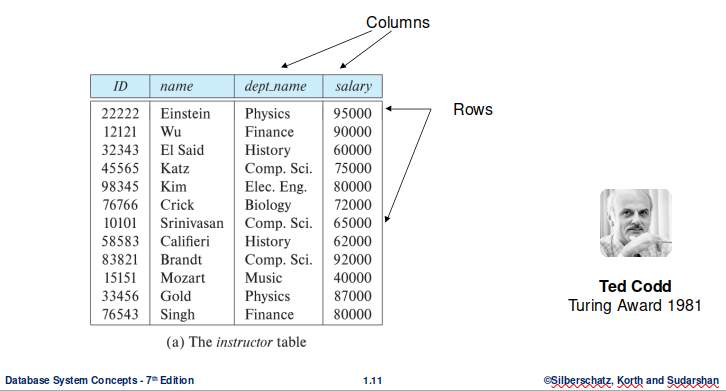

# Introduction to Database System

## Outline

The outline includes not only what will be included in today's class but throughout all the semester.

* History of Database Systems
* Purpose of Database Systems
* Database-System Applications
* View of Data
* Database Languages - SQL, NoSQL, and other query languages
* Database Design
* Database Engine
* Database Architecture
* Database Users and Administrators
* Other types of data stores, its query languages based on Restful APIs and distributed file systems.

## Glossary and Acronyms

* DBMS: Database Management System
* RDMS: Relational Database Management System
* Database System or Database or Databases

## Database System

**DBMS contains information about a particular enterprise**

* Collection of interrelated data
* Set of programs to access the data
* An environment that is both convenient and efficient to use

**Database systems are used to manage collections of data that are**

* Highly valuable
* Relatively large
* Accessed by multiple users and applications, often at the same time.

**A modern database system is a complex software system**

It is used for managing a large, complex collection of data.

**Databases touch all aspects of our lives**

## Database Applications Examples

**Enterprise Information**

* Sales: customers, products, purchases
* Accounting: payments, receipts, assets
* Human Resources: Information about employees, salaries, payroll taxes.
* Manufacturing: management of production, inventory, orders, supply chain.

**Banking and finance**

* `Customer information` accounts, loans, and banking transactions.
* `Credit card transactions`
* `Finance` sales and purchases of financial instruments (e.g., stocks and bonds; storing real-time market data
* `Universities` registration, grades
* `Stock trading`

**Airlines**

Reservations, schedules

**Telecommunication**

Records of calls, texts, and data usage, generating monthly bills, maintaining balances on prepaid calling cards

**Web-based services**

* Online retailers: order tracking, customized recommendations
* Online advertisements

**Document databases**

**Navigation systems**

For maintaining the locations of varies places of interest along with the exact routes of roads, train systems, buses, etc.

## Purpose of Database Systems

In the early days, people faced a lot of software issues by using file system,

**Data redundancy and inconsistency**

Data is stored  in multiple file formats resulting induplication of information in different files.

**Difficulty in accessing data**

Need to write a new program to carry out each new task

**Data isolation**

Multiple files and formats

**Integrity problems**

* Integrity constraints  (e.g., account balance > 0) become “buried” in program code rather than being stated explicitly

* Hard to add new constraints or change existing ones

**Atomicity of updates**

* Failures may leave database in an inconsistent state with partial updates carried out.

* Example: Transfer of funds from one account to another should either complete or not happen at all

**Concurrent access by multiple users**

* Concurrent access needed for performance
* Uncontrolled concurrent accesses can lead to inconsistencies
Ex: Two people reading a balance (say 100) and updating it by withdrawing money (say 50 each) at the same time.

**Security problems**

Hard to provide user access to some, but not all data.

## University Database Example

In this text we will be using a university database to illustrate all the concepts.

**Data consists of information about:**

* Students
* Instructors
* Classes

**Application program examples:**

* Add new students, instructors, and courses
* Register students for courses, and generate class rosters
* Assign grades to students, compute grade point averages (GPA) and generate 

## View of Data

A database system is a collection of interrelated data and a set of programs that allow users to access and modify these data.

A major purpose of a database system is to provide users with an abstract view of the data.

**Data models**

A collection of conceptual tools for describing data, data relationships, data semantics, and consistency constraints.

**Data abstraction**

Hide the complexity  of data structures to represent data in the database from users through several levels of data abstraction.

## Data Models

**A collection of tools**
for describing,

* Data
* Data relationships
* Data semantics
* Data constraints

**Relational model**

**Entity-Relationship data model (mainly for database design, or called ER diagram)**

**Object-based data models (Object-oriented and Object-relational, or called UML)**

**Semi-structured data model  (XML)**

**Other older models**

* Network model

* Hierarchical model

## Relational Model

All the data is stored in various tables.

Example of tabular data in the relational model,




## Levels of Abstraction

`Physical level`: describes how a record (e.g., instructor) is stored.

`Logical level`: describes data stored in database, and the relationships among the data.

This is the level you will write sql code,

```
	  type instructor = record
		                    ID : string; 
	                        name : string;
	                        dept_name : string;
	                        salary : integer;
                        end;
```

`View  level`: application programs hide details of data types. Views can also hide information (such as an employee’s salary) for security purposes.

