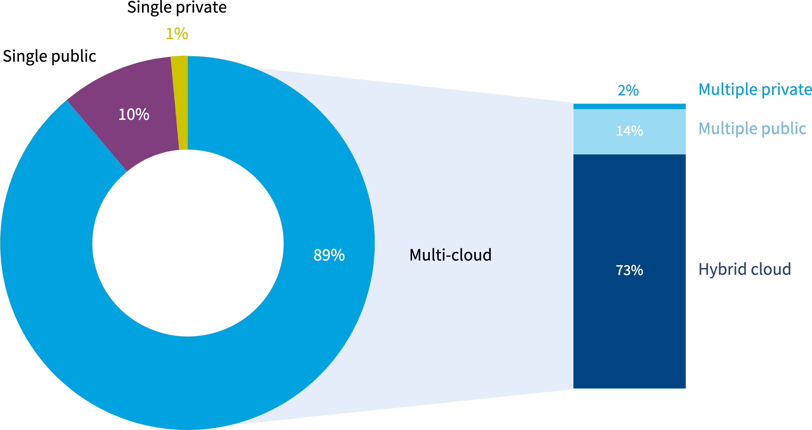
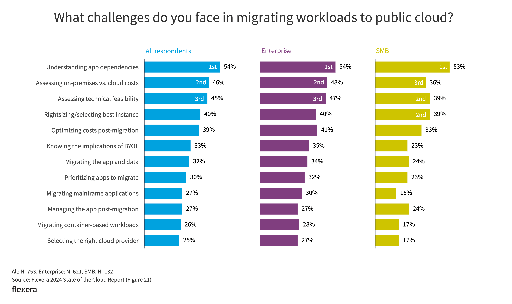
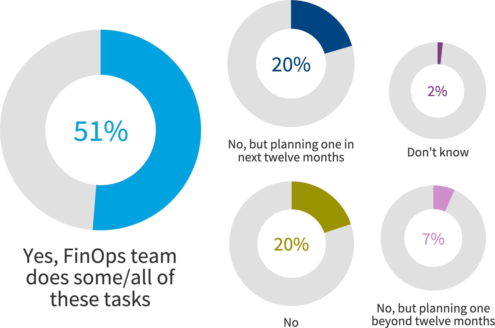
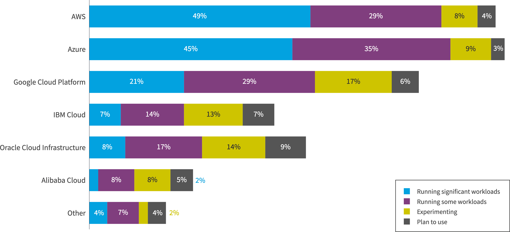
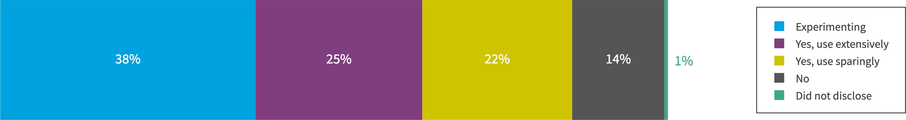
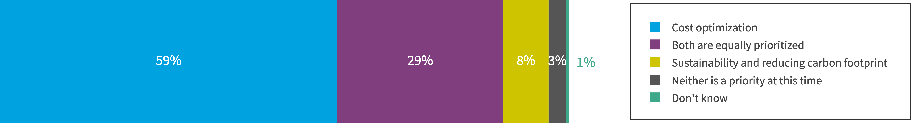
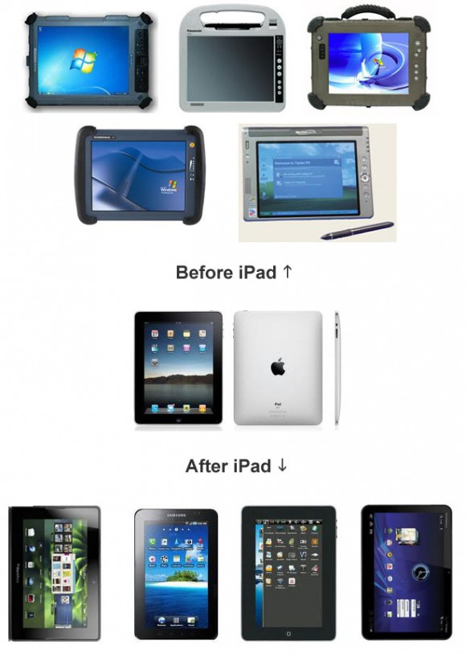

# Computer Cloud - Data and Information

## What is computer cloud or cloud computing?

The computer cloud, or cloud computing, is the delivery of computing services over the internet, such as storage, networking, servers, databases, software, and analytics. These services are hosted by third-party providers and accessed through cloud servers, which are located in data centers around the world.
Cloud computing allows users to access files and data from any device with an internet connection, without having to manage physical servers or run applications on their own machines. Users typically only pay for the services they use, which can help lower operating costs and scale as business needs change.

Some examples of cloud computing services include:

**Infrastructure as a service**: 

Offers compute and storage services. Such as,

* AWS: Amazon Web Service Platform
* GCP: Google cloud Platform
* Azure: Microsoft Azure

These platforms are not only doing web hosting, they provide Virtual Machine, DNS, Certs/SSL/TLS, 
Database, Data warehouse, Data Analytics and ML tools, LoadBalancer, and Web host and ...etc.

**Platform as a service**: Provides an environment for building cloud apps.

* AWS
* GCP
* Azure

They offer CICD tools for building software, deployment of software and monitoring tools.

**Software as a service**: Delivers apps as services
Products are like,

* TurboTax
* Office 365
* Adobe Photoshop
* A lot of online games, which you only install some lean client side that is less than 100M.

## Why Cloud?

Cloud computing derived from historic web hosting(dedicated hardware or VPS) or storage sharing in the old fashion business like those website hosting business.
Such business are plenty in the past such as GoDaddy, Bluehost, hostmonster...etc.

The cloud enables users to access the same files and applications from almost any device, because the computing and storage takes place on servers in a data center, instead of locally on the user device. This is why a user can log in to their Instagram account on a new phone after their old phone breaks and still find their old account in place, with all their photos, videos, and conversation history. It works the same way with cloud email providers like Gmail or Microsoft Office 365, and with cloud storage providers like Dropbox or Google Drive.

For businesses, switching to cloud computing removes some IT costs and overhead: for instance, they no longer need to update and maintain their own servers, as the cloud vendor they are using will do that. This especially makes an impact for small businesses that may not have been able to afford their own internal infrastructure but can outsource their infrastructure needs affordably via the cloud. The cloud can also make it easier for companies to operate internationally, because employees and customers can access the same files and applications from any location.

## How does cloud computing work?

Cloud computing is possible because of a technology called virtualization. Virtualization allows for the creation of a simulated, digital-only "virtual" computer that behaves as if it were a physical computer with its own hardware. The technical term for such a computer is virtual machine. When properly implemented, virtual machines on the same host machine are sandboxed from one another, so they do not interact with each other at all, and the files and applications from one virtual machine are not visible to the other virtual machines even though they are on the same physical machine.

Virtual machines also make more efficient use of the hardware hosting them. By running many virtual machines at once, one server can run many virtual "servers," and a data center becomes like a whole host of data centers, able to serve many organizations. Thus, cloud providers can offer the use of their servers to far more customers at once than they would be able to otherwise, and they can do so at a low cost.

Even if individual servers go down, cloud servers in general should be always online and always available. Cloud vendors generally back up their services on multiple machines and across multiple regions.

Users access cloud services either through a browser or through an app, connecting to the cloud over the Internet — that is, through many interconnected networks — regardless of what device they are using.

## How is cloud priced?

* Pay as your go. With volume of data transmitted and basic fee monthly.
* Reserve quota for software or hardware.
* Pay online with portal, your username and password.

## What are the main service models of cloud computing?

**Software-as-a-Service (SaaS)**: Instead of users installing an application on their device, SaaS applications are hosted on cloud servers, and users access them over the Internet. SaaS is like renting a house: the landlord maintains the house, but the tenant mostly gets to use it as if they owned it. Examples of SaaS applications include Salesforce, MailChimp, and Slack.

**Platform-as-a-Service (PaaS)**: In this model, companies don't pay for hosted applications; instead they pay for the things they need to build their own applications. PaaS vendors offer everything necessary for building an application, including development tools, infrastructure, and operating systems, over the Internet. PaaS can be compared to renting all the tools and equipment necessary for building a house, instead of renting the house itself. PaaS examples include Heroku and Microsoft Azure.

**Infrastructure-as-a-Service (IaaS)**: In this model, a company rents the servers and storage they need from a cloud provider. They then use that cloud infrastructure to build their applications. IaaS is like a company leasing a plot of land on which they can build whatever they want — but they need to provide their own building equipment and materials. IaaS providers include DigitalOcean, Google Compute Engine, and OpenStack.

Formerly, SaaS, PaaS, and IaaS were the three main models of cloud computing, and essentially all cloud services fit into one of these categories. However, in recent years a fourth model has emerged:

**Function-as-a-Service (FaaS)**: FaaS, also known as serverless computing, breaks cloud applications down into even smaller components that only run when they are needed. Imagine if it were possible to rent a house one little bit at a time: for instance, the tenant only pays for the dining room at dinner time, the bedroom while they are sleeping, the living room while they are watching TV, and when they are not using those rooms, they don't have to pay rent on them.

FaaS or serverless applications still run on servers, as do all these models of cloud computing. But they are called "serverless" because they do not run on dedicated machines, and because the companies building the applications do not have to manage any servers.

Also, serverless functions scale up, or duplicate, as more people use the application — imagine if the tenant's dining room could expand on demand when more people come over for dinner! Learn more about serverless computing (FaaS).

What are the different types of cloud deployments?
In contrast to the models discussed above, which define how services are offered via the cloud, these different cloud deployment types have to do with where the cloud servers are and who manages them.

The most common cloud deployments are:

**Private cloud**

A private cloud is a server, data center, or distributed network wholly dedicated to one organization.

**Public cloud**

A public cloud is a service run by an external vendor that may include servers in one or multiple data centers. Unlike a private cloud, public clouds are shared by multiple organizations. Using virtual machines, individual servers may be shared by different companies, a situation that is called "multitenancy" because multiple tenants are renting server space within the same server.

**Hybrid cloud**

hybrid cloud deployments combine public and private clouds, and may even include on-premises legacy servers. An organization may use their private cloud for some services and their public cloud for others, or they may use the public cloud as backup for their private cloud.

**Multi-cloud**

multi-cloud is a type of cloud deployment that involves using multiple public clouds. In other words, an organization with a multi-cloud deployment rents virtual servers and services from several external vendors — to continue the analogy used above, this is like leasing several adjacent plots of land from different landlords. Multi-cloud deployments can also be hybrid cloud, and vice versa.

## Cloud Market and Leading Providers (2024)

In the face of ongoing economic uncertainties, many organizations are investing in transformative initiatives such as generative AI (GenAI) and sustainability. At the same time, managing costs effectively remains a top priority—and trying to find a balance between the two is a formidable challenge. Despite this, cloud usage is on the rise, while wasted spend is decreasing. Hybrid cloud strategies are evolving, with a notable increase in the number of businesses adopting a more comprehensive view of cost management for hybrid deployments, including the licensing of software used in the cloud.

Cloud spending remains substantial, as nearly half of all workloads and data are now in the public cloud. For the second year in a row, managing cloud expenses has emerged as a more pressing challenge than security, highlighting an intensified focus on FinOps practices and tools for optimizing cloud costs and enhancing efficiency. This trend is consistent with the broader adoption of multi-cloud strategies, the increased use of cloud services, and the establishment of cloud centers of excellence (CCOEs) in more than half of the organizations surveyed, signifying a shift toward more centralized and strategic cloud management.

## Why cloud computing is so prevailing?

* The advancement of mobile devices and applications, both hardware and software make client side more accessible from their own devices.
  The acquisition of knowledge from devices requires a way that people can share information and data.
  * Hardware are like intelligent mobile phone, tablets, and wearable devices.
  * Software for instance, flutter, Reactive Native, Swift and iOS, Android and Android SDK...etc.

* The development of faster CPUs make server side can handle heavy-duty load, thus client side application is much leaner.

* Faster internet data transmission speed and bandwidth, making mobile device to access signal everywhere.

## Ref

- https://www.cloudflare.com/learning/cloud/what-is-the-cloud/

- https://info.flexera.com/CM-REPORT-State-of-the-Cloud?utm_source=google&utm_medium=PPC&utm_content=finops_cloud&lead_source=PPC&cq_cmp=21430958132&cq_term=top%20cloud%20platform&cq_plac=&cq_net=g&cq_plt=gp&gad_source=1&gclid=Cj0KCQjw2ou2BhCCARIsANAwM2EHBK_GEfoefMNrsgLNs40eO5UFpNg-08YZNafp_zNSoBHRCaIn8hUaAqSmEALw_wcB