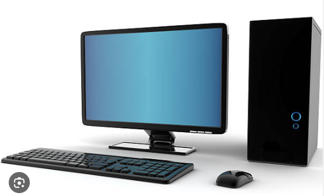
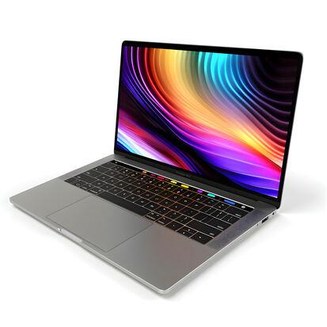
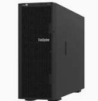
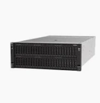
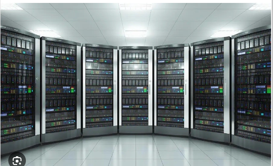

# Computer Organization and Architecture

##  What is Computer?

A computer is an electronic device that can process and store information. 
It can perform calculations, manipulate data, and execute instructions to accomplish specific tasks. 
The basic components of a computer include the 

* central processing unit (CPU), 
* memory (RAM), storage (hard drive or solid-state drive), 
* input devices (keyboard, mouse, etc.), 
* output devices (monitor, printer, etc.), and 
* various peripheral devices (such as USB drives or external hard drives). 
* It is a programmable device and it executes tasks by running the instructions stored in its memory. 

These tasks are executed based on predefined algorithms that process an output.

## How does computer work?

The computer is a device that helps us to complete our tasks easily and speedily. 
Computers don’t have a brain like human beings. We have to give them instructions on what to do when a particular situation arises. We have to tell them everything from what to expect for data(what type of data), how to process it(how to perform calculations) to where to store the data. We humans understand language that is composed of words which further is composed of letters. But, the computers don’t understand our language or the words like “hello, good morning, discipline, etc”. They only understand binary language whose vocabulary contains only two letters or states or symbols i.e. 0 and 1, True and False, On and Off. To maintain the state transistors are used.

* Transistors are tiny devices that are used to store 2 values 1 and 0 or on and off.
* If the transistor is on we say that it has a value of 1, and if it is off the value is 0.

For example, a memory chip contains hundreds of millions or even billions of transistors, each of which can be switched on or off individually. As a transistor can store 2 distinct values, we can have millions of different values stored on a memory chip consisting entirely of 0’s and 1s. But how does a transistor get its value? When a very little amount of electric current passes through the transistor it maintains the state of 1 and when there is no electric current then the transistor has the state of 0.

Then how is it all connected to the computer?
These 0’s and 1’s form the building block of a computer. With the combinations of 0 and 1, we create a whole new language For example, 0 can be written as 0,

```
1 as 1
2 as 10
3 as 11
4 as 100
5 as 101
a as 01100001
A as 01000001
s as 01110011
U as 01010101
```

`Hello` as,

`01001000 01100101 01101100 01101100 01101111`

`Hello World!` as,

```
01001000 01100101 01101100 01101100 01101111
00100000 01010111 01101111 01110010 01101100 01100100 00100001
```

And so on… So now the question arises how can a human remember this code?

It seems impossible but the idea is to look up a dictionary.

**Telegram** (This is not the chatting or messenger tools )


Let us read the story in the below image,


## History and Origin of Computers

The development of computers started thousands of years ago with ancient devices like the abacus. Later mechanical calculators were introduced which furthermore contributed to the development of computers. It was in the mid-19th century that Charles Babbage and Ada Lovelace laid the foundations of modern computing with their designs of difference between engine and analytical engines. The 20th century saw the inventions of electromechanical and electronic devices like the ENIAC and UNIVAC. Around this time other important components were also being invented. these include transistors, integrated circuits, and microprocessors. Personal computers gained massive popularity following the boom of the Internet and the World Wide Web in the 1990s. In today’s time, advanced technologies like Artificial Intelligence, quantum computing, and cloud technology are integrated to create much more sophisticated technologies.

**Types of Computers**

There are various types of computers that are used today based on the need of user. Some of the types are:

Desktop: Desktops are mainly used for regular use, and they have separate components mounted together like the monitor, keyboard, mouse, CPU etc. Since the system is primarily kept on a desk for better usability it is called as desktops. They have powerful processors in them which accounts for a wide variety of tasks that they are capable of doing.



Laptop: Laptops are a portable version of the desktops, with all the components integrated in a single unit thus providing mobility to the system. They are great for on the go work and come with built-in eb cams, Bluetooth and Wi-Fi.



Servers: Servers are special types of computers that are used to manage network resources. They provide services to other systems and computers. Some of the primary tasks of servers include creating databases, hosting and proving support to other applications. They are backed up by multiple processors and high capacity storage.

It might look like a normal case,



or you could be a special case,



And server room might look like this where it has cooling system, electricity recovery protection, and it removes a lot of computer accessories like DVD-ROM.



Tablets: Tablets are even portal than laptops. They are smaller than laptops but are larger in size than smartphones. They come with touchscreens with makes it perfect for browsing the web, consuming content and personal communications.
Other devices: Other devices include smartphones, game console, Smart TV’s etc.


## What is CPU?

The CPU is often considered the brain of the computer, as it performs most of the processing and calculations required for a computer to function. RAM is the temporary memory that stores data and instructions while the computer is running, while storage is the long-term memory where data is stored even when the computer is turned off. Input devices allow users to input data or commands into the computer, while output devices display the results of the computer’s processing. Peripheral devices are additional components that can be added to a computer to enhance its functionality.

A computer is an electronic device that can perform tasks based on instructions provided to it. It consists of hardware components such as the central processing unit (CPU), memory, input/output devices, and storage devices. The CPU is the brain of the computer and performs the bulk of the processing tasks. Memory, also known as RAM, is where data and instructions are temporarily stored while the computer is running. Input/output devices, such as a keyboard, mouse, and monitor, allow users to interact with the computer and receive information from it. Storage devices, such as a hard drive or solid-state drive, store data and programs permanently on the computer.

Computers can run different types of software, including operating systems, applications, and games. They can also be connected to the internet and used to access online services, communicate with other people, and share information. Overall, computers are incredibly versatile machines that have become an integral part of modern life, used for work, entertainment, education, and many other purposes.

## What is a Software?

Software is a set of instructions that tells the computer what to do, when to do, and how to do it. Examples are, the paint that we use in Microsoft, WhatsApp, and games, all are types of different software. Suppose we want to add 2 numbers and want to know what 2 + 2 is 4. Then we must give the computer instructions,

Step-1: take 2 values.
Step-2: a store that 2 value
Step-3: add 2 value by using + operator
Step-4: save the answer

Separate instructions are provided for the + operator so the computer knows how to do addition when it encounters the + sign. So who converts this code? Instead of who we can ask what converts the code. And answer to that question is a software called interpreter that interprets our language code into binary code. The interpreter converts our code into machine language that can be understood by the computer.

Now the question is how we give our input.

We give our input with the use of hardware for example like scanner, keyboard, and mouse(not the one that eats cheese). When we give input through hardware, the software interprets it into machine language and then it is processed and our output is shown.

Process: If we want to display the letter ‘A’ on the screen we first will open the notepad. Then we will press the Caps lock key or shift key to make the letter capital, after that, we will press the letter ‘a’. And our screen will show the letter ‘A’.

Under the hood process: When we pressed the caps lock or shift key the software tells us that whatever follows this should be printed on the screen and after we have pressed the letter a which is a small letter, the software first converts it into binary like it had converted the shift or caps lock key and then after the computer understands it prints A on the screen.

## Hardware vs Software

Hardware
Software
Hardware are the physical component of computers that we can touch and see. They run physical tasks that are essential for the functioning of a computer such as displaying data.

Software are the programs that are executed on the operating system that help in deciding which decision to take. They take care of the decisions and instruct the hardware what to do.

Some of the examples include keyboard, printer, processor etc.

Programs that we run on operating systems is an example of a software.

## Components of a Computer

Following are the different components of a computer

Central Processing Unit (CPU) : The CPU is the brain of the computer. All the important decisions and manipulations are carried out by the CPU. CPU is further divided into the Arithmetic Logic Unit(ALU) and the Control Unit(CU).
Motherboard: The motherboard is the main circuit that connects all the components of a computer.
Memory: The RAM(Random Access Memory) is used for quick access of data.
Storage: The storage components include Hard Disk Drives(HDD) and the Solid State drives(SDD). They are used for storing data for the long term.
Input devices: The various devices via which we can input data into the computer from the user are called input devices. Examples of input devices include keyboard, mouse, scanners.
Output devices: Output devices are the devices via which the computer gives out the output to the users. Examples of output devices include printers and speakers.

## Concepts Related to Computers
Some related concepts that can help in understanding computers include:

Binary code: Computers communicate and process information using a binary code, which is a system of ones and zeroes. Each binary digit (or bit) represents a simple “on” or “off” state, and combinations of bits can represent more complex information.
Algorithms: An algorithm is a set of instructions or steps that a computer program follows to solve a problem or complete a task. Algorithms are used to perform a wide range of tasks, from sorting data to searching for patterns.
Programming languages: Programming languages are used to write computer programs. There are many different programming languages, each with its own syntax and set of rules.
Hardware vs. software: Hardware refers to the physical components of a computer, such as the CPU, memory, and storage devices. Software, on the other hand, refers to the programs and instructions that tell the hardware what to do.
Networks: Computers can be connected together in networks, which allows them to communicate and share resources. Networks can be wired or wireless and can be used for tasks such as sharing files, accessing the internet, or playing multiplayer games.
User interfaces: User interfaces are the means by which humans interact with computers. They can be graphical, such as a desktop or mobile operating system, or text-based, such as a command line interface.

## Types of Computers

There are different types of computers based on different parameters. Following are different categories.

**Types of Computers Based on Size**

   Microcomputers: Microcomputers are meant for individual use. They are small, compact and very mini. For example smartphones and desktops.
   Minicomputers: They are used in businesses that are mid sized and are more powerful than microcomputers. Servers are an example of minicomputers.
   Mainframe computers: These are used by large organizations. They help in processing of bulk data.
   Supercomputers: These are extremely powerful computers that help in carrying out complex calculations. They aren’t for meant for personal use and are often used for research purpose.

**Types of Computers Based on Processing Power**

   Personal computers (PCs): These are the most common type of computer and are designed for personal use. PCs include desktops, laptops, and tablets.
   Servers: Servers are designed to manage and distribute resources and data to multiple users or devices. They are often used in businesses or organizations to store and share data and run applications.
   Mainframes: Mainframe computers are large, powerful machines that are designed to handle massive amounts of data and perform complex operations. They are often used in large corporations or government agencies.
   Supercomputers: Supercomputers are extremely powerful computers that are designed to process data at extremely high speeds. They are often used for scientific research and other specialized applications.
   Embedded systems: Embedded systems are small computers that are built into other devices, such as appliances, cars, and medical devices. They are designed to perform specific functions and operate without human intervention.
   Wearable computers: Wearable computers are small, portable devices that are worn on the body, such as smartwatches or fitness trackers. They are designed to track data and provide information on the go.

**Types of Computers Based on Functionality**

   Analog computers: In analog computers data is stored using continuous physical quantities. Mechanical integrator is an example of analog computer.
   Digital computers: These are the most common types of computers found in the market today. Data is processed in digital computers using discrete values. Smartphone is a common example of digital computers.
   Hybrid computers: These are a combination of both analog and digital computers. Examples include complex medical equipment. 
   
**Features of Computer**
   Processor: The processor is the brain of the computer, and it carries out all the instructions and calculations required by the system.
   Memory: The memory or RAM (Random Access Memory) stores data temporarily for the processor to access quickly.
   Storage: Storage devices like hard disks, solid-state drives, or external drives provide long-term storage for data and files.
   Input devices: Input devices like keyboards, mice, scanners, and cameras enable the user to provide data and instructions to the computer.
   Output devices: Output devices like monitors, printers, and speakers display the results of the computer’s processing.
   Operating System: The operating system manages the computer’s resources, controls the hardware, and runs application programs.
   Networking: Networking capabilities allow computers to communicate and share resources with other computers and devices.
   Software: Software is the set of instructions that tell the computer what to do, and it can range from simple applications to complex programs.
   Graphics and Sound: Graphics and sound capabilities enable the computer to display and manipulate images and play sounds and videos.
   Connectivity: Connectivity features like USB, Wi-Fi, Bluetooth, and Ethernet enable the computer to connect to other devices and the internet.
