# Information Technology

## What is information technology?

Information technology (IT) is the use of computers, storage, networking and other physical devices, infrastructure and processes to create, process, store, secure and exchange all forms of electronic data. Typically, IT is used in the context of business operations, as opposed to the technology used for personal or entertainment purposes. The commercial use of IT encompasses both computer technology and telecommunications.

## What is information?

## Three characterastic of information

* Asymmetric
* Real-time
* Historic

## In the world of information

**How we acquire information**

The following image shows how we learn information technology 100 yrs old,

And here is today,

Technology changed a lot but it hasn’t changed much about our desire for information.

**How we select the right information**

There are massive content and information generated on the internet. Some are good and informative, and educational but some are like marketing bait.

To filter and get the exact contents you need to know takes time... And thanks to the modern technology of machine learning and LLM, and we can use something like ChatGPT to do it...

## How powerful is the information technology

**Example of DNA Computing**

The power of information comes from how it is situated in powerful contexts. Consider, for example, the SARS-CoV-2 Pfizer vaccine, which is one of many vaccines that will help build and sustain global immunity to the dangerous virus. This is a powerful, innovative vaccine that is fundamentally information: it encodes how to construct the “spike” of SARS-CoV-2 found on the surface of the coronavirus that causes COVID-19. When that information, stored as messenger RNA, is injected into our bodies, our cells read those mRNA instructions, assemble the spike protein, and our immune systems, rich databases of safe and dangerous proteins, detect the spike as a new foreign body, and add it to their database of substances to attack. The next time our immune systems see that spike, they are ready to act and destroy the virus before it replicates and causes COVID-19 symptoms. Information, therefore, keeps us healthy.

There is also power behind the origins of that DNA sequence. In February and March 2020, an international community of American and Chinese researchers worked together to model, describe, and share the structure of the SARS-CoV-2 spike. Their research depended on computers, on DNA sequencers, on the internet for distribution of knowledge, and on the free movement of information across national boundaries in academia. All of these information systems, and the centuries of research on vaccines, DNA, and computing, were necessary for making the vaccine possible in record time. The power of the vaccine, then, isn’t just about an mRNA sequence, but an entire history of discovery, innovation, and institutions that use information to understand nature. Information, therefore, fuels discovery.

For example, in 1202, Fibonacci, otherwise, known as Leonardo of Pisa, released a book called Liber Abaci, which described and taught the Hindu-Arabic number system that had long been used in the middle east and southeast Asia to compute. It replaced the clumsy, inefficient Roman numeral system, brought the number zero to western civilization, and transformed mathematics, commerce, science, and engineering. Information therefore **teaches** us.

The Gregorian calendar, which standardized time for Western civilization.

Prior to 1592, there was no standard calendar in western civilization, and so it was hard to discuss time. The declaration of Pope Gregory XIII defined months, weeks, years, and days for Europe—and due to the rampant colonialism that followed—for most of the world. It became the basis of time zones, international trade, and is now deeply encoded in computers, through application programming interfaces that facilitate time and date arithmetic. Information, therefore, organizes us.

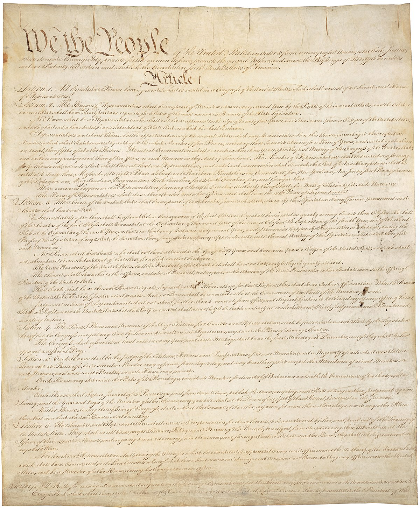
The information in the U.S. Constitution continues to be the supreme law of the United States.

As European colonialism waned and modern democracies emerged, information was a central force in shaping new systems of government. For example, the Declaration of Independence, released on July 4th, 1776, can be thought of simply as a one page letter to the Kingdom of Great Britain, declaring the British colonies as sovereign states. But it was far more than a letter: it led to the Revolutionary War, the decline of power in Great Britain, and the writing of the U.S. Constitution.

Max Edling (2003). A Revolution in Favor of Government: Origin of the U.S. Constitution and the Making of the American State. OUP USA.

The Constitution, and its amendments, have led to great advances in freedom in the United States and beyond, while simultaneously encoding great injustices and inequities in human rights. Information, for better or worse, **regulates** us.

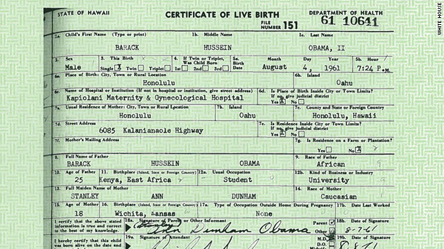
Martin Luther King, Jr. gives I have a dream.

Some of these injustices in the United States led to information that changed the course of civil rights. For example, Martin Luther King, Jr’s 1963 speech, I have a dream, conveyed a vision of the United States without racism.

It pressured the U.S. Congress to advance civil rights legislation, and create a generation of activists to fight for racial justice, trying to overcome the racist beliefs and laws that had been at the foundation of U.S. history and its constitution. Information, therefore, **inspires** us.

Throughout this history of human and civil rights, a central challenge has been defining identity. Who is American? How does one prove they were born here? Documents like birth certificates, filled out and signed at the time and place of birth, become powerful media for laying claim to the rights of citizenship. Nowhere was this more apparent than in President Trump’s baseless conspiracy theories of President Obama’s citizenship.
Vincent N. Pham (2015). Our foreign president Barack Obama: The racial logics of birther discourses. Journal of International and Intercultural Communication.

Even the release of President Obama’s long form certificate did not quell skepticism. Information, therefore, **identifies** us.

### Something more exciting?

**Starlink**

Telecommunication and network will be part of IT.
Whether it is bluetooth, TCPIP, IPV4 or IPV6. These are basic knowledge that will help us connect the world. 
When I grew up in college, bluetooth was still in the research and not mature, and look at today for the bluetooth earbud,
phone and car connection or even more.

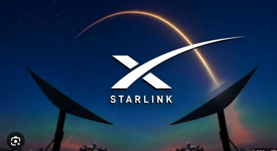

Starlink is the new tech, from envisioning to reality. It tells a successful story of "You need to have a dream".

**Mars Landrover**

The robots actually acquire knowledge by computer vision, and they would have to send back
petabytes data per sec.

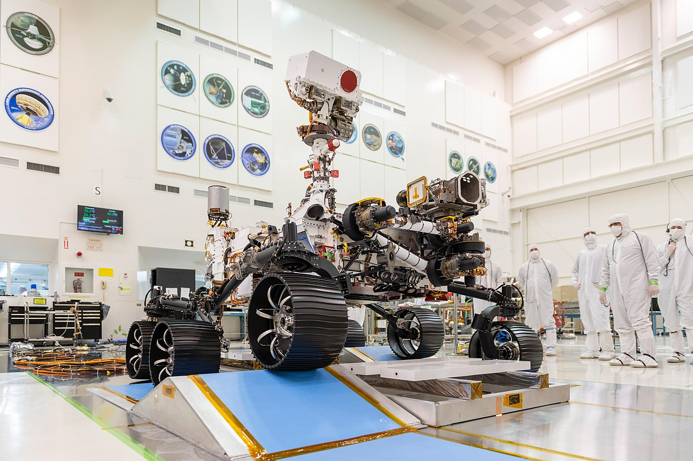

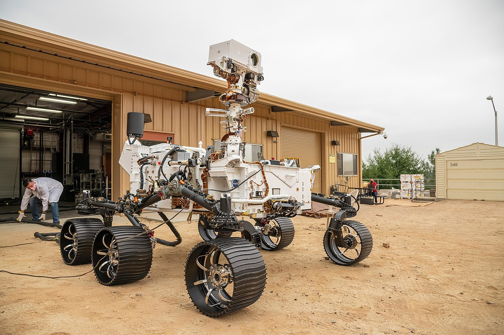

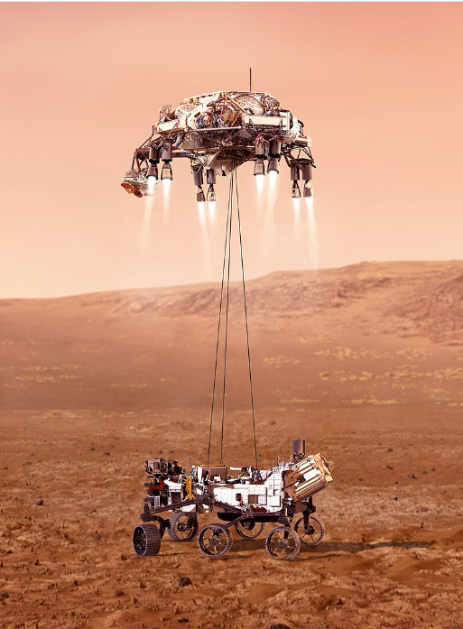

**Boston Dynamics**

Robots would sense the world by multiple cams and sensors. They will computer fast and take 
reactions, also it would have to send back all the information in the form of data back to storage or control terminal.

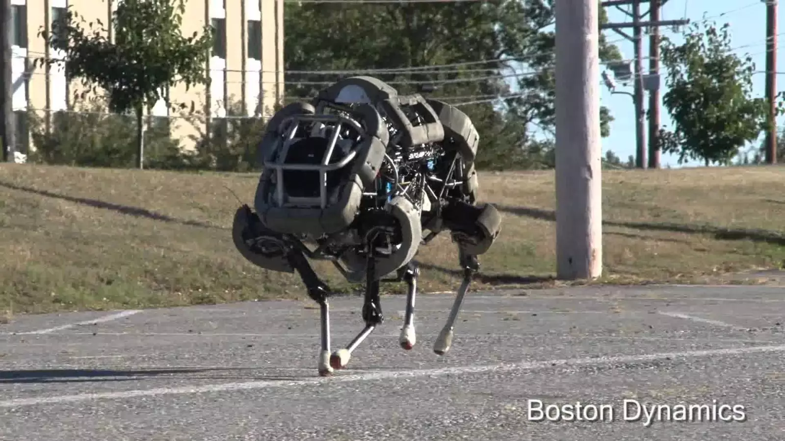

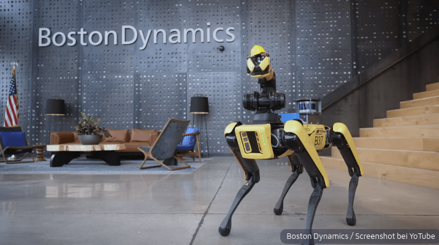

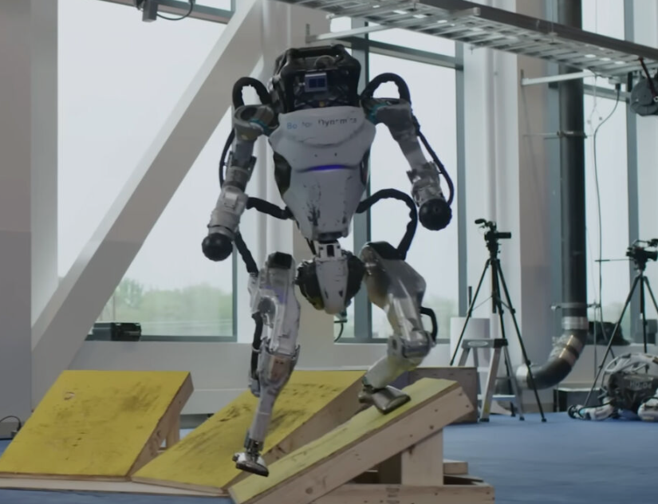

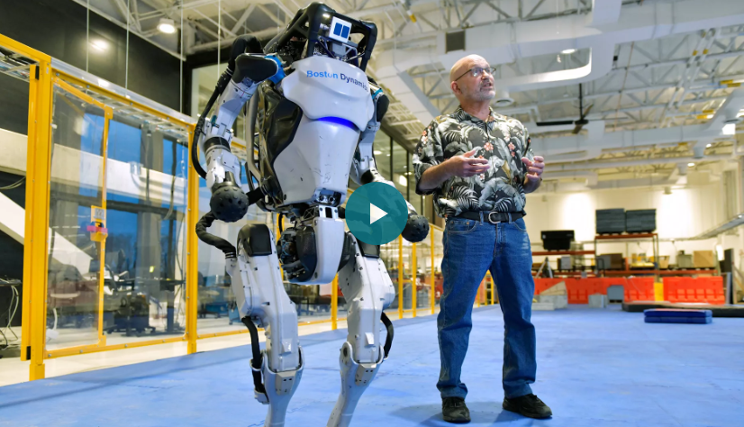

## Types of information technology

Information technology encompasses a wide range of technologies and systems that are used to store, retrieve, process and transmit data for specific use cases.

Common information technology types include the following:

**Internet and web technologies**

This includes the tools and protocols used to access, navigate and interact with information on the internet. Examples include web browsers, websites, web servers, Hypertext Markup Language, cascading style sheets, JavaScript, HTTP and other internet-related technologies.

**Cloud computing**

This involves the delivery of computing resources and services over the internet on a pay-per-use basis. This can include infrastructure as a service, platform as a service, software as a service and cloud storage options.

**Databases**

This includes IT systems and software used to store, organize and retrieve data. Examples include MySQL, NoSQL, relational database management systems and MongoDB.

**Artificial intelligence and machine learning**

AI and ML-based IT technologies use algorithms and statistical models to enable computers to perform tasks that typically require human intelligence. Examples include speech recognition, image recognition and natural language processing.

**Cybersecurity**

This type of IT includes technologies and best practices designed to protect IT systems, networks and data from unauthorized access, cyber attacks and other security threats. Cybersecurity can be enforced through firewalls, antivirus software, encryption, intrusion detection systems and security policies.

**Internet of things**

This includes the network of interconnected devices and sensors that collect, exchange and analyze data. IoT technologies enable the integration of physical objects into computer systems, providing automation, monitoring and control in various domains.

**IT governance**

This involves making policies and rules for the organization to ensure effective operation.

**Data analytics and business intelligence**

BI(Business Intelligence) focuses on tools and techniques for extracting insights from large data sets to support decision-making and business operations. This can include data mining, statistical analysis, data visualization and predictive modeling.

## What does information technology encompass?

1/ Deploying and maintaining business applications, services and infrastructure -- including servers, networks and storage.

Note: Sort of like DevOps, DevSecOps, MLOps, MLSecOps, Linux Administration, Windows server administration, Google cloud administrator, Amazon Web Service Administrator, Database Administrator or even hardware cable man.

2/ Monitoring, optimizing and troubleshooting the performance of applications, services and infrastructure.

3/ Overseeing the security and governance of applications, services and infrastructure.

Most IT staff have different responsibilities within the team that can be broken into the following key areas:

**Administration**. Administrators handle the day-to-day deployment, operation and monitoring of an IT environment, including systems, networks and applications. Admins often perform a range of other duties such as software upgrades, user training, software license management, procurement, security, data management and observing adherence to business process and compliance requirements. Effective delegation is also part of IT administration and is crucial for a team's productivity.

**Support**. Help desk staff specialize in answering questions, gathering information and directing troubleshooting efforts for hardware and software. IT support often includes IT asset and change management, helping admins with procurement, handling backup and recovery of data and applications, monitoring and analyzing logs and other performance monitoring tools and following established support workflows and processes.

**Applications**. Businesses rely on software to perform work. Some applications, such as email server applications, are procured and deployed by third parties. But many organizations retain a staff of skilled developers that create the applications and interfaces -- such as application programming interfaces -- needed to deliver critical business capabilities and services. Applications might be coded in a wide array of popular programming languages and integrated with other applications to create smooth and seamless interactions between different applications. Developers might also be tasked with creating interactive business websites and building mobile applications. The trend toward agile or continuous development paradigms requires developers to be increasingly involved with IT operations, such as deploying and monitoring applications.

**Compliance**. Businesses are obligated to observe varied government and industry-driven regulatory requirements. IT staff play a major role in securing and monitoring access to business data and applications to ensure that such resources are used according to established business governance policy that meets regulatory requirements. Such staff are deeply involved with security tasks and routinely interact with legal and business teams to prevent, detect, investigate and report possible breaches.

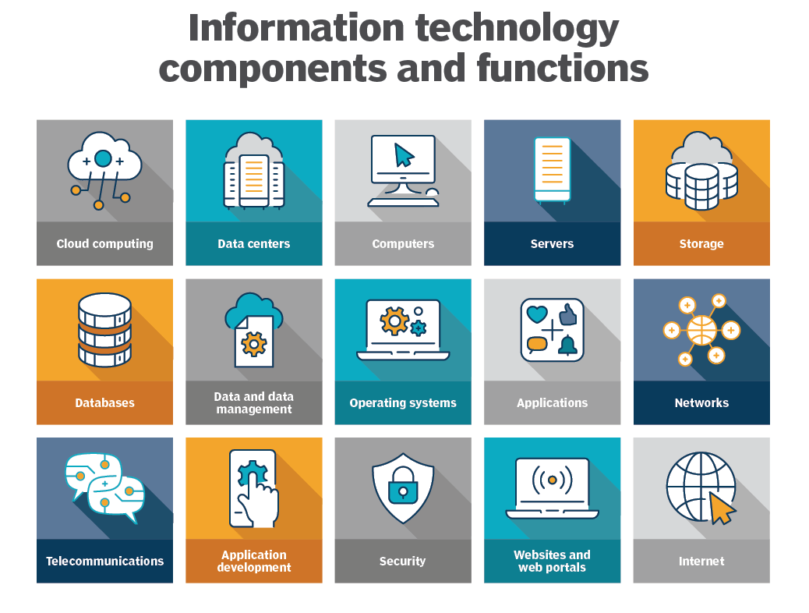

## Why is information technology important?

It's been said that data is what powers industries worldwide. That might be hyperbole, but few businesses -- large or small -- can remain competitive without the ability to collect data and turn it into useful information. IT provides the means to develop, process, analyze, exchange, store and secure information.

Data processing plays a significant role in the following core business practices:

* Product development and design.
* Marketing and market research.
* Sales and invoicing.
* Data analysis and decision-making.
* Customer development and retention.
* Accounting and taxes.
* Human resources and payroll.
* Regulatory compliance.

Information technology plays a vital role for businesses in the following ways:

Facilitates communication and collaboration. IT enables seamless communication and collaboration across different locations and time zones. For example, global corporations that are spread across continents can use video conferencing, instant messaging and content collaboration tools to bridge geographical distances and communicate effectively.

Advances pervasive computing. Computing has penetrated practically every part of business and much of our personal lives. The ubiquity of computing -- also referred to as pervasive computing -- is another reason why IT is critical. Computing devices have evolved well beyond PCs and servers. Today, all businesses and most people have and use multiple computing devices, including phones, tablets, laptops, game consoles and even doorbells, thermostats, vacuums and many kitchen appliances.

Enhances efficiency and productivity. IT systems and tools streamline processes, automate repetitive tasks and provide access to real-time data, thereby improving the overall efficiency and productivity of businesses. For example, a retail company with an integrated IT system can use an automated inventory management tool to track stock levels in real time and replenish them through automatic reordering.

Enables access to information. IT provides access to vast amounts of information and knowledge in databases and online libraries, empowering individuals and organizations to make informed decisions and stay updated with the latest developments.

Supports innovation and creativity. IT fosters innovation by providing platforms for creative expression, experimentation and problem-solving. For example, consider a software development company utilizing IT platforms for innovation. Its developers can collaborate in virtual environments, experiment with new coding techniques and technologies and create groundbreaking software through iterative testing, feedback loops and problem-solving.

Supports critical business operations. IT is essential for the smooth functioning of modern businesses, from managing operations and finances to marketing and customer service. For example, most customer service teams use IT systems for efficient communication, issue resolution and feedback collection to ensure a positive user experience.

Helps with education and research. IT plays a vital role in education, providing access to educational resources, facilitating distance learning and supporting research endeavors. Remote learning technologies enable access to education from anywhere, bridging geographical barriers and providing opportunities for lifelong learning.

Provides cost savings. IT reduces costs associated with paper-based processes, manual labor and physical infrastructure, leading to significant savings for both businesses and individuals.

Provides connectivity to the internet. Virtually all IT devices, many of which are part of the IoT, tap into the internet, which interconnects billions of devices worldwide.

## Examples of information technology

So how is IT involved in day-to-day business? Consider the following six common examples of IT and teams at work:

**Server upgrade**. 

One or more data center servers are near the end of their operational and maintenance lifecycle. IT staff will perform the following:

* Select and procure replacement servers.
* Configure and deploy the new servers.

* Back up applications and data on existing servers.
* Transfer that data and applications to the new servers.
* Validate that the new servers are working properly.
* Repurpose or decommission and dispose of the old servers.

**Security monitoring**

Businesses routinely use tools to monitor and log activity in applications, networks and systems. IT staff receive alerts of potential threats or noncompliant behavior, such as a user attempting to access a restricted file; check logs and other reporting tools to investigate and determine the root cause of the alert; take prompt action to address and remediate the threat, often driving changes and improvements to security posture that can prevent similar events in the future.

**New software**

The business determines a need for a new mobile application that can enable customers to log in and access account information or conduct other transactions from smartphones and tablets. Developers work to create and refine a suitable application according to a planned roadmap. Operations staff post each iteration of the new mobile application for download and deploy the back-end components of the app to the organization's infrastructure.

**Business improvement** 

A business requires more availability from a critical application to help with revenue or business continuance strategies. The IT staff might be called upon to architect a high-availability cluster to provide greater performance and resilience for the application to ensure that it can continue to function in the face of single outages. This can be paired with enhancements to data storage protection and recovery.

**User support**

Developers are building a major upgrade for a vital business application. Developers and admins collaborate to create new documentation for the upgrade. IT staff might deploy the upgrade for limited beta testing -- enabling a select group of users to try the new version -- while also developing and delivering comprehensive training that prepares all users for the new version's eventual release.

**Digital workplace organization**

Employees in a bustling office are wasting too much time trying to locate paper documents, files and office supplies that are scattered throughout the workspace. The office has decided to incorporate a digital filing and inventory management system. Each document in the office is scanned and stored electronically and tagged with relevant keywords. Additionally, office supplies are also tracked in a digital inventory database. Now, whenever an employee needs to access a document or find a tool, they promptly open the digital inventory system. With just a quick search, they pinpoint the precise file or item along with its current physical location in the workspace. This enhances the efficiency and productivity of the employees.

## Software vs. hardware

When it comes to IT systems, both software and hardware are integral and interdependent components of computer systems. The following are some main differences between the two:

### Software

Software refers to a set of instructions that enable the hardware to perform specific tasks. It includes system software, application software and other programs that run on the computer.

There are two categories of software: system software and applications. System software encompasses the computer programs that manage the basic computing functions. They include the following:

* Operating systems (OSes).
* BIOSes.
* Boot programs.
* Assemblers.
* Device drivers.

Examples of business applications include the following:

* Databases, such as Microsoft SQL Server.
* Transactional systems, such as real-time order entry.
* Email servers, such as Microsoft Exchange.
* Web servers, such as Apache and Microsoft's Internet Information Services.
* Customer relationship management, such as Oracle NetSuite and HubSpot.
* Enterprise resource planning systems, including SAP S/4HANA.
These applications use programmed instructions to manipulate, consolidate, disperse and otherwise work with data for a business purpose.

Mobile applications that run on smartphones, tablets and other portable devices typically connect with cloud or data center applications over the internet. These applications have expanded the scope of computing and created a new category of software and telecommunications that requires special expertise to maintain.

### Hardware

Hardware refers to the physical components of a computer that come in many different forms, including the monitor, servers, central processing unit, keyboard and mouse. Computer servers run business applications. Servers interact with client devices in the client-server model. They also communicate with other servers across computer networks, which typically link to the internet.

Storage is another type of hardware. It's any technology that holds information as data. Storage can be local on a specific server or shared among many servers, and it could be installed on-premises or accessed via a cloud service. Information that is stored can take many forms, including file, multimedia, telephony, and web and sensor data. Storage hardware includes volatile RAM (random-access memory) as well as non-volatile tape, hard disk drives and solid-state drives.

Telecom equipment -- comprising network interface cards, cabling, wireless communications and switching devices -- connects the hardware elements together and to external networks.

Abstracting hardware and software
Abstraction simplifies resource provisioning, management and scalability. By hiding the complexities of hardware, abstraction streamlines resource allocation, ensuring optimal utilization of available resources.

IT architectures have evolved to include virtualization and cloud computing, where physical resources are abstracted and pooled in different configurations to meet application requirements. Clouds can be distributed across locations and shared with other IT users, or they can be contained within a corporate data center or some combination of both deployments.

Volatility is a characteristic of virtualized resources, enabling them to expand and contract as needed. Subscription-based cloud or locally installed resources, such as storage or composable architectures, can spin up resources, such as servers, OSes and application software, as needed and then release them when processing is complete.

## Information technology vs. computer science

When researching careers in IT, one is likely to come across the term computer science. While there's an overlap between IT and computer science, the two disciplines are distinct and require different courses of study to prepare for careers.

IT is generally associated with the application of technology to deal with business issues. As such, the IT workforce is oriented toward developed technologies such as hardware systems, OSes and application software. Proficiency in IT is required to identify the hardware and software components that should be used to enhance a specific business process. IT pros work with a variety of technologies, such as server OSes, communications devices and software and applications. Career examples typically include roles such as database administrator, cybersecurity specialist and network administrator.

Preparation for an IT career requires basic courses in hardware and software systems. A bachelor's degree in IT and other programs might include the following subjects:

* Business analysis.
* Project management.
* Telecommunications.
* Network administration.
* Database design.
* Database management.

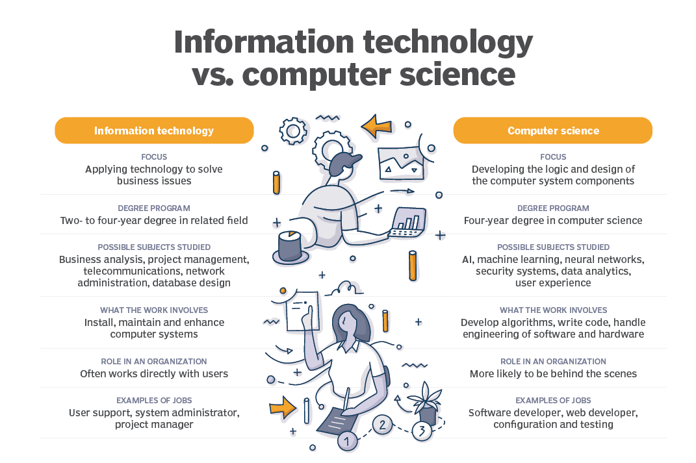

Computer science focuses on the logic and design of the underpinnings of the components that IT experts use to assemble business systems. A strong mathematics background is required to pursue a computer science career. Much of the work in computer science involves developing the algorithms and logic and writing low-level code that enables computer systems to address business problems.

Computer scientists might participate in the hardware and software engineering work required to develop products. They're also likely to delve into more abstract technologies, such as AI and ML. Roles in computer science include software developer, computer systems analyst, computer programmer and computer information research scientist.

A course of study in computer science requires a foundation in computer concepts and advanced mathematics. It could be complemented with the following subjects:

* AI and ML.
* Neural networks.
* Security systems.
* Data analytics.
* User experience.

## Careers in information technology

A team of administrators and other technical staffers deploy and manage a company's IT infrastructure and assets. IT teams depend on a range of specialized information and technology skills and knowledge to support equipment, applications and activities. Third-party contractors and IT vendor support personnel augment the IT team.

The information technology profession is extremely diverse. IT workers can specialize in fields, including software development; application management; hardware components; server, storage or network administration and network architecture. Many businesses seek IT professionals with mixed or overlapping skill sets.

There's a wide array of IT careers, each with varying technological and managerial requisites. Among the most common IT job titles are the following:

* Chief information officer. A CIO is responsible for IT and computer systems that support the goals of the business.
* Chief technology officer. A CTO sets the technology goals and policies within an organization.
* IT director. An IT director is responsible for the functioning of the business's technology tools and processes. This role might also be called IT manager or IT leader.
* System administrator. A sys admin configures, manages, supports and troubleshoots a multiuser computing environment. Within a business, this role can be divided up by technology, requiring an administrator or team dedicated to server, desktop, network administration, virtualization or other components and technologies.
* Application manager. An application manager's role centers on the provisioning and management of a high-demand business application, such as Microsoft Exchange.
* Developer or software engineer. A software engineer or team writes, updates and tests code for computer programs to meet internal or customer-facing business objectives.
* Chief IT architect or IT architect. An IT architect examines and changes IT functions to best support the business.
* Information security analyst. An information security analyst protects organizations from threats and data breaches.
* Cloud engineer. A cloud engineer is responsible for managing and designing cloud-based systems for organizations.

## IT skills and certifications

The U.S. Bureau of Labor Statistics projects a 15% growth in employment within the computer and information technology sector between now and 2032. A successful IT career will involve developing several technical skills. For the current IT job market, the following 10 skills are among those most in demand:

* Cybersecurity.
* Cloud computing.
* Edge computing and IoT.
* IT automation.
* Software development.
* Big data management and data analytics.
* DevOps.
* AI.
* ML.
* Mobile application development.

In the pursuit of these fundamental IT disciplines, it's advantageous to earn certifications to demonstrate proficiency in specific technologies and areas of expertise. Some of the most highly regarded certifications offered by various technology vendors include the following:

* AWS Certified Solutions Architect -- Professional.
* CompTIA A+.
* Certified Ethical Hacker.
* Certified in Risk and Information Systems Control.
* Certified Information Security Manager.
* Certified Information Systems Security Professional.
* Cisco Certified Network Associate.
* Google Certified Professional Cloud Architect.
* Microsoft role-based certifications.
* Project Management Professional.
* VMware Certified Professional.

## Ref

- https://faculty.washington.edu/ajko/books/foundations-of-information/power

- https://www.techtarget.com/searchdatacenter/definition/IT