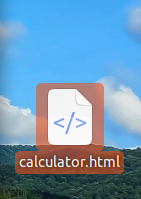
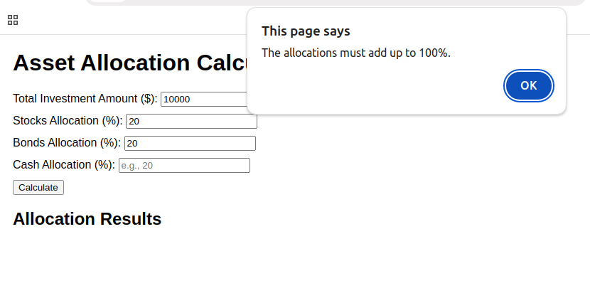
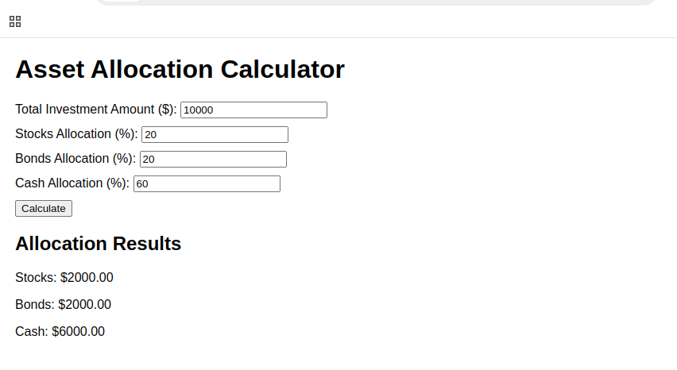
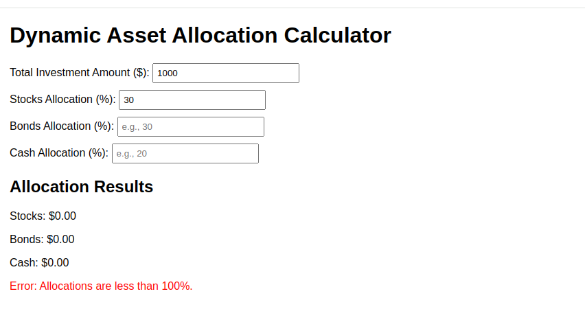
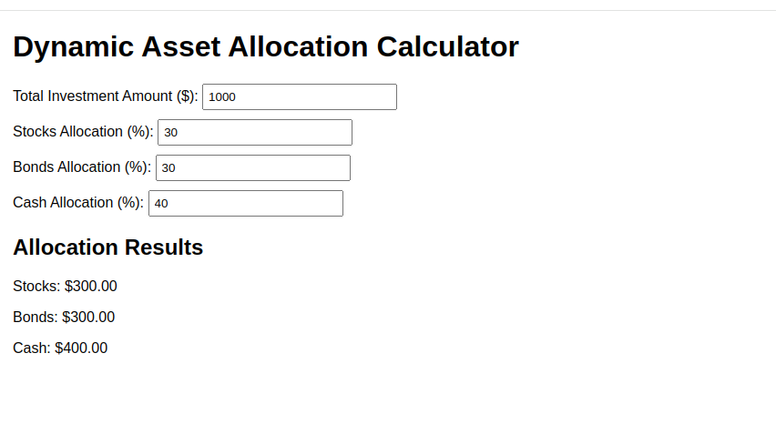
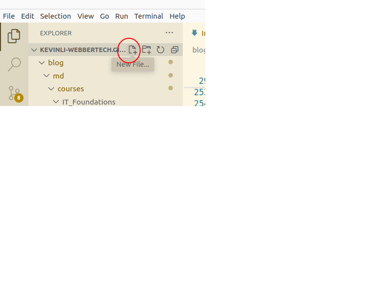

## History of JavaScript

JavaScript is developed by Brendan Eich, a computer scientist and programmer at Netscape Communications Corporation. The initial name of the JavaScript was the 'Mocha'. After that, it changed to 'LiveScript', and then 'JavaScript'.

## A Few Big Events

* Between 1996 and 1997, the European Computer Manufacturers Association (ECMA) standardized JavaScript. After that, 3 revisions of the JavaScript have been done.

* In ES5 (2009), Node.js was introduced to use JavaScript as a server-side language. The ES6 (2015) was a significant revision of JavaScript, introducing advanced features into JavaScript.

Currently, JavaScript has reached the version ES14. ES14 (ECMAScript 2023) the 14th version, was released in June 2023.

## Fullstack Development Language

With the advance of Node.js, even with different implentation methodologies, with similar syntax, Javascript becomes a full-stack development language.

With my suggested learning trail of Javascript, we should start with Vanilla Javascript and try to understand the real power of browser-side/client-side Javascript.

## Frameworks and Learning Trails

* Vanilla Javasript (YES)

* ReactJS (YES)

* VueJS (YES)

* AngularJS (Optional)

## How Javascript works? 

Javascript is a powerful tool. In today's world and web application you can not live without Javascript. It is one of the most practical skills you will need.

**Page Dynamics**

1. A ChatGPT example of an asset calculator.

**Question:** `asset allocation calculator in javascript`

```javascript
<!DOCTYPE html>
<html lang="en">
<head>
    <meta charset="UTF-8">
    <meta name="viewport" content="width=device-width, initial-scale=1.0">
    <title>Asset Allocation Calculator</title>
    <style>
        body {
            font-family: Arial, sans-serif;
            margin: 20px;
        }
        .form-group {
            margin-bottom: 10px;
        }
    </style>
</head>
<body>
    <h1>Asset Allocation Calculator</h1>
    <div>
        <div class="form-group">
            <label for="investment">Total Investment Amount ($): </label>
            <input type="number" id="investment" placeholder="Enter total investment" />
        </div>
        <div class="form-group">
            <label for="stocks">Stocks Allocation (%): </label>
            <input type="number" id="stocks" placeholder="e.g., 50" />
        </div>
        <div class="form-group">
            <label for="bonds">Bonds Allocation (%): </label>
            <input type="number" id="bonds" placeholder="e.g., 30" />
        </div>
        <div class="form-group">
            <label for="cash">Cash Allocation (%): </label>
            <input type="number" id="cash" placeholder="e.g., 20" />
        </div>
        <button onclick="calculateAllocation()">Calculate</button>
    </div>
    <h2>Allocation Results</h2>
    <div id="results"></div>

    <script>
        function calculateAllocation() {
            // Get input values
            const investment = parseFloat(document.getElementById("investment").value);
            const stocksPercent = parseFloat(document.getElementById("stocks").value);
            const bondsPercent = parseFloat(document.getElementById("bonds").value);
            const cashPercent = parseFloat(document.getElementById("cash").value);

            // Validate input
            if (isNaN(investment) || investment <= 0) {
                alert("Please enter a valid total investment amount.");
                return;
            }
            if (stocksPercent + bondsPercent + cashPercent !== 100) {
                alert("The allocations must add up to 100%.");
                return;
            }

            // Calculate allocations
            const stocksAmount = (investment * stocksPercent) / 100;
            const bondsAmount = (investment * bondsPercent) / 100;
            const cashAmount = (investment * cashPercent) / 100;

            // Display results
            const resultsDiv = document.getElementById("results");
            resultsDiv.innerHTML = `
                <p>Stocks: $${stocksAmount.toFixed(2)}</p>
                <p>Bonds: $${bondsAmount.toFixed(2)}</p>
                <p>Cash: $${cashAmount.toFixed(2)}</p>
            `;
        }
    </script>
</body>
</html>
```

Let us save the above code with your text editor (Eclipse, Visual Studio Code or IntelliJ) to a folder or your desktop like below,



And double click on the file, you will see the following,



So the popup window above is the error dialog. In reality, it is not a good choice, since some website would be embeded into other webpage, and the popup would not work really well.

If you fill out the number right, it would look like the below,



**Question:** `thanks but please make it using ajax and without the calculate button`

```javascript
<!DOCTYPE html>
<html lang="en">
<head>
    <meta charset="UTF-8">
    <meta name="viewport" content="width=device-width, initial-scale=1.0">
    <title>Dynamic Asset Allocation Calculator</title>
    <style>
        body {
            font-family: Arial, sans-serif;
            margin: 20px;
        }
        .form-group {
            margin-bottom: 10px;
        }
        input {
            width: 200px;
            padding: 5px;
        }
        #results {
            margin-top: 20px;
        }
        .error {
            color: red;
        }
    </style>
</head>
<body>
    <h1>Dynamic Asset Allocation Calculator</h1>
    <div>
        <div class="form-group">
            <label for="investment">Total Investment Amount ($): </label>
            <input type="number" id="investment" placeholder="Enter total investment" />
        </div>
        <div class="form-group">
            <label for="stocks">Stocks Allocation (%): </label>
            <input type="number" id="stocks" placeholder="e.g., 50" />
        </div>
        <div class="form-group">
            <label for="bonds">Bonds Allocation (%): </label>
            <input type="number" id="bonds" placeholder="e.g., 30" />
        </div>
        <div class="form-group">
            <label for="cash">Cash Allocation (%): </label>
            <input type="number" id="cash" placeholder="e.g., 20" />
        </div>
    </div>
    <div id="results">
        <h2>Allocation Results</h2>
        <p id="stocksResult">Stocks: $0.00</p>
        <p id="bondsResult">Bonds: $0.00</p>
        <p id="cashResult">Cash: $0.00</p>
        <p id="errorMessage" class="error"></p>
    </div>

    <script>
        // Get references to input fields and result elements
        const investmentInput = document.getElementById("investment");
        const stocksInput = document.getElementById("stocks");
        const bondsInput = document.getElementById("bonds");
        const cashInput = document.getElementById("cash");

        const stocksResult = document.getElementById("stocksResult");
        const bondsResult = document.getElementById("bondsResult");
        const cashResult = document.getElementById("cashResult");
        const errorMessage = document.getElementById("errorMessage");

        // Add event listeners for input fields
        [investmentInput, stocksInput, bondsInput, cashInput].forEach(input => {
            input.addEventListener("input", updateAllocation);
        });

        function updateAllocation() {
            const investment = parseFloat(investmentInput.value) || 0;
            const stocksPercent = parseFloat(stocksInput.value) || 0;
            const bondsPercent = parseFloat(bondsInput.value) || 0;
            const cashPercent = parseFloat(cashInput.value) || 0;

            // Validate total percentage
            if (stocksPercent + bondsPercent + cashPercent > 100) {
                errorMessage.textContent = "Error: Allocations exceed 100%.";
                clearResults();
                return;
            } else if (stocksPercent + bondsPercent + cashPercent < 100) {
                errorMessage.textContent = "Error: Allocations are less than 100%.";
                clearResults();
                return;
            } else {
                errorMessage.textContent = "";
            }

            // Calculate allocations
            const stocksAmount = (investment * stocksPercent) / 100;
            const bondsAmount = (investment * bondsPercent) / 100;
            const cashAmount = (investment * cashPercent) / 100;

            // Update results
            stocksResult.textContent = `Stocks: $${stocksAmount.toFixed(2)}`;
            bondsResult.textContent = `Bonds: $${bondsAmount.toFixed(2)}`;
            cashResult.textContent = `Cash: $${cashAmount.toFixed(2)}`;
        }

        function clearResults() {
            stocksResult.textContent = "Stocks: $0.00";
            bondsResult.textContent = "Bonds: $0.00";
            cashResult.textContent = "Cash: $0.00";
        }
    </script>
</body>
</html>
```

In the above example, it is an ajax example, it is using asynchrous javascript to avoid using a button event to trigger the calculation and display of error. The error or display of result happen right away.





Now we know what Javascript is!!

> Remember this is browser side Javascript! For server side Node.js implementation, Javascript works with OS to access file system such as IO and database.

## Start Coding with Javascript

> Hint: The easist way to learn programming is to copy-n-paste. And know how to run it!

* Step 1. Download and install `visual studio code`, `Eclipse IDE` or `IntelliJ`.

* Step 2. In my class, I use `visual studio code`, please create a workspace, and create a new file like the image below,




* Example 1 Hello World

Copy the following into a new html file,

```html
<html>
<head>
   <script>
      document.write("Hello World");
   </script>
</head>
<body>
</body>
<html>
```

Double click it, and see what it is.

* Example 2, Alert window

```html
<html>
<head>
   <script>
      alert("Hello World");
   </script>
</head>
<body>
</body>
<html>
```

Copy the above code to a new html, double click and see what it is.

* Example 3 Logging

Logging is a usage for debug printing some variable or messages to find out your coding issues.

It is only seen by `inspect` the html webpage, right click in your html,
and click `inspect`, and you will see the message.

```html
<html>
<head>
   <script>
      console.log("Hello World");
   </script>
</head>
<body>
   <p> Please open the console before clicking "Edit & Run" button </p>
</body>
<html>
```

* Example 4 Display the content in the Div

Copy the code below and make a new html, and give it a try. Note that the scriptlet is moved from the <head> to <body>. If they are in the <head> then html hasn't done rendering the <div> so the code will not find the document object of the specified div.

```html
<html>
<head>
   <title>Using innerHTML property</title>
</head>
<body>
   <div id = "output"> </div>
   <script>
      document.getElementById("output").innerHTML = "Hello World";
   </script>
</body>
<html>

```


## Ref

* https://www.w3schools.com/js/

* https://www.tutorialspoint.com/javascript/index.htm