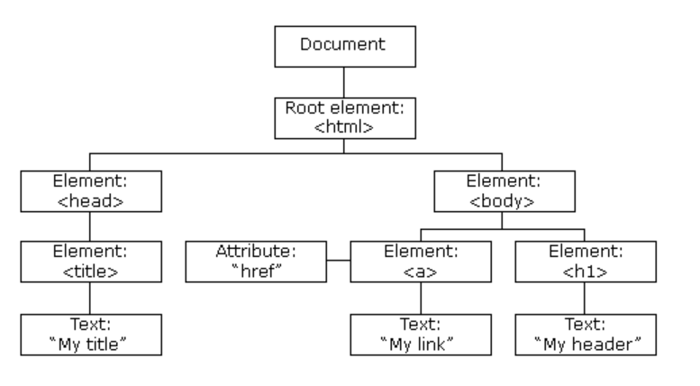
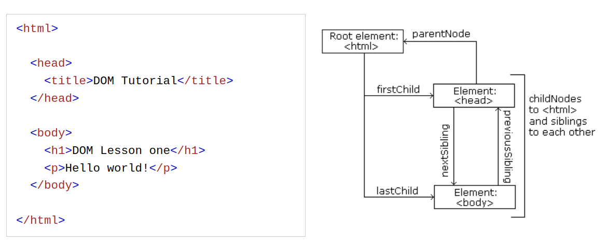

# Javascript Event Programming

## A toggle button example

In this example, we would like to make a toggle button. This button will not only show the content, but if we click on it again, it would hide the content.

In order to implement this example, we would use the following features of javascript we learned earlier,

* global variable
* function
* onclick event

To study this example, you can copy and paste the following html source code into a new html file. In my example, I created a file called "dom.html".

**dom.html**

```javascript
<html>
<head>
   <title>Using innerHTML property</title>
   <script>
      var displayed = false;

      function showIt() {
         document.getElementById("output").innerHTML = "Hello World";
         console.log("We flip this displayed flag on");
       
         displayed = true;
         console.log(displayed);
      }

      function toggle() {
         console.log("I am debugging in the toggle...");
         console.log(displayed);
         if (displayed) {
            // if it is true, then I want to hide it,
            document.getElementById("output").innerHTML="";
            displayed = false;
         } else {
            showIt()
         }
      }
   </script>
</head>

<body>
   <div id = "output" style="font-size: larger; font-family: 'Times New Roman', Times, serif; color: blueviolet;"> </div>

   <input type = "button" onclick = "toggle()" value = "display" />

</body>

<html>
```

In this example, we use a global variable as a flag to store a boolean value for us. The variable is called `displayed` and it was initially set to `false`. If we set the value then we flip it to `true`. Once we toggle the value back, we reset the value to empty string "" and we set the `displayed` to `false`.

**About Debugging**

Remember during the course that, if you type up the above code and run it and it does not work as expected, we can debug it by doing `console.log`.

How we do it is to right click on your html page, and click "Inspect", and then we go to "console" to check the printout messages from `console.log`.

## Register event to a HTML DOM component

There are two ways we can register events for a HTML DOM element,

* Use HTML Tag attribute such as "onclick", "onchange", "oninput"...etc.
* Use Javascript native dom.addEventListener(event, func)

```html

<!DOCTYPE html>
<html>
<body>

<h2>JavaScript addEventListener()</h2>

<p>This example uses the addEventListener() method to attach a click event to a button.</p>

<button id="myBtn">Try it</button>

<script>
document.getElementById("myBtn").addEventListener("click", function() {
  alert("Hello World!");
});
</script>

</body>
</html>
```

Also you can not to define the function inside of the addEventListener, just in case the function definition is bulky, then we can do the following,


```javascript
<!DOCTYPE html>
<html>
<body>

<h2>JavaScript addEventListener()</h2>

<p>This example uses the addEventListener() method to execute a function when a user clicks on a button.</p>

<button id="myBtn">Try it</button>

<script>
document.getElementById("myBtn").addEventListener("click", myFunction);

function myFunction() {
  alert ("Hello World!");
}
</script>

</body>
</html>
```

## DOM Events

Different HTML DOM elements would allow different events. For instance, the following example will use `<h1>` tag and it will allow `onclick` event.

```javascript
<!DOCTYPE html>
<html>
<body>

<h1 onclick="this.innerHTML = 'Ooops!'">Click on this text!</h1>

</body>
</html>
```

>Hint: Note here the `this` object refers to `h1` tag.

Now the following example shows you why it is convinient for HTML attribute event registration.

```javascript
<!DOCTYPE html>
<html>
<body>

<h1 onclick="changeText(this)">Click on this text!</h1>

<script>
function changeText(id) {
  id.innerHTML = "Ooops!";
}
</script>

</body>
</html>
```

>Hint: Note the `this` object actually saves your effort for doing, `document.getElementById(id)`.

## What is the differencs of these two ways of event registration?

**Why on earth we need both of them?**

Remember in the above case, the HTML DOM element `h1` or `div` was already existing, right?
So you could use either way to register the events. **However**, JS is so flexible that, it will allow you to dynamically generate these HTML DOM elements on the fly based on some conditional logic, then you do not have those dynamic element before hand, and you wouldn't even know what those `div`'s `id` would be. And very likely those `id` of the non-existing `div` would also be dynamically generated. Then the `dom.getElementById(id)` will come in handy.

Here is an example where the `div` 'demo' does not have content, and we will generate it.

```javascript
<!DOCTYPE html>
<html>
<body>
<h1>JavaScript HTML Events</h1>
<h2>The onclick Events</h2>

<p>Click "Try it" to execute the displayDate() function.</p>
<button id="myBtn">Try it</button>

<p id="demo"></p>

<script>
document.getElementById("myBtn").onclick = displayDate;

function displayDate() {
  document.getElementById("demo").innerHTML = Date();
}
</script>

</body>
</html> 
```

## Common JS Events

Javascript events are UI-driven events, thus they are similar to any other GUI events such as C#, Java Swing/AWT or Python UI or event GTK in linux, or any mobile UI SDK.

Here is a table of such events and a line of examples,

|Event| Functionality| Example|
|-----| -------------|--------|
|onload/onunload|* The onload and onunload events are triggered when the user enters or leaves the page. * The onload event can be used to check the visitor's browser type and browser version, and load the proper version of the web page based on the information. * The onload and onunload events can be used to deal with cookies.|`<body onload="checkCookies()"`>|
|oninput| The oninput event is often to some action while the user input data.|`<input type="text" id="fname" oninput="upperCase()">`|
|onchange| The oninput event is often to some action while the user input data.|`<input type="text" id="fname" onchange="upperCase()">`|
|onmouseover/onmouseout |The onmouseover and onmouseout events can be used to trigger a function when the user mouses over, or out of, an HTML element:|`<div onmouseover="mOver(this)" onmouseout="mOut(this)" style="background-color:#D94A38;width:120px;height:20px;padding:40px;">Mouse Over Me</div>`|
|onmousedown/onmouseup |left button of mouse|`<div onmousedown="mDown(this)" onmouseup="mUp(this)" style="background-color:#D94A38;width:90px;height:20px;padding:40px;">Click Me</div>`|
|onfocus|When the input field gets focus|`<input type="text" onfocus="myFunction(this)">`|

## Revisit HTML DOM Nodes

**DOM Nodes**

HTML or XML document is a tree structure.



**Node Relationships**



**Navigating Between Nodes**

* parentNode
* childNodes[nodenumber]
* firstChild
* lastChild
* nextSibling
* previousSibling

**Child Nodes and Node Values**

`<title id="demo">DOM Tutorial</title>`

* It contains a text node with the value "DOM Tutorial".

* The value of the text node can be accessed by the node's innerHTML property.

* Accessing the innerHTML property is the same as accessing the nodeValue of the first child

`myTitle = document.getElementById("demo").firstChild.nodeValue;`

* Accessing the first child can also be done like this:

`myTitle = document.getElementById("demo").childNodes[0].nodeValue;`

**DOM Root Nodes**

There are two special properties that allow access to the full document:

* document.body - The body of the document
* document.documentElement - The full document

**DOM Node Attributes**

* The nodeName Property
  The nodeName property specifies the name of a node.
      * nodeName is read-only
      * nodeName of an element node is the same as the tag name
      * nodeName of an attribute node is the attribute name
      * nodeName of a text node is always #text
      * nodeName of the document node is always #document

* The nodeValue Property
  The nodeValue property specifies the value of a node.
      * nodeValue for element nodes is null
      * nodeValue for text nodes is the text itself
      * nodeValue for attribute nodes is the attribute value

* The nodeType Property
  The nodeType property is read only. It returns the type of a node.

The most important nodeType properties are:

|Node|	Type|	Example|
|----|-------|---------|
|ELEMENT_NODE|	1|	`<h1 class="heading">W3Schools</h1>`|
|ATTRIBUTE_NODE|	2|	 class = "heading" (deprecated)|
|TEXT_NODE|	3|	W3Schools|
|COMMENT_NODE|	8|	`<!-- This is a comment -->`|
|DOCUMENT_NODE|	9|	The HTML document itself (the parent of <html>)|
|DOCUMENT_TYPE_NODE|	10|	<!Doctype html>|

## Dynamically Create Contents

The power of Javascript is to create contents dynamically,

**Create new node**

```javascript
<div id="div1">
  <p id="p1">This is a paragraph.</p>
  <p id="p2">This is another paragraph.</p>
</div>

<script>
const para = document.createElement("p");
const node = document.createTextNode("This is new.");
para.appendChild(node);

const element = document.getElementById("div1");
element.appendChild(para);
</script>
```

**Insert a new node**

```javascript
<!DOCTYPE html>
<html>
<body>

<h2>JavaScript HTML DOM</h2>
<p>Add a new HTML Element.</p>

<div id="div1">
<p id="p1">This is a paragraph.</p>
<p id="p2">This is another paragraph.</p>
</div>

<script>
const para = document.createElement("p");
const node = document.createTextNode("This is new.");
para.appendChild(node);

const element = document.getElementById("div1");
const child = document.getElementById("p1");
element.insertBefore(para,child);
</script>

</body>
</html>
```

**Remove a node**

```javascript
<!DOCTYPE html>
<html>
<body>

<h2>JavaScript HTML DOM</h2>
<h3>Remove an HTML Element.</h3>

<div>
<p id="p1">This is a paragraph.</p>
<p id="p2">This is another paragraph.</p>
</div>

<button onclick="myFunction()">Remove Element</button>

<script>
function myFunction() {
document.getElementById("p1").remove();
}
</script>

</body>
</html>
```

**Remove Child Node**

```javascript
<!DOCTYPE html>
<html>
<body>

<h2>JavaScript HTML DOM</h2>
<p>Remove Child Element</p>

<div id="div1">
<p id="p1">This is a paragraph.</p>
<p id="p2">This is another paragraph.</p>
</div>

<script>
const parent = document.getElementById("div1");
const child = document.getElementById("p1");
parent.removeChild(child);
</script>

</body>
</html>
```

**Replacing HTML Elements**

```javascript
<!DOCTYPE html>
<html>
<body>

<h2>JavaScript HTML DOM</h2>
<h3>Replace an HTML Element.</h3>

<div id="div1">
<p id="p1">This is a paragraph.</p>
<p id="p2">This is a paragraph.</p>
</div>

<script>
const parent = document.getElementById("div1");
const child = document.getElementById("p1");
const para = document.createElement("p");
const node = document.createTextNode("This is new.");
para.appendChild(node);
parent.replaceChild(para,child);
</script>

</body>
</html>
```

## HTML DOM Collections

**The HTMLCollection Object**

An HTMLCollection object is an array-like list (collection) of HTML elements.

The `getElementsByTagName()` method returns an HTMLCollection object. The following code selects all <p> elements in a document:

The following code selects all <p> elements in a document:

`const myCollection = document.getElementsByTagName("p");`

* The index starts at 0.

* myCollection.length

* You can loop through the list and refer to the elements with a number (just like an array).

* However, you cannot use array methods like valueOf(), pop(), push(), or join() on an HTMLCollection.

```javascript
const myCollection = document.getElementsByTagName("p");
for (let i = 0; i < myCollection.length; i++) {
  myCollection[i].style.color = "red";
}
```

## HTML DOM NodeList Object

* A NodeList object is a list (collection) of nodes extracted from a document.

* A NodeList object is almost the same as an HTMLCollection object.

* Most browsers return a NodeList object for the method querySelectorAll()

* myNodelist.length

`const myNodeList = document.querySelectorAll("p");`

```javascript
const myNodelist = document.querySelectorAll("p");
for (let i = 0; i < myNodelist.length; i++) {
  myNodelist[i].style.color = "red";
}
```

## HTMLCollection vs NodeList

* An HTMLCollection is a collection of document elements. A NodeList is a collection of document nodes (element nodes, attribute nodes, and text nodes).

* HTMLCollection items can be accessed by their name, id, or index number. NodeList items can only be accessed by their index number.

* An HTMLCollection is always a live collection. Example: If you add a <li> element to a list in the DOM, the list in the HTMLCollection will also change.

* A NodeList is most often a static collection. Example: If you add a <li> element to a list in the DOM, the list in NodeList will not change.

* The getElementsByClassName() and getElementsByTagName() methods return a live HTMLCollection.

* The querySelectorAll() method returns a static NodeList.

* The childNodes property returns a live NodeList.