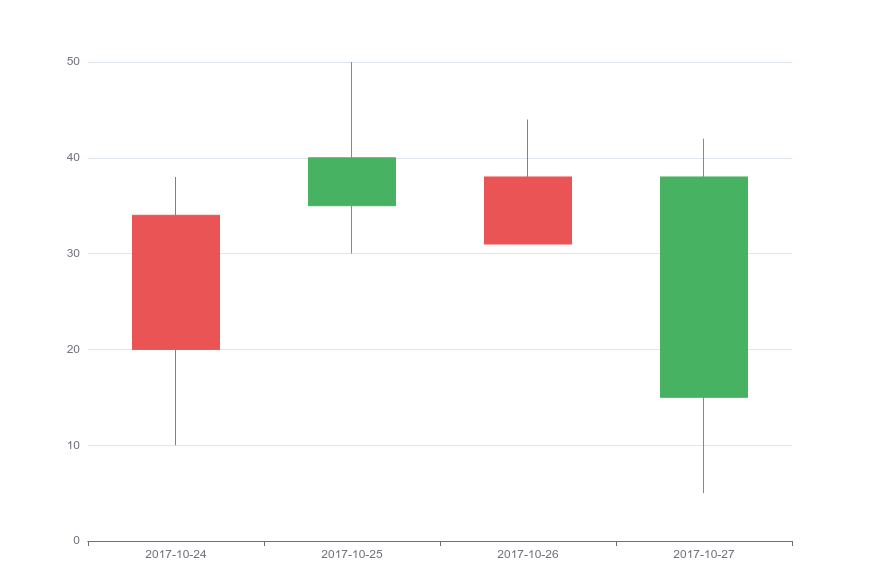
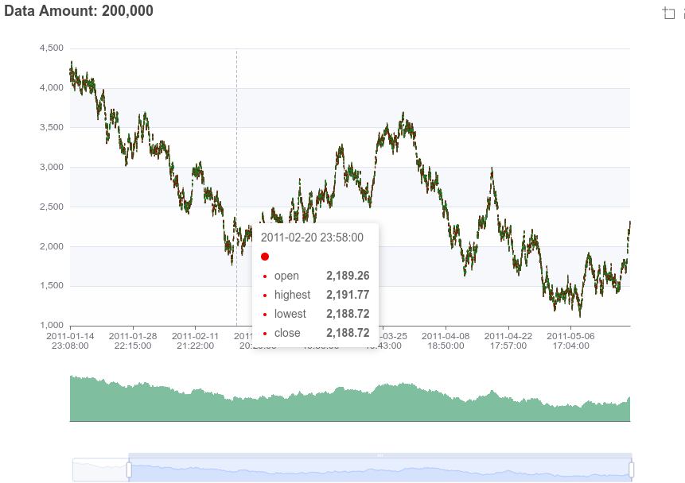
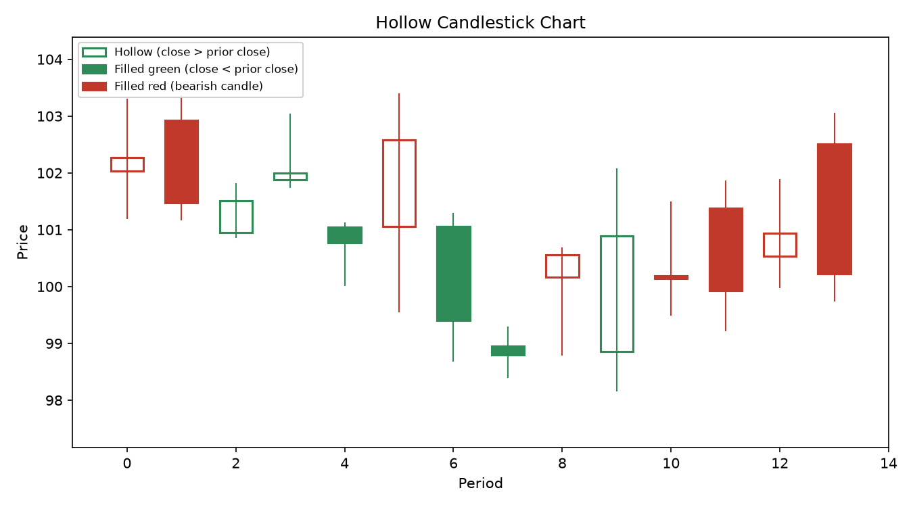
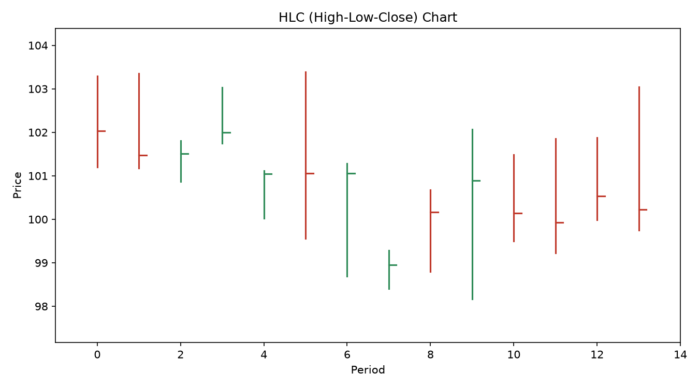

# Class 2 - Reading Charts

## Goal

Learn to read price charts, the primary tool for technical analysis.

## Topics

- Line charts vs. bar charts vs. candlestick charts
- Anatomy of a candlestick: open, high, low, close
- Bullish vs. bearish candles
- Choosing a timeframe: 1-minute, hourly, daily, weekly
- Volume bars and what they tell you

## Definitions

- **Line chart**: A chart that plots a single price point (usually the closing price) per period, connected by a continuous line.
- **Bar chart**: A chart using vertical bars where each bar shows the open, high, low, and close (OHLC) for a period via small tick marks.
- **Candlestick chart**: A chart that represents each period's open, high, low, and close as a "candle" with a body and wicks, making price action easier to read visually than bar charts.
- **Open**: The first traded price of a security during a given time period.
- **High**: The highest traded price of a security during a given time period.
- **Low**: The lowest traded price of a security during a given time period.
- **Close**: The last traded price of a security during a given time period.
- **Bullish candle**: A candle where the close is higher than the open, typically shown in green or white, signaling upward price pressure during that period.
- **Bearish candle**: A candle where the close is lower than the open, typically shown in red or black, signaling downward price pressure during that period.

- **Timeframe**: The duration each candle/bar represents on a chart (e.g., 1-minute, hourly, daily, weekly), which determines how much price history is condensed into each candle.
- **Volume**: The number of shares (or contracts) traded during a given period, usually displayed as bars beneath the price chart to show the level of trading activity.

- **Hollow candlestick chart**: A candlestick variant where the body is hollow (unfilled/white) when the close is higher than the prior period's close, and filled (solid color) when the close is lower than the prior period's close, regardless of whether the candle itself is bullish or bearish. This adds an extra layer of information (price vs. the previous period) on top of the usual bullish/bearish coloring.

- **HLC chart**: A bar-style chart that plots only the high, low, and close for each period - a vertical line from low to high with a small tick to the right marking the close. Unlike an OHLC bar chart, it omits the open tick.

## Key Takeaways

- Candlestick charts pack four data points (O/H/L/C) into a single visual.
- The timeframe you choose should match your trading style (day trading vs. swing trading vs. investing).
- Volume confirms (or contradicts) price movement.

## Practice

Pick a stock and identify five candlesticks on the daily chart. For each, describe whether it is bullish or bearish and why.
