# Cassandra Introduction

## Outline

* Cassandra components, architecture and data replication
* CQL
* Installation
* Comparison with other systems

## What is Cassandra?

Cassandra is a free and open-source, distributed, wide-column store, `NoSQL` database management system designed to handle large amounts of data across many commodity servers, providing high availability with no single point of failure. Cassandra offers support for clusters spanning multiple datacenters, with asynchronous masterless replication allowing low latency operations for all clients. Cassandra was designed to implement a combination of Amazon's Dynamo distributed storage and replication techniques combined with Google's Bigtable data and storage engine model.

### History

* `Avinash Lakshman`, one of the authors of Amazon's Dynamo, and `Prashant Malik` initially developed Cassandra at Facebook to power the Facebook inbox search feature.
* Facebook released Cassandra as an open-source project on Google code in July 2008. 
* In March 2009, it became an Apache Incubator project. 
* On February 17, 2010, it graduated to a top-level project.

### Cassandra Fault Tolerant and Data Replication

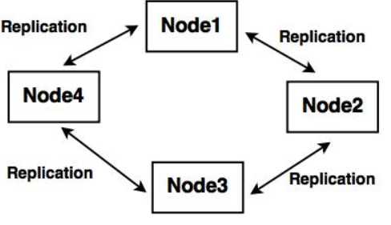

### Main Components of Cassandra

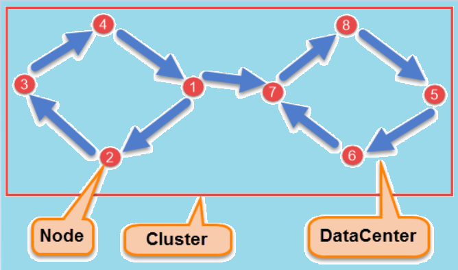

* Node: It is used to store data.

* Data center: It acts as a collection of related nodes.

* Cluster: It contains one or more data centers.

* Commit log: It is a crash-recovery mechanism which is used for writing operation.

* Mem-table: It is a memory-resident data structure, in which the data is written after the commit log.

* SSTable: The data is flushed into this disk file from the mem-table. It is used when the contents of the mem-table reaches a threshold value.

* Bloom filter: It is a special type of cache which is used to check if an element is a member of a set. They are quick and nondeterministic algorithms that are accessed after every query.

### Write Operations

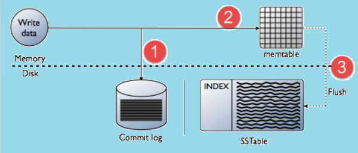

### Difference Between Relational And NoSQL Database

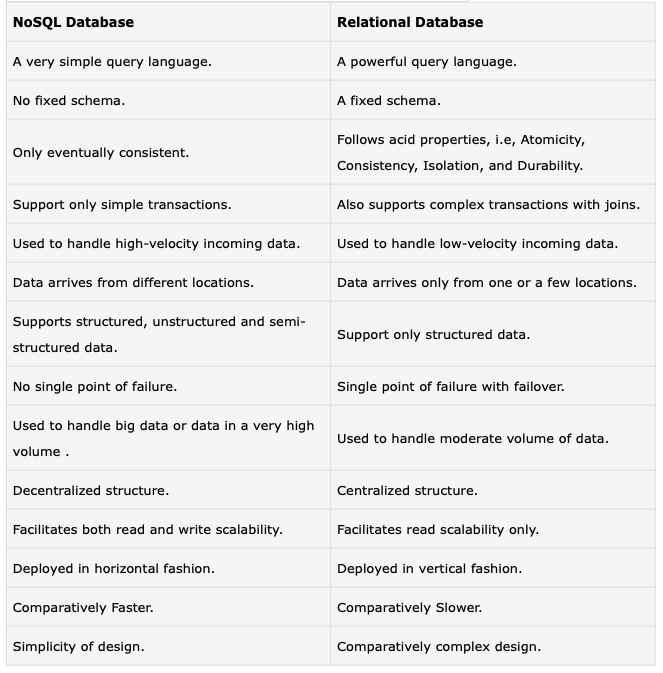

### Difference Between Cassandra And HBase

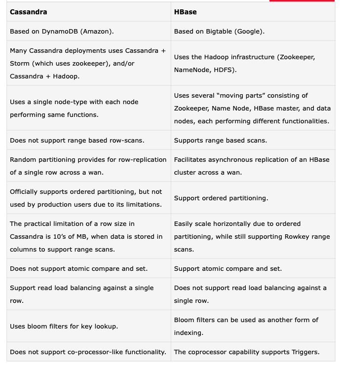

### Cassandra Use Case

* Messaging:

Cassandra can store hundreds of terabytes of data, and thus is best for the companies providing Mobile phones and messaging services.

* High speed Applications:

With the feature of high speed data handling Cassandra is a preferred choice for the high-speed data applications. These data would be coming from different devices or sensors.

* Product Catalogs and retail apps:

For durable shopping cart protection Cassandra is a great database for the retailers. It also facilitates fast product catalog input and output.

* Social Media Analytics and recommendation engine:

Cassandra is also suitable for the use case of analysis and recommendation to the customers and thus is preferred by online companies and social media providers.

## Cassandra Data Types 

In this tutorial, we will learn about the Data Types in `Cassandra CQL language`. 
DataTypes generally define the type of data a column can hold along with their own significance. 
CQL language supports the below list Data types:

* Native Types 
* Collection Types
* User-defined Types
* Tuple types

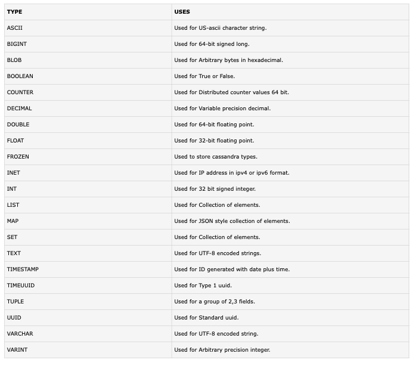

### Understanding Cqlsh in Cassandra

* CQLSH – This is the Command Line Utility used to execute the commands to communicate with Cassandra database.
* To start the utility we need to give the command cqlsh either in linux terminal or windows command prompt. 
* The default listen port for cqlsh is 9042

### Installation

* The DataStax community edition.
* JDK installed.
* https://www.apache.org/dyn/closer.lua/cassandra/4.0.11/apache-cassandra-4.0.11-bin.tar.gz

For instance, 

**Cassandra installation -- MacOS**

1/ `install homebrew`
`ruby -e "$(curl -fsSL https://raw.github.com/Homebrew/homebrew/go/install)"`

2/ `brew install python`

3/ `pip install cql`

4/ `brew install cassandra`

5/ `brew services start cassandra`

```shell
==> cassandra
To start cassandra now and restart at login:
brew services start cassandra
Or, if you don't want/need a background service you can just run:
/opt/homebrew/opt/cassandra/bin/cassandra -f
```

> Ref: https://gist.github.com/hkhamm/a9a2b45dd749e5d3b3ae

### Cassandra Data Model

* **Cluster**

A Cluster in Cassandra is the outermost container of the database. It contains one or more data centres. A data centre again acts as a collection of related nodes. With four nodes in a cluster, Cassandra facilitates replication as each node has a copy of the same data. If any of the four nodes are not working then the purpose can still be served by the other three nodes on request. Cassandra facilitates an increase in the number of nodes in the cluster which thus advances the throughput.

* **Keyspace**

A keyspace in Cassandra is the outermost container for data. A Keyspace in Cassandra has some basic attributes, including,
Replication factor:  It is used to define the number of the machine in the cluster which will be used in replication, i.e, the number of machines receiving the copies of the same data.
Replica placement Strategy: The Replica Placement Strategy in Cassandra is used to specify the way to place the replicas in the ring. The strategy can be of  three types: Simple strategy (rack-aware strategy), old network topology strategy (rack-aware strategy) and network topology strategy (datacenter-shared strategy)

* **Column families**

A keyspace in Cassandra holds a list of one or more column families. A column family in Cassandra holds a collection of rows, where each row contains ordered columns.


### Cassandra Data Models Rules

* JOINS, GROUP BY, OR clause, aggregation etc. are not supported.
The data thus needs to be stored in a way so that it can be easily retrieved whenever needed.

* For better read performance and data availability, the writes need to be maximized, since the Cassandra is optimized for high write performances.

* By maximizing the number of data writes, the data read performance can also be optimized, as there is a trade off between data write and data read in Cassandra.

* Cassandra is a distributed database. A maximization in data duplication provides instant data availability with maximized fault tolerance.

### Cassandra CQLsh


###  Create KeySpace in cassandra

* KeySpace in NoSQL database is just like a schema in regular RDBMS concept, and it does not have any concrete structure.
* In NoSQL database, there will be one keyspace per application.
* A Keyspace contains column families or super columns. Each super column contains one or more column family, each column family contains at least one column.

**Create keyspace**

***Syntax 1: To create keyspace:***

`CREATE KEYSPACE <identifier> WITH <properties>`

***Syntax 2: To create keyspace:***

`CREATE KEYSPACE Keyspace_Name with replication={'class':strategy name,
'replication_factor': No of replications on different nodes}`

**Example**

```sql
CREATE KEYSPACE IF NOT EXISTS example
WITH replication = {'class':'SimpleStrategy', 'replication_factor' : 3};
```

**Verification**

`DESCRIBE keyspaces;`

> Hint: `DESCRIBE` is similar to MySQL.

> keyspace is like a database collection.

**Strategy**

In Cassandra syntax, there are two types of strategy declaration.

* **Simple Strategy:** In the case of one data centre, this strategy is preferred. The first replica is thus placed on the selected node in the process. In this strategy, the remaining nodes are placed in the ring in the clockwise direction. The rack or node location is not considered.

* **Network Topology Strategy:**
In the case of more than one data centres, the Network Topology strategy is used. A replication factor is provided in this strategy for each data centre separately.

* **Replication Factor:**
Replication factor is the number of the machine in the cluster which will be used in replication, i.e, the number of machines receiving the copies of the same data.

* **Durable_writes:**
The durable_writes is a property which is used with the CREATE KEYSPACE statement. By default, it is set to true. It can be set to false. But, cannot be set to simplex strategy.

***Example***

```sql
CREATE KEYSPACE durable_example
WITH REPLICATION = { 'class' : 'NetworkTopologyStrategy', 'datacenter1' : 3 }
AND DURABLE_WRITES = false;
```
***Verfication***

Verification

`cqlsh> DESCRIBE keyspaces;`

## Use Keyspace

**Syntax:**

`USE <identifier>`

***Example***

`USE durable_example;`

## Alter and Drop Keyspace

***Syntax 1:***
`ALTER KEYSPACE  WITH`

***Syntax 2:***
```sql
ALTER KEYSPACE "KeySpace_Name"  
WITH replication = {'class': 'Strategy name', 'replication_factor': 'No. Of  replicas'};
```

***Syntax 3:***
```sql
ALTER KEYSPACE example with replication={'class':'Strategy_Name',   
'replication_factor': no of replications on different nodes}  with DURABLE_WRITES=true/false
```

## Drop Keyspace

`DROP keyspace example;`

## Create Table

***Syntax 1:***
```sql
CREATE (TABLE | COLUMNFAMILY)   
('' , '')  
(WITH
```

***Syntax 2: Declaring a primary key:***
```sql
CREATE TABLE table_name(  
Column_Name1 Data_Type PRIMARY KEY,  
Column_Name2 Data_Type,  
Column_Name3 Data_Type  ... )
```

***Syntax 3: Declaring a primary key:***
```sql
CREATE TABLE table_name(  
Column_Name1 Data_Type,  
Column_Name2 Data_Type,  
Column_Name3 Data_Type  
..
Primary key(Column_Name)  )
with Property_Name=Property_Value;
```

***Example*** 

```sql
CREATE TABLE employees(  
id int PRIMARY KEY,  
name text,    
salary varint
);
```

***Explanation:***

A table named 'employees' is created.
The created table can be checked using the below command.eg

`SELECT * FROM employees;`

## Alter Table

***Syntax***

`ALTER (TABLE | COLUMN_FAMILY) tablename instruction`


### add column syntax

***Syntax***

```sql
ALTER TABLE table_name  
ADD new column datatype;
```

***Example***

```sql
ALTER TABLE employees  
ADD city text;
```

### Drop column

***Syntax***
```sql
  ALTER table_name  
  DROP column_name;
```

***Example***
```sql
ALTER TABLE employees  
DROP city;

```

```sql
ALTER TABLE employees  
DROP (name, salary);
```

## Drop and truncate table

***Examples***

`DROP TABLE employees;`
`TRUNCATE employees;`

## Create and Drop index

***Syntax***

`CREATE INDEX <identifier> ON <tablename>`

* The primary key in Cassandra is already indexed and thus cannot be indexed.
* Collections in Cassandra cannot be indexed.
* A column cannot be filtered by Cassandra, without the indexing on that column, unless it is a primary key.

***Example***

`CREATE INDEX e_name ON employees (name);`

Run in CQL,

`cqlsh:your_system> CREATE INDEX name ON emp1 (emp_name);`

## Batch Processing

***Syntax:***

```sql
BEGIN BATCH
<insert-stmt>/ <update-stmt>/ <delete-stmt>
APPLY BATCH
```

Assume there is a table in Cassandra called emp having the following data −

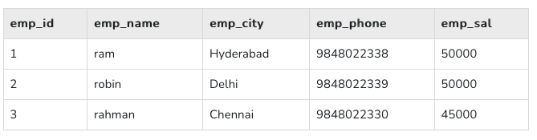

```sql
cqlsh:your_system> BEGIN BATCH
... INSERT INTO emp (emp_id, emp_city, emp_name, emp_phone, emp_sal) values(  4,'Pune','rajeev',9848022331, 30000);
... UPDATE emp SET emp_sal = 50000 WHERE emp_id =3;
... DELETE emp_city FROM emp WHERE emp_id = 2;
... APPLY BATCH;
```

***Verification***

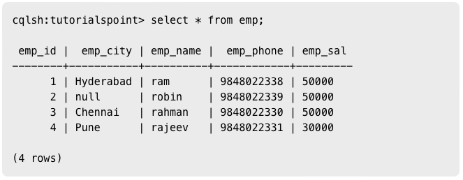

## Create Data

Syntax:
INSERT INTO <tablename>
(<column1 name>, <column2 name>....)
VALUES (<value1>, <value2>....)
USING <option>

Eg:
cqlsh:tutorialspoint> INSERT INTO employees (id, name, city, salary)
VALUES(1,'ram', 'Hyderabad', 50000);

cqlsh:tutorialspoint> INSERT INTO employees (id, name, city, salary)
VALUES(2,'robin', 'Hyderabad', 40000);

cqlsh:tutorialspoint> INSERT INTO employees (id, name, city, salary)
VALUES(3,'rahman', 'Chennai', 45000);

***Verification***
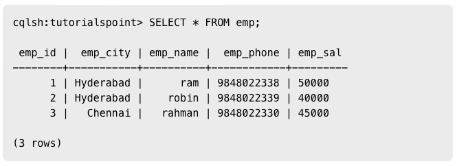

## Update Data

***Syntax:***

```sql
UPDATE <tablename>
SET <column name> = <new value>
<column name> = <value>....
WHERE <condition>
```

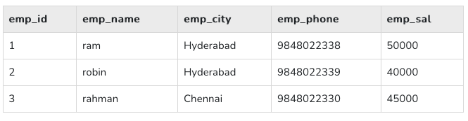

***Verification***

```sql
cqlsh:tutorialspoint> UPDATE emp SET emp_city='Delhi',emp_sal=50000
WHERE emp_id=2;

Select * from emp;
```

## Read Data

***Syntax***

`SELECT FROM <table name> WHERE <condition>;`

***Example***

```sql
cqlsh:your_system> CREATE INDEX ON emp(emp_sal);
cqlsh:your_system> SELECT * FROM emp WHERE emp_sal=50000;
```

| emp_id |  emp_city | emp_name |  emp_phone | emp_sal |
|--------|-----------|----------|------------|---------|
| 1      | Hyderabad |      ram | 9848022338 | 50000   |
| 2      |      null |    robin | 9848022339 | 50000   |
| 3      |   Chennai |   rahman | 9848022330 | 50000   | 

## Delete Data

***Syntax***

`DELETE FROM <identifier> WHERE <condition>;`

***Example***

`cqlsh:tutorialspoint> DELETE emp_sal FROM emp WHERE emp_id=3;`

***Verification***

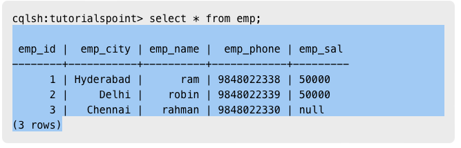

## Ref

- https://www.i2tutorials.com/cassandra-tutorial/cassandra-create-table/
- https://www.w3schools.blog/cassandra-tutorial