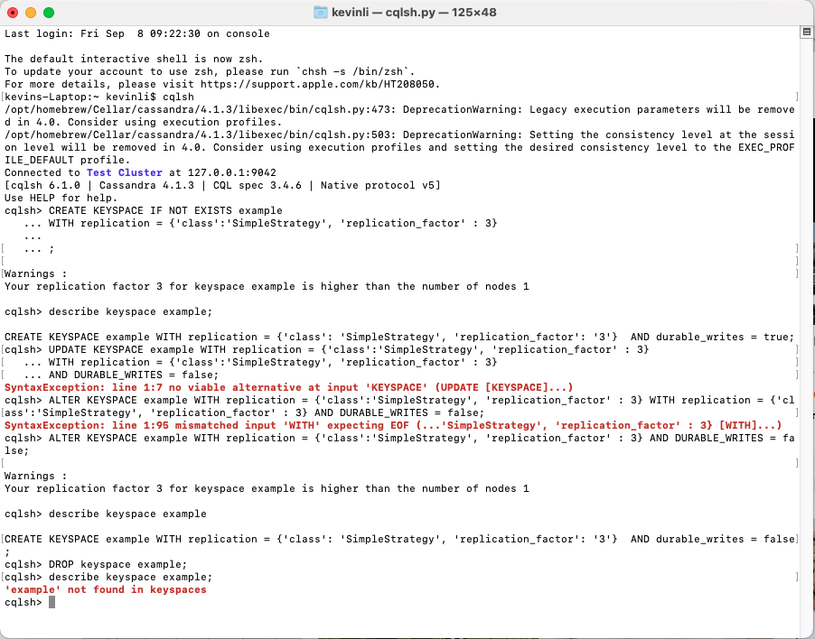
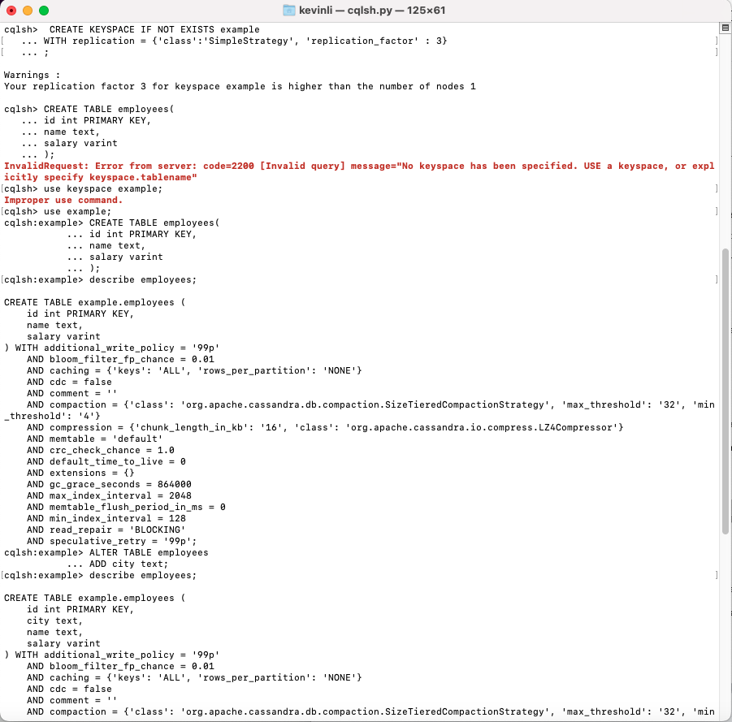
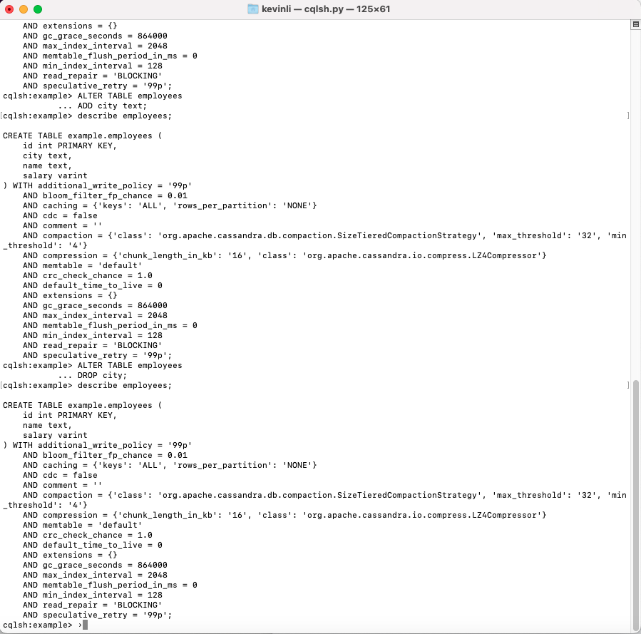
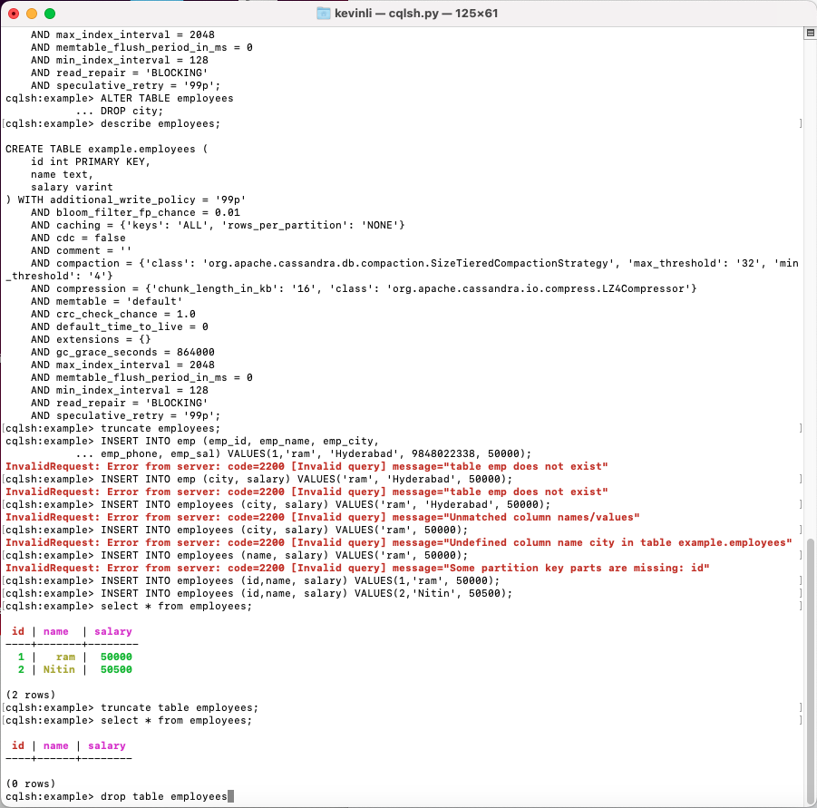
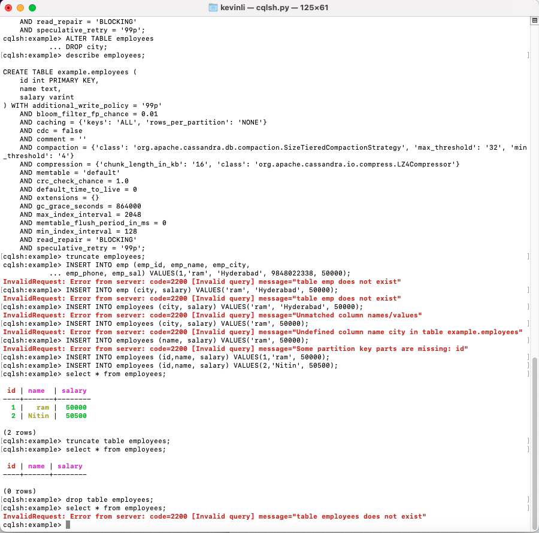
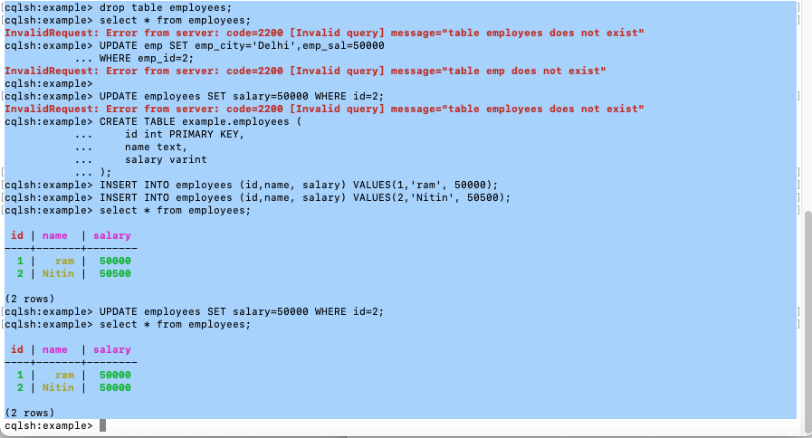

# Cassandra Programming

## Outline

* Part I CQL Programming
* Part II Programming with Python

## Part I: CQL Programming

Please following all the steps to get familiarized with the NoSQL syntax.

**Keyspace**

```sql
CREATE KEYSPACE IF NOT EXISTS example
... WITH replication = {'class':'SimpleStrategy', 'replication_factor' : 3}
```

`describe keyspace example;`

`ALTER KEYSPACE example WITH replication = {'class':'SimpleStrategy', 'replication_factor' : 3} AND DURABLE_WRITES = false;`

`describe keyspace example`

`DROP keyspace example;`

`CREATE KEYSPACE example WITH replication = {'class': 'SimpleStrategy', 'replication_factor': '3'}  AND durable_writes = false;
describe keyspace example;`



## Tables













## Batch

```sql
APPLY BATCH
INSERT INTO employees (id,name, salary) VALUES(1,'ram', 50000);
INSERT INTO employees (id,name, salary) VALUES(2,'Nitin', 50500);
UPDATE employees SET salary=50000 WHERE id=2;
delete from employees where id = 2;
APPLY BATCH
```

## Part II: Programming with Python

### Install driver

`pip3 install cassandra-driver`

### Code

```python
from cassandra.cluster import Cluster
from cassandra.policies import DCAwareRoundRobinPolicy
from cassandra.auth import PlainTextAuthProvider

auth_provider = PlainTextAuthProvider(username='cassandra', password='cassandra')

clstr=Cluster(['0.0.0.0'] ,
                #load_balancing_policy=DCAwareRoundRobinPolicy(local_dc='US-WEST'),
                port=9042,
                auth_provider=auth_provider
                )
session=clstr.connect()
session.execute("create keyspace if not exists mykeyspace with replication={'class':'SimpleStrategy','replication_factor':1};")
session=clstr.connect('mykeyspace')
qry= '''
 create table if not exists students (
  studentID int,
   name text,
   age int,
   marks int,
   primary key(studentID)
);'''
session.execute(qry)
session.execute("insert into students (studentID, name, age, marks) values (1, 'Juhi',20, 200);")
rows=session.execute("select * from students;")
for row in rows:
    print ('StudentID: {} Name:{} Age:{}'.format(row[0],row[1], row[2]))
    #print(row)
```


## Ref

- https://www.tutorialspoint.com/python_data_persistence/python_data_persistence_cassandra_driver.htm
- https://docs.datastax.com/en/developer/python-driver/3.25/getting_started/