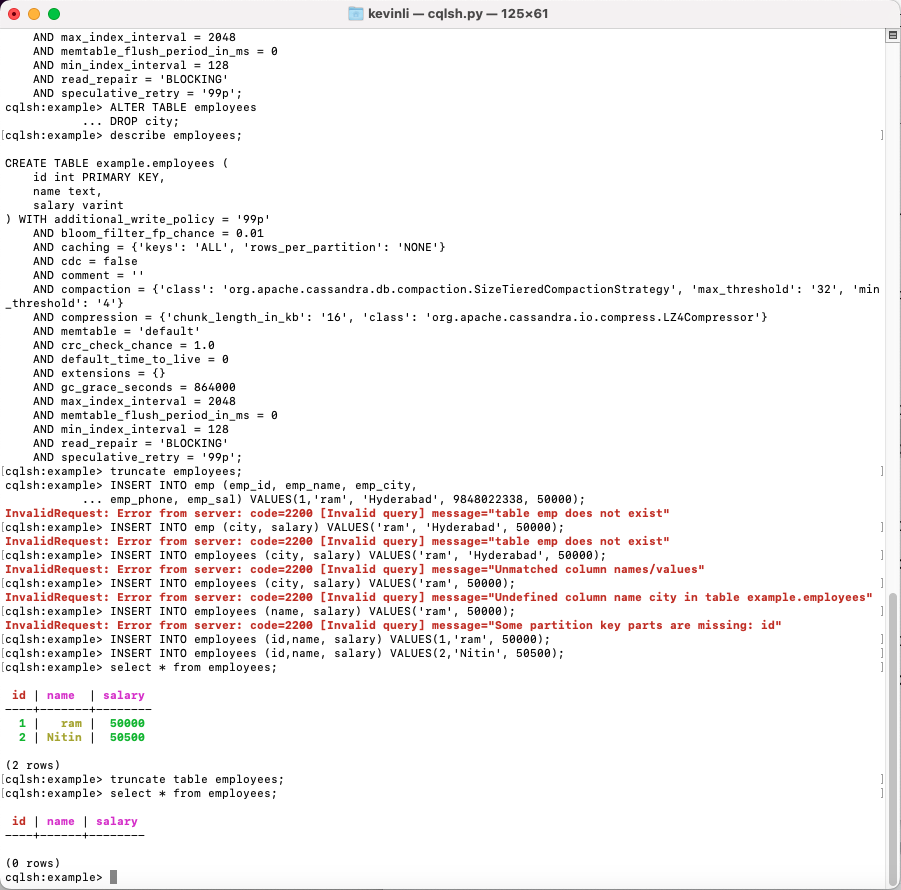
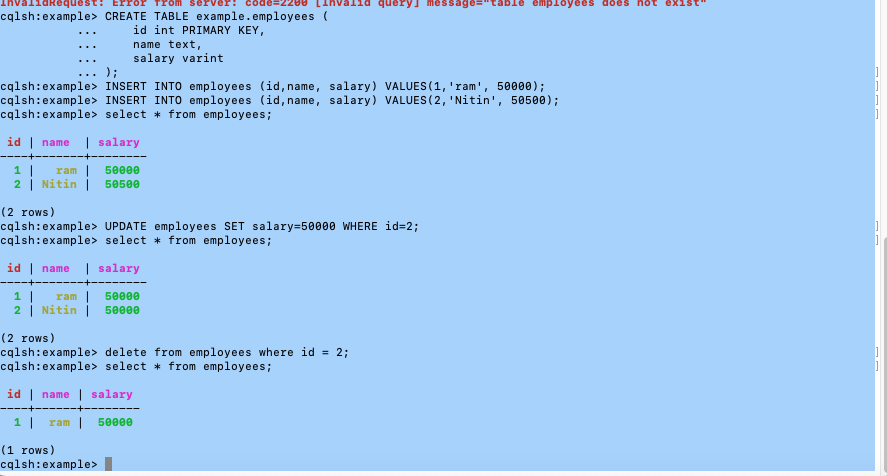
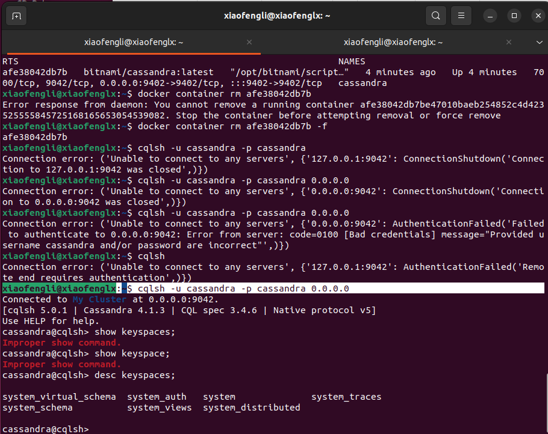
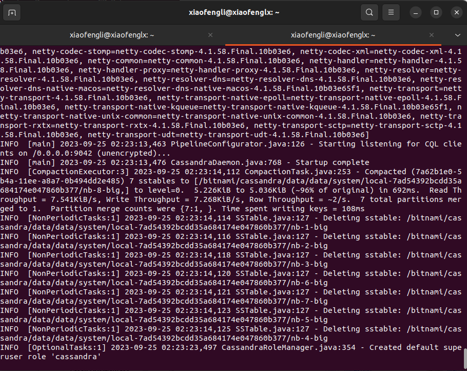

# Cassandra Programming

## Outline

* Part I CQL Programming
* Part II Programming with Python

## Part I: CQL Programming

Please following all the steps to get familiarized with the NoSQL syntax.

**Keyspace**

```sql
CREATE KEYSPACE IF NOT EXISTS example
... WITH replication = {'class':'SimpleStrategy', 'replication_factor' : 3}
```

`describe keyspace example;`

`ALTER KEYSPACE example WITH replication = {'class':'SimpleStrategy', 'replication_factor' : 3} AND DURABLE_WRITES = false;`

`describe keyspace example`

`DROP keyspace example;`

`CREATE KEYSPACE example WITH replication = {'class': 'SimpleStrategy', 'replication_factor': '3'}  AND durable_writes = false;
describe keyspace example;`


## Tables







## Batch

```sql
APPLY BATCH
INSERT INTO employees (id,name, salary) VALUES(1,'ram', 50000);
INSERT INTO employees (id,name, salary) VALUES(2,'Nitin', 50500);
UPDATE employees SET salary=50000 WHERE id=2;
delete from employees where id = 2;
APPLY BATCH
```

## Part II: Programming with Python

### Docker Image

Docker Image to run Cassandra in Commandline (20 mins)

**#1 way to run free cassandra docker image**

This is the easiest way and recommended way to start a cassandra docker container,

`docker pull bitnami/cassandra`
`docker run --name cassandra bitnami/cassandra:latest`

In case you do not mount custom configuration files, the following variables are available for configuring cassandra:

• CASSANDRA_TRANSPORT_PORT_NUMBER: Inter-node cluster communication port. Default: 7000

• CASSANDRA_JMX_PORT_NUMBER: JMX connections port. Default: 7199

• CASSANDRA_CQL_PORT_NUMBER: Client port. Default: 9042.

• CASSANDRA_USER: Apache Cassandra user name. Defaults: cassandra

• CASSANDRA_PASSWORD_SEEDER: Password seeder will change the Apache Cassandra default credentials at initialization. In clusters, only one node should be marked as password seeder. Default: no

• CASSANDRA_PASSWORD: Apache Cassandra user password. Default: cassandra

• CASSANDRA_NUM_TOKENS: Number of tokens for the node. Default: 256.

• CASSANDRA_HOST: Hostname used to configure Apache Cassandra. It can be either an IP or a domain. If left empty, it will be resolved to the machine IP.

• CASSANDRA_CLUSTER_NAME: Cluster name to configure Apache Cassandra.. Defaults: My Cluster

• CASSANDRA_SEEDS: Hosts that will act as Apache Cassandra seeds. No defaults.

• CASSANDRA_ENDPOINT_SNITCH: Snitch name (which determines which data centers and racks nodes belong to). Default: SimpleSnitch

• CASSANDRA_ENABLE_RPC: Enable the thrift RPC endpoint (ignored for Apache Cassandra 4.X and newer). Default :true

• CASSANDRA_DATACENTER: Datacenter name for the cluster. Ignored in SimpleSnitch endpoint snitch. Default: dc1.

• CASSANDRA_RACK: Rack name for the cluster. Ignored in SimpleSnitch endpoint snitch. Default: rack1.

• CASSANDRA_ENABLE_USER_DEFINED_FUNCTIONS: User defined functions. Default: false.

• CASSANDRA_ENABLE_SCRIPTED_USER_DEFINED_FUNCTIONS: User defined scripted functions. Default: false

• CASSANDRA_BROADCAST_ADDRESS: The public IP address this node uses to broadcast to other nodes outside the network or across regions in multiple-region EC2 deployments. This option is commented out by default (if not provided, Apache Cassandra will use "listen_address"). No defaults.

• CASSANDRA_COMMITLOG_DIR: Directory where the commit logs will be stored. Default: /bitnami/cassandra/data/commitlog

• CASSANDRA_AUTOMATIC_SSTABLE_UPGRADE: Automatically upgrade sstables after upgrade - if there is no ordinary compaction to do, the oldest non-upgraded sstable will get upgraded to the latest version. Default: false.
Additionally, any environment variable beginning with the following prefix will be mapped to its corresponding Apache Cassandra key in the proper file:

• CASSANDRA_CFG_ENV_: Will add the corresponding key and the provided value to cassandra-env.sh.

• CASSANDRA_CFG_RACKDC_: Will add the corresponding key and the provided value to cassandra-rackdc.properties.

• CASSANDRA_CFG_COMMITLOG_: Will add the corresponding key and the provided value to commitlog_archiving.properties.




# 2 way to run canssdra image via docker-compose

`curl -sSL https://raw.githubusercontent.com/bitnami/containers/main/bitnami/cassandra/docker-compose.yml > docker-compose.yml`

then

`docker-compose up -d`

If you set any configuration in command line vs yaml, they looks like this,

```shell
docker run --name cassandra \
-e CASSANDRA_PASSWORD_SEEDER=yes \
-e CASSANDRA_PASSWORD=password123 \
bitnami/cassandra:latest
```

or using Docker Compose:

```shell
cassandra:
image: bitnami/cassandra:latest
environment:
- CASSANDRA_PASSWORD_SEEDER=yes
- CASSANDRA_PASSWORD=password123
```

**Why use Bitnami Images?**

• Bitnami closely tracks upstream source changes and promptly publishes new versions of this image using our automated systems.

• With Bitnami images the latest bug fixes and features are available as soon as possible.

• Bitnami containers, virtual machines and cloud images use the same components and configuration approach - making it easy to switch between formats based on your project needs.

• All our images are based on minideb a minimalist Debian based container image which gives you a small base container image and the familiarity of a leading Linux distribution.

• All Bitnami images available in Docker Hub are signed with Docker Content Trust (DCT). You can use DOCKER_CONTENT_TRUST=1 to verify the integrity of the images.

• Bitnami container images are released on a regular basis with the latest distribution packages available.

**Why use a non-root container?**

Non-root container images add an extra layer of security and are generally recommended for production environments. However, because they run as a non-root user, privileged tasks are typically off-limits. Learn more about non-root containers in our docs.

**How to deploy Apache Cassandra in Kubernetes? (Skipped)**

Deploying Bitnami applications as Helm Charts is the easiest way to get started with our applications on Kubernetes. Read more about the installation in the Bitnami Apache Cassandra Chart GitHub repository.
Bitnami containers can be used with Kubeapps for deployment and management of Helm Charts in clusters.



 


> References:
- https://hub.docker.com/r/bitnami/cassandra
- https://www.docker.com/101-tutorial/
- https://www.tutorialspoint.com/docker/index.htm


### Install driver

`pip3 install cassandra-driver`

### Code

```python
from cassandra.cluster import Cluster
from cassandra.policies import DCAwareRoundRobinPolicy
from cassandra.auth import PlainTextAuthProvider

auth_provider = PlainTextAuthProvider(username='cassandra', password='cassandra')

clstr=Cluster(['0.0.0.0'] ,
                #load_balancing_policy=DCAwareRoundRobinPolicy(local_dc='US-WEST'),
                port=9042,
                auth_provider=auth_provider
                )
session=clstr.connect()
session.execute("create keyspace if not exists mykeyspace with replication={'class':'SimpleStrategy','replication_factor':1};")
session=clstr.connect('mykeyspace')
qry= '''
 create table if not exists students (
  studentID int,
   name text,
   age int,
   marks int,
   primary key(studentID)
);'''
session.execute(qry)
session.execute("insert into students (studentID, name, age, marks) values (1, 'Juhi',20, 200);")
rows=session.execute("select * from students;")
for row in rows:
    print ('StudentID: {} Name:{} Age:{}'.format(row[0],row[1], row[2]))
    #print(row)
```


## Ref

- https://www.tutorialspoint.com/python_data_persistence/python_data_persistence_cassandra_driver.htm
- https://docs.datastax.com/en/developer/python-driver/3.25/getting_started/