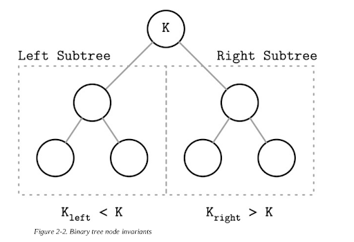
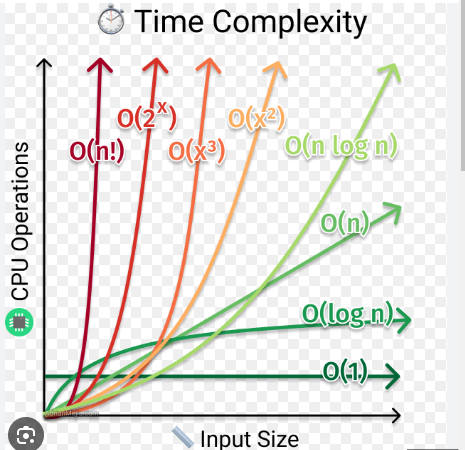
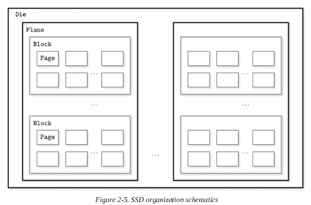
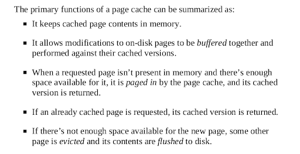
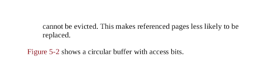
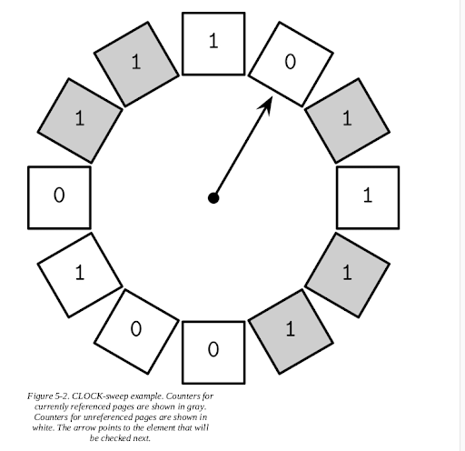
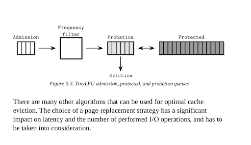

# **10. Database Internals**

## **Storage Engine**

## **Data Storage (data files, index files)**

**Database System** = Data Files + Index Files

**Data files:** data files store data records

**Index files:** store meta information.

**Takeaways:**

* Index files are typically smaller than the data
files.

* Files are partitioned into pages, which typically have the size of a single or multiple disk blocks.

* Pages can be organized as sequences of
records or as a slotted pages

* New records (insertions) and updates to the existing records are
represented by key/value pairs.

* Most modern storage systems do not delete data from pages explicitly. Instead, they use deletion markers (also called
tombstones), which contain deletion metadata, such as a key and a
timestamp.

* Space occupied by the records shadowed by their updates or
deletion markers is reclaimed during garbage collection, which reads the pages, writes the live (i.e., nonshadowed) records to the new place, and discards the shadowed ones.

### **Data Files** 

Data files (sometimes called _**primary files**_) can be implemented as

* index-organized tables (IOT), 

* heap-organized tables (heap files), or 

*hash-organized tables (hashed files). 

#### **Two ways of storing data**

* Storing data with index

Storing data records in the index allows us to reduce the number of disk seeks by at least one, since after traversing the index and locating the searched key, we do not have to address a separate file to find the associated data record. 

* Storing data and index separately

When records are stored in a separate file, index files hold data entries, uniquely identifying data records and containing enough information to locate them in the data file. For example, we can store file offsets (sometimes called row locators), locations of data records in the data file, or bucket IDs in the case of hash files. In index-organized tables, data entries hold actual data records.

### **Index Files** 

Index files are used to map keys to locations in data files where the records identified by these keys (in the case of heap files) or primary keys (in the case of index-organized tables) are stored. 

### **Two types of index**

* primary index: index on primary key, one column or a tuple of columns that are primary key.

* secondary index: all others, such as in the where statement in SQL

## **Cluster index vs non-cluster index**

## **Primary Index as an Indirection (Two approaches)**

a) Two indexes reference data entries directly from secondary index files. 

b) A secondary index goes through the indirection layer of a primary index to locate the data entries.

## **B Tree Basics**

**Two types of storage engines:**

* mutable (in-place update)
* immutable

**Why we use B Tree not others?** 

Why B tree instead of other traditional data structures such as 
binary search trees, 2-3-Trees, and AVL Trees.

**Binary Search Tree Issue (Tree balancing)**

What is BST?

The balanced tree is defined as one that has a height of log2 N, where N is the total number of items in the tree, and the difference in height between the two subtrees is not greater than one. Without balancing, we lose performance benefits of the binary search tree structure, and allow insertions and deletions order to determine tree shape.

In the balanced tree, following the left or right node pointer reduces the search space in half on average, so lookup complexity is logarithmic:  O(log2 N). 

If the tree is not balanced, worst-case complexity goes up to O(N), since we might end up in the situation where all elements end up on one side of the tree.

One of the ways to keep the tree balanced is to perform a rotation step after nodes are added or removed. If the insert operation leaves a branch unbalanced (two consecutive nodes in the branch have only one child), we can rotate nodes around the middle one. In the example shown in Figure 2-4, during rotation the middle node (3), known as a rotation pivot, is promoted one level higher, and its parent becomes its right child. 

## **Trees for Disk-Based Storage**

Increased maintenance costs make BSTs impractical as on-disk data structures [NIEVERGELT74]. Due to low fanout (fanout is the maximum allowed number of
children per node), we have to perform balancing, relocate nodes, and
update pointers rather frequently.

**Problem 1:**

Locality issue: since elements are added in random order, there’s no
guarantee that a newly created node is written close to its parent, which
means that node child pointers may span across several disk pages. We can
improve the situation to a certain extent by modifying the tree layout and
using paged binary trees (see “Paged Binary Trees”).

**Problem 2:**

Tree heights: If tree height is large, then inter-disk-page traffic will be high and impractical. [COMER79].

**Potential solution**

Considering these factors, a version of the tree that would be better suited
for disk implementation has to exhibit the following properties:
High fanout to improve locality of the neighboring keys.
Low height to reduce the number of seeks during traversal.

## **Disk-Based Structures**

**Problem faced**

*  In Memory-Versus Disk-Based DBMS scenario, not all the data structures that fits Memory DBMS will fit disk-based.

* Not possible to hold all the data in the memory, some must be sitting on disk.

* A balanced solution could be using cache to store some frequently used data, and the rest sitting on disk.

**Disk Structures**

* Hard disk drives (HDD)

On spinning disks, seeks increase costs of random reads because they
require disk rotation and mechanical head movements to position the
read/write head to the desired location. The smallest transfer unit of a spinning drive is a sector, so when some
operation is performed, at least an entire sector can be read or written.
Sector sizes typically range from 512 bytes to 4 Kb.

**Solid state drives (SSD)**

There’s no disk that spins, or head that has to be positioned for the read. A typical SSD is built of memory cells, connected into strings (typically 32 to 64 cells per string),
strings are combined into arrays, arrays are combined into pages, and
pages are combined into blocks [LARRIVEE15].

Pages vary in size between devices, but typically their sizes
range from 2 to 16 Kb. Blocks typically contain 64 to 512 pages. Blocks
are organized into planes and, finally, planes are placed on a die. SSDs can
have one or more dies.

**On-disk structures**

Since B-Trees are a page organization technique (i.e., they are used to
organize and navigate fixed-size pages), we often use terms node and page
interchangeably.

Internal nodes: store keys

Leaf nodes: store values

Since values in B+-Trees are stored only on the leaf level, all operations (inserting, updating, removing, and retrieving data records) affect only leaf nodes and propagate to higher levels only during splits and merges.

B tree can partion trees into subtrees, and subtree can make use of binary search tree feature.

Keys stored in B-Tree nodes are called index entries, separator keys, or
divider cells. They split the tree into subtrees (also called branches or
subranges), holding corresponding key ranges. Keys are stored in sorted
order to allow binary search.

`Ki-1 ≤ Ks < Ki`

#### **B-tree lookup complexity**

B-Tree lookup complexity is generally referenced as log M. Logarithm base is generally not used in complexity. M is a total number of items in the B-Tree pages
are addressed to find a searched key. 

## **B-Tree Lookup Algorithm**

The algorithm starts from the root and performs a binary search,
comparing the searched key with the keys stored in the root node until it
finds the first separator key that is greater than the searched value.

### **Transaction Processing Recovery**

**ACID  (Atomicity Consistency Isolation Durability )**

The **lock manager** guards access to these resources and prevents
concurrent accesses that would violate data integrity.

The page cache serves as an intermediary between persistent storage (disk)
and the rest of the storage engine. It stages state changes in main memory
and serves as a cache for the pages that haven’t been synchronized with
persistent storage. All changes to a database state are first applied to the
cached pages.

The **log manager** holds a history of operations (log entries) applied to
cached pages but not yet synchronized with persistent storage to guarantee
they won’t be lost in case of a crash. In other words, the log is used toreapply these operations and reconstruct the cached state during startup.
Log entries can also be used to undo changes done by the aborted
transactions.

Distributed (multipartition) transactions require additional coordination
and remote execution. We discuss distributed transaction protocols in later chapters.

**Buffer Management**

Buffer handles speed problem. Most databases are built using a two-level memory hierarchy: slower persistent storage (disk) and faster main memory (RAM).  

Cached pages available in memory can be reused under the assumption
that no other process has modified the data on disk. A more common name for the same concept is page cache or buffer pool. The page cache is responsible for caching pages read fromdisk in memory. In case of a database system crash or unorderly shutdown, cached contents are lost.

The problem of caching pages is not limited in scope to databases.
Operating systems have the concept of a page cache, too. Operating
systems utilize unused memory segments to transparently cache disk
contents to improve performance of I/O syscalls.

Uncached pages are said to be paged in when they’re loaded from disk. If
any changes are made to the cached page, it is said to be dirty, until these
changes are flushed back on disk.

#### **Caching Semantics**

All we have to do is replace disk accesses by the calls to the page cache. 

If the page contents are not yet cached, the cache translates the logical page address or page number to its physical address, loads its contents in memory, and returns its cached version to the storage
engine.

Once returned, the buffer with cached page contents is said to be
referenced, and the storage engine has to hand it back to the page cache or
dereference it once it’s done. The page cache can be instructed to avoid
evicting pages by pinning them.

If the page is modified (for example, a cell was appended to it), it is
marked as dirty. A dirty flag set on the page indicates that its contents are
out of sync with the disk and have to be flushed for durability.

#### **Cache Eviction**

However, the page cache has a limited capacity and, sooner or later, to
serve the new contents, old pages have to be evicted. 

**What you can evict and not to ?**

* If page contents are: 
in sync with the disk (i.e., were already flushed or were never modified)
and the page is not pinned or referenced, it can be evicted right away.

* Dirty pages have to be flushed before they can be evicted.

* Referenced pages should not be evicted while some other thread is using them.

**Recovery during cache eviction**

Another important property to keep in mind is durability: if the database
has crashed, all data that was not flushed is lost. To make sure that all
changes are persisted, flushes are coordinated by the checkpoint process.
The checkpoint process controls the write-ahead log (WAL) and page
cache, and ensures that they work in lockstep. Only log records associated
with operations applied to cached pages that were flushed can be discarded
from the WAL. Dirty pages cannot be evicted until this process completes.

**Locking Pages in Cache**

Having to perform disk I/O on each read or write is impractical: Splits and merges also eventually propagate to the higher-level
nodes.

We can “lock” pages that have a high probability of being used in the
nearest time. Locking pages in the cache is called pinning. Pinned pages
are kept in memory for a longer time, which helps to reduce the number of
disk accesses and improve performance [GRAEFE11].

(Think about the LRU design, but this is a modified LRU, we pinged some pages)

##### **Page Replacement**

When cache capacity is reached, to load new pages, old ones have to be
evicted. For this, we can say that pages should be evicted according to the eviction
policy (also sometimes called the page-replacement policy). It attempts to
find pages that are least likely to be accessed again any time soon. 

For a page cache implementation to be performant, it needs an efficient
page-replacement algorithm.

##### **FIFO and LRU (Same as the Operating System Algorithms)**

The most naïve page-replacement strategy is first in, first out (FIFO).

A natural extension of the FIFO algorithm is least recently used (LRU)

#### **CLOCK**

In some situations, efficiency may be more important than precision.
CLOCK algorithm variants are often used as compact, cache-friendly, and
concurrent alternatives to LRU [SOUNDARARARJAN06]. Linux, for
example, uses a variant of the CLOCK algorithm.

The algorithm is easy to
understand and implement and is often used in both textbooks
[TANENBAUM14] and real-wold systems.

**LFU (least frequently used)**

LRU is not always the best replacement strategy for a database system.
Sometimes, it may be more practical to consider usage frequency rather than recency as a predictive factor. 

