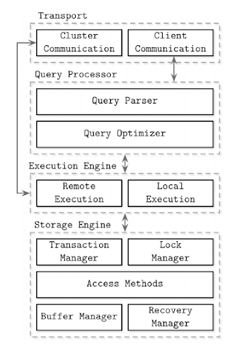
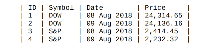
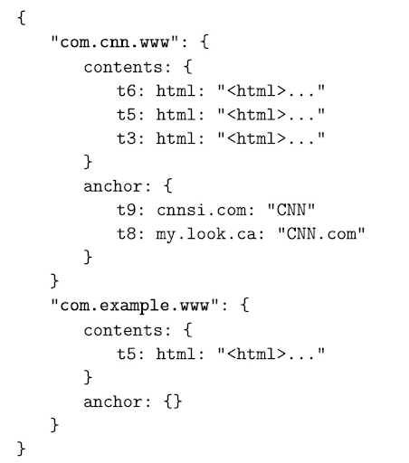
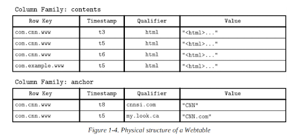

# **Database Internals**

**Outline**

* Focuses on the storage engine in node-local processes
* Introduce B-Trees, and cover algorithms for efficiently maintaining B-Tree structures on disk, 
including serialization, page layout, and on-disk representations
* Log-structured storage, commonly used for implementing file and storage systems, motivation, and reasons to use them. 
* How to organize multiple nodes into a database cluster
* Fault-tolerant distributed systems
* Distributed Algorithms
* Introduce several algorithms for leader 
election and discuss their suitability
* One of the most difficult things in distributed systems is achieving data consistency

Most databases already have stress tools that can be used to reconstruct specific use cases. If there’s no standard 
stress tool to generate realistic randomized workloads in the database ecosystem, it might be a red flag. 

One of the popular tools used for benchmarking, performance evaluation, and comparison is Yahoo! Cloud Serving Benchmark
(YCSB). The Transaction Processing Performance Council (TPC). TPC has a set of benchmarks that database  vendors use for
comparing and advertising the performance of their products. TPC-C is an online transaction processing (OLTP) benchmark,
a mixture of read-only and update transactions that  simulate common application workloads. 

## **Online transaction processing (OLTP) databases** 

These handle a large number of user-facing requests and transactions. Queries are often predefined and short-lived.

## **Online analytical processing (OLAP) databases** 

Online analytical processing (OLAP) databases 
These handle complex aggregations. OLAP databases are often used  for analytics and data warehousing and are capable of
handling  complex, long-running ad hoc queries.

## **Hybrid transactional and analytical processing (HTAP)** 

These databases combine properties of both OLTP and OLAP stores. 

**Storage Engine**

**_Access methods (storage structures)_** 

These manage access and organizing data on disk. Access methods 
include heap files and storage structures such as B-Trees (see “Ubiquitous B-Trees”) or LSM Trees (see “LSM Trees”). 

## **Column- Versus Row-Oriented DBMS**

Examples of row-oriented database management systems are abundant: 
MySQL, PostgreSQL, and most of the traditional relational databases. The two pioneer open source column-oriented stores are MonetDB and C-Store (C-Store is an open source predecessor to Vertica)

**Column-Oriented Data Layout** 

Here, values for the same 
column are stored contiguously on disk (as opposed to storing rows contiguously as in the previous example). 

Column-oriented stores are a good fit for analytical workloads that compute aggregates, such as finding trends, computing average values, etc. 
Processing complex aggregates can be used in cases when logical records have multiple fields, but some of them (in this case, price quotes) have different importance and are often consumed together. 
During the last several years, likely due to a rising demand to run complex analytical queries over growing datasets, we’ve seen many new column-oriented file formats such as Apache Parquet, Apache ORC, RCFile, as 
well as column-oriented stores, such as Apache Kudu, ClickHouse, and many others [ROY12]

## **Wide Column Stores**

Column-oriented databases should not be mixed up with wide column stores, such as BigTable or HBase, where data is represented as a multidimensional map, columns are grouped into column families (usually storing data of the same type), and inside each column family, data is 
stored row-wise. This layout is best for storing data retrieved by a key or a sequence of keys. 

A canonical example from the Bigtable paper [CHANG06] is a Webtable. 
A Webtable stores snapshots of web page contents, their attributes, and the 
relations among them at a specific timestamp. Pages are identified by the 
reversed URL, and all attributes (such as page content and anchors, 
representing links between pages) are identified by the timestamps at 
which these snapshots were taken. In a simplified way, it can be 
represented as a nested map,

A canonical example from the Bigtable paper [CHANG06] is a Webtable.

A Webtable stores snapshots of web page contents, their attributes, and the relations among them at a specific timestamp. Pages are identified by the reversed URL, and all attributes (such as page content and anchors, 
representing links between pages) are identified by the timestamps at which these snapshots were taken.

## **Data Files** 

* Data files (sometimes called primary files) can be implemented as index- organized tables (IOT), 

* Heap-organized tables (heap files), or 

* Hash-organized tables (hashed files). Records in heap files are not required to follow any particular order, and most of the time they are placed in a write order. This way, no additional work or file reorganization is required when new pages are appended.
 
Heap files require additional index structures, pointing to the locations where data records are stored, to make them searchable. 

In hashed files, records are stored in buckets, and the hash value of the key determines which bucket a record belongs to. Records in the bucket can be stored in append order or sorted by key to improve lookup speed. 

Index-organized tables (IOTs) store data records in the index itself. Since records are stored in key order, range scans in IOTs can be implemented by sequentially scanning its contents. 

Storing data records in the index allows us to reduce the number of disk seeks by at least one, since after traversing the index and locating the searched key, we do not have to address a separate file to find the associated data record. 
When records are stored in a separate file, index files hold data entries, uniquely identifying data records and containing enough information to locate them in the data file. For example, we can store file offsets 
(sometimes called row locators), locations of data records in the data file, or bucket IDs in the case of hash files. In index-organized tables, data entries hold actual data records.

## **Index Files** 

An index is a structure that organizes data records on disk in a way that facilitates efficient retrieval operations. Index files are organized as specialized structures that map keys to locations in data files where the records identified by these keys (in the case of heap files) or primary keys 
(in the case of index-organized tables) are stored. 

An index on a primary (data) file is called the primary index. However, in most cases we can also assume that the primary index is built over a primary key or a set of keys identified as primary. All other indexes are called secondary. Secondary indexes can point directly to the data record, or simply store its primary key. A pointer to a data record can hold an offset to a heap file or an index-organized table. Multiple secondary indexes can point to the same record, allowing a single data record to be identified by different fields and located through different indexes. While primary index files hold a unique entry per search key, secondary indexes may hold several entries per search key. 
 
If the order of data records follows the search key order, this index is called clustered (also known as clustering). Data records in the clustered case are usually stored in the same file or in a clustered file, where the key 
order is preserved. If the data is stored in a separate file, and its order does not follow the key order, the index is called nonclustered (sometimes called unclustered). Figure 1-5 shows the difference between the two approaches: 

a) Two indexes reference data entries directly from secondary index files. 

b) A secondary index goes through the indirection layer of a primary index to locate the data entries.

Many database systems have an inherent and explicit primary key, a set of columns that uniquely identify the database record. In cases when the primary key is not specified, the storage engine can create an implicit 
primary key (for example, MySQL InnoDB adds a new auto-increment column and fills in its values automatically). 

## **Primary Index as an Indirection** 

a) Two indexes reference data entries directly from secondary index files. 

b) A secondary index goes through the indirection layer of a primary index to locate the data entries.

Both approaches have their pros and cons and are better discussed in the scope of a complete implementation. By referencing data directly, we can reduce the number of disk seeks, but have to pay a cost of updating the pointers whenever the record is updated or relocated during a maintenance process. 

Using indirection in the form of a primary index allows us to reduce the cost of pointer updates, but has a higher cost on a read path. Updating just a couple of indexes might work if the workload mostly consists of reads, but this approach does not work well for write-heavy workloads with multiple indexes. 

To reduce the costs of pointer updates, instead of payload offsets, some implementations use primary keys for indirection. For example, MySQL InnoDB uses a primary index and performs two lookups: one in the secondary index, and one in a primary index when performing a query [TARIQ11]. This adds an overhead of a primary index lookup instead of following the offset directly from the secondary index.

Why storage engine is evolving and why new database storage structures keep emerging.  why there are so many B- Tree variants.

Storage structures have three common variables: they use buffering (or avoid using it), use immutable (or mutable) files, and store values in order (or out of order).

**Buffering**

we discuss in this book is adding in-memory 
buffers to B-Tree nodes to amortize I/O costs (see “Lazy B-Trees”). However, this is not the only way we can apply buffering. For example, two-component LSM Trees (see “Two-component LSM Tree”), despite their similarities with B-Trees, use buffering in an entirely different way, and combine buffering with immutability. All the db system use buffering to some degree.

**Mutability**

1. in-place update
2. append method
3. copy-on-write

One of them is copy-on-write (see “Copy-on-Write”), where the modified page, holding the updated version of the record, is written to the new location in the file, instead of its original location. Often thedistinction between LSM and B-Trees is drawn as immutable against in-place update storage, but there are structures (for example, “Bw-Trees”) that are inspired by B-Trees but are immutable. 

**Ordering**

Storing data out of order (most often, in insertion order) opens up for some write-time optimizations. For example, Bitcask (see “Bitcask”) and WiscKey (see “WiscKey”) store data records directly in append-only files. 

## **B Tree Basics**

Two types of storage engines:

* mutable (in-place update)
* immutable

### **Mutable and in-place:** 

During insert, delete, or update operations, data records are updated directly in their locations in the target file.

**_Note:_** 

Storage engines often allow multiple versions of the same data record to be present in the database; for example, when using multiversion concurrency control (see “Multiversion Concurrency Control”) or slotted page organization (see “Slotted Pages”). 

Before we go to b-tree, we want to see other tree data structures,

Binary search trees, 2-3-Trees, and AVL Trees.

B-Trees are not a recent invention: they were introduced by Rudolph Bayer and Edward M. McCreight back in 1971 and gained popularity over the years. By 1979, there were already quite a few variants of B-Trees. 

Binary Search Tree Issue (Tree balancing)

The balanced tree is defined as one that has a height of log2 N, where N is the total number of items in the tree, and the difference in height between the two subtrees is not greater than one. Without balancing, we lose performance benefits of the binary search tree structure, 
and allow insertions and deletions order to determine tree shape.

In the balanced tree, following the left or right node pointer reduces the search space in half on average, so lookup complexity is logarithmic: 
O(log2 N). If the tree is not balanced, worst-case complexity goes up to O(N), since we might end up in the situation where all elements end up on one side of the tree.

One of the ways to keep the tree balanced is to perform a rotation step after nodes are added or removed. If the insert operation leaves a branch unbalanced (two consecutive nodes in the branch have only one child), we 
can rotate nodes around the middle one. In the example shown in Figure 2-4, during rotation the middle node (3), known as a rotation pivot, is promoted one level higher, and its parent becomes its right child. 

1. **What is the differences between column-based and column-wide based database?**
2. **What is marshalling?**
3. **What is ACID?**
4. **What is database sharding?**

## **Ref: Database internal**

