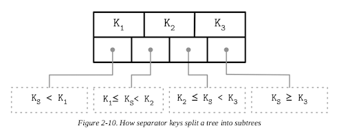

# **10. Database Internals - BTree**


## Part I A quick review of Index, Data and Storages.

**Storage Engine**


**Data Storage (data files, index files)**

* Database System = Data Files + Index Files

* Data files: data files store data records

* Index files: store meta information.

* **Takeaways:**

* Index files are typically smaller than the data files.

* Files are partitioned into pages, which typically have the size of a single or multiple disk blocks.

* Pages can be organized as sequences of records or as a slotted pages

* New records (insertions) and updates to the existing records are represented by key/value pairs.

* Most modern storage systems do not delete data from pages explicitly. Instead, they use deletion markers (also called `tombstones`), which contain deletion metadata, such as a key and a timestamp.

* Space occupied by the records shadowed by their updates or
deletion markers is reclaimed during garbage collection, which reads the pages, writes the live (i.e., nonshadowed) records to the new place, and discards the shadowed ones.

**Data Files** 

Data files (sometimes called _**primary files**_) can be implemented as,

* index-organized tables (IOT), 

* heap-organized tables (heap files), or hash-organized tables (hashed files). 

**Two ways of storing data**

* Storing data with index

Storing data records in the index allows us to reduce the number of disk seeks by at least one, since after traversing the index and locating the searched key, we do not have to address a separate file to find the associated data record. 

* Storing data and index separately

When records are stored in a separate file, index files hold data entries, uniquely identifying data records and containing enough information to locate them in the data file. 
For example, we can store file offsets (sometimes called row locators), locations of data records in the data file, or bucket IDs in the case of hash files. In index-organized tables, data entries hold actual data records.

### **Index Files** 

Index files are used to map keys to locations in data files where the records identified by these keys (in the case of heap files) or primary keys (in the case of index-organized tables) are stored. 

### **Two types of index**

* **primary index:** index on primary key, one column or a tuple of columns that are primary key.

* **secondary index:** all others, such as in the where statement in SQL

## **Cluster index vs non-cluster index**

If the order of data records follows the search key order, this index is called **clustered** (also known as clustering). 
Data records in the clustered case are usually stored in the same file or in a clustered file, where the key order is preserved.

If the data is stored in a separate file, and its order does not follow the key order, the index is called **nonclustered** (sometimes called unclustered).

a) Two indexes reference data entries directly from secondary index files.

b) A secondary index goes through the indirection layer of a primary index to locate the data entries.


The left above is clustered.  The right one is non-clustered.

Many database systems have an inherent and explicit primary key, a set of columns that uniquely identify the database
record. In cases when the primary key is not specified, the storage engine can create an implicit primary key
(for example, MySQL InnoDB adds a new auto-increment column and fills in its values automatically).

## **Primary Index as an Indirection (Two approaches)**

a) Two indexes reference data entries directly from secondary index files. 

b) A secondary index goes through the indirection layer of a primary index to locate the data entries.


**A design:**

**Pros:**  we can reduce the number of disk seeks

**Cons:** but have to pay a cost of updating the pointers whenever the record is updated or relocated during a maintenance process.

**B design:**

**Pros:** Using indirection in the form of a primary index allows us to reduce the cost of pointer updates

**Cons:** but has a higher cost on a read path. Updating just a couple of indexes might work if the workload mostly consists of reads, but this approach does not work well for write-heavy workloads with multiple indexes.

To reduce the costs of pointer updates, instead of payload offsets, some implementations use primary keys for indirection. 

For example, `MySQL InnoDB` uses a primary index and performs two lookups: one in the secondary index, and one in a primary index when performing a query [TARIQ11]. 
This adds an overhead of a primary index lookup instead of following the offset directly from the secondary index.

## **Storage Structures and Important Concepts**

A storage engine is based on some data structure. However, these
structures do not describe the semantics of caching, recovery, transactionality, and other things that storage engines add on top of them.

Storage structures have three common variables: they use buffering (or avoid using it), use immutable (or mutable) files, and store values in order (or out of order).

* Buffering

We discuss in this book is adding in-memory buffers to B-Tree nodes to amortize I/O costs (see “Lazy B-Trees”). 
However, this is not the only way we can apply buffering. For example, two-component LSM Trees (see “Two-component LSM Tree”), despite their similarities with B-Trees, use buffering in an entirely different way, and combine buffering with immutability. 
All the db system use buffering to some degree.

> Buffer has been appearing in every aspect of computer and real life.

**Examples of Buffer**

*Disk  > memory > cache in CPU (Buffer)*

1. ORM, cache will help the query, buffer concept (software buffer)
2. Database cache mechanism (software buffer)
3. CPU cache L1, L2, buffer with memory (hardware)
4. Network cache (redis)

* Mutability

    1. In-place update
    2. Append method
    3. Copy-on-write

One of them is copy-on-write (see “Copy-on-Write”), where the modified page, holding the updated version of the record, is written to the new location in the file, instead of its original location. Often the distinction between LSM and B-Trees is drawn as immutable against in-place update storage, but there are structures (for example, “Bw-Trees”) that are inspired by B-Trees but are immutable.

* Ordering

Storing data out of order (most often, in insertion order) opens up for some write-time optimizations. For example, Bitcask (see “Bitcask”) and WiscKey (see “WiscKey”) store data records directly in append-only files.

## **B Tree Basics**

**Two types of storage engines:**

* mutable (in-place update)
* immutable

#### **Mutable and in-place**

During insert, delete, or update operations, data records are updated directly in their locations in the target file.

One of the most popular storage structures is a B-Tree. Many open source database systems are B-Tree based, and over the years they’ve proven to cover the majority of use cases.

### **The History of B Tree**

* They were introduced by Rudolp Bayer and Edward M. McCreight back in 1971.

* By 1979, there were already quite a few variants of B-Trees.

Before we go to b-tree, we want to see other tree data structures, Douglas Comer collected and systematized some of them.

**Why we use B Tree not others?**

Why B tree instead of other traditional data structures such as binary search trees, 2-3-Trees, and AVL Trees.

**Binary Search Tree Issue (Tree balancing)**

What is BST?


The balanced tree is defined as one that has a height of log2 N, where N is the total number of items in the tree, and the difference in height between the two subtrees is not greater than one. Without balancing, we lose performance benefits of the binary search tree structure, and allow insertions and deletions order to determine tree shape.

In the balanced tree, following the left or right node pointer reduces the search space in half on average, so lookup complexity is logarithmic:  O(log2 N). 

If the tree is not balanced, worst-case complexity goes up to O(N), since we might end up in the situation where all elements end up on one side of the tree.


One of the ways to keep the tree balanced is to perform a rotation step after nodes are added or removed. If the insert operation leaves a branch unbalanced (two consecutive nodes in the branch have only one child), we can rotate nodes around the middle one. In the example shown in Figure 2-4, during rotation the middle node (3), known as a rotation pivot, is promoted one level higher, and its parent becomes its right child. 


## **Trees for Disk-Based Storage**

Increased maintenance costs make BSTs impractical as on-disk data structures [NIEVERGELT74]. Due to low fanout (fanout is the maximum allowed number of
children per node), we have to perform balancing, relocate nodes, and
update pointers rather frequently.

**Problem 1:**

Locality issue: since elements are added in random order, there’s no
guarantee that a newly created node is written close to its parent, which
means that node child pointers may span across several disk pages. We can
improve the situation to a certain extent by modifying the tree layout and
using paged binary trees (see “Paged Binary Trees”).

**Problem 2:**

Tree heights: If tree height is large, then inter-disk-page traffic will be high and impractical. [COMER79].

**Potential solution**

Considering these factors, a version of the tree that would be better suited
for disk implementation has to exhibit the following properties:
High fanout to improve locality of the neighboring keys.
Low height to reduce the number of seeks during traversal.

## **Disk-Based Structures**

**Problem faced**

*  In Memory-Versus Disk-Based DBMS scenario, not all the data structures that fits Memory DBMS will fit disk-based.

* Not possible to hold all the data in the memory, some must be sitting on disk.

* A balanced solution could be using cache to store some frequently used data, and the rest sitting on disk.

**Disk Structures**

* Hard disk drives (HDD)

On spinning disks, seeks increase costs of random reads because they
require disk rotation and mechanical head movements to position the
read/write head to the desired location. The smallest transfer unit of a spinning drive is a sector, so when some
operation is performed, at least an entire sector can be read or written.
Sector sizes typically range from 512 bytes to 4 Kb.

**Solid state drives (SSD)**


There’s no disk that spins, or head that has to be positioned for the read. A typical SSD is built of memory cells, connected into strings (typically 32 to 64 cells per string),
strings are combined into arrays, arrays are combined into pages, and
pages are combined into blocks [LARRIVEE15].

Pages vary in size between devices, but typically their sizes
range from 2 to 16 Kb. Blocks typically contain 64 to 512 pages. Blocks
are organized into planes and, finally, planes are placed on a die. SSDs can
have one or more dies.

**On-disk structures**


```
Bst_node {
Int val;
Bst_node left;
Bst_node right
}
```

Since B-Trees are a page organization technique (i.e., they are used to organize and navigate fixed-size pages), we often use terms node and page interchangeably.


**Internal nodes:** store keys

**Leaf nodes:** store values

Since values in B+-Trees are stored only on the leaf level, all operations (inserting, updating, removing, and retrieving data records) affect only leaf nodes and propagate to higher levels only during splits and merges.

**Separator Keys**
B tree can partion trees into subtrees, and subtree can make use of binary search tree feature.

Keys stored in B-Tree nodes are called index entries, separator keys, or divider cells. They split the tree into subtrees (also called branches or subranges), holding corresponding key ranges. Keys are stored in sorted
order to allow binary search.

`Ki-1 ≤ Ks < Ki`



**B-tree lookup complexity**

B-Tree lookup complexity is generally referenced as log M. Logarithm base is generally not used in complexity. M is a total number of items in the B-Tree pages are addressed to find a searched key.


Complexity: **`Logk(M) k->4, M is the total pages/Tree nodes
BST Log2(N)`**

**`O(Logk(M)) + O(C), C is constant. (M or N is an variable/ulimited, C is constant/limited)`**

**`O(Logk(M)) + O(C) = O(Logk(M))`**

## **B-Tree Lookup Algorithm**

The algorithm starts from the root and performs a binary search, comparing the searched key with the keys stored in the root node until it
finds the first separator key that is greater than the searched value.

