# **Database Internals BTree**

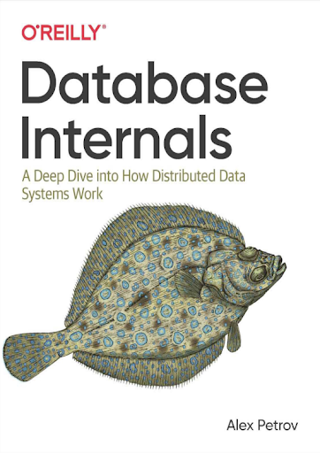


**Outline**

* Focuses on the storage engine in node-local processes introduce B-Trees, and cover algorithms for efficiently maintaining B-Tree structures on disk, including serialization, page layout, and on-disk representations
* Log-structured storage, commonly used for implementing file and storage systems, motivation, and reasons to use them. 
* How to organize multiple nodes into a database cluster
* Fault-tolerant distributed systems
* Distributed Algorithms
* Introduce several algorithms for leader election and discuss their suitability
* One of the most difficult things in distributed systems is achieving data consistency


Most databases already have stress tools that can be used to reconstruct specific use cases. If there’s no standard 
stress tool to generate realistic randomized workloads in the database ecosystem, it might be a red flag. 

One of the popular tools used for benchmarking, performance evaluation, and comparison is Yahoo! Cloud Serving Benchmark
(YCSB). The Transaction Processing Performance Council (TPC). TPC has a set of benchmarks that database vendors use for
comparing and advertising performance of their products. TPC-C is an online transaction processing (OLTP) benchmark, 
a mixture of read-only and update transactions that simulate common application workloads. 

## **Online transaction processing (OLTP) databases** 

These handle a large number of user-facing requests and transactions. Queries are often predefined and short-lived. 

## **Online analytical processing (OLAP) databases** 

These handle complex aggregations. OLAP databases are often used 
for analytics and data warehousing, and are capable of handling 
complex, long-running ad hoc queries.

## **Hybrid transactional and analytical processing (HTAP)** 

These databases combine properties of both OLTP and OLAP stores.

**Storage Engine**

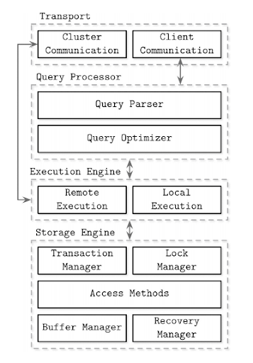

**Access methods (storage structures)** 

These manage access and organizing data on disk. Access methods include heap files and storage structures such as B-Trees (see 
“Ubiquitous B-Trees”) or LSM Trees (see “LSM Trees”). 

## **Column- Versus Row-Oriented DBMS**

Examples of row-oriented database management systems are abundant: 
MySQL, PostgreSQL, and most of the traditional relational databases. The two pioneer open source column-oriented stores are MonetDB and C-Store (C-Store is an open source predecessor to Vertica)

**Column-Oriented Data Layout** 

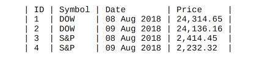

Here, values for the same column are stored contiguously on disk (as opposed to storing rows contiguously as in the previous example). 

Column-oriented stores are a good fit for analytical workloads that compute aggregates, such as finding trends, computing average values, etc. 

Processing complex aggregates can be used in cases when logical records have multiple fields, but some of them (in this case, price quotes) have different importance and are often consumed together. 
During the last several years, likely due to a rising demand to run complex analytical queries over growing datasets, we’ve seen many new column- oriented file formats such as Apache Parquet, Apache ORC, RCFile, as 
well as column-oriented stores, such as Apache Kudu, ClickHouse, and many others [ROY12]


## **Wide Column Stores**

Column-oriented databases should not be mixed up with wide column stores, such as BigTable or HBase, where data is represented as a multidimensional map, columns are grouped into column families (usually storing data of the same type), and inside each column family, data is 
stored row-wise. This layout is best for storing data retrieved by a key or a sequence of keys. 

A canonical example from the Bigtable paper [CHANG06] is a Webtable. 
A Webtable stores snapshots of web page contents, their attributes, and the 
relations among them at a specific timestamp. Pages are identified by the reversed URL, and all attributes (such as page content and anchors, representing links between pages) are identified by the timestamps at which these snapshots were taken. In a simplified way, it can be represented as a nested map,


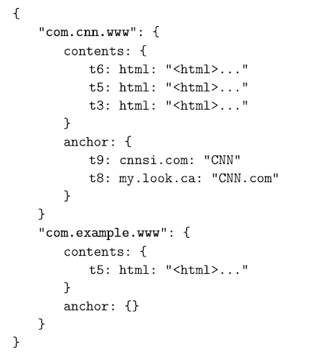


A canonical example from the Bigtable paper [CHANG06] is a Webtable. 

A Webtable stores snapshots of web page contents, their attributes, and the relations among them at a specific timestamp. Pages are identified by the reversed URL, and all attributes (such as page content and anchors, 
representing links between pages) are identified by the timestamps at which these snapshots were taken.


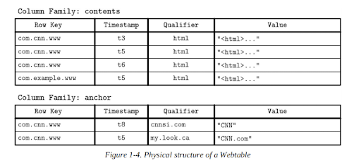

## **Part II Data Files and Index Files**

**Database System** = Data Files + Index Files + Transaction + recovery ....

**Data files:** data files store data records

**Index files:** store meta information.

_**Takeaways:**_

* Index files are typically smaller than the data files.

* Files are partitioned into pages, which typically have the size of a single or multiple disk blocks.

* Pages can be organized as sequences of records or as a slotted pages

#### **Blocks vs page**

**Page :** excel sheet of data, flat table, a sequence of records.

**Blocks:** Each block is linkedlist node. And disk seek will link them and find them.

* New records (insertions) and updates to the existing records are
represented by key/value pairs.

* Most modern storage systems do not delete data from pages explicitly. Instead, they use deletion markers (also called
tombstones), which contain deletion metadata, such as a key and a
timestamp.

* Space occupied by the records shadowed by their updates or
deletion markers is reclaimed during garbage collection, which reads the pages, writes the live (i.e., nonshadowed) records to the new place, and discards the shadowed ones.


## **Data Files** 

Data files (sometimes called **primary files**) can be implemented as

* Index-organized tables (IOT), 

* Heap-organized tables (heap files), or 

* Hash-organized tables (hashed files). 

Records in heap files are not required to follow any particular order, and most of the time they are placed in a write order.  Heap files require additional index structures, pointing to the locations where data records are stored, to make them searchable. 

In hashed files, records are stored in buckets, and the hash value of the key determines which bucket a record belongs to. Records in the bucket can be stored in append order or sorted by key to improve lookup speed. 

Index-organized tables (IOTs) store data records in the index itself. Since records are stored in key order, range scans in IOTs can be implemented by sequentially scanning its contents. 


**Two ways of storing data**

* _Storing data with index_

Storing data records in the index allows us to reduce the number of disk seeks by at least one, since after traversing the index and locating the searched key, we do not have to address a separate file to find the associated data record. 

* _Storing data and index separately_

When records are stored in a separate file, index files hold data entries, uniquely identifying data records and containing enough information to locate them in the data file. For example, we can store file offsets (sometimes called row locators), locations of data records in the data file, or bucket IDs in the case of hash files. In index-organized tables, data entries hold actual data records.

## **Index Files** 

Index files are used to map keys to locations in data files where the records identified by these keys (in the case of heap files) or primary keys (in the case of index-organized tables) are stored. 

### **Two types of index**

* Primary index: index on primary key, one column or a tuple of columns that are primary key.

* Secondary index: all others, such as in the where statement in sql

**Note:** An index on a primary (data) file is called the primary index. However, in most cases we can also assume that the primary index is built over a primary key or a set of keys identified as primary. 

All other indexes are called secondary. Secondary indexes can point directly to the data record, or simply store its primary key. A pointer to a data record can hold an offset to a heap file or an index-organized table. Multiple secondary indexes can point to the same record, allowing a single data record to be identified by different fields and located through different indexes. While primary index files hold a unique entry per search key, secondary indexes may hold several entries per search key. 

```sql
SELECT * FROM students WHERE score > 90
```
```
Stu_id primary index,
Score , index, 
(Score and stu_id)
(score and age) age > 25 and score > 90
```

## **Cluster index vs non-cluster index**

If the order of data records follows the search key order, this index is called clustered (also known as clustering). Data records in the clustered case are usually stored in the same file or in a clustered file, where the key order is preserved. 

If the data is stored in a separate file, and its order does not follow the key order, the index is called nonclustered (sometimes called unclustered). 


_**Figure 1-5 shows the difference between the two approaches:**_ 

a) Two indexes reference data entries directly from secondary index files. 

b) A secondary index goes through the indirection layer of a primary index to locate the data entries.

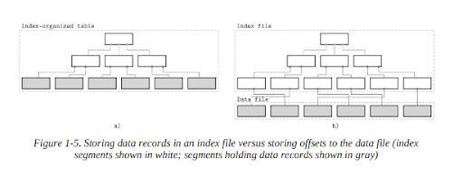

**The left above is clustered.  The right one is non-clustered.**

Many database systems have an inherent and explicit primary key, a set of columns that uniquely identify the database 
record. In cases when the primary key is not specified, the storage engine can create an implicit primary key 
(for example, MySQL InnoDB adds a new auto-increment column and fills in its values automatically). 


**Eg:**

```
Student, id (auto_increment), student_id(uuid)
Id -> primary
(Id,student_id) -> primary
Student_id (unique, indexed) -> primary
```

### **Primary Index as an Indirection (Two approaches)**

a) Two indexes reference data entries directly from secondary index files. 

b) A secondary index goes through the indirection layer of a primary index to locate the data entries.

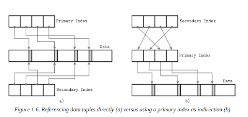

Both approaches have their pros and cons and are better discussed in the scope of a complete implementation. 

**A design:** 

**Pros:**  we can reduce the number of disk seeks

**Cons:** but have to pay a cost of updating the pointers whenever the record is updated or relocated during a maintenance process. 

**B design:**

**Pros:** Using indirection in the form of a primary index allows us to reduce the cost of pointer updates

**Cons:** but has a higher cost on a read path. Updating just a couple of indexes might work if the workload mostly consists of reads, but this approach does not work well for write-heavy workloads with multiple indexes. 

To reduce the costs of pointer updates, instead of payload offsets, some implementations use primary keys for indirection. For example, MySQL InnoDB uses a primary index and performs two lookups: one in the secondary index, and one in a primary index when performing a query [TARIQ11]. This adds an overhead of a primary index lookup instead of following the offset directly from the secondary index.


## **Storage Structures and Important Concepts**

A storage engine is based on some data structure. However, these
structures do not describe the semantics of caching, recovery, transactionality, and other things that storage engines add on top of them.

Storage structures have three common variables: they use buffering (or avoid using it), use immutable (or mutable) files, and store values in order (or out of order).

* Buffering

we discuss in this book is adding in-memory buffers to B-Tree nodes to amortize I/O costs (see “Lazy B-Trees”). However, this is not the only way we can apply buffering. For example, two-component LSM Trees (see “Two-component LSM Tree”), despite their similarities with B-Trees, use buffering in an entirely different way, and combine buffering with immutability. All the db system use buffering to some degree.

**Disk  > memory > cache in CPU (Buffer)**

1. ORM, cache will help the query, buffer concept (software buffer)
2. Database cache a lot (software buffer)
3. CPU cache L1, L2, buffer with memory (hardware)

* Mutability (CVS, SVN, GIThub, Revision)

  1. In-place update
  2. Append method
  3. Copy-on-write

One of them is copy-on-write (see “Copy-on-Write”), where the modified page, holding the updated version of the record, is written to the new location in the file, instead of its original location. Often the distinction between LSM and B-Trees is drawn as immutable against in-place update storage, but there are structures (for example, “Bw-Trees”) that are inspired by B-Trees but are immutable. 

* Ordering

Storing data out of order (most often, in insertion order) opens up for some write-time optimizations. For example, Bitcask (see “Bitcask”) and WiscKey (see “WiscKey”) store data records directly in append-only files.


## **Part III B Tree Basics**


Two types of storage engines:

* Mutable (in-place update)
* Immutable

#### **Mutable and in-place**

During insert, delete, or update operations, data records are updated directly in their locations in the target file.

One of the most popular storage structures is a B-Tree. Many open source database systems are B-Tree based, and over the years they’ve proven to cover the majority of use cases.

### **The History of B Tree**

* They were introduced by Rudolp Bayer and Edward M. McCreight back in 1971. 

* By 1979, there were already quite a few variants of B-Trees.

Before we go to b-tree, we want to see other tree data structures, Douglas Comer collected and systematized some of them. 

**Why we use B Tree not others?** 

Why B tree instead of other traditional data structures such as binary search trees, 2-3-Trees, and AVL Trees.

**Binary Search Tree Issue (Tree balancing)**

What is BST?

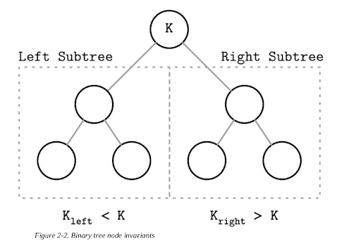
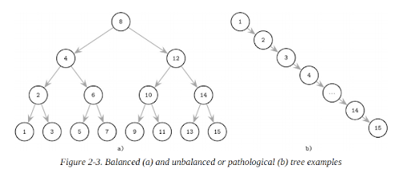

The balanced tree is defined as one that has a height of log2 N, where N is the total number of items in the tree, and the difference in height between the two subtrees is not greater than one. Without balancing, we lose performance benefits of the binary search tree structure, and allow insertions and deletions order to determine tree shape.

In the balanced tree, following the left or right node pointer reduces the search space in half on average, so lookup complexity is logarithmic:  O(log2 N). 

If the tree is not balanced, worst-case complexity goes up to O(N), since we might end up in the situation where all elements end up on one side of the tree.

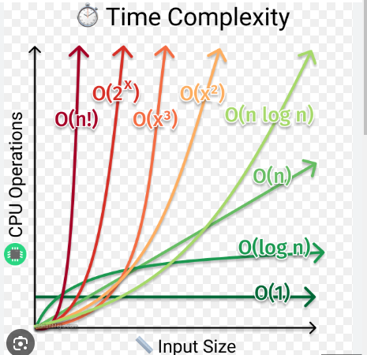

One of the ways to keep the tree balanced is to perform a rotation step after nodes are added or removed. 
If the insert operation leaves a branch unbalanced (two consecutive nodes in the branch have only one child), 
we can rotate nodes around the middle one. In the example shown in Figure 2-4, during rotation the middle node (3), 
known as a rotation pivot, is promoted one level higher, and its parent becomes its right child. 

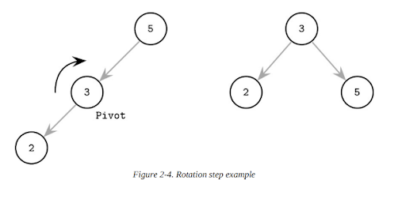

### **Trees for Disk-Based Storage**

Increased maintenance costs make BSTs impractical as on-disk data structures [NIEVERGELT74]. Due to low fanout (fanout is the maximum allowed number of children per node), we have to perform balancing, relocate nodes, and update pointers rather frequently.

**Problem 1:**

Locality issue: since elements are added in random order, there’s no
guarantee that a newly created node is written close to its parent, which means that node child pointers may span across several disk pages. We can improve the situation to a certain extent by modifying the tree layout and using paged binary trees (see “Paged Binary Trees”).

**Problem 2:**

Tree heights: If tree height is large, then inter-disk-page traffic will be high and impractical. [COMER79].

**Potential solution**

Considering these factors, a version of the tree that would be better suited for disk implementation has to exhibit the following properties:
High fanout to improve locality of the neighboring keys.
Low height to reduce the number of seeks during traversal.

### **Disk-Based Structures**

**Problem faced**

*  In Memory-Versus Disk-Based DBMS scenario, not all the data structures that fits Memory DBMS will fit disk-based.

* Not possible to hold all the data in the memory, some must be sitting on disk.

* A balanced solution could be using cache(buffer) to store some frequently used data, and the rest sitting on disk.


**Disk Structures**

* Hard disk drives (HDD)

On spinning disks, seeks increase costs of random reads because they
require disk rotation and mechanical head movements to position the
read/write head to the desired location. The smallest transfer unit of a spinning drive is a sector, so when some operation is performed, at least an entire sector can be read or written. Sector sizes typically range from 512 bytes to 4 Kb.

* Solid state drives (SSD)
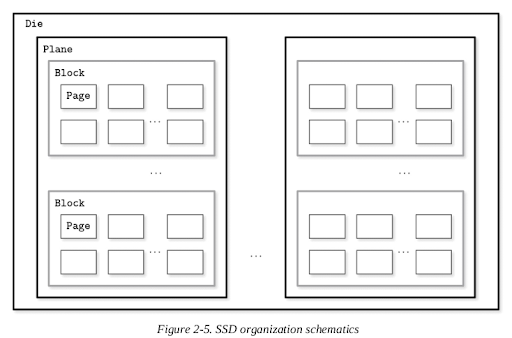

There’s no disk that spins, or head that has to be positioned for the read. A typical SSD is built of memory cells, connected into strings (typically 32 to 64 cells per string), strings are combined into arrays, arrays are combined into pages, and pages are combined into blocks [LARRIVEE15].

Pages vary in size between devices, but typically their sizes
range from 2 to 16 Kb. Blocks typically contain 64 to 512 pages. Blocks are organized into planes and, finally, planes are placed on a die. SSDs can have one or more dies.

* On-disk structures

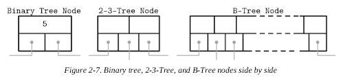

```
Bst_node {
Int val;
Bst_node left;
Bst_node right
}
```

Since B-Trees are a page organization technique (i.e., they are used to
organize and navigate fixed-size pages), we often use terms node and page interchangeably.

Internal nodes: store keys

Leaf nodes: store values

Since values in B+-Trees are stored only on the leaf level, all operations (inserting, updating, removing, and retrieving data records) affect only leaf nodes and propagate to higher levels only during splits and merges.


**Separator Keys**

B tree can partition trees into subtrees, and subtree can make use of binary search tree feature.

Keys stored in B-Tree nodes are called index entries, separator keys, or
divider cells. They split the tree into subtrees (also called branches or
sub ranges), holding corresponding key ranges. Keys are stored in sorted order to allow binary search.

`Ki-1 ≤ Ks < Ki`


**B-tree lookup complexity**

B-Tree lookup complexity is generally referenced as log M. Logarithm base is generally not used in complexity. M is a total number of items in the B-Tree pages are addressed to find a searched key. 

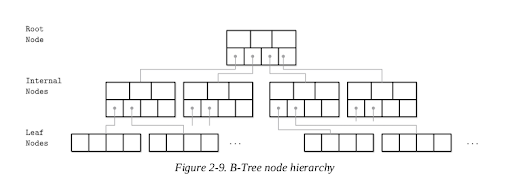

Complexity: **`Logk(M) k->4, M is the total pages/Tree nodes
BST Log2(N)`**

**`O(Logk(M)) + O(C), C is constant. (M or N is an variable/ulimited, C is constant/limited)`**

**`O(Logk(M)) + O(C) = O(Logk(M))`**

### **B-Tree Lookup Algorithm**

The algorithm starts from the root and performs a binary search, comparing the searched key with the keys stored in the
root node until it finds the first separator key that is greater than the searched value.

### **Part IV Transaction Processing Recovery**

ACID  (Atomicity Consistency Isolation Durability )

The **lock manager** guards access to these resources and prevents concurrent accesses that would violate data integrity.

The **page cache** serves as an intermediary between persistent storage (disk)
and the rest of the storage engine. It stages state changes in main memory
and serves as a cache for the pages that haven’t been synchronized with
persistent storage. All changes to a database state are first applied to the
cached pages.

The **log manager** holds a history of operations (log entries) applied to
cached pages but not yet synchronized with persistent storage to guarantee
they won’t be lost in case of a crash. In other words, the log is used to reapply these operations and reconstruct the cached state during startup.
Log entries can also be used to undo changes done by the aborted
transactions.

Distributed (multi-partition) transactions require additional coordination
and remote execution. We discuss distributed transaction protocols in later chapters.


#### **Buffer Management**

Buffer handles speed problem. Most databases are built using a two-level memory hierarchy: slower persistent storage (disk) and faster main memory (RAM).  

Cached pages available in memory can be reused under the assumption
that no other process has modified the data on disk. A more common name for the same concept is page cache or buffer pool. The page cache is responsible for caching pages read fromdisk in memory. In case of a database system crash or unorderly shutdown, cached contents are lost.

The problem of caching pages is not limited in scope to databases.
Operating systems have the concept of a page cache, too. Operating
systems utilize unused memory segments to transparently cache disk
contents to improve performance of I/O syscalls.

Uncached pages are said to be paged in when they’re loaded from disk. If
any changes are made to the cached page, it is said to be dirty, until these
changes are flushed back on disk.

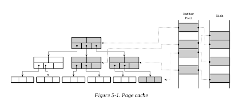
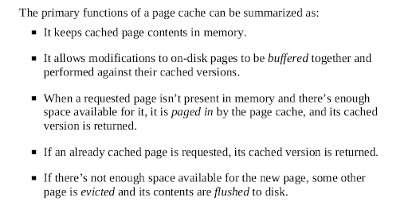

**Caching Semantics**

All we have to do is replace disk accesses by the calls to the page cache. 

If the page contents are not yet cached, the cache translates the logical page address or page number to its physical address, loads its contents in memory, and returns its cached version to the storage
engine.

Once returned, the buffer with cached page contents is said to be
referenced, and the storage engine has to hand it back to the page cache or
dereference it once it’s done. The page cache can be instructed to avoid
evicting pages by pinning them.

If the page is modified (for example, a cell was appended to it), it is
marked as dirty. A dirty flag set on the page indicates that its contents are
out of sync with the disk and have to be flushed for durability.

**Cache Eviction**

However, the page cache has a limited capacity and, sooner or later, to
serve the new contents, old pages have to be evicted. 

**What you can evict and not to ?**

* If page contents are
in sync with the disk (i.e., were already flushed or were never modified)
and the page is not pinned or referenced, it can be evicted right away.

* Dirty pages have to be flushed before they can be evicted.

* Referenced pages should not be evicted while some other thread is using them.

**Recovery during cache eviction**

Another important property to keep in mind is durability: if the database
has crashed, all data that was not flushed is lost. To make sure that all
changes are persisted, flushes are coordinated by the checkpoint process.
The checkpoint process controls the write-ahead log (WAL) and page
cache, and ensures that they work in lockstep. Only log records associated
with operations applied to cached pages that were flushed can be discarded
from the WAL. Dirty pages cannot be evicted until this process completes.


**Locking Pages in Cache**

Having to perform disk I/O on each read or write is impractical: Splits and merges also eventually propagate to the higher-level
nodes.

We can “lock” pages that have a high probability of being used in the
nearest time. Locking pages in the cache is called pinning. Pinned pages
are kept in memory for a longer time, which helps to reduce the number of
disk accesses and improve performance [GRAEFE11].

(Think about the LRU design, but this is a modified LRU, we pinged some pages)


**Page Replacement**

When cache capacity is reached, to load new pages, old ones have to be
evicted. For this, we can say that pages should be evicted according to the eviction
policy (also sometimes called the page-replacement policy). It attempts to
find pages that are least likely to be accessed again any time soon. 


For a page cache implementation to be performant, it needs an efficient
page-replacement algorithm.

**FIFO and LRU (Same as the Operating System Algorithms)**

The most naïve page-replacement strategy is first in, first out (FIFO).

A natural extension of the FIFO algorithm is least-recently used (LRU)

**CLOCK**

In some situations, efficiency may be more important than precision.
CLOCK algorithm variants are often used as compact, cache-friendly, and
concurrent alternatives to LRU [SOUNDARARARJAN06]. Linux, for
example, uses a variant of the CLOCK algorithm.

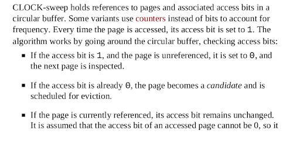
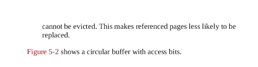
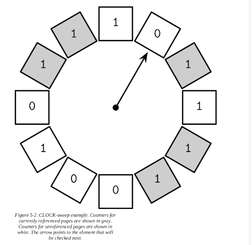

The algorithm is easy to understand and implement and is often used in both textbooks
[TANENBAUM14] and real-wold systems.


**LFU (least frequently used)**

LRU is not always the best replacement strategy for a database system.
Sometimes, it may be more practical to consider usage frequency rather than recency as a predictive factor. 

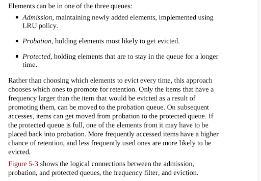

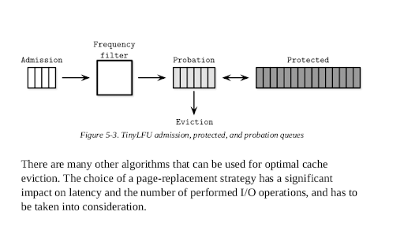
