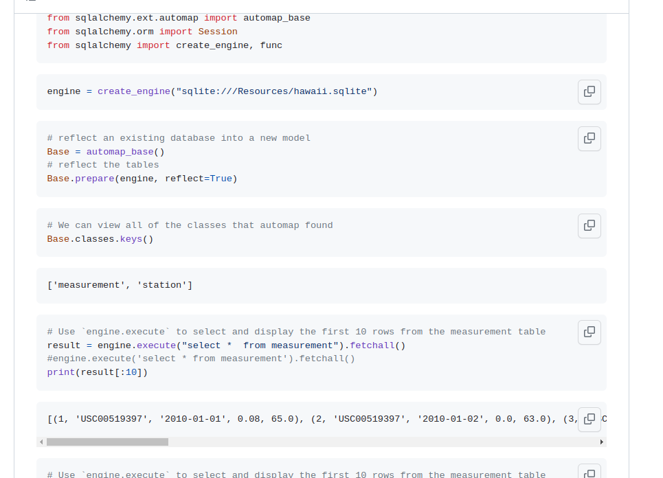

# Assignment 6 SQLite and Data Analysis

Please see the following two files for instructions.

* Please submit both jupiter notebook  and code in word document with screenshots, so that I can do grading quicker.
* Please download your database, a sqlite file from here,
[TODO]

## Climate Analysis and Exploration**

To begin, use Python and SQLAlchemy to do basic climate analysis and data exploration of your climate database. 
All of the following analysis should be completed using SQLAlchemy ORM queries, Pandas, and Matplotlib.

* Use the provided `hawaii.sqlite` file to complete your climate analysis and data exploration.
* Choose a start date and end date for your trip. Make sure that your vacation range is approximately 3-15 days total.
* Use SQLAlchemy create_engine to connect to your sqlite database.
* Use SQLAlchemy automap_base() to reflect your tables into classes and save a reference to those classes called Station and Measurement.

**Precipitation Analysis**

* Design a query to retrieve the last 12 months of precipitation data.
* Select only the date and prcp values.
* Load the query results into a Pandas DataFrame and set the index to the date column.
* Sort the DataFrame values by date.
* Plot the results using the DataFrame plot method.


Use Pandas to print the summary statistics for the precipitation data.

**Station Analysis**

* Design a query to calculate the total number of stations.
* Design a query to find the most active stations.
  * List the stations and observation counts in descending order.
  * Which station has the highest number of observations?
  > Hint: You may need to use functions such as func.min, func.max, func.avg, and func.count in your queries.

* Design a query to retrieve the last 12 months of temperature observation data (tobs).
  * Filter by the station with the highest number of observations.
  * Plot the results as a histogram with bins=12.


**Temperature Analysis**

* The starter notebook contains a function called calc_temps that will accept a start date and end date in the format %Y-%m-%d and return the minimum, average, and maximum temperatures for that range of dates.
* Use the calc_temps function to calculate the min, avg, and max temperatures for your trip using the matching dates from the previous year (i.e., use "2017-01-01" if your trip start date was "2018-01-01").
*  Plot the min, avg, and max temperature from your previous query as a bar chart.
  * Use the average temperature as the bar height.
  * Use the peak-to-peak (tmax-tmin) value as the y error bar (yerr).


```python
import numpy as np
import pandas as pd
import datetime as dt
import sqlalchemy
import matplotlib.pyplot as plt from matplotlib
import style %matplotlib inline
style.use('seaborn')
style.use('fivethirtyeight')
from sqlalchemy.ext.automap
import automap_base from sqlalchemy.orm
```

and 

## Python SQL toolkit and Object Relational Mapper

```python
import sqlalchemy
from sqlalchemy.ext.automap
import automap_base
from sqlalchemy.orm import Session
from sqlalchemy import create_engine, func
```



Data are found in sqlite database,


Then you can make queries like above,


Then you can do something like this,

```sql

# Query Measurement for id`, `station`, date, prcp, tobs and `data` and save the query into results
id=[]
station=[]
date=[]
prcp=[]
tobs=[]
data=[]
for row in session.query(Measurement.id, Measurement.station, Measurement.date, Measurement.prcp, Measurement.tobs).all():
    id.append(row[0])
    station.append(row[1])
    date.append(row[2])
    prcp.append(row[3])
    tobs.append(row[4])
```

and 

```python
engine.execute('SELECT * FROM measurement LIMIT 5').fetchall()
[(1, 'USC00519397', '2010-01-01', 0.08, 65.0),
 (2, 'USC00519397', '2010-01-02', 0.0, 63.0),
 (3, 'USC00519397', '2010-01-03', 0.0, 74.0),
 (4, 'USC00519397', '2010-01-04', 0.0, 76.0),
 (5, 'USC00519397', '2010-01-06', None, 73.0)]
```

Now, you are start programming, also when you are curious about the sqlite database, please feel free to use Dbeaver to connect and visually see what it is inside..

> Note: All questions have equal points totalling to 100 pts. Word document of a decent report is 10 pts.
