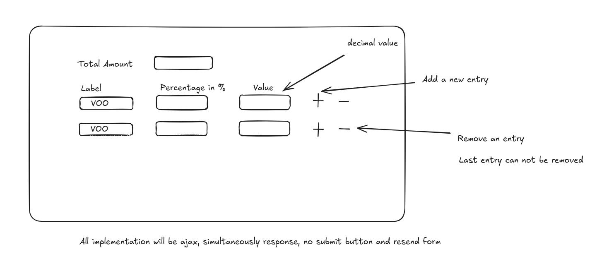

# Implement a Javascript Calculator

## Submission requirements

* Your word/pdf on top, not in the zip file.
* If you have source code of a project, you can zip and upload it.

## Tasks

Write a Javascript code to implement a simple calculator.

This is to get yourself familiarized with HTML5 and Javascript.

