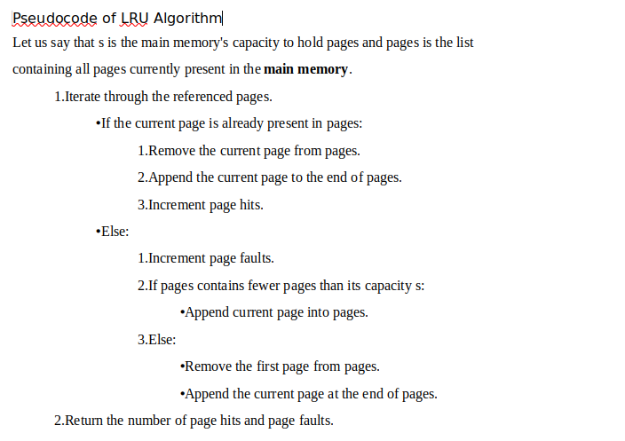
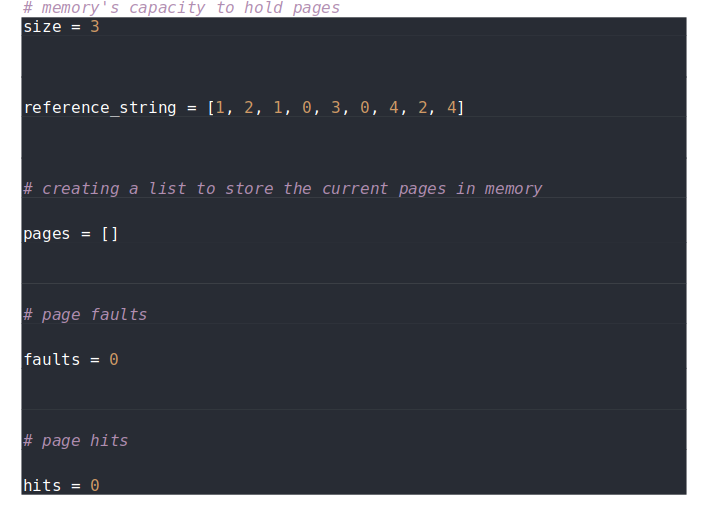
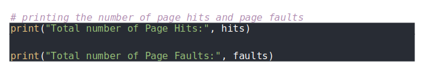

# Assignment 8 Algorithm Implementation

## Implement the LRU page replacement algorithm

**Pseudocode of LRU Algorithm**

Let us say that s is the main memory's capacity to hold pages and pages is the list
containing all pages currently present in the main memory.

**Python Code Template**

Please fill out the algorithm body and submit your code in word and python file in a zip.

For how LRU is working, please refer to our class content.