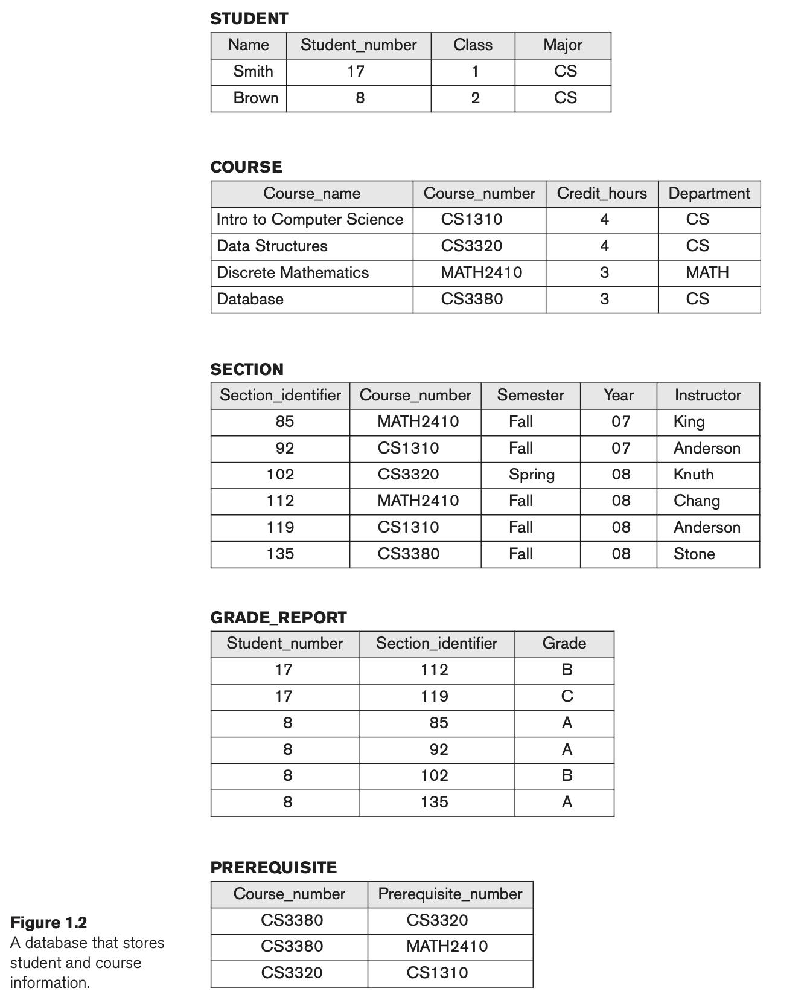

# Midterm Project - Web Development with Database

## Database application: the registrar’s database

In this project we will achieve developing a simple web application using Python, MySQL Database, html to implement a simple student management system.

**System/Business Requirement**

We will build a small system with the following relationships of tables. Sample data provided for you to validate your schema integrity.

Of course, in reality, the system would be much more complex, such as each student would have their profile data such as dob, and name would usually be last name, mid name and first  name, here in this project, we simply all that. Like wise, normally staff, instructor, would also have instructor id to form these relations, but here we also simplify the requirements.

**How to present your project in a word document**

1/ You would provide all the SQL DDL (create statements) of these tables. (10pts)

2/ Optimizations: indexes, foreign keys should be also included in the DDL. (10pts)

3/ DML. You can provide this during you are developing the web application. (10pts)

4/ Develop python code for endpoints and pages. API endpoints should follow practices that each table’s endpoints will use their own space, for example, for students/, courses/, sections/ ...etc.
Code should be zipped and attached. HTML, JS, or Python should be in good hierarchy. (10pts)

5/ ER diagram. (10pts)

6/ All the pages should be taken screenshots and pasted into your report. (10pts)

7/ Paste a Link to a small short video of your youtube clip into the report and during this video, you will demo the project how it works based on the system you developed. 
Just explain the web system, no need to explain the sql part in the python coding. (10pts)

8/ Documentation of each endpoint. And screenshots of testing them using `postman` or `curl`. (30pts)

**Requirements of DB SQL Design**

* Use Mysql Database to connect with Python code. (Details of web pages developments are found in #8 in-class lab). Please consider SQLAlchemy or Mysql’w own connector.

* Constraints:  student_number should be unique, course_number should be unique. For each table, you need to decide which are primary keys (This is to test you out for understanding the normalization).

* ER Diagram. You can use reverse engineering way using Dbeaver or MySQL workbench.

* Indexes, foreign keys should be considered and created in SQL(DDL). SQL should be all provided in the project.

* Optimization: Always considering creating necessary indexes to optimize query speed, and explain why.

* DML. You will have to see how to join these tables based on the UI/Programming requirements.

**UI Requirements**

>note:
 * We will have to have simple user interface as shown in class of `Web Development`. How-to get HTML form to display contents from querying database.
 * Insert the data from the figure 2.1 and to help you get some dummy data to finish testing.
 * {id} in the following could mean an auto_increment id or your student id or student_number.
 *  Views in web development. The following should be different html pages and routes for the following views.

1/ Students should have a view that shows their grades. Specifically, it should show: Course_name, Course_number, Section_identifier, Instructor, Credit_hours, Semester, Year, Grade for each course they are enrolled in. How to pass the student_number to the html? We pass it from the url (This is a task for you to figure out.)
**Endpoint: students/{id}**

2/ Instructor view: should be a hyperlink in step 1’s html and clicking it, it will direct to the instructor page.

**Endpoint: /instructors/{id}**

3/ Course_number in the 1/ should be hyperlink and clicking it can direct to a course page. And course page should show all the prerequisite.

**Endpoint: /courses/{course_id}**

4/ Design a controller route to show student information page.
**Endpoint /students/all**: a page will show all the students
**Endpoint /students/{id}**: a page will show only that student if you click on student name in the students/all page.

5/ Design a controller route to show course information page which will include prerequisite too.
**Endpoint: /courses/all**

