# **Microservice Development in Python with Database**

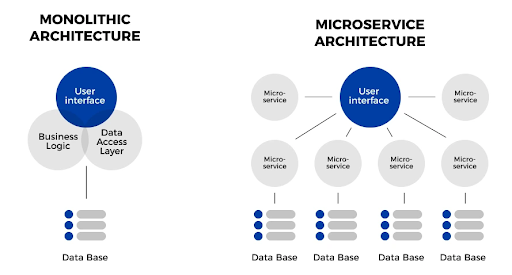

## **Monolithic**

Monolithic architecture is generally considered a good choice for smaller programs that need quick and cheap deployment,
however, they lack flexibility and can be difficult to scale. We’ll go into more detail regarding monolithic 
architecture pros and cons later on. In this case, monolithic architecture is your friend. You can put an app together 
rapidly, without expending too many resources. The monolithic architecture allows you to get your business up and 
running in good time, and you can take the time to optimize and improve your programs later on as you scale.

## **Microservices**

Microservices have a lot of applications, but a common one is the restructuring of legacy systems. Microservices are
also useful if you need to do a significant amount of real-time data streaming and processing, such as the type 
streaming services, online banking, or eCommerce applications are known for doing. Microservices are far more capable 
of handling this kind of data load than monolithic applications.

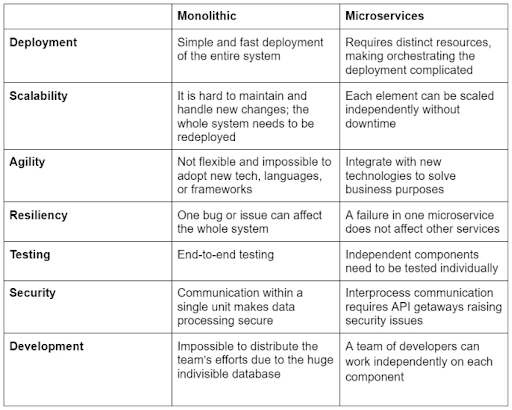

### **Bad Examples of Monolithic**

Think about when you program JSP, JSTL, or PHP  and mix them with html, js and css….


* Code are easy to break
* Loading different divs in html is slow, while in microservice architecture, each div could call a different service.
* Microservice architecture you can easily add new features without messing with existing features.

## **Microservice Architecture**

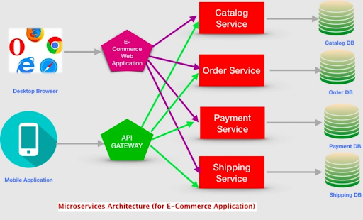

[**Image source**](https://www.openlegacy.com/blog/monolithic-application)

## **Software Deployment Architecture**

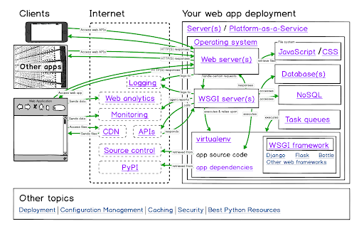

[**Image source**](https://www.fullstackpython.com/deployment.html)

## **Microservice with Dockerized container and Load Balancer**

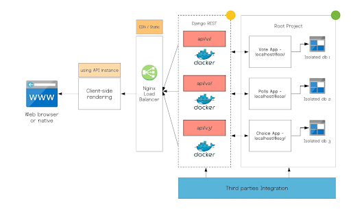

[**Image source**](https://github.com/diyframework/django-microservice)

## **A Hotel Booking System Architecture**

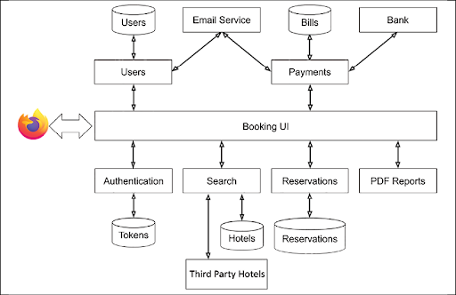

[**Image source**](https://subscription.packtpub.com/book/web-development/9781801076302/1/ch01lvl1sec04/the-microservice-approach)


### **Lab:  Python Microservice Development**

Important Note: This is a small lab, but I will show you how to write your final project in a few steps. 
Please make sure you can run it before you leave the classroom today.

#### **Step 1 Learn how to write a restful endpoint**

Develop a restful endpoint that will give you a JSON format. JSON format is a Javascript array format. 
JSON format is required by restful or REST endpoints and is part of the microservice‘s service output. 

**Note, that the endpoint is also called controller in the microservice development context and literature.**

`microservice.py`

```python
from flask import Flask, jsonify
 
app = Flask(__name__)
 
@app.route("/taxrecords/all", methods=['GET'])
def hello_microservice():
    message = {"id": "1", "name": "Kevin Li", ""}
    return jsonify(message)
 
if __name__ == "__main__":
    app.run(port=8000)
```

Run the microservice.py using the Python command:

`python microservice.py`

Go to http://127.0.0.1:8000/taxrecords/all in your browser. You can see the JSON output.

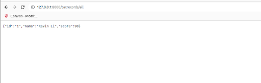

Or use curl command to check your result,

`curl http://127.0.0.1:8000/taxrecords/all`

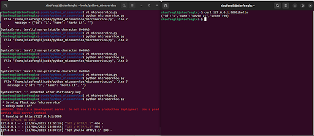

_**Note:**_ 

**In your final project, when you call a database query and get the result, you will need to render it as JSON file.**

If you see any errors, please check with the following 


```python
from flask import Flask, jsonify, render_template

app = Flask(__name__)
```


> This is a file to load html.  
> This same html page will serve as a single-page application.  
> This page will load javascript file, and it will make ajax call/jquery to call our backend api.  
>  
> Although backend apis are also coded into the same flask project, it will simulate a microservice project.

```python
@app.route('/')
def index():
    return render_template('index.html')
```
> Hint: What are the Restful API naming schemas? Pluras or singular?

```python
@app.route("/taxrecords/all", methods=['GET'])
def hello_microservice():
    """
    Connect to your database and make queries, then manipulate your 
    result into the following format 
    """
    message = {"id": "1", "name": "Kevin Li", "score": 90}
    return jsonify(message)

if __name__ == "__main__":
    app.run(port=8000)
```

#### **Step 2:  use / root of the URL to load an index.html file.**

Add the following missing parts to the microservice.py above.

```python
from flask import Flask, render_template

app = Flask(__name__)

@app.route('/')
def index():
    return render_template('index.html')
```

Create /templates/index.html should look like the following,


```html
<!DOCTYPE html>
<html lang="en">
<head>
    <meta charset="UTF-8">
    <title>Tax Tracking App</title>
    <link rel="stylesheet" href="{{ url_for('static', filename= 'css/style.css') }}">
    <title>FlaskBlog</title>
</head>
<body>
   <div id="data_table">
        <h1>This is the Tax Data Table</h1>
   </div>
   
   <div id="filtered_table">
        <h1>This is the Tax Data Table</h1>
   </div>
</body>
</html>
```

Create static/css/style.css with the following content,

```css
h1 {
    border: 2px #eee solid;
    color: brown;
    text-align: center;
    padding: 10px;
}
```

**Takeaway:**

* http://127.0.0.1:8000/taxrecords/all is your endpoint, which is part of your backend service

* http://127.0.0.1:8000/ is your frontend service. In this implementation, we put your UI service and backend service all together.


* Here is a diagram how a micro microservice project should look like,

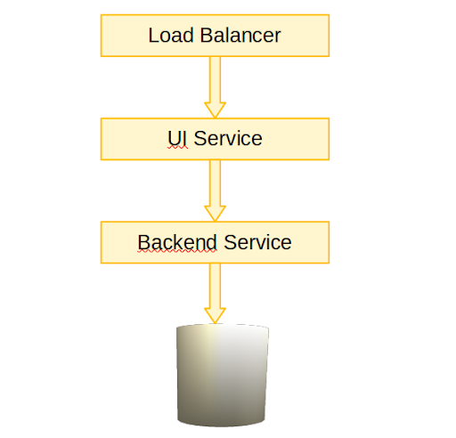

#### **Question**

Is our project now a microservice architecture?

#### **Step 3 Use Javascript to call restful endpoint**

Add Jquery to your html (Jquery is an Ajax- asynchronous javascript library and is widely used by industry)

Google CDN:

```html
<head>
<script src="https://ajax.googleapis.com/ajax/libs/jquery/3.7.1/jquery.min.js"></script>
</head>
```

Then add the following code,

```html
<!DOCTYPE html>
<html lang="en">
<head>
    <meta charset="UTF-8">
    <title>Tax Tracking App</title>
    <link rel="stylesheet" href="{{ url_for('static', filename= 'css/style.css') }}">
    <title>Tax Tracking App</title>
    <script src="https://ajax.googleapis.com/ajax/libs/jquery/3.7.1/jquery.min.js"></script>

<script>
$(document).ready(function(){
  $("#test_me").click(function(){
                  console.log("you click me");
    $("#data_table").toggle();
  });
});
</script>

</head>
<body>

    <button id="test_me" >show content</button>
   <div id="data_table">
        <h1>This is the Tax Data Table</h1>
   </div>

   <div id="filtered_table">
        <h1>This is the Tax Filtered Table</h1>
   </div>
</body>
</html>


Code Explanation:

* The following in the head is the javascript code. This is called in-line js code. Normally we will put js code in its separate file, I would recommend you do that for your project. Please recall our mid-term project how we did it,

<script>
$(document).ready(function(){
  $("#test_me").click(function(){
                  console.log("you click me");
    $("#data_table").toggle();
  });
});
</script>
```

* The # is to reference the HTML component/tag‘s id, such as “test_me” is an id=”test_name”. Please check the jQuery reference to see what if the div does not have an id, but instead has an attribute called “name”.

* In this example, it only tells you how to trigger/implement an event of clicking a button. In our final project, we would need an event for updating the page dynamically by choosing different dropdown menu item.


#### **Step 4 Sum up for the kick-start project layout**

**Project layout**

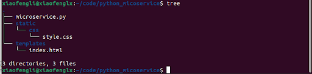


**Python app code**

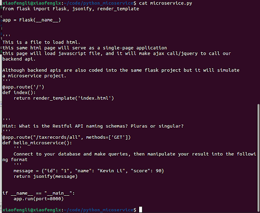


**HTML code**

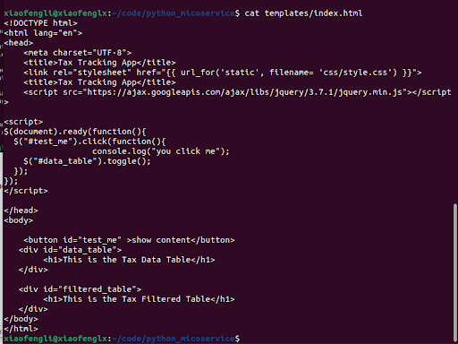


**CSS code**

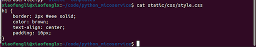

Js code

None. You should have it in your final project and make the project more modular. This is a good marketing opportunity 
when you make a youtube video out of it.

**Project Output**

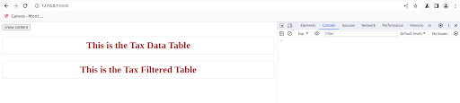

When you click it, and it will hide the second div

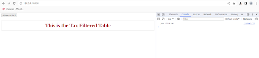


