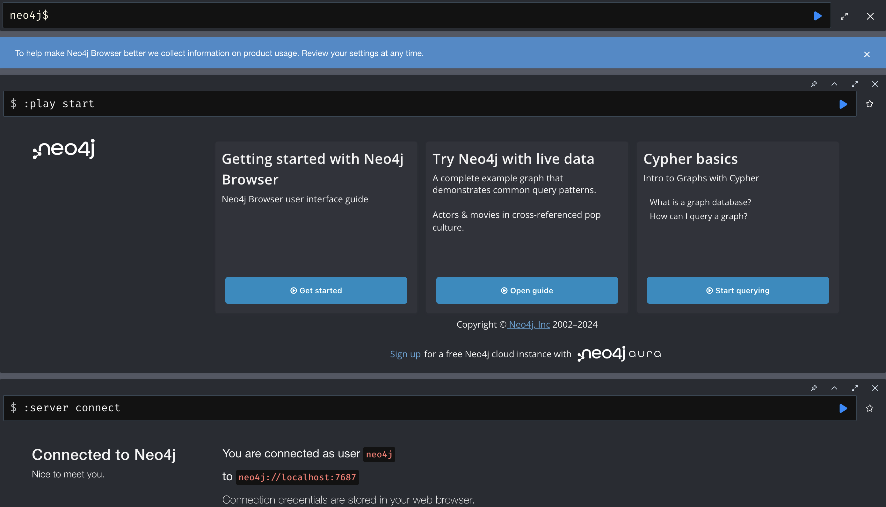

# **Neo4j**

## **Installation**

Neo4j can be installed in different deployment contexts, such as Linux, macOS, and Windows.

* [System requirements](https://neo4j.com/docs/operations-manual/current/installation/requirements/) — The system requirements for a production deployment of Neo4j.

* [Linux](https://neo4j.com/docs/operations-manual/current/installation/linux/) — Installation instructions for Linux.

* [macOS](https://neo4j.com/docs/operations-manual/current/installation/osx/) — Installation instructions for macOS.

* [Windows](https://neo4j.com/docs/operations-manual/current/installation/windows/) — Installation instructions for Windows.

* [Neo4j Desktop](https://neo4j.com/docs/operations-manual/current/installation/neo4j-desktop/) — About Neo4j Desktop.

## **Installation-free options**

Neo4j AuraDB is a fully managed Neo4j database, hosted in the cloud and requires no installation. For more information, see the [AuraDB product page](https://neo4j.com/aura/) and [AuraDB documentation](https://neo4j.com/docs/aura/current/).

Neo4j can be run in a Docker container. For information on running Neo4j on Docker, see [Docker](https://neo4j.com/docs/operations-manual/current/docker/).

### **Using Docker:**

Ensure you have installed docker desktop and it has started

`docker run \
    --name neo4j \
    -p7474:7474 -p7687:7687 \
    -d neo4j:latest`

### **Connecting to Neo4j**

After installation, you can access the Neo4j Browser at http://localhost:7474. Use the default credentials:

* Username: neo4j

* Password: You will set this up on the first run. its still for the first time (neo4j)

The Page looks like this Once its connected: 

Alternatively, you can use Cypher Shell to interact with the database via terminal:

`cypher-shell -u neo4j -p password`

## **Basic Commands (Cypher Queries)**

1. Create a Node

To create a node representing a person:

`CREATE (n:Person {name: "Alice", age: 30, city: "New York"})
RETURN n`

2. Create a Relationship

To create a relationship between two existing nodes:

`MATCH (a:Person {name: "Alice"})-[:KNOWS]-(b:Person {name: "Bob"})
RETURN a, b`

3. Retrieve All Nodes

Retrieve all nodes of a certain type:

`MATCH (n:Person) RETURN n`

4. Update a Node

To update the properties of a node:

`MATCH (n:Person {name: "Alice"})
SET n.age = 31
RETURN n`

5. Retrieve Relationships

To retrieve relationships between nodes:

`MATCH (a:Person)-[r:KNOWS]->(b:Person)
RETURN a, r, b`

6. Count Nodes or Relationships

To count the number of nodes or relationships:

`MATCH (n:Person) RETURN count(n)`

## **Neo4j Administration Commands**

1. Start/Stop the Database

On Linux systems, you can manage the Neo4j service:

`sudo systemctl start neo4j`

`sudo systemctl stop neo4j`

For Docker:

`docker start neo4j`

`docker stop neo4j`

**Conclusion**

Neo4j is a powerful graph database with many features. Once installed, you can use Cypher to create and query data with
ease. This document provides a basic foundation to get started with Neo4j. For more advanced use cases, 
refer to the [Neo4j documentation](https://neo4j.com/docs/).

