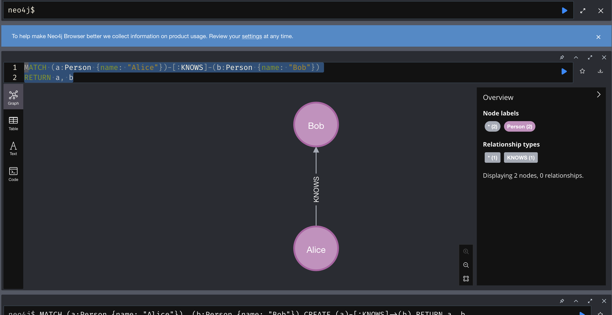

# **Neo4j**

## **Installation**

Neo4j can be installed in different deployment contexts, such as Linux, macOS, and Windows.

* [System requirements](https://neo4j.com/docs/operations-manual/current/installation/requirements/) — The system requirements for a production deployment of Neo4j.

* [Linux](https://neo4j.com/docs/operations-manual/current/installation/linux/) — Installation instructions for Linux.

* [macOS](https://neo4j.com/docs/operations-manual/current/installation/osx/) — Installation instructions for macOS.

* [Windows](https://neo4j.com/docs/operations-manual/current/installation/windows/) — Installation instructions for Windows.

* [Neo4j Desktop](https://neo4j.com/docs/operations-manual/current/installation/neo4j-desktop/) — About Neo4j Desktop.

## **Installation-free options**

Neo4j AuraDB is a fully managed Neo4j database, hosted in the cloud and requires no installation. For more information, see the [AuraDB product page](https://neo4j.com/aura/) and [AuraDB documentation](https://neo4j.com/docs/aura/current/).

Neo4j can be run in a Docker container. For information on running Neo4j on Docker, see [Docker](https://neo4j.com/docs/operations-manual/current/docker/).

### **Using Docker:**

Ensure you have installed docker desktop and it has started

`docker run \
    --name neo4j \
    -p7474:7474 -p7687:7687 \
    -d neo4j:latest`

### **Connecting to Neo4j**

After installation, you can access the Neo4j Browser at http://localhost:7474. Use the default credentials:

* Username: neo4j

* Password: You will set this up on the first run. its still for the first time (neo4j)

The Page looks like this Once its connected:


Alternatively, you can use Cypher Shell to interact with the database via terminal:

`cypher-shell -u neo4j -p password`

## **Basic Commands (Cypher Queries)**

## **Cypher** 

### **What is Cypher?**

Cypher is Neo4j’s declarative graph query language. It was created in 2011 by Neo4j engineers as an SQL-equivalent language for graph databases. Similar to SQL, Cypher lets users focus on what to retrieve from graph, rather than how to retrieve it. As such, Cypher enables users to realize the full potential of their property graph databases by allowing for efficient and expressive queries that reveal previously unknown data connections and clusters.

Cypher provides a visual way of matching patterns and relationships. It relies on the following ascii-art type of syntax: (nodes)-[:CONNECT_TO]→(otherNodes). Rounded brackets are used for circular nodes, and -[:ARROWS]→ for relationships. Writing a query is effectively like drawing a pattern through the data in the graph. In other words, entities such as nodes and their relationships are visually built into queries. This makes Cypher a highly intuitive language to both read and write.

### **Cypher and SQL: key differences**

Cypher and SQL are similar in many ways. For example, they share many of the same keywords, such as WHERE and ORDER BY. However, there are some important differences between the two:

_**Cypher is schema-flexible**_

While it is both possible and advised to enforce partial schemas using indexes and constraints, Cypher and Neo4j offers a greater degree of schema-flexibility than SQL and a relational database. More specifically, nodes and relationships in a Neo4j database do not have to have a specific property set to them because other nodes or relationships in the same graph have that property (unless there is an existence constraint created on that specific property). This means that users are not required to use a fixed schema to represent data and that they can add new attributes and relationships as their graphs evolve.

**_Query order_**

SQL queries begin with what a user wants to return, whereas Cypher queries end with the return clause. For example, consider the following two queries (both searching a database for titles of movies with a rating of greater than 7), the first written with SQL and the second with Cypher:

**SQL** 

```sql
SELECT movie.name
FROM movie
WHERE movie.rating > 7
```
**Cypher**

```cypher
MATCH (movie:Movie)
WHERE movie.rating > 7
RETURN movie.title
```

_**Cypher queries are more concise**_

Due to its intuitive, whiteboard-like method of constructing clauses, Cypher queries are often more concise than their equivalent SQL queries. For example, consider the following two queries (both searching a database for the names of the actors in the movie The Matrix), the first written with SQL and the second with Cypher:

**SQL** 

```sql
SELECT actors.name
FROM actors
 	LEFT JOIN acted_in ON acted_in.actor_id = actors.id
	LEFT JOIN movies ON movies.id = acted_in.movie_id
WHERE movies.title = "The Matrix"
```

`MATCH (actor:Actor)-[:ACTED_IN]->(movie:Movie {title: 'The Matrix'})
RETURN actor.name`

To learn more on Cypher commands one can visit the documentation [here](https://neo4j.com/docs/cypher-manual/current/introduction/)

1. Create a Node

To create a node representing a person:

`CREATE (n:Person {name: "Alice", age: 30, city: "New York"})
RETURN n`


2. Create a Relationship

To create a relationship between two existing nodes:

`MATCH (a:Person {name: "Alice"})-[:KNOWS]-(b:Person {name: "Bob"})
RETURN a, b`



3. Retrieve All Nodes

Retrieve all nodes of a certain type:

`MATCH (n:Person) RETURN n`

4. Update a Node

To update the properties of a node:

`MATCH (n:Person {name: "Alice"})
SET n.age = 31
RETURN n`


5. Retrieve Relationships

To retrieve relationships between nodes:

`MATCH (a:Person)-[r:KNOWS]->(b:Person)
RETURN a, r, b`

6. Count Nodes or Relationships

To count the number of nodes or relationships:

`MATCH (n:Person) RETURN count(n)`

## **Neo4j Administration Commands**

1. Start/Stop the Database

On Linux systems, you can manage the Neo4j service:

`sudo systemctl start neo4j`

`sudo systemctl stop neo4j`

For Docker:

`docker start neo4j`

`docker stop neo4j`

**Conclusion**

Neo4j is a powerful graph database with many features. Once installed, you can use Cypher to create and query data with
ease. This document provides a basic foundation to get started with Neo4j. For more advanced use cases, 
refer to the [Neo4j documentation](https://neo4j.com/docs/).
