# **ORM (Object-Relational Mapping)**


Object-relational mapping speeds up development time for teams and reduces costs,
but how does it work? Our expert explains.


Object-relational mapping (ORM) is a design pattern that helps streamline 
communication between relational databases and object-oriented programming 
languages like Java or Python. 

## **ORM vs. SQL**

* ORM is high level API abstraction from languages Java or Python to 
reduce programming code. For instance, Oracle and MS SQL syntax are different, 
and you do not have to worry about the difference in syntax.

* ORM is more secure.

* ORM is more complex and requires some learning curve.

* ORM has slow performance


ORM provides a convenient alternative to SQL, but deciding which one to use 
often depends on one’s coding experience and the nature of the data-related 
task that needs to be completed. Some ORM tools may not support advanced SQL
features, thereby limiting their usefulness for certain applications. 
This is especially true when complex queries are involved because ORM 
tools generate SQL queries automatically. 

Additionally, ORM tools often generate more database queries than necessary, 
which can slow down performance even further. While ORM tools can help simplify 
development, these tools may not be the best choice for applications that need 
high performance or have strict performance requirements.

### Object-Relational Mapping Tools

#### **Popular ORM Tools for Java**
**1. Hibernate**

[Hibernate](https://hibernate.org/orm/) enables developers to write data persistent classes following OOP 
concepts like inheritance, polymorphism, association, composition. Hibernate is
highly performant and is also scalable.

**2. Apache OpenJPA**

[Apache OpenJPA](https://openjpa.apache.org/) is also a Java persistence tool.
It can be used as a stand-alone **POJO** (plain old Java object) persistence layer.

**3. EclipseLink**

[EclipseLink](https://www.eclipse.org/eclipselink/) is an open source Java persistence 
solution for relational, XML, and database web services.

**4. jOOQ**

[JOOQ](https://www.jooq.org/) generates Java code from data stored in a database. You can also use this
tool to build type safe SQL queries.

**5. Oracle TopLink**

You can use [Oracle TopLink](https://www.jooq.org/) to build high-performance applications that store 
persistent data. The data can be transformed into either relational data or XML elements.

#### **Popular ORM Tools for Python**

**1. Django**

[Django](https://docs.djangoproject.com/en/4.1/topics/db/queries/) is a great tool for building web applications rapidly.

**2. web2py**

[Web2py](http://www.web2py.com/init/default/index) is an open source full-stack Python 
framework for building fast, scalable, secure, and data-driven web applications.

**3. SQLObject**

[SQLObject](http://www.sqlobject.org/) is an object relational manager that provides an object interface to your database.

**4. SQLAlchemy**

[SQLAlchemy](https://www.sqlalchemy.org/) provides persistence patterns designed for efficient and high-performing database access.

#### **Popular ORM Tools for PHP**

**1. Laravel**

[Laravel](https://laravel.com/docs/9.x/eloquent) comes with an object relational manager called Eloquent which makes interaction with databases easier.

**2. CakePHP**

[CakePHP](https://book.cakephp.org/4/en/orm.html) provides two object types: repositories which give you access to a collection of data and entities which represents individual records of data.

**3. Qcodo**

[Qcodo](https://github.com/qcodo/qcodo) provides different commands that can be run in the terminal to interact with databases.

**4. RedBeanPHP**

[RedBeanPHP](https://redbeanphp.com/index.php) is a zero config object relational mapper.


#### **Popular ORM Tools for .NET**

**1. Entity Framework**

[Entity Framework](https://learn.microsoft.com/en-us/ef/) is a multi-database object-database mapper. It supports SQL, SQLite, MySQL, PostgreSQL, and Azure Cosmos DB.

**2. NHibernate**

[Nhibernate](https://nhibernate.info/) is an open source object relational mapper with tons of plugins and tools to make development easier and faster.

**3. Dapper**

[Dapper](https://www.learndapper.com/) is a micro-ORM. It is mainly used to map queries to objects. This tool doesn't do most of the things an ORM tool 
would do like SQL generation, caching results, lazy loading, and so on.

**4. Base One Foundation Component Library (BFC)**

[BFC](http://www.boic.com/b1mspecsheet.htm) is a framework for creating networked database applications with Visual Studio and DBMS software from Microsoft, 
Oracle, IBM, Sybase, and MySQL You can see more ORM tools here. Now let's discuss some of the advantages and 
disadvantages of using ORM tools.

#### **Java Persistence API**

The Java Persistence API provides Java developers with an object/relational mapping facility for managing relational 
data in Java applications. Java Persistence consists of four areas:

* The Java Persistence API
* The query language
* The Java Persistence Criteria API
* Object/relational mapping metadata

The following topics are addressed here:
1. [Entities](https://docs.oracle.com/javaee/6/tutorial/doc/bnbqa.html)
2. [Entity Inheritance](https://docs.oracle.com/javaee/6/tutorial/doc/bnbqn.html)
3. [Managing Entities](https://docs.oracle.com/javaee/6/tutorial/doc/bnbqw.html)
4. [Querying Entities](https://docs.oracle.com/javaee/6/tutorial/doc/gjise.html)
5. [Further Information about Persistence](https://docs.oracle.com/javaee/6/tutorial/doc/gkclc.html)

Java example, 

```java
@MappedSuperclass
public class Employee {
    @Id
    protected Integer employeeId;
    ...
}

@Entity
public class FullTimeEmployee extends Employee {
    protected Integer salary;
    ...
}

@Entity
public class PartTimeEmployee extends Employee {
    protected Float hourlyWage;
    ...
}

```


The following example shows how to manage transactions in an application that uses an application-managed entity manager:

```java
@PersistenceContext
EntityManagerFactory emf;
EntityManager em;
@Resource
UserTransaction utx;
...
em = emf.createEntityManager();
try {
  utx.begin();
  em.persist(SomeEntity);
  em.merge(AnotherEntity);
  em.remove(ThirdEntity);
  utx.commit();
} catch (Exception e) {
  utx.rollback();
}
```

**Finding Entities Using the EntityManager**

The EntityManager.find method is used to look up entities in the data store by the entity’s primary key:

```java
@PersistenceContext
EntityManager em;
public void enterOrder(int custID, Order newOrder) {
    Customer cust = em.find(Customer.class, custID);
    cust.getOrders().add(newOrder);
    newOrder.setCustomer(cust);
}
```

**Persisting Entity Instances**

```java
@PersistenceContext
EntityManager em;
...
public LineItem createLineItem(Order order, Product product,
        int quantity) {
    LineItem li = new LineItem(order, product, quantity);
    order.getLineItems().add(li);
    em.persist(li);
    return li;
}
```
**Removing Entity Instances**

```java
public void removeOrder(Integer orderId) {
    try {
        Order order = em.find(Order.class, orderId);
        em.remove(order);
    }...
}

```
The persist operation is propagated to all entities related to the calling entity that have the cascade element set 
to ALL or PERSIS in the relationship annotation:

```java
@OneToMany(cascade=ALL, mappedBy="order")
public Collection<LineItem> getLineItems() {
    return lineItems;
}
```

**Synchronizing Entity Data to the Database**

The state of persistent entities is synchronized to the database when the transaction with which the entity is 
associated commits. If a managed entity is in a bidirectional relationship with another managed entity, the data 
will be persisted, based on the owning side of the relationship.

To force synchronization of the managed entity to the data store, invoke the flush method of the EntityManager instance.
If the entity is related to another entity and the relationship annotation has the cascade element set to PERSIST or 
ALL, the related entity’s data will be synchronized with the data store when flush is called.

If the entity is removed, calling flush will remove the entity data from the data store.

### **Java Persistence query language (JPQL)**

**Creating Queries Using the Java Persistence Query Language**

The `EntityManager.createQuery` and `EntityManager.createNamedQuery` methods are used to query the datastore by using Java 
Persistence query language queries.

**Dynamic Query**

The `createQuery` method is used to create dynamic queries, which are queries defined directly within an application’s 
business logic:

```java
public List findWithName(String name) {
return em.createQuery(
    "SELECT c FROM Customer c WHERE c.name LIKE :custName")
    .setParameter("custName", name)
    .setMaxResults(10)
    .getResultList();
}
```

**Named Query**

The `createNamedQuery` method is used to create **static queries**, or queries that are defined in metadata by using the 
`javax.persistence.NamedQuery` annotation. The name element of `@NamedQuery` specifies the name of the query that will be
used with the `createNamedQuery` method. The _query_ element of `@NamedQuery` is the query:

```java
@NamedQuery(
    name="findAllCustomersWithName",
    query="SELECT c FROM Customer c WHERE c.name LIKE :custName"
)
```

Here’s an example of `createNamedQuery`, which uses the `@NamedQuery`:

```java
@PersistenceContext
public EntityManager em;
...
customers = em.createNamedQuery("findAllCustomersWithName")
    .setParameter("custName", "Smith")
    .getResultList();
```

**Positional Parameters in Queries**

You may use positional parameters instead of named parameters in queries. Positional parameters are prefixed with a 
question mark (?) followed the numeric position of the parameter in the query. 
The `Query.setParameter(integer position, Object value)` method is used to set the parameter values.
In the following example, the `findWithName` business method is rewritten to use input parameters:

```java
public List findWithName(String name) {
    return em.createQuery(
        “SELECT c FROM Customer c WHERE c.name LIKE ?1”)
        .setParameter(1, name)
        .getResultList();
}
```

Input parameters are numbered starting from 1. Input parameters are case-sensitive, and may be used by both dynamic 
and static queries.

#### **Difference Between JPA and Hibernate**

| **Java Persistence API (JPA)**                                                                                       | **Hibernate**                                                                                                |
|----------------------------------------------------------------------------------------------------------------------|--------------------------------------------------------------------------------------------------------------|
| JPA is responsible for managing relational databases in Java applications.                                           | Hibernate is an ORM tool used for saving the state of the Java object in the database.                       |
| It is defined under the `javax.persistence` package.                                                                 | It is defined under `org.hibernate` package.                                                                 |
| JPA is the Java specification and not the implementation.                                                            | Hibernate is an implementation of JPA and uses common standards of Java Persistence API.                     |
| It is the standard API that allows developers to perform database operations smoothly.                               | It is used to map Java data types with database tables and SQL data types.                                   |
| It uses the `EntityManagerFactory` interface to interact with the entity manager factory for the persistence unit.   | It uses the `SessionFactory` interface for creating Session instances.                                       |
| It uses the `EntityManager` interface to create, read, and delete operations for instances of mapped entity classes. | It uses a `Session` interface to create, read, and delete operations for instances of mapped entity classes. |
| It uses Java Persistence Query Language (JPQL), an object-oriented query language to perform database operations.    | It uses Hibernate Query Language (HQL), an object-oriented query language to perform database operations.    |


##### **Advantages of JPA**

* The burden of interacting with the database reduces significantly by using JPA.
* The programming task becomes easy by using O/R mapping and database access processing.
* Annotations reduce the code of creating definition files.
* Using different implementations can add the features to the standard implementation which can later be the part of JPA specification.

##### **Disadvantages of JPA**
* JPA specification may need to go through important developments before it becomes stable.
* JPA is not a product but a specification, so you need a provider to provide an implementation 
so that you can gain the benefits of these standards-based APIs.

##### **Advantages of Hibernate**

* Hibernate supports Inheritance, Associations, and Collections.
* Hibernate can generate primary keys automatically while we are storing the records in the database.
* Hibernate has its query language, i.e., Hibernate query language, which is database-independent, so if you change the 
database, then also our application will work as HQL is database independent.
* Hibernate provides Dialect classes, so you do not need to write SQL queries in hibernate. Instead, we use the methods provided by that API.

##### **Disadvantages of Hibernate**

* The performance of Hibernate is not good with batch processing, so it is advised to go with pure JDBC in these cases.
* Having mappings and joins among the tables makes it difficult to understand the code as we need to define the mapping 
and enter information in the XML file.
* A small project will have fewer tables, and introducing the entire Hibernate framework will be overhead than helpful.
* Hibernate does not allow some queries which JDBC supports. A developer has to write a separate query to insert each object.

## **JPA Entity Manager (An implementation of JPA)**

* The entity manager implements the API and encapsulates all of them within a single interface
* Entity manager is used to read, delete and write an entity.
* An object referenced by an entity is managed by entity manager.

##### **StudentEntity.java**

```java
import javax.persistence.*;

@Entity
@Table(name="student")
public class StudentEntity{


@Id
private int s_id;
private String s_name;
private int s_age;


public StudentEntity(int s_id, String s_name, int s_age) {  
        super();  
        this.s_id = s_id;  
        this.s_name = s_name;  
        this.s_age = s_age;  
    }  
  
    public StudentEntity() {  
        super();  
    }  
  
    public int getS_id() {  
        return s_id;  
    }  
  
    public void setS_id(int s_id) {  
        this.s_id = s_id;  
    }  
  
    public String getS_name() {  
        return s_name;  
    }  
  
    public void setS_name(String s_name) {  
        this.s_name = s_name;  
    }  
  
    public int getS_age() {  
        return s_age;  
    }  
  
    public void setS_age(int s_age) {  
        this.s_age = s_age;  
    }  
      
}  

```

##### **Persistence.xml**

```xml
<persistence>  
<persistence-unit name="Student_details">  
      
    <class>com.javatpoint.jpa.student.StudentEntity</class>  
  
<properties>  
<property name="javax.persistence.jdbc.driver" value="com.mysql.jdbc.Driver"/>  
<property name="javax.persistence.jdbc.url" value="jdbc:mysql://localhost:3306/studentdata"/>  
<property name="javax.persistence.jdbc.user" value="root"/>  
<property name="javax.persistence.jdbc.password" value=""/>  
<property name="eclipselink.logging.level" value="SEVERE"/>  
<property name="eclipselink.ddl-generation" value="create-or-extend-tables"/>  
</properties>  
  
    </persistence-unit>  
</persistence>
```

##### **PersistStudent.java**

```java
package com.javatpoint.jpa.persist;  
  
import com.javatpoint.jpa.student.*;  
import javax.persistence.*;  
public class PersistStudent {  
      
    public static void main(String args[])  
    {  
          
        EntityManagerFactory emf=Persistence.createEntityManagerFactory("Student_details");  
        EntityManager em=emf.createEntityManager();  
          
em.getTransaction().begin();  
          
        StudentEntity s1=new StudentEntity();  
        s1.setS_id(101);  
        s1.setS_name("Gaurav");  
        s1.setS_age(24);  
          
        StudentEntity s2=new StudentEntity();  
        s2.setS_id(102);  
        s2.setS_name("Ronit");  
        s2.setS_age(22);  
          
        StudentEntity s3=new StudentEntity();  
        s3.setS_id(103);  
        s3.setS_name("Rahul");  
        s3.setS_age(26);  
          
        em.persist(s1);  
        em.persist(s2);  
        em.persist(s3);       
  
em.getTransaction().commit();  
          
        emf.close();  
        em.close();  
          
    }  
}  
```

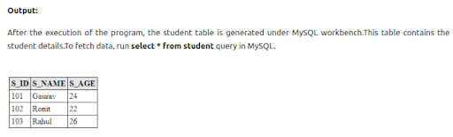

##### **FindStudent.java**

```java
package com.javatpoint.jpa.find;  
  
import javax.persistence.*;  
  
import com.javatpoint.jpa.student.*;  
  
public class FindStudent {  
    public static void main(String args[])  
    {  
        EntityManagerFactory emf=Persistence.createEntityManagerFactory("Student_details");  
        EntityManager em=emf.createEntityManager();  
          
      
          
        StudentEntity s=em.find(StudentEntity.class,101);  
          
        System.out.println("Student id = "+s.getS_id());  
        System.out.println("Student Name = "+s.getS_name());  
        System.out.println("Student Age = "+s.getS_age());  
          
    }  
}  
```

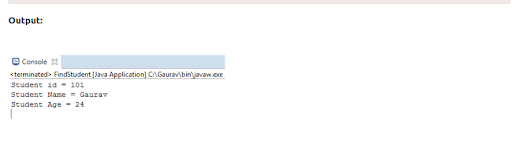

##### **UpdateStudent.java**

```java
package com.javatpoint.jpa.update;  
import javax.persistence.*;  
  
import com.javatpoint.jpa.student.*;  
public class UpdateStudent {  
      
    public static void main(String args[])  
    {  
        EntityManagerFactory emf=Persistence.createEntityManagerFactory("Student_details");  
        EntityManager em=emf.createEntityManager();  
          
      
          
        StudentEntity s=em.find(StudentEntity.class,102);  
        System.out.println("Before Updation");  
        System.out.println("Student id = "+s.getS_id());  
        System.out.println("Student Name = "+s.getS_name());  
        System.out.println("Student Age = "+s.getS_age());  
          
s.setS_age(30);  
          
        System.out.println("After Updation");  
        System.out.println("Student id = "+s.getS_id());  
        System.out.println("Student Name = "+s.getS_name());  
        System.out.println("Student Age = "+s.getS_age());  
          
          
    }  
  
}  
```


##### **Deletion.java**

```java
package com.javatpoint.jpa.delete;  
import javax.persistence.*;  
import com.javatpoint.jpa.student.*;  
  
public class DeleteStudent {  
  
    public static void main(String args[])  
    {  
    EntityManagerFactory emf=Persistence.createEntityManagerFactory("Student_details");  
    EntityManager em=emf.createEntityManager();  
em.getTransaction().begin();  
  
    StudentEntity s=em.find(StudentEntity.class,102);  
em.remove(s);  
em.getTransaction().commit();  
emf.close();  
em.close();  
    }  
}  

```

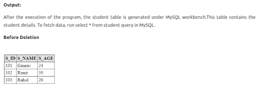

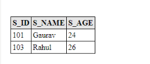


## **Hibernate (JPA Implementation) – Skipped**

* As it looks really similar to the above usage.
* It is incorporated into Springboot framework called Springboot JPA.

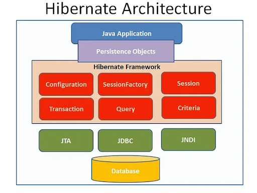


Features of Hibernate
1. Light Weight
2. Open Source
3. ORM (Object Relation Mapping)
4. High Performance
5. HQL (Hibernate Query Language)
6. Caching
7. Auto-Generation
8. Scalability
9. Lazy Loading
10. Database Independent


### **JPA Entity Manager VS Hibernate**

* Both are JPA implementation and Hibernate gains popularity and Oracle implemented Entity Manager later which acts in a similar way.
* Springboot JPA which is a popular framework incorporate Hibernate internally.

The initial JPA release was very basic, and didn’t include many of the advanced features available in Hibernate 
at the time, including Hibernate’s very powerful Criteria API. When JPA was first released, many organizations
used both JPA and Hibernate together. Developers would call upon proprietary Hibernate APIs, such as the 
HibernateSession within their code, while at the same time, they would decorate their JavaBeans and POJOs with 
JPA-based annotation to simplify the mapping between the Java code and the relational database in use. In doing so, 
organizations took advantage of useful features in the standard API, and simultaneously had access to various Hibernate
functions that weren’t yet standardized.


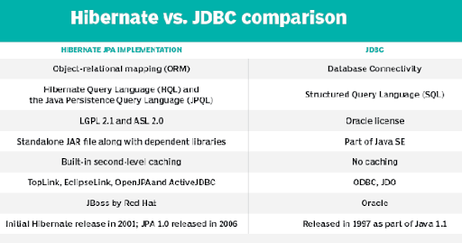

##### **Advantages of Hibernate vs JPA**

Even today, it’s possible for there to be [advanced mapping features](https://www.theserverside.com/feature/Taking-the-Hibernate-debate-beyond-JPA-and-data-persistence) 
baked into the Hibernate framework that aren’t yet available through the JPA specification. Because JPA is guided by 
the JCP and JSR process, it’s often a slow and methodical process to add new features. However, since the JBoss team 
that manages the Hibernate project isn’t bound by these sorts of restrictions, they can make features available much 
faster through their proprietary APIs. Some important features that were implemented by Hibernate long before the 
JPA specification caught up include:

* Java 8 Date and Time support
* SQL fragment mapping
* Immutable entity types
* Entity filters
* SQL fragment matching
* A manual flush mode
* Second level cache queries
* Soft deletes

But, despite the fact the [Hibernate is often quicker](https://www.theserverside.com/blog/Coffee-Talk-Java-News-Stories-and-Opinions/How-to-fix-the-MySQL-typeMyISAM-SQLSyntaxErrorException-in-Hibernate-and-JPA) 
at the draw when it comes to introducing new and advanced features, the JPA 2.0 release almost closed the gap between 
the two. It would be difficult for any software developer to develop applications with the proprietary API, when the JPA 
specification almost always provides equivalent functionality. And if one of those advanced Hibernate features is
required, you can always write code that bypasses JPA and calls the Hibernate code directly, which completely 
eliminates the need to ever choose sides in the JPA and Hibernate debate.

[Reference](https://www.theserverside.com/blog/Coffee-Talk-Java-News-Stories-and-Opinions/Set-the-record-straight-on-the-JPA-and-Hibernate-debate)


There are many ORM frameworks in the market and the famous ones for Java are

1. [Hibernate](https://medium.com/javarevisited/top-5-books-to-learn-hibernate-for-java-developers-b2cb4b16ccd6)
2. EclipseLink
3. iBATIS

### **Springboot JPA – Springboot data project**

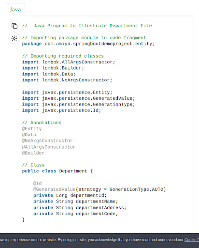
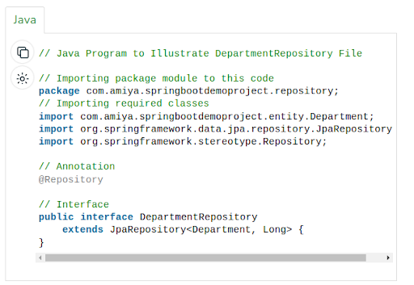
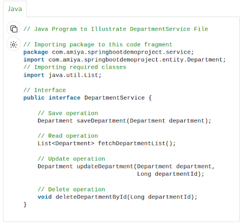

##### **DepartmentServiceImpl.java**

```java
// Java Program to Illustrate DepartmentServiceImpl File
// Importing package module to this code
package com.amiya.springbootdemoproject.service;
import com.amiya.springbootdemoproject.entity.Department;
import com.amiya.springbootdemoproject.repository.DepartmentRepository;
// Importing required classes
import java.util.List;
import java.util.Objects;
import org.springframework.beans.factory.annotation.Autowired;
import org.springframework.stereotype.Service;

// Annotation
@Service

// Class
public class DepartmentServiceImpl
	implements DepartmentService {

	@Autowired
	private DepartmentRepository departmentRepository;

	// Save operation
	@Override
	public Department saveDepartment(Department department)
	{
		return departmentRepository.save(department);
	}

	// Read operation
	@Override public List<Department> fetchDepartmentList()
	{
		return (List<Department>)
			departmentRepository.findAll();
	}

	// Update operation
	@Override
	public Department
	updateDepartment(Department department,
					Long departmentId)
	{
		Department depDB
			= departmentRepository.findById(departmentId)
				.get();

		if (Objects.nonNull(department.getDepartmentName())
			&& !"".equalsIgnoreCase(
				department.getDepartmentName())) {
			depDB.setDepartmentName(
				department.getDepartmentName());
		}

		if (Objects.nonNull(
				department.getDepartmentAddress())
			&& !"".equalsIgnoreCase(
				department.getDepartmentAddress())) {
			depDB.setDepartmentAddress(
				department.getDepartmentAddress());
		}

		if (Objects.nonNull(department.getDepartmentCode())
			&& !"".equalsIgnoreCase(
				department.getDepartmentCode())) {
			depDB.setDepartmentCode(
				department.getDepartmentCode());
		}

		return departmentRepository.save(depDB);
	}

	// Delete operation
	@Override
	public void deleteDepartmentById(Long departmentId)
	{
		departmentRepository.deleteById(departmentId);
	}
}
```

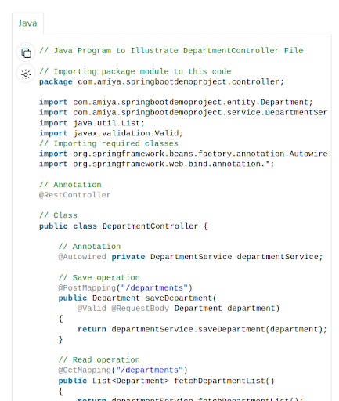
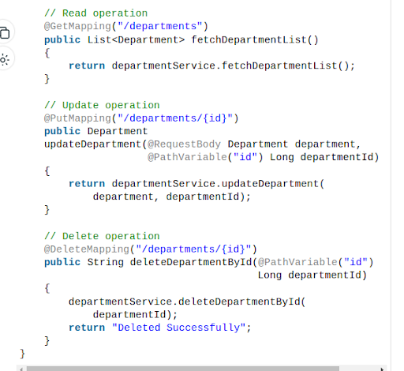


## [**Python ORM**](https://www.sqlalchemy.org/)

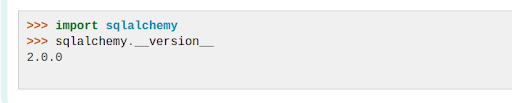
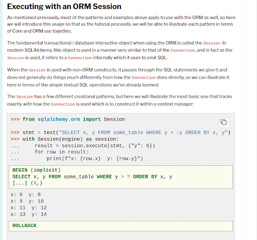
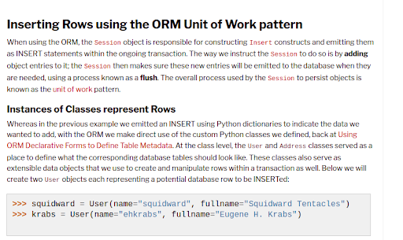
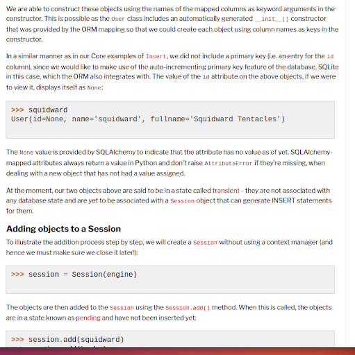
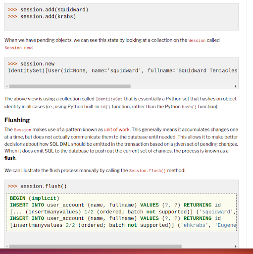

[Reference](https://docs.sqlalchemy.org/en/20/tutorial/dbapi_transactions.html#executing-with-an-orm-session)


