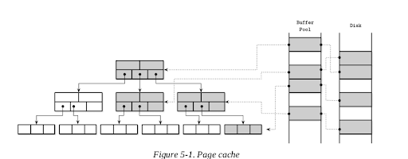

# **Database Internals -- Transaction and Recovery **

## ** Transaction Processing Recovery**

ACID  (Atomicity Consistency Isolation Durability )

The **lock manager** guards access to these resources and prevents concurrent accesses that would violate data integrity.

The **page cache** serves as an intermediary between persistent storage (disk)
and the rest of the storage engine. It stages state changes in main memory
and serves as a cache for the pages that haven’t been synchronized with
persistent storage. All changes to a database state are first applied to the
cached pages.

The **log manager** holds a history of operations (log entries) applied to
cached pages but not yet synchronized with persistent storage to guarantee
they won’t be lost in case of a crash. In other words, the log is used to reapply these operations and reconstruct the cached state during startup.
Log entries can also be used to undo changes done by the aborted
transactions.

Distributed (multi-partition) transactions require additional coordination
and remote execution. We discuss distributed transaction protocols in later chapters.

## **Buffer Management**

Buffer handles speed problem. Most databases are built using a two-level memory hierarchy: slower persistent storage (disk) and faster main memory (RAM).  

Cached pages available in memory can be reused under the assumption
that no other process has modified the data on disk. A more common name for the same concept is page cache or buffer pool. The page cache is responsible for caching pages read fromdisk in memory. In case of a database system crash or unorderly shutdown, cached contents are lost.

The problem of caching pages is not limited in scope to databases.
Operating systems have the concept of a page cache, too. Operating
systems utilize unused memory segments to transparently cache disk
contents to improve performance of I/O syscalls.

Uncached pages are said to be paged in when they’re loaded from disk. If
any changes are made to the cached page, it is said to be dirty, until these
changes are flushed back on disk.

**Caching Semantics**

All we have to do is replace disk accesses by the calls to the page cache. 

If the page contents are not yet cached, the cache translates the logical page address or page number to its physical address, loads its contents in memory, and returns its cached version to the storage
engine.

Once returned, the buffer with cached page contents is said to be
referenced, and the storage engine has to hand it back to the page cache or
dereference it once it’s done. The page cache can be instructed to avoid
evicting pages by pinning them.

If the page is modified (for example, a cell was appended to it), it is
marked as dirty. A dirty flag set on the page indicates that its contents are
out of sync with the disk and have to be flushed for durability.

**Cache Eviction**

However, the page cache has a limited capacity and, sooner or later, to
serve the new contents, old pages have to be evicted. 

**What you can evict and not to ?**

* If page contents are
in sync with the disk (i.e., were already flushed or were never modified)
and the page is not pinned or referenced, it can be evicted right away.

* Dirty pages have to be flushed before they can be evicted.

* Referenced pages should not be evicted while some other thread is using them.

**Recovery during cache eviction**

Another important property to keep in mind is durability: if the database
has crashed, all data that was not flushed is lost. To make sure that all
changes are persisted, flushes are coordinated by the checkpoint process.
The checkpoint process controls the write-ahead log (WAL) and page
cache, and ensures that they work in lockstep. Only log records associated
with operations applied to cached pages that were flushed can be discarded
from the WAL. Dirty pages cannot be evicted until this process completes.

**Locking Pages in Cache**

Having to perform disk I/O on each read or write is impractical: Splits and merges also eventually propagate to the higher-level
nodes.

We can “lock” pages that have a high probability of being used in the
nearest time. Locking pages in the cache is called pinning. Pinned pages
are kept in memory for a longer time, which helps to reduce the number of
disk accesses and improve performance [GRAEFE11].

(Think about the LRU design, but this is a modified LRU, we pinged some pages)

**Page Replacement**

When cache capacity is reached, to load new pages, old ones have to be
evicted. For this, we can say that pages should be evicted according to the eviction
policy (also sometimes called the page-replacement policy). It attempts to
find pages that are least likely to be accessed again any time soon. 

For a page cache implementation to be performant, it needs an efficient
page-replacement algorithm.

**FIFO and LRU (Same as the Operating System Algorithms)**

The most naïve page-replacement strategy is first in, first out (FIFO).

A natural extension of the FIFO algorithm is least-recently used (LRU)

**CLOCK**

In some situations, efficiency may be more important than precision.
CLOCK algorithm variants are often used as compact, cache-friendly, and
concurrent alternatives to LRU [SOUNDARARARJAN06]. Linux, for
example, uses a variant of the CLOCK algorithm.

The algorithm is easy to understand and implement and is often used in both textbooks
[TANENBAUM14] and real-wold systems.

**LFU (least frequently used)**

LRU is not always the best replacement strategy for a database system.
Sometimes, it may be more practical to consider usage frequency rather than recency as a predictive factor. 

