# **Flask Web Development with Database ORM**


Note: This is an introduction session to get you started on your mid-term project.
This is a not a complete session of Python web service development.

**This is in-class lab**

**_Outline_**

* Web service
* Http server
* Http protocols
* Controller and aka the “Endpoint”
* Flask
* Sqlite
* ORM programming

**_Takeaway_**

* You will know how to develop a small web application
* The web application will implement a few pages
* The pages & buttons will read, write, delete and update to databases
* More on sqlite database you will be working on


**Http server**: A web server is [computer software](https://en.wikipedia.org/wiki/Computer) and underlying [hardware](https://en.wikipedia.org/wiki/Computer_hardware) 
that accepts requests via [HTTP](https://en.wikipedia.org/wiki/Hypertext_Transfer_Protocol) (the [network protocol](https://en.wikipedia.org/wiki/Network_protocol) created to distribute [web content](https://en.wikipedia.org/wiki/Web_browser)) or its secure variant [HTTPS](https://en.wikipedia.org/wiki/HTTPS). A user agent, commonly 
a [web browser](https://en.wikipedia.org/wiki/Web_browser) or [web crawler](https://en.wikipedia.org/wiki/Web_crawler), initiates communication by making a request for a [web page](https://en.wikipedia.org/wiki/Web_page) or other [resource](https://en.wikipedia.org/wiki/Web_Resource) using HTTP, 
and the [server](https://en.wikipedia.org/wiki/Server_(computing)) responds with the content of that resource or an [error message.](https://en.wikipedia.org/wiki/List_of_HTTP_status_codes) A web server can also accept and store 
resources sent from the user agent if configured to do so.

**HTTP protocol**

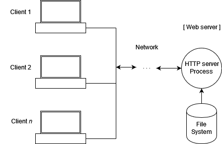

**Note: This in-class lab will highly impact on our mid-term course project.**

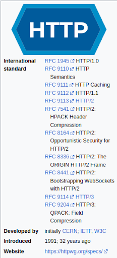

## **HTTP**
* Http requests
* Http response

### **HTTP requests**


A correctly composed HTTP request contains the following elements:
1. A request line.
2. A series of HTTP headers, or header fields.
3. A message body, if needed.

**Example:**

GET /software/htp/cics/index.html HTTP/1.1

**In this example:**

* the method is GET
* the path is /software/htp/cics/index.html
* the HTTP version is HTTP/1.1

**HTTP headers**

Accept-Language: fr, de If-Modified-Since: Fri, 10 Dec 2004 11:22:13 GMT

**Message body**

The body content of any HTTP message can be referred to as a message body or **entity body**. Technically, 
the entity body is the actual content of the message. The message body contains the entity body, which can 
be in its original state, or can be encoded in some way for transport, such as by being broken into chunks 
(chunked transfer-coding). The message body of a request may be referred to for convenience as a request body.

[**Request Methods**](https://developer.mozilla.org/en-US/docs/Web/HTTP/Methods)

GET, POST, DELETE, …

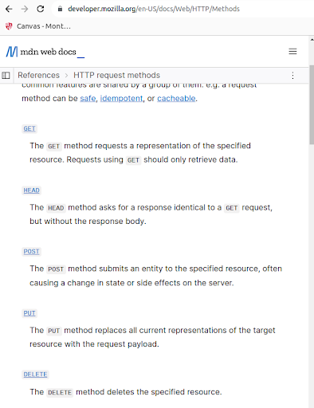

#### **Lab 1 Run a flask http server**

In this lab, you will learn what is http server, and how to run a http server in python, and what is controller and what is web service.


[**Step 1 — Installing Flask**](https://www.digitalocean.com/community/tutorials/how-to-make-a-web-application-using-flask-in-python-3#step-1-installing-flask)

`Python -m venv web`

`source web/bin/activate`

`pip install flask`

`python -c "import flask; print(flask.__version__)"`

[**Step 2 — Creating a Base Application**](https://www.digitalocean.com/community/tutorials/how-to-make-a-web-application-using-flask-in-python-3#step-2-creating-a-base-application)

`hello.py`

```python
from flask import Flask

app = Flask(__name__)


@app.route('/')
def hello():
    return 'Hello, World!'

if __name__ == '__main__':
    app.run()
```


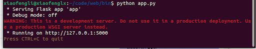
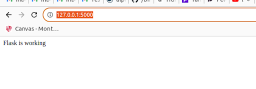


You pass the special variable `__name__`that holds the name of the current Python module. It’s used to tell the instance where it’s located—you need this because Flask sets up some paths behind the scenes.

`@app.route` is a decorator that turns a regular Python function into a Flask view function, which converts the function’s return value into an HTTP response to be displayed by an HTTP client, such as a web browser.

You pass the value '/' to `@app.route()` to signify that this function will respond to web requests for the URL /, which is the main URL.

To run your web application, you’ll first tell Flask where to find the application (the hello.py file in your case) with the FLASK_APP environment variable:

```dotenv
export FLASK_APP=hello
export FLASK_ENV=development
```
`flask run`

To change the port, you can start it by : `flask run -p 5001`

[**Step 3 — Using HTML templates**](https://www.digitalocean.com/community/tutorials/how-to-make-a-web-application-using-flask-in-python-3#step-3-using-html-templates)

Flask provides a `render_template()` helper function that allows use of the [Jinja](http://jinja.pocoo.org/) template engine. This will make managing HTML much easier by writing your HTML code in .html files as well as using logic in your HTML code. You’ll use these HTML files, (templates) to build all of your application pages, such as the main page where you’ll display the current blog posts, the page of the blog post, the page where the user can add a new post, and so on.

```python 
from flask import Flask, render_template

app = Flask(__name__)

@app.route('/')
def index():
    return render_template('index.html')

if __name__ == '__main__':
  app.run()

```
In command line, run the following,


```dotenv
export FLASK_APP=app
```
`flask run`

Then run (This is in Linux and Mac, for windows, please just right click and create it, suggested using Visual studio Code),

`mkdir templates`

`touch index.html`

and add the following into index.html,

```html
<!DOCTYPE html>
<html lang="en">
<head>
    <meta charset="UTF-8">
    <title>FlaskBlog</title>
</head>
<body>
   <h1>Welcome to FlaskBlog</h1>
</body>
</html>
```

`mkdir static`

`mkdir static/css`

`touch static/css/style.css`


**style.css**

```css
h1 {
    border: 2px #eee solid;
    color: brown;
    text-align: center;
    padding: 10px;
}
```

open templates/index.html, and add the following,


```html
...

<head>
    <meta charset="UTF-8">
    <link rel="stylesheet" href="{{ url_for('static', filename= 'css/style.css') }}">
    <title>FlaskBlog</title>
</head>

...

```

Here you use the [` url_for()`](https://flask.palletsprojects.com/en/1.1.x/api/#flask.url_for) helper function to generate the appropriate location of the file. The first argument specifies that you’re linking to a static file and the second argument is the path of the file inside the static directory.

Then open localhost:5000 or http://127.0.0.1:5000/

Then create flask_blog/templates/base.html

```html
<!doctype html>
<html lang="en">
  <head>
    <!-- Required meta tags -->
    <meta charset="utf-8">
    <meta name="viewport" content="width=device-width, initial-scale=1, shrink-to-fit=no">

    <!-- Bootstrap CSS -->
    <link rel="stylesheet" href="https://stackpath.bootstrapcdn.com/bootstrap/4.3.1/css/bootstrap.min.css" integrity="sha384-ggOyR0iXCbMQv3Xipma34MD+dH/1fQ784/j6cY/iJTQUOhcWr7x9JvoRxT2MZw1T" crossorigin="anonymous">

    <title> </title>
  </head>
  <body>
    <nav class="navbar navbar-expand-md navbar-light bg-light">
        <a class="navbar-brand" href="{{ url_for('index')}}">FlaskBlog</a>
        <button class="navbar-toggler" type="button" data-toggle="collapse" data-target="#navbarNav" aria-controls="navbarNav" aria-expanded="false" aria-label="Toggle navigation">
            <span class="navbar-toggler-icon"></span>
        </button>
        <div class="collapse navbar-collapse" id="navbarNav">
            <ul class="navbar-nav">
            <li class="nav-item active">
                <a class="nav-link" href="#">About</a>
            </li>
            </ul>
        </div>
    </nav>
    <div class="container">
         
    </div>

    <!-- Optional JavaScript -->
    <!-- jQuery first, then Popper.js, then Bootstrap JS -->
    <script src="https://code.jquery.com/jquery-3.3.1.slim.min.js" integrity="sha384-q8i/X+965DzO0rT7abK41JStQIAqVgRVzpbzo5smXKp4YfRvH+8abtTE1Pi6jizo" crossorigin="anonymous"></script>
    <script src="https://cdnjs.cloudflare.com/ajax/libs/popper.js/1.14.7/umd/popper.min.js" integrity="sha384-UO2eT0CpHqdSJQ6hJty5KVphtPhzWj9WO1clHTMGa3JDZwrnQq4sF86dIHNDz0W1" crossorigin="anonymous"></script>
    <script src="https://stackpath.bootstrapcdn.com/bootstrap/4.3.1/js/bootstrap.min.js" integrity="sha384-JjSmVgyd0p3pXB1rRibZUAYoIIy6OrQ6VrjIEaFf/nJGzIxFDsf4x0xIM+B07jRM" crossorigin="anonymous"></script>
  </body>
</html>
```

Then, replace the content in index.html with,

```html



    <h1> Welcome to FlaskBlog </h1>

```

#### **Lab 2 Dig further about route (This is called the endpoint)**


```python
@app.route('/')
@app.route('/index')
def index():
    return "Hello, World!"
```

To run,

```dotenv
export FLASK_APP=app.py
```

`flask run`

Test both endpoints.

#### **Lab 3 Flask with database (ORM)**

`pip install flask-sqlalchemy`

```python
from flask import Flask
from flask_sqlalchemy import SQLAlchemy
 
app = Flask(__name__)
app.debug = True
 
# adding configuration for using a sqlite database
app.config['SQLALCHEMY_DATABASE_URI'] = 'sqlite:///site.db'
 
# Creating an SQLAlchemy instance
db = SQLAlchemy(app)
 
if __name__ == '__main__':
    app.run()
```

**Creating Models**

```python
from flask import Flask, request, redirect
from flask.templating import render_template
from flask_sqlalchemy import SQLAlchemy
 
app = Flask(__name__)
app.debug = True
 
# adding configuration for using a sqlite database
app.config['SQLALCHEMY_DATABASE_URI'] = 'sqlite:///site.db'
 
# Creating an SQLAlchemy instance
db = SQLAlchemy(app)
 
# Models
class Profile(db.Model):
    # Id : Field which stores unique id for every row in 
    # database table.
    # first_name: Used to store the first name if the user
    # last_name: Used to store last name of the user
    # Age: Used to store the age of the user
    id = db.Column(db.Integer, primary_key=True)
    first_name = db.Column(db.String(20), unique=False, nullable=False)
    last_name = db.Column(db.String(20), unique=False, nullable=False)
    age = db.Column(db.Integer, nullable=False)
 
    # repr method represents how one object of this datatable
    # will look like
    def __repr__(self):
        return f"Name : {self.first_name}, Age: {self.age}"
 
if __name__ == '__main__':
    app.run()
```

**Creating the database**

In the command line which is navigated to the project directory and virtual environment running, we need to run the following commands.

`python`

The above command will initiate a python bash in your command line where you can use further lines of code to create your data table according to your model class in your database. 

`from app import db`

`db.create_all()`

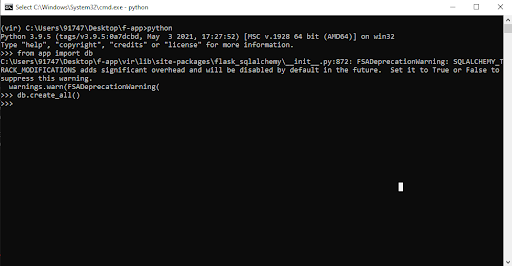


**Making Migrations in database**

Install Flask-Migrate using pip,

`pip install Flask-Migrate`

Now, in your app.py add two lines, the code being as follows,

```python
# Import for Migrations
from flask_migrate import Migrate, migrate

# Settings for migrations
migrate = Migrate(app, db)
```

Now to create migrations we run the following commands one after the other.

`flask db init`

`flask db migrate -m "Initial migration"`

`flask db upgrade`

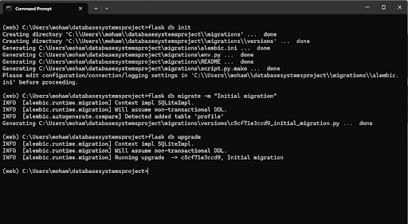

**Creating the Index Page Of the Application**

Before moving forward and building our form let’s create an index page for our website. The HTML file is always stored
inside a folder in the parent directory of the application named ‘templates’. Inside the templates folder create a file 
named index.html and paste the below code for now. We will go back to adding more code into our index file as we move on.

```html
<html>
   <head>
      <title>Index Page</title>
   </head>
   <body>
      <h3>Profiles</h3>
   </body>
</html>
```

Update app.py

````python
from flask import Flask, request, redirect
from flask.templating import render_template
from flask_sqlalchemy import SQLAlchemy
 
app = Flask(__name__)
app.debug = True
 
# adding configuration for using a sqlite database
app.config['SQLALCHEMY_DATABASE_URI'] = 'sqlite:///site.db'
 
# Creating an SQLAlchemy instance
db = SQLAlchemy(app)
 
# Models
class Profile(db.Model):
 
    id = db.Column(db.Integer, primary_key=True)
    first_name = db.Column(db.String(20), unique=False, nullable=False)
    last_name = db.Column(db.String(20), unique=False, nullable=False)
    age = db.Column(db.Integer, nullable=False)
 
    def __repr__(self):
        return f"Name : {self.first_name}, Age: {self.age}"
 
# function to render index page
@app.route('/')
def index():
    return render_template('index.html')
 
if __name__ == '__main__':
    app.run()
````

To test whether everything is working fine you can run your application using the command,

`python app.py`

The run http://127.0.0.1:5000 on your browser,

**Output**

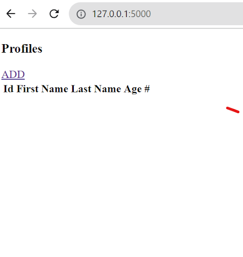


**Creating HTML page for form**

We will be creating an HTML page in which our form will be rendered. Create an HTML file named add_profile in your templates folder. The HTML code is as follows.

add_profile.html

```html
<!DOCTYPE html>
<html>
   <head>
      <title>Add Profile</title>
   </head>
   <body>
      <h3>Profile form</h3>
      <form action="/add" method="POST">
         <label>First Name</label>
         <input type="text" name="first_name" placeholder="first name...">
         <label>Last Name</label>
         <input type="text" name= "last_name" placeholder="last name...">
         <label>Age</label>
         <input type="number" name="age" placeholder="age..">
         <button type="submit">Add</button>
      </form>
   </body>
</html>
```

Add the below code at the end of your app.py before main

```python
@app.route('/add_data')
def add_data():
    return render_template('add_profile.html')
```

The run http://127.0.0.1:5000   on your browser to check if flask is working.

**OUTPUT**

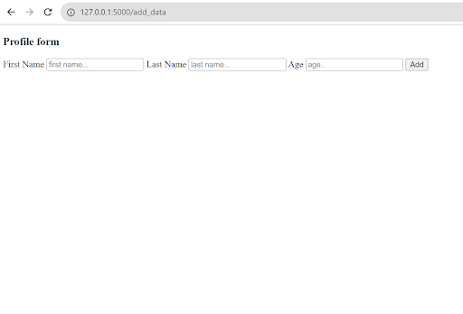

**Function to add data using the form to the database**

To add data to the database we will be using the “POST” method. POST is used to send data to a server to create/update a resource. In flask where we specify our route that is app.route we can also specify the HTTP methods there. Then inside the function, we create variables to store data and use request objects to procure data from the form.

Add this to your app.py

```python
# function to add profiles
@app.route('/add', methods=["POST"])
def profile():
    
    # In this function we will input data from the 
    # form page and store it in our database.
    # Remember that inside the get the name should
    # exactly be the same as that in the html
    # input fields
    first_name = request.form.get("first_name")
    last_name = request.form.get("last_name")
    age = request.form.get("age")

    # create an object of the Profile class of models
    # and store data as a row in our datatable
    if first_name != '' and last_name != '' and age is not None:
        p = Profile(first_name=first_name, last_name=last_name, age=age)
        db.session.add(p)
        db.session.commit()
        return redirect('/')
    else:
        return redirect('/')
```

**Display data on Index Page**

On our index page now, we will be displaying all the data that has been stored in our data table. We will be using
`Profile.query.all()` to query all the objects of the Profile class and then use **Jinja templating language** to 
display it dynamically on our index HTML file.

Update your index file as follows.

```html
<!DOCTYPE html>
<html>
<head>
	<title>Index Page</title>
</head>
<body>
	<h3>Profiles</h3>
	<a href="/add_data">ADD</a>
	<br>
	<table>
		<thead>
			<th>Id</th>
			<th>First Name</th>
			<th>Last Name</th>
			<th>Age</th>
			<th>#</th>
		</thead>
		
		<tbody>
			<td>{{data.id}}</td>
			<td>{{data.first_name}}</td>
			<td>{{data.last_name}}</td>
			<td>{{data.age}}</td>
			<td><a href="/delete/{{data.id}}" type="button">Delete</a></td>
		</tbody>
		
	</table>
</body>
</html>
```

**Deleting data from our database**

To delete data we have already used an anchor tag in our table and now we will just be associating a function with it.

```python
@app.route('/delete/<int:id>')
def erase(id):
    # Deletes the data on the basis of unique id and 
    # redirects to home page
    data = Profile.query.get(id)
    db.session.delete(data)
    db.session.commit()
    return redirect('/')
```

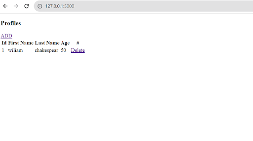


**References:**

https://www.geeksforgeeks.org/connect-flask-to-a-database-with-flask-sqlalchemy/?ref=lbp

https://www.digitalocean.com/community/tutorials/how-to-make-a-web-application-using-flask-in-python-3#step-1-installing-flask

https://blog.miguelgrinberg.com/post/the-flask-mega-tutorial-part-i-hello-world

https://realpython.com/tutorials/flask/

https://www.tutorialspoint.com/flask/index.htm

https://www.geeksforgeeks.org/flask-tutorial/

https://flask.palletsprojects.com/en/3.0.x/tutorial/

**Appendix**

_**Add_profile.html**_


**_Index.html_**


**_App.py_**

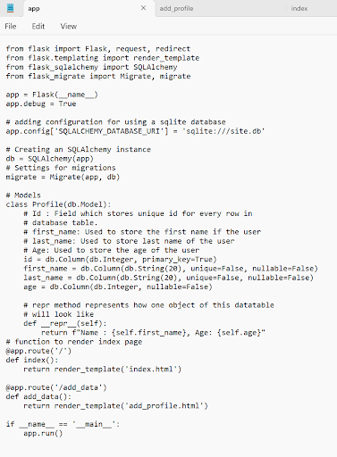


