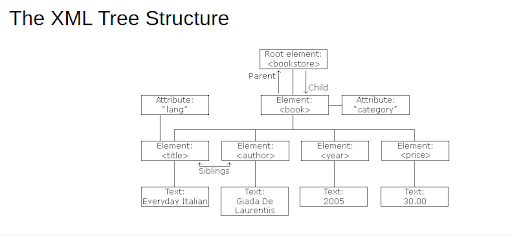
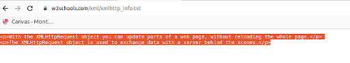
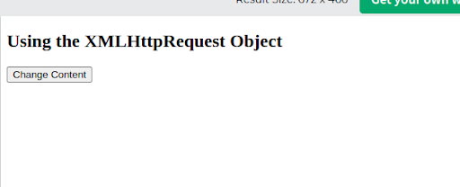
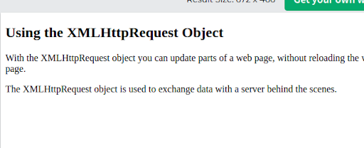
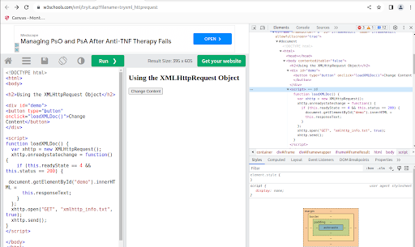
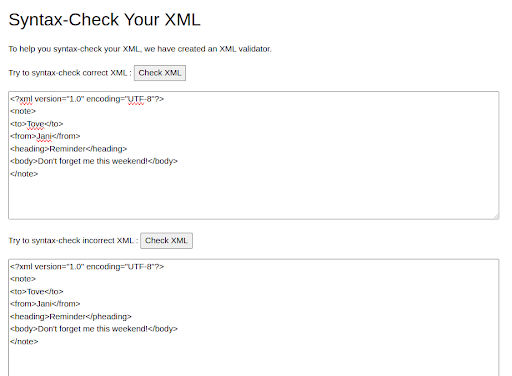
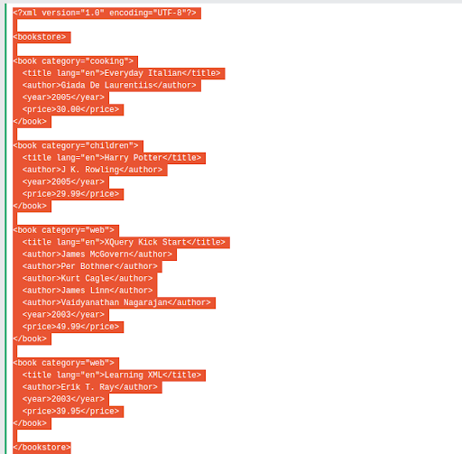
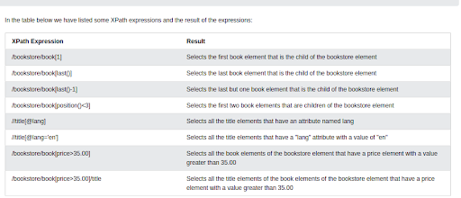
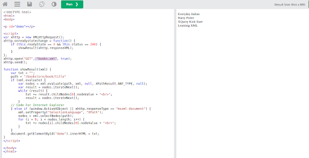
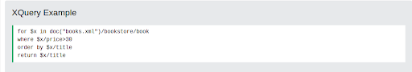

# **XML, Xquery, XSLT And Programming (40 mins)**

## **Created by Xiaofeng Li**
## **Created at: 09/24/2023**
## **References: W3c, tutorialpoints.com**

* XML stands for extensible Markup Language much like HTML.
* XML was designed to store and transport data.
* XML was designed to be both human- and machine-readable
* XML was designed to be self-descriptive
* XML does not DO anything.
* XML is extensible. XML tags are not predefined like HTML tags are, if you do, you need a schema, and thus has schema check for you
* XML is often used to separate data from presentation.
* XML is Often a Complement to HTML


                                Outline

[XML AJAX](https://www.w3schools.com/xml/ajax_intro.asp)

[XML DOM](https://www.w3schools.com/xml/dom_intro.asp)

[XML Xpath](https://www.w3schools.com/xml/xpath_intro.asp)

[XML XSLT](https://www.w3schools.com/xml/xsl_intro.asp)

[XML Xquery](https://www.w3schools.com/xml/xquery_intro.asp)

[XML DTD](https://www.w3schools.com/xml/xml_dtd_intro.asp)

[XML Schema](https://www.w3schools.com/xml/schema_intro.asp)

[XML Service](https://www.w3schools.com/xml/xml_services.asp)

# XML usage

### Example: XML News

```xml
<?xml version="1.0" encoding="UTF-8"?>
<nitf>
  <head>
    <title>Colombia Earthquake</title>
  </head>
  <body>
    <headline>
      <hl1>143 Dead in Colombia Earthquake</hl1>
    </headline>
    <byline>
      <bytag>By Jared Kotler, Associated Press Writer</bytag>
    </byline>
    <dateline>
      <location>Bogota, Colombia</location>
      <date>Monday January 25 1999 7:28 ET</date>
    </dateline>
  </body>
</nitf>
```

### Example: XML Weather Service

```xml
<?xml version="1.0" encoding="UTF-8"?>
<current_observation>

<credit>NOAA's National Weather Service</credit>
<credit_URL>http://weather.gov/</credit_URL>

<image>
  <url>http://weather.gov/images/xml_logo.gif</url>
  <title>NOAA's National Weather Service</title>
  <link>http://weather.gov</link>
</image>

<location>New York/John F. Kennedy Intl Airport, NY</location>
<station_id>KJFK</station_id>
<latitude>40.66</latitude>
<longitude>-73.78</longitude>
<observation_time_rfc822>Mon, 11 Feb 2008 06:51:00 -0500 EST
</observation_time_rfc822>

<weather>A Few Clouds</weather>
<temp_f>11</temp_f>
<temp_c>-12</temp_c>
<relative_humidity>36</relative_humidity>
<wind_dir>West</wind_dir>
<wind_degrees>280</wind_degrees>
<wind_mph>18.4</wind_mph>
<wind_gust_mph>29</wind_gust_mph>
<pressure_mb>1023.6</pressure_mb>
<pressure_in>30.23</pressure_in>
<dewpoint_f>-11</dewpoint_f>
<dewpoint_c>-24</dewpoint_c>
<windchill_f>-7</windchill_f>
<windchill_c>-22</windchill_c>
<visibility_mi>10.00</visibility_mi>

<icon_url_base>http://weather.gov/weather/images/fcicons/</icon_url_base>
<icon_url_name>nfew.jpg</icon_url_name>
<disclaimer_url>http://weather.gov/disclaimer.html</disclaimer_url>
<copyright_url>http://weather.gov/disclaimer.html</copyright_url>

</current_observation>
```

### Example: Book store

```xml
<?xml version="1.0" encoding="UTF-8"?>
<bookstore>
  <book category="cooking">
    <title lang="en">Everyday Italian</title>
    <author>Giada De Laurentiis</author>
    <year>2005</year>
    <price>30.00</price>
  </book>
  <book category="children">
    <title lang="en">Harry Potter</title>
    <author>J K. Rowling</author>
    <year>2005</year>
    <price>29.99</price>
  </book>
  <book category="web">
    <title lang="en">Learning XML</title>
    <author>Erik T. Ray</author>
    <year>2003</year>
    <price>39.95</price>
  </book>
</bookstore>

```



## XML Element, Attributes, Namespaces

```xml
<bookstore>
  <book category="children">
  <title>Harry Potter</title>
   <author>J K. Rowling</author>
   <year>2005</year>
   <price>29.99</price>
   </book>
   <book category="web">
   <title>Learning XML</title>
  <author>Erik T. Ray</author>
    <year>2003</year>
    <price>39.95</price>
 </book>
</bookstore>

```

### **Namespace conflicts issues**

_This XML carries HTML table information:_

```xml
<table>
  <tr>
    <td>Apples</td>
    <td>Bananas</td>
  </tr>
</table>

```

_This XML carries information about a table (a piece of furniture):_

```xml
<table>
  <name>African Coffee Table</name>
  <width>80</width>
  <length>120</length>
</table>

```

### **Solving the Name Conflict Using a Prefix**

```xml
<h:table>
  <h:tr>
    <h:td>Apples</h:td>
    <h:td>Bananas</h:td>
  </h:tr>
</h:table>

<f:table>
  <f:name>African Coffee Table</f:name>
  <f:width>80</f:width>
  <f:length>120</f:length>
</f:table>

```

* When a namespace is defined for an element, all child elements with the same prefix are associated with the same namespace.
* Namespaces can also be declared in the XML root element:

But you can’t use the prefix without definition.

```xml
<root>

<h:table xmlns:h="http://www.w3.org/TR/html4/">
  <h:tr>
    <h:td>Apples</h:td>
    <h:td>Bananas</h:td>
  </h:tr>
</h:table>

<f:table xmlns:f="https://www.w3schools.com/furniture">
  <f:name>African Coffee Table</f:name>
  <f:width>80</f:width>
  <f:length>120</f:length>
</f:table>

</root>

```

Or you can do this,

```xml
<root xmlns:h="http://www.w3.org/TR/html4/"
xmlns:f="https://www.w3schools.com/furniture">

<h:table>
  <h:tr>
    <h:td>Apples</h:td>
    <h:td>Bananas</h:td>
  </h:tr>
</h:table>

<f:table>
  <f:name>African Coffee Table</f:name>
  <f:width>80</f:width>
  <f:length>120</f:length>
</f:table>

</root>

```

### **Uniform Resource Identifier (URI)**

A Uniform Resource Identifier (URI) is a string of characters which identifies an Internet Resource.
The most common URI is the Uniform Resource Locator (URL) which identifies an Internet domain address. Another, not so common type of URI is the Uniform Resource Name (URN).

```xml
<table xmlns="http://www.w3.org/TR/html4/">
  <tr>
    <td>Apples</td>
    <td>Bananas</td>
  </tr>
</table>
```

### **Namespaces in Real Use**

XSLT is a language that can be used to transform XML documents into other formats.
The XML document below, is a document used to transform XML into HTML.
The namespace "http://www.w3.org/1999/XSL/Transform" identifies XSLT elements inside an HTML document:

```xml
<?xml version="1.0" encoding="UTF-8"?>

<xsl:stylesheet version="1.0" xmlns:xsl="http://www.w3.org/1999/XSL/Transform">

<xsl:template match="/">
<html>
<body>
  <h2>My CD Collection</h2>
  <table border="1">
    <tr>
      <th style="text-align:left">Title</th>
      <th style="text-align:left">Artist</th>
    </tr>
    <xsl:for-each select="catalog/cd">
    <tr>
      <td><xsl:value-of select="title"/></td>
      <td><xsl:value-of select="artist"/></td>
    </tr>
    </xsl:for-each>
  </table>
</body>
</html>
</xsl:template>

</xsl:stylesheet>

```

## **Javascript with XML with HttpRequest**



```html
<!DOCTYPE html>
<html>
<body>

<h2>Using the XMLHttpRequest Object</h2>

<div id="demo">
<button type="button" onclick="loadXMLDoc()">Change Content</button>
</div>

<script>
function loadXMLDoc() {
  var xhttp = new XMLHttpRequest();
  xhttp.onreadystatechange = function() {
    if (this.readyState == 4 && this.status == 200) {
      document.getElementById("demo").innerHTML =
      this.responseText;
    }
  };
  xhttp.open("GET", "xmlhttp_info.txt", true);
  xhttp.send();
}
</script>

</body>
</html>

```



Click “Change Content”



Check the whole process of HTML to show the display area,




                                XML Parser

All modern browsers have a built-in XML parser that can 
convert text into an XML DOM object. Actually this is a 
support of Javascript. Javascript history, standard and 
versions are skipped here. You will see that in your 
assignment #4 for a little research essay.

## **Parsing a Text String**

This example parses a text string into an XML DOM object, 
and extracts the info from it with JavaScript:

```html
<html>
<body>

<p id="demo"></p>

<script>
var text, parser, xmlDoc;

text = "<bookstore><book>" +
"<title>Everyday Italian</title>" +
"<author>Giada De Laurentiis</author>" +
"<year>2005</year>" +
"</book></bookstore>";

parser = new DOMParser();
xmlDoc = parser.parseFromString(text,"text/xml");

document.getElementById("demo").innerHTML =
xmlDoc.getElementsByTagName("title")[0].childNodes[0].nodeValue;
</script>

</body>

```

**The XML DOM**

```xml
<?xml version="1.0" encoding="UTF-8"?>
<bookstore>

  <book category="cooking">
    <title lang="en">Everyday Italian</title>
    <author>Giada De Laurentiis</author>
    <year>2005</year>
    <price>30.00</price>
  </book>

  <book category="children">
    <title lang="en">Harry Potter</title>
    <author>J K. Rowling</author>
    <year>2005</year>
    <price>29.99</price>
  </book>

</bookstore>

```

### **Now for modularity, we do it in reality DOM + XLST!** 

# **XML DTD**

DTD stands for Document Type Definition.

A DTD defines the structure and the legal elements and attributes of an XML document.

## **Valid XML Documents**

```xml
<?xml version="1.0" encoding="UTF-8"?>
<!DOCTYPE note SYSTEM "Note.dtd">
<note>
<to>Tove</to>
<from>Jani</from>
<heading>Reminder</heading>
<body>Don't forget me this weekend!</body>
</note>
```

Note.dtd

```xml
<!DOCTYPE note
[
<!ELEMENT note (to,from,heading,body)>
<!ELEMENT to (#PCDATA)>
<!ELEMENT from (#PCDATA)>
<!ELEMENT heading (#PCDATA)>
<!ELEMENT body (#PCDATA)>
<!ENTITY nbsp "&#xA0;">
<!ENTITY writer "Writer: Donald Duck.">
<!ENTITY copyright "Copyright: W3Schools.">
]>
```

_The DTD above is interpreted like this:_

* !DOCTYPE note -  Defines that the root element of the document is note

* !ELEMENT note - Defines that the note element must contain the elements: "to, from, heading, body"

* !ELEMENT to - Defines the to element to be of type "#PCDATA"

* !ELEMENT from - Defines the from element to be of type "#PCDATA"

* !ELEMENT heading  - Defines the heading element to be of type "#PCDATA"

* !ELEMENT body - Defines the body element to be of type "#PCDATA"

A DOCTYPE declaration can also be used to define special characters or strings, used in the document:
An entity has three parts: it starts with an ampersand (&), then comes the entity name, and it ends with a semicolon (;).


## **When to Use a DTD?**

With a DTD, independent groups of people can agree to use a standard DTD for interchanging data.
With a DTD, you can verify that the data you receive from the outside world is valid.
You can also use a DTD to verify your own data.

## **When NOT to Use a DTD?**

XML does not require a DTD.
When you are experimenting with XML, or when you are working with small XML files, creating DTDs may be a waste of time.
If you develop applications, wait until the specification is stable before you add a DTD. Otherwise, your software might stop working because of validation errors.

# **XML Validation**

The syntax rules were described in the previous chapters:

* XML documents must have a root element
* XML elements must have a closing tag
* XML tags are case sensitive
* XML elements must be properly nested
* XML attribute values must be quoted


## **Online XML validation tools**



**Security concern**

If you are dealing with business data, please 
do not just paste them in some random website to validate your xml. 
The data has to be masked/shuffled or randomized before you use them.

# **XML Schema (XSD)**

An XML Schema describes the structure of an XML document, just like a DTD. The XML Schema language is also referred to as XML Schema Definition (XSD).

An XML document with correct syntax is called "Well Formed".

An XML document validated against an XML Schema is both "Well Formed" and "Valid".

```xml
<xs:element name="note">

<xs:complexType>
  <xs:sequence>
    <xs:element name="to" type="xs:string"/>
    <xs:element name="from" type="xs:string"/>
    <xs:element name="heading" type="xs:string"/>
    <xs:element name="body" type="xs:string"/>
  </xs:sequence>
</xs:complexType>

</xs:element>

```

### **XML Schemas are More Powerful than DTD**

XML Schemas are written in XML

XML Schemas are extensible to additions

XML Schemas support data types

XML Schemas support namespaces


```xml
<?xml version="1.0"?>

<note
xmlns="https://www.w3schools.com"
xmlns:xsi="http://www.w3.org/2001/XMLSchema-instance"
xsi:schemaLocation="https://www.w3schools.com/xml_note.xsd">
  <to>Tove</to>
  <from>Jani</from>
  <heading>Reminder</heading>
  <body>Don't forget me this weekend!</body>
</note>

```

```xml
<?xml version="1.0"?>
<xs:schema xmlns:xs="http://www.w3.org/2001/XMLSchema"
targetNamespace="https://www.w3schools.com"
xmlns="https://www.w3schools.com"
elementFormDefault="qualified">

<xs:element name="note">
  <xs:complexType>
    <xs:sequence>
      <xs:element name="to" type="xs:string"/>
      <xs:element name="from" type="xs:string"/>
      <xs:element name="heading" type="xs:string"/>
      <xs:element name="body" type="xs:string"/>
    </xs:sequence>
  </xs:complexType>
</xs:element>

</xs:schema>

```

# **XML Xpath**

XPath is a major element in the XSLT standard.

XPath can be used to navigate through elements and attributes in an XML document.

XPath is a syntax for defining parts of an XML document

    XPath uses path expressions to navigate in XML documents
    XPath contains a library of standard functions
    XPath is a major element in XSLT and in XQuery
    XPath is a W3C recommendation





Say the above xml is called books.xml,



# **XML and XQuery**

XQuery is to XML what SQL is to databases.

XQuery was designed to query XML data.

books.xqy


**XQueryTester.java**

```java
package com.tutorialspoint.xquery;

import java.io.File;
import java.io.FileInputStream;
import java.io.FileNotFoundException;
import java.io.InputStream;


import javax.xml.xquery.XQConnection;
import javax.xml.xquery.XQDataSource;
import javax.xml.xquery.XQException;
import javax.xml.xquery.XQPreparedExpression;
import javax.xml.xquery.XQResultSequence;


import com.saxonica.xqj.SaxonXQDataSource;


public class XQueryTester {
   public static void main(String[] args){
      try {
         execute();
      }
      
      catch (FileNotFoundException e) {
         e.printStackTrace();
      }
      
      catch (XQException e) {
         e.printStackTrace();
      }
   }


   private static void execute() throws FileNotFoundException, XQException{
      InputStream inputStream = new FileInputStream(new File("books.xqy"));
      XQDataSource ds = new SaxonXQDataSource();
      XQConnection conn = ds.getConnection();
      XQPreparedExpression exp = conn.prepareExpression(inputStream);
      XQResultSequence result = exp.executeQuery();
      
      while (result.next()) {
         System.out.println(result.getItemAsString(null));
      }
   }    
}

```

# **References:**

[**W3Schools**](https://www.w3schools.com/xml/schema_howto.asp)


