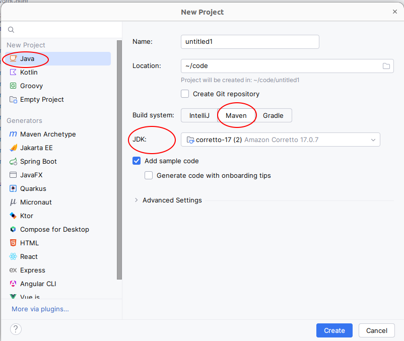
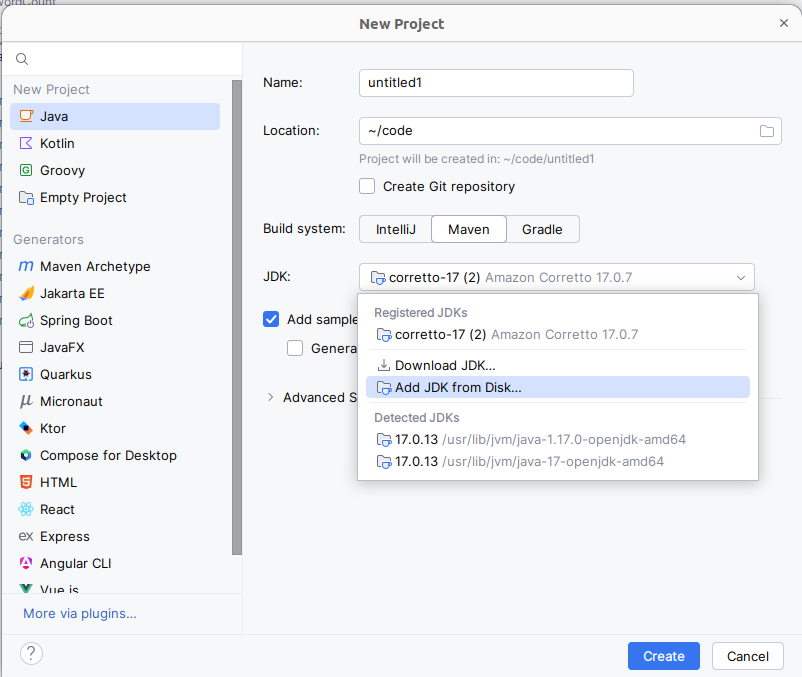
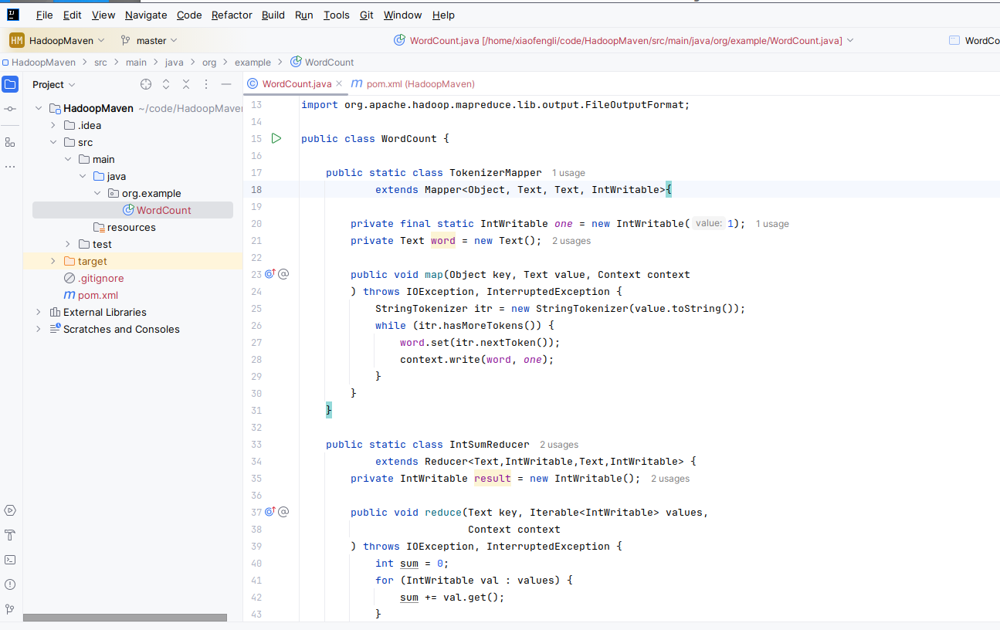
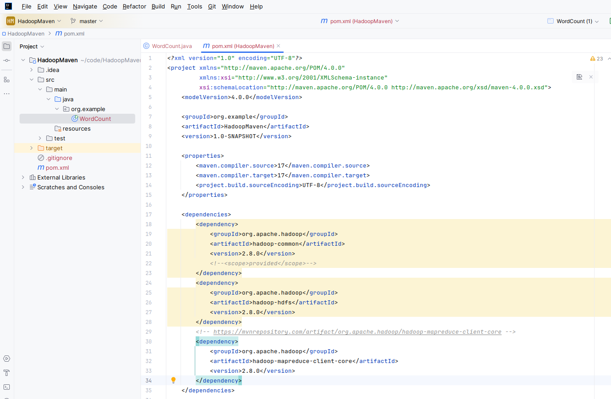
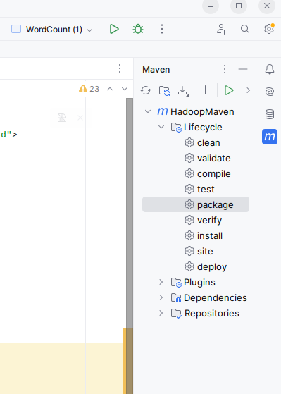

# Hadoop Lab - Hadoop 2.8.2 Image

## Download and run your docker image

`docker run -ti -p 8042 -p 8088 -p 19888 -p 50070 -p 50075 harisekhon/hadoop`

This docker image will run like the following,

>Hint: It is going to set up sshd, ssh and password less config.

```shell
xiaofengli@xiaofenglx:~$ docker run -ti -p 8042 -p 8088 -p 19888 -p 50070 -p 50075 harisekhon/hadoop
Generating public/private rsa key pair.
Created directory '/root/.ssh'.
Your identification has been saved in /root/.ssh/id_rsa.
Your public key has been saved in /root/.ssh/id_rsa.pub.
The key fingerprint is:
SHA256:Qp4/sRuiRuDfss8rzaVbvp4PjhbnXJ+J/cthr66MrRk root@150bd5dc3090
The key's randomart image is:
+---[RSA 1024]----+
|                 |
|                 |
|      .          |
|  .  o .         |
| . .  + S        |
|  . . .ooo.      |
|   o +.BB.E+ oo  |
|    =o**o*.*=o o |
|   .o**+Bo=.++*o.|
+----[SHA256]-----+
'/root/.ssh/id_rsa.pub' -> '/root/.ssh/authorized_keys'
mode of '/root/.ssh/authorized_keys' changed from 0644 (rw-r--r--) to 0400 (r--------)
/usr/sbin/sshd-keygen: line 10: /etc/rc.d/init.d/functions: No such file or directory
Generating SSH2 RSA host key: /usr/sbin/sshd-keygen: line 63: success: command not found

Generating SSH2 ECDSA host key: /usr/sbin/sshd-keygen: line 105: success: command not found

Generating SSH2 ED25519 host key: /usr/sbin/sshd-keygen: line 126: success: command not found

SSH is ready to rock
....
```

## Step 2 Get container id

```shell
xiaofengli@xiaofenglx:~/k8s$ docker container ls
CONTAINER ID IMAGE COMMAND CREATED STATUS PORTS NAMES
ce2725cff088 harisekhon/hadoop "/bin/sh -c \"/entryp…" 3 minutes ago Up 3 minutes 8020/tcp, 9000/tcp, 10020/tcp, 50010/tcp, 50020/tcp, 50090/tcp, 0.0.0.0:32772->8042/tcp, :::32772->8042/tcp, 0.0.0.0:32771->8088/tcp, :::32771->8088/tcp, 0.0.0.0:32770->19888/tcp, :::32770->19888/tcp, 0.0.0.0:32769->50070/tcp, :::32769->50070/tcp, 0.0.0.0:32768->50075/tcp, :::32768->50075/tcp cranky_pascal
```

## Step 3 Get into the hadoop container by grabbing the container id from step 2

```shell
xiaofengli@xiaofenglx:~/k8s$ docker exec -it ce2725cff088 /bin/bash
[root@ce2725cff088 /]# ps axuw|grep java
root         174  1.7  0.9 2797308 309716 ?      Sl   23:23   0:04 /usr/bin/java -Dproc_namenode -Xmx1000m -Djava.net.preferIPv4Stack=true -Dhadoop.log.dir=/hadoop-2.8.2/logs -Dhadoop.log.file=hadoop.log -Dhadoop.home.dir=/hadoop-2.8.2 -Dhadoop.id.str=root -Dhadoop.root.logger=INFO,console -Djava.library.path=/hadoop-2.8.2/lib/native -Dhadoop.policy.file=hadoop-policy.xml -Djava.net.preferIPv4Stack=true -Djava.net.preferIPv4Stack=true -Djava.net.preferIPv4Stack=true -Dhadoop.log.dir=/hadoop-2.8.2/logs -Dhadoop.log.file=hadoop-root-namenode-ce2725cff088.log -Dhadoop.home.dir=/hadoop-2.8.2 -Dhadoop.id.str=root -Dhadoop.root.logger=INFO,RFA -Djava.library.path=/hadoop-2.8.2/lib/native -Dhadoop.policy.file=hadoop-policy.xml -Djava.net.preferIPv4Stack=true -Dhadoop.security.logger=INFO,RFAS -Dhdfs.audit.logger=INFO,NullAppender -Dhadoop.security.logger=INFO,RFAS -Dhdfs.audit.logger=INFO,NullAppender -Dhadoop.security.logger=INFO,RFAS -Dhdfs.audit.logger=INFO,NullAppender -Dhadoop.security.logger=INFO,RFAS org.apache.hadoop.hdfs.server.namenode.NameNode
root         301  1.5  0.7 2792660 234340 ?      Sl   23:23   0:04 /usr/bin/java -Dproc_datanode -Xmx1000m -Djava.net.preferIPv4Stack=true -Dhadoop.log.dir=/hadoop-2.8.2/logs -Dhadoop.log.file=hadoop.log -Dhadoop.home.dir=/hadoop-2.8.2 -Dhadoop.id.str=root -Dhadoop.root.logger=INFO,console -Djava.library.path=/hadoop-2.8.2/lib/native -Dhadoop.policy.file=hadoop-policy.xml -Djava.net.preferIPv4Stack=true -Djava.net.preferIPv4Stack=true -Djava.net.preferIPv4Stack=true -Dhadoop.log.dir=/hadoop-2.8.2/logs -Dhadoop.log.file=hadoop-root-datanode-ce2725cff088.log -Dhadoop.home.dir=/hadoop-2.8.2 -Dhadoop.id.str=root -Dhadoop.root.logger=INFO,RFA -Djava.library.path=/hadoop-2.8.2/lib/native -Dhadoop.policy.file=hadoop-policy.xml -Djava.net.preferIPv4Stack=true -server -Dhadoop.security.logger=ERROR,RFAS -Dhadoop.security.logger=ERROR,RFAS -Dhadoop.security.logger=ERROR,RFAS -Dhadoop.security.logger=INFO,RFAS org.apache.hadoop.hdfs.server.datanode.DataNode
root         464  1.2  0.8 2768824 270548 ?      Sl   23:23   0:03 /usr/bin/java -Dproc_secondarynamenode -Xmx1000m -Djava.net.preferIPv4Stack=true -Dhadoop.log.dir=/hadoop-2.8.2/logs -Dhadoop.log.file=hadoop.log -Dhadoop.home.dir=/hadoop-2.8.2 -Dhadoop.id.str=root -Dhadoop.root.logger=INFO,console -Djava.library.path=/hadoop-2.8.2/lib/native -Dhadoop.policy.file=hadoop-policy.xml -Djava.net.preferIPv4Stack=true -Djava.net.preferIPv4Stack=true -Djava.net.preferIPv4Stack=true -Dhadoop.log.dir=/hadoop-2.8.2/logs -Dhadoop.log.file=hadoop-root-secondarynamenode-ce2725cff088.log -Dhadoop.home.dir=/hadoop-2.8.2 -Dhadoop.id.str=root -Dhadoop.root.logger=INFO,RFA -Djava.library.path=/hadoop-2.8.2/lib/native -Dhadoop.policy.file=hadoop-policy.xml -Djava.net.preferIPv4Stack=true -Dhadoop.security.logger=INFO,RFAS -Dhdfs.audit.logger=INFO,NullAppender -Dhadoop.security.logger=INFO,RFAS -Dhdfs.audit.logger=INFO,NullAppender -Dhadoop.security.logger=INFO,RFAS -Dhdfs.audit.logger=INFO,NullAppender -Dhadoop.security.logger=INFO,RFAS org.apache.hadoop.hdfs.server.namenode.SecondaryNameNode
root         626  3.2  1.2 2975656 396584 pts/0  Sl+  23:24   0:08 /usr/bin/java -Dproc_resourcemanager -Xmx1000m -Dhadoop.log.dir=/hadoop-2.8.2/logs -Dyarn.log.dir=/hadoop-2.8.2/logs -Dhadoop.log.file=yarn--resourcemanager-ce2725cff088.log -Dyarn.log.file=yarn--resourcemanager-ce2725cff088.log -Dyarn.home.dir= -Dyarn.id.str= -Dhadoop.root.logger=INFO,RFA -Dyarn.root.logger=INFO,RFA -Djava.library.path=/hadoop-2.8.2/lib/native -Dyarn.policy.file=hadoop-policy.xml -Dhadoop.log.dir=/hadoop-2.8.2/logs -Dyarn.log.dir=/hadoop-2.8.2/logs -Dhadoop.log.file=yarn--resourcemanager-ce2725cff088.log -Dyarn.log.file=yarn--resourcemanager-ce2725cff088.log -Dyarn.home.dir=/hadoop-2.8.2 -Dhadoop.home.dir=/hadoop-2.8.2 -Dhadoop.root.logger=INFO,RFA -Dyarn.root.logger=INFO,RFA -Djava.library.path=/hadoop-2.8.2/lib/native -classpath /hadoop-2.8.2/etc/hadoop:/hadoop-2.8.2/etc/hadoop:/hadoop-2.8.2/etc/hadoop:/hadoop-2.8.2/share/hadoop/common/lib/*:/hadoop-2.8.2/share/hadoop/common/*:/hadoop-2.8.2/share/hadoop/hdfs:/hadoop-2.8.2/share/hadoop/hdfs/lib/*:/hadoop-2.8.2/share/hadoop/hdfs/*:/hadoop-2.8.2/share/hadoop/yarn/lib/*:/hadoop-2.8.2/share/hadoop/yarn/*:/hadoop-2.8.2/share/hadoop/mapreduce/lib/*:/hadoop-2.8.2/share/hadoop/mapreduce/*:/contrib/capacity-scheduler/*.jar:/contrib/capacity-scheduler/*.jar:/contrib/capacity-scheduler/*.jar:/hadoop-2.8.2/share/hadoop/yarn/*:/hadoop-2.8.2/share/hadoop/yarn/lib/*:/hadoop-2.8.2/etc/hadoop/rm-config/log4j.properties org.apache.hadoop.yarn.server.resourcemanager.ResourceManager
root         738  2.7  0.9 2826508 301876 ?      Sl   23:24   0:07 /usr/bin/java -Dproc_nodemanager -Xmx1000m -Dhadoop.log.dir=/hadoop-2.8.2/logs -Dyarn.log.dir=/hadoop-2.8.2/logs -Dhadoop.log.file=yarn-root-nodemanager-ce2725cff088.log -Dyarn.log.file=yarn-root-nodemanager-ce2725cff088.log -Dyarn.home.dir= -Dyarn.id.str=root -Dhadoop.root.logger=INFO,RFA -Dyarn.root.logger=INFO,RFA -Djava.library.path=/hadoop-2.8.2/lib/native -Dyarn.policy.file=hadoop-policy.xml -server -Dhadoop.log.dir=/hadoop-2.8.2/logs -Dyarn.log.dir=/hadoop-2.8.2/logs -Dhadoop.log.file=yarn-root-nodemanager-ce2725cff088.log -Dyarn.log.file=yarn-root-nodemanager-ce2725cff088.log -Dyarn.home.dir=/hadoop-2.8.2 -Dhadoop.home.dir=/hadoop-2.8.2 -Dhadoop.root.logger=INFO,RFA -Dyarn.root.logger=INFO,RFA -Djava.library.path=/hadoop-2.8.2/lib/native -classpath /hadoop-2.8.2/etc/hadoop:/hadoop-2.8.2/etc/hadoop:/hadoop-2.8.2/etc/hadoop:/hadoop-2.8.2/share/hadoop/common/lib/*:/hadoop-2.8.2/share/hadoop/common/*:/hadoop-2.8.2/share/hadoop/hdfs:/hadoop-2.8.2/share/hadoop/hdfs/lib/*:/hadoop-2.8.2/share/hadoop/hdfs/*:/hadoop-2.8.2/share/hadoop/yarn/lib/*:/hadoop-2.8.2/share/hadoop/yarn/*:/hadoop-2.8.2/share/hadoop/mapreduce/lib/*:/hadoop-2.8.2/share/hadoop/mapreduce/*:/hadoop/contrib/capacity-scheduler/*.jar:/hadoop/contrib/capacity-scheduler/*.jar:/hadoop-2.8.2/share/hadoop/yarn/*:/hadoop-2.8.2/share/hadoop/yarn/lib/*:/hadoop-2.8.2/etc/hadoop/nm-config/log4j.properties org.apache.hadoop.yarn.server.nodemanager.NodeManager
root        1067  0.0  0.0   9064  1792 pts/1    S+   23:28   0:00 grep --color=auto java
```

>hint: how these processes being started?
> Use a `ls` command to see the following, and the `entrypoint.sh` is the file being executed which started everything for you.
> 
> ```shell
[root@150bd5dc3090 /]# ls
anaconda-post.log  dev            etc     hadoop-2.8.2  lib    lost+found  mnt  proc  run   srv  tmp  var
bin                entrypoint.sh  hadoop  home          lib64  media       opt  root  sbin  sys  usr
```
> Up to here you should check back on our [hadoop 2.7.2](https://kevinli-webbertech.github.io/blog/html/courses/big_data/hadoop/hadoop_lab.html)
for more commands. And compare what is different.

> Please inspect `entrypoint.sh` to see the difference.

```

## Explore more system variables

Type `set` in linux command,

```shell
[root@150bd5dc3090 /]# set |grep "HADOOP"
HADOOP_HOME=/hadoop
```

We can find out that /hadoop is a soft link, which is a shortcut to another dir,

```shell
[root@150bd5dc3090 /]# set |grep "HADOOP"
HADOOP_HOME=/hadoop
[root@150bd5dc3090 /]# ls -al
total 92
drwxr-xr-x   1 root root     4096 Oct 14 03:21 .
drwxr-xr-x   1 root root     4096 Oct 14 03:21 ..
-rwxr-xr-x   1 root root        0 Oct 14 03:07 .dockerenv
-rw-r--r--   1 root root    15836 Sep 11  2017 anaconda-post.log
lrwxrwxrwx   1 root root        7 Sep 11  2017 bin -> usr/bin
drwxr-xr-x   5 root root      360 Oct 14 03:07 dev
-rwxrwxr-x   1 root root     1900 Nov  8  2017 entrypoint.sh
drwxr-xr-x   1 root root     4096 Oct 14 03:07 etc
lrwxrwxrwx   1 root root       12 Nov  8  2017 hadoop -> hadoop-2.8.2
drwxr-xr-x   1  502 dialout  4096 Oct 14 03:07 hadoop-2.8.2
drwxr-xr-x   2 root root     4096 Nov  5  2016 home
lrwxrwxrwx   1 root root        7 Sep 11  2017 lib -> usr/lib
lrwxrwxrwx   1 root root        9 Sep 11  2017 lib64 -> usr/lib64
drwx------   2 root root     4096 Sep 11  2017 lost+found
drwxr-xr-x   2 root root     4096 Nov  5  2016 media
drwxr-xr-x   2 root root     4096 Nov  5  2016 mnt
drwxr-xr-x   2 root root     4096 Nov  5  2016 opt
dr-xr-xr-x 366 root root        0 Oct 14 03:07 proc
dr-xr-x---   1 root root     4096 Oct 14 03:07 root
drwxr-xr-x   1 root root     4096 Oct 14 03:07 run
lrwxrwxrwx   1 root root        8 Sep 11  2017 sbin -> usr/sbin
drwxr-xr-x   2 root root     4096 Nov  5  2016 srv
dr-xr-xr-x  13 root root        0 Oct 14 03:07 sys
drwxrwxrwt   1 root root     4096 Oct 14 03:08 tmp
drwxr-xr-x   1 root root     4096 Nov  8  2017 usr
drwxr-xr-x   1 root root     4096 Nov  8  2017 var

```

## Run WordCount Example

* Create input directory in the dfs system.

```
[root@150bd5dc3090 hadoop]# hdfs dfs -mkdir -p /mapreduce/wordcount/input/
```

* Create a local file

```shell
touch testme.txt
vi testme.txt
```

and put the following text into it,

```shell
this is our test file.
you have to make this file by using touch and vim.
```

Then in your directory, it should look like this,

```shell
[root@150bd5dc3090 hadoop]# ls
LICENSE.txt  README.txt      bin  hadoop-mapreduce-examples-2.8.2.jar  lib      logs  share
NOTICE.txt   WordCount.java  etc  include                              libexec  sbin  testme.txt
```

* Copy local file to the dfs's input dir,

```shell
[root@150bd5dc3090 hadoop]# hdfs dfs -copyFromLocal testme.txt /mapreduce/wordcount/input/
```

After the copy, you should check if the file was indeed in the dfs, by doing the following,

```shell
[root@150bd5dc3090 hadoop]# bin/hadoop dfs -ls /mapreduce/wordcount/input/
DEPRECATED: Use of this script to execute hdfs command is deprecated.
Instead use the hdfs command for it.

Found 1 items
-rw-r--r--   1 root supergroup         74 2024-10-14 03:45 /mapreduce/wordcount/input/testme.txt
```

* Now, let us run the example,

```shell
[root@150bd5dc3090 hadoop]# bin/hadoop jar hadoop-mapreduce-examples-2.8.2.jar wordcount -files testme.txt /mapreduce/wordcount/input output
24/10/14 03:50:42 INFO client.RMProxy: Connecting to ResourceManager at /0.0.0.0:8032
24/10/14 03:50:42 INFO input.FileInputFormat: Total input files to process : 1
24/10/14 03:50:42 INFO mapreduce.JobSubmitter: number of splits:1
24/10/14 03:50:43 INFO mapreduce.JobSubmitter: Submitting tokens for job: job_1728875281309_0004
24/10/14 03:50:43 INFO impl.YarnClientImpl: Submitted application application_1728875281309_0004
24/10/14 03:50:43 INFO mapreduce.Job: The url to track the job: http://150bd5dc3090:8088/proxy/application_1728875281309_0004/
24/10/14 03:50:43 INFO mapreduce.Job: Running job: job_1728875281309_0004
24/10/14 03:50:49 INFO mapreduce.Job: Job job_1728875281309_0004 running in uber mode : false
24/10/14 03:50:49 INFO mapreduce.Job:  map 0% reduce 0%
24/10/14 03:50:53 INFO mapreduce.Job:  map 100% reduce 0%
24/10/14 03:50:57 INFO mapreduce.Job:  map 100% reduce 100%
24/10/14 03:50:58 INFO mapreduce.Job: Job job_1728875281309_0004 completed successfully
24/10/14 03:50:58 INFO mapreduce.Job: Counters: 49
File System Counters
FILE: Number of bytes read=165
FILE: Number of bytes written=279365
FILE: Number of read operations=0
FILE: Number of large read operations=0
FILE: Number of write operations=0
HDFS: Number of bytes read=200
HDFS: Number of bytes written=99
HDFS: Number of read operations=6
HDFS: Number of large read operations=0
HDFS: Number of write operations=2
Job Counters
Launched map tasks=1
Launched reduce tasks=1
Data-local map tasks=1
Total time spent by all maps in occupied slots (ms)=1401
Total time spent by all reduces in occupied slots (ms)=1599
Total time spent by all map tasks (ms)=1401
Total time spent by all reduce tasks (ms)=1599
Total vcore-milliseconds taken by all map tasks=1401
Total vcore-milliseconds taken by all reduce tasks=1599
Total megabyte-milliseconds taken by all map tasks=1434624
Total megabyte-milliseconds taken by all reduce tasks=1637376
Map-Reduce Framework
Map input records=2
Map output records=16
Map output bytes=138
Map output materialized bytes=165
Input split bytes=126
Combine input records=16
Combine output records=15
Reduce input groups=15
Reduce shuffle bytes=165
Reduce input records=15
Reduce output records=15
Spilled Records=30
Shuffled Maps =1
Failed Shuffles=0
Merged Map outputs=1
GC time elapsed (ms)=72
CPU time spent (ms)=470
Physical memory (bytes) snapshot=442015744
Virtual memory (bytes) snapshot=3952570368
Total committed heap usage (bytes)=348127232
Shuffle Errors
BAD_ID=0
CONNECTION=0
IO_ERROR=0
WRONG_LENGTH=0
WRONG_MAP=0
WRONG_REDUCE=0
File Input Format Counters
Bytes Read=74
File Output Format Counters
Bytes Written=99
```

Now, let us check in the output directory,

```shell
[root@150bd5dc3090 hadoop]# bin/hadoop dfs -ls output
DEPRECATED: Use of this script to execute hdfs command is deprecated.
Instead use the hdfs command for it.

Found 2 items
-rw-r--r--   1 root supergroup          0 2024-10-14 03:50 output/_SUCCESS
-rw-r--r--   1 root supergroup         99 2024-10-14 03:50 output/part-r-00000
[root@150bd5dc3090 hadoop]#
```

Then, let us check the content of the output,

```shell
[root@150bd5dc3090 hadoop]# bin/hadoop dfs -cat output/part-r-00000
DEPRECATED: Use of this script to execute hdfs command is deprecated.
Instead use the hdfs command for it.

and	1
by	1
file	1
file.	1
have	1
is	1
make	1
our	1
test	1
this	2
to	1
touch	1
using	1
vim.	1
you	1
```

## How to develop Hadoop Code

* Step 1. Download and install `IntelliJ` community version.
* Step 2. Create a Maven project like the following,
Make sure you have JDK 17 or up installed.



* Step 3. JDK installation(Optional).

If you do not have JDK installed in the step 2 above, please check the following image to install JDK. By using intelliJ's tool you can avoid downloading .exe or .dmg in any Linux, Mac or windows and setting up environmental variables.



* Step 4, Create a main class.

When you are done with creating a Java project with Maven setup, please paste the following code into the editor,

* Check the source code

```java
import java.io.IOException;
import java.util.StringTokenizer;
import org.apache.hadoop.conf.Configuration;
import org.apache.hadoop.fs.Path;
import org.apache.hadoop.io.IntWritable;
import org.apache.hadoop.io.Text;
import org.apache.hadoop.mapreduce.Job;
import org.apache.hadoop.mapreduce.Mapper;
import org.apache.hadoop.mapreduce.Reducer;
import org.apache.hadoop.mapreduce.lib.input.FileInputFormat;
import org.apache.hadoop.mapreduce.lib.output.FileOutputFormat;

public class WordCount {

public static class TokenizerMapper
extends Mapper<Object, Text, Text, IntWritable>{

    private final static IntWritable one = new IntWritable(1);
    private Text word = new Text();

    public void map(Object key, Text value, Context context
                    ) throws IOException, InterruptedException {
      StringTokenizer itr = new StringTokenizer(value.toString());
      while (itr.hasMoreTokens()) {
        word.set(itr.nextToken());
        context.write(word, one);
      }
    }
}

public static class IntSumReducer
extends Reducer<Text,IntWritable,Text,IntWritable> {
private IntWritable result = new IntWritable();

    public void reduce(Text key, Iterable<IntWritable> values,
                       Context context
                       ) throws IOException, InterruptedException {
      int sum = 0;
      for (IntWritable val : values) {
        sum += val.get();
      }
      result.set(sum);
      context.write(key, result);
    }
}

public static void main(String[] args) throws Exception {
    Configuration conf = new Configuration();
    Job job = Job.getInstance(conf, "word count");
    job.setJarByClass(WordCount.class);
    job.setMapperClass(TokenizerMapper.class);
    job.setCombinerClass(IntSumReducer.class);
    job.setReducerClass(IntSumReducer.class);
    job.setOutputKeyClass(Text.class);
    job.setOutputValueClass(IntWritable.class);
    FileInputFormat.addInputPath(job, new Path(args[0]));
    FileOutputFormat.setOutputPath(job, new Path(args[1]));
    System.exit(job.waitForCompletion(true) ? 0 : 1);
  }
}
```

And then you will see something like the following,



* Step 5. Add Maven dependencies of the Hadoop and Mapreduce libraries,

```xml
       <dependency>
            <groupId>org.apache.hadoop</groupId>
            <artifactId>hadoop-common</artifactId>
            <version>2.8.0</version>
            <!--<scope>provided</scope>-->
        </dependency>
        <dependency>
            <groupId>org.apache.hadoop</groupId>
            <artifactId>hadoop-hdfs</artifactId>
            <version>2.8.0</version>
        </dependency>
        <!-- https://mvnrepository.com/artifact/org.apache.hadoop/hadoop-mapreduce-client-core -->
        <dependency>
            <groupId>org.apache.hadoop</groupId>
            <artifactId>hadoop-mapreduce-client-core</artifactId>
            <version>2.8.0</version>
        </dependency>
```



* Step 6 Build maven project and generate the jar file



>Trouble shooting, if you see any syntax coloring issue like class not found after Maven has downloaded the package, please go and restart your IntelliJ.

## Ref

https://hadoop.apache.org/docs/r2.8.2/hadoop-mapreduce-client/hadoop-mapreduce-client-core/MapReduceTutorial.html
