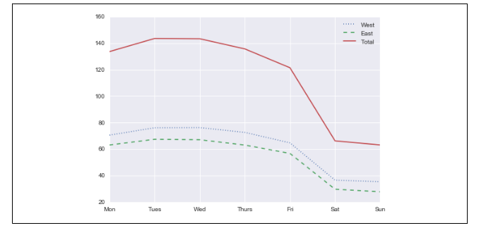
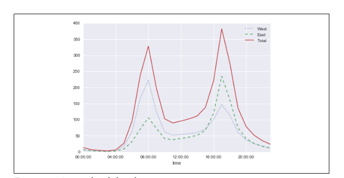

# Homework 3 Time-series Analysis with Pandas

In this homework, we will import external data and apply time-series methodologies and visualize our data.

* Task 1 (0 points). Download the data and 

In Jupyter notebook, you can run the following to get the data,

`!curl -o FremontBridge.csv https://data.seattle.gov/api/views/65db-xm6k/rows.csv?accessType=DOWNLOAD`

You should get to the following,


And we can see hourly plot like the following,


* Task 2 (20 pts) Plot the Weekly **bicycle crossings of Seattle’s Fremont bridge** data using Resample method. (hint: resample daily data)

* Task 3 (20 pts) Plot the Weekly **bicycle crossings of Seattle’s Fremont bridge** data using a rolling mean. (hint: resample daily data, rolling mean on 7 days in right/default and plot.)

* Task 4 (20 pts) 50 days rolling mean with Guassian function (std set to 30 days).

* Task 5 (20 pts) Average daily bicycle counts. X axis is Monday to Sunday. We will have to achieve to this digram.



* Task 6 (20 pts) Plot daily data by hourly.

>Hint: your hourly ticks, have been worked out for you like the following, and you will need to work on `by_time`. And you will have to use `groupby` and research about `data.index.time`.

```python
hourly_ticks = 4 * 60 * 60 * np.arange(6)
by_time.plot(xticks=hourly_ticks, style=[':', '--', '-']);
```

