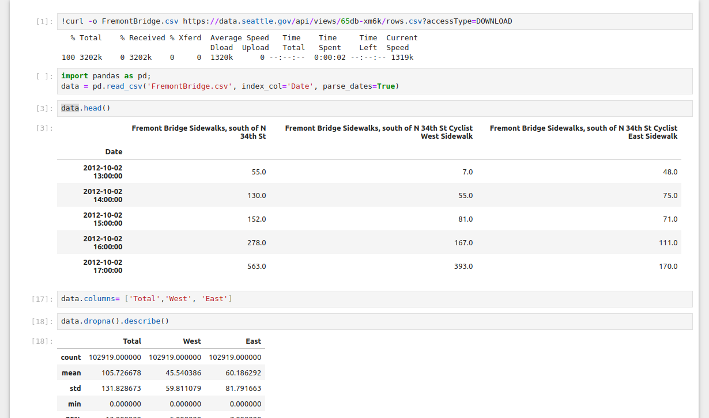
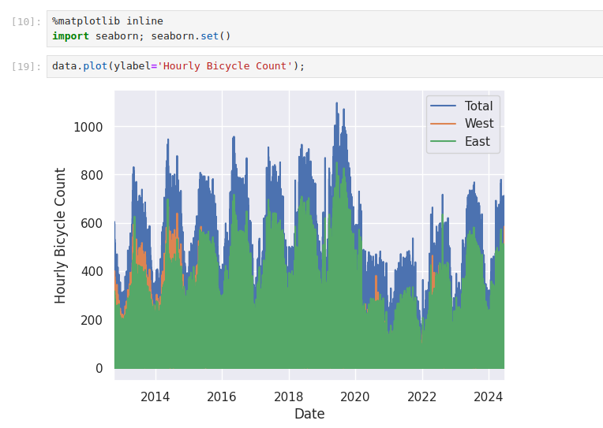

# Homework 3 Time-series Analysis with Pandas

In this homework, we will import external data and apply time-series methodologies and visualize our data.

* Task 1 (0 points). Download the data and 

In Jupyter notebook, you can run the following to get the data,

`!curl -o FremontBridge.csv https://data.seattle.gov/api/views/65db-xm6k/rows.csv?accessType=DOWNLOAD`

You should get to the following,

And we can see hourly plot like the following,

* Task 2 (25 pts) Plot the Weekly **bicycle crossings of Seattle’s Fremont bridge** data using Resample method.

* Task 3 (25 pts) Plot the Weekly **bicycle crossings of Seattle’s Fremont bridge** data using a rolling mean,
  utilizing the `pd.rolling_mean()` function

* Task 4 (25 pts) Plot the Weekly **bicycle crossings of Seattle’s Fremont bridge** data using Gaussian window function.
 X axis ticks are every 4 hours.

* Task 5 (25 pts) Average daily bicycle counts.
 X axis is Monday to Sunday.