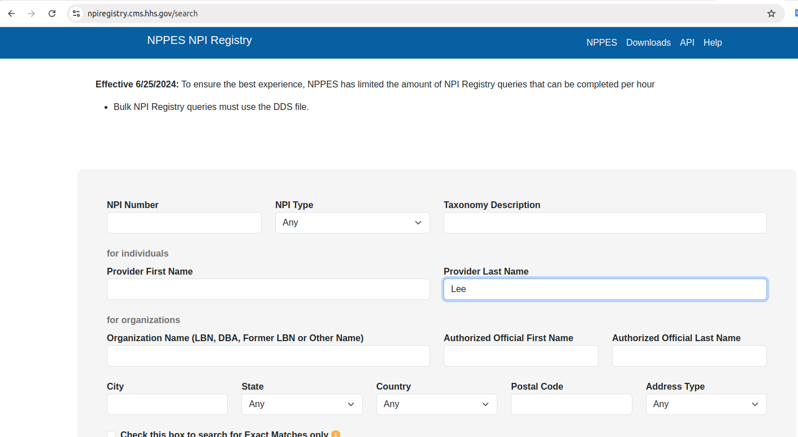
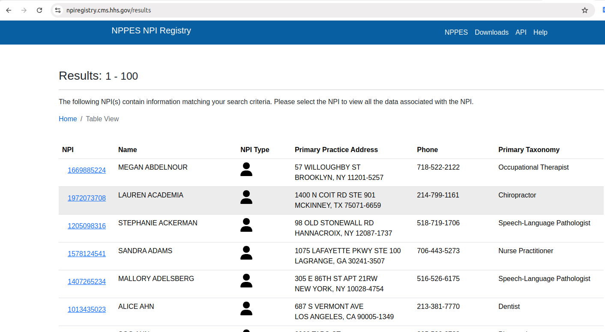

# US Doctor Database Analysis

## Background Intro

NPI database is fast and provide public data and API.

https://npiregistry.cms.hhs.gov/search



Once you search you would get the following,



**Goal:**

We would like to explore their whole data or data as a whole by analyzing the csv files and try to understand how to use their data of the following. The API is searching with criterial, but it has no pagination but only “More” buttons.

* We do not care about personal information but we are curious about such a charting of pie chart where we can show different practices/taxonomy and portions.

* we do not rely on their API but rather on .zip files from the following,

https://download.cms.gov/nppes/NPI_Files.html

* There is a Full Replacement Monthly NPI Deactivation File zip, and deactivation zips, so we might need to perform a delta cleaning, which means filter them out from the whole data. Since this is more dynamic such as some doctors are leaving the jobs, retiring or dead.

* We should analyze the following,


## Task of visualizing the data

1/ Read all the montly doctor data and sort doctors with different practices. (20 pts)

2/ Remove the doctors from the deactivation zip. (20 pts)

3/ After removal, get counts of all the active doctors based on the practices. (20 pts)

4/ Use a Piechart or any visualization to show the percentage other any other charts you think that can visualize better. (20 pts)

5/ Using Pandas to see if the following doctors are in the NPI data. (20 pts)

Doctor information for Testing,

```
Elizabeth Botham, MD, 1 Seymour St 6th Floor, Montclair, NJ 07042
Michael Costanzo, APN, 890 Mountain Ave 3rd Floor, New Providence, NJ 07974
Jenna Presto, MD, 2 Brighton Rd, Clifton, NJ 07012
Daniel Roling, MD, 6 Lancaster Ave, Wynnewood, PA 19096
Marlyn Wu, DO, 2 Brighton Road, 2nd Floor, Clifton, NJ, (973) 792-8455
Robert Kantor, MD, 1255 Broad St., 2nd Floor, Clifton, NJ, (973) 685-5736
```
