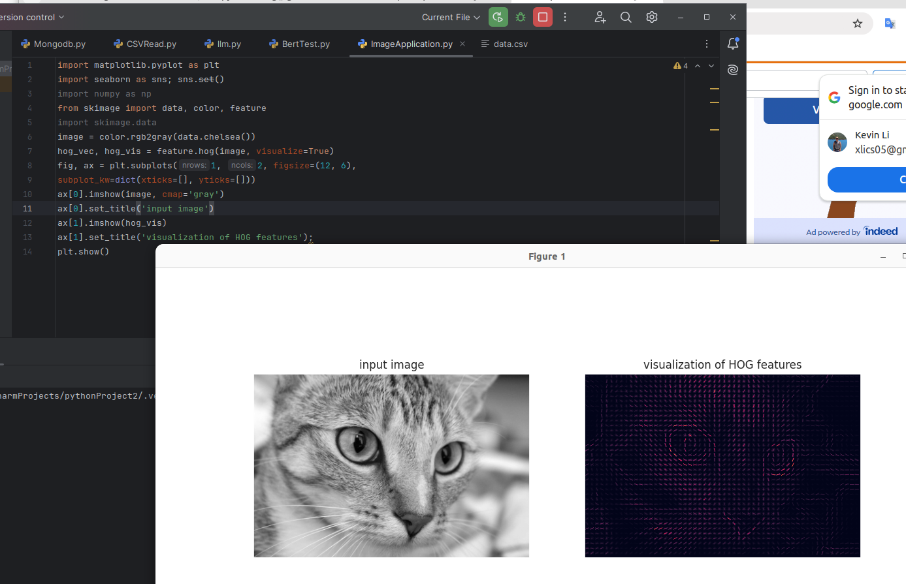

# Face Detection Application

Real-world datasets are noisy and heterogeneous, may have missing features, and may include data in a form that is difficult to map to a clean [n_samples,
n_features] matrix.

One interesting and compelling application of machine learning is to images, and we have already seen a few examples of this where pixel-level features are used for classification.

In this section, we will take a look at one such feature extraction technique, the Histogram of Oriented Gradients (HOG), which transforms image pixels into a vector representation that is sensitive to broadly informative image features regardless of confounding factors like illumination.

%matplotlib inline
import matplotlib.pyplot as plt
import seaborn as sns; sns.set()
import numpy as np

## HOG Features

The Histogram of Gradients is a straightforward feature extraction procedure that was developed in the context of identifying pedestrians within images. HOG involves
the following steps:

1. Optionally prenormalize images. This leads to features that resist dependence on variations in illumination.

2. Convolve the image with two filters that are sensitive to horizontal and vertical brightness gradients. These capture edge, contour, and texture information.

3. Subdivide the image into cells of a predetermined size, and compute a histogram of the gradient orientations within each cell.

4. Normalize the histograms in each cell by comparing to the block of neighboring cells. This further suppresses the effect of illumination across the image.

5. Construct a one-dimensional feature vector from the information in each cell.

A fast HOG extractor is built into the Scikit-Image project, and we can try it out rela‐
tively quickly and visualize the oriented gradients within each cell.

Let us use the following code. 

```python
import matplotlib.pyplot as plt
import seaborn as sns; sns.set()
import numpy as np
from skimage import data, color, feature
import skimage.data
image = color.rgb2gray(data.chelsea())
hog_vec, hog_vis = feature.hog(image, visualize=True)
fig, ax = plt.subplots(1, 2, figsize=(12, 6),
subplot_kw=dict(xticks=[], yticks=[]))
ax[0].imshow(image, cmap='gray')
ax[0].set_title('input image')
ax[1].imshow(hog_vis)
ax[1].set_title('visualization of HOG features');
plt.show()
```

Then we can see the following image,

