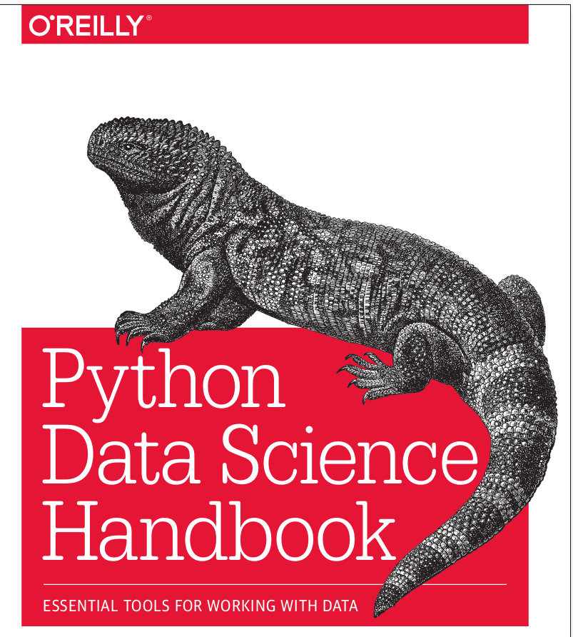

# Scikit-Learn

Scikit-Learn characterized by a clean, uniform, and streamlined API, as well as by very useful and complete online documentation.

**Data Representation in Scikit-Learn**

Machine learning is about creating models from data: for that reason, we’ll start by discussing how data can be represented in order to be understood by the computer. The best way to think about data within Scikit-Learn is in terms of tables of data.

**Data as table**

A basic table is a two-dimensional grid of data, in which the rows represent individ‐
ual elements of the dataset, and the columns represent quantities related to each of
these elements. For example, consider the Iris dataset,

This is the iris data set from https://en.wikipedia.org/wiki/Iris_flower_data_set.

famously analyzed by Ronald
Fisher in 1936. We can download this dataset in the form of a Pandas DataFrame
using the Seaborn library:

