# NumPy

## PART I Basics of Numpy - Array and Coding Efficiencies

### Dynamic type and Dynamic type of Array

* Display the version

```shell
>>> import numpy
>>> numpy.__version__
'1.24.3'
```

* A tab will show you built-in functions.

```shell
>>> import numpy as np
>>> np.[tab on your keyboard]
```

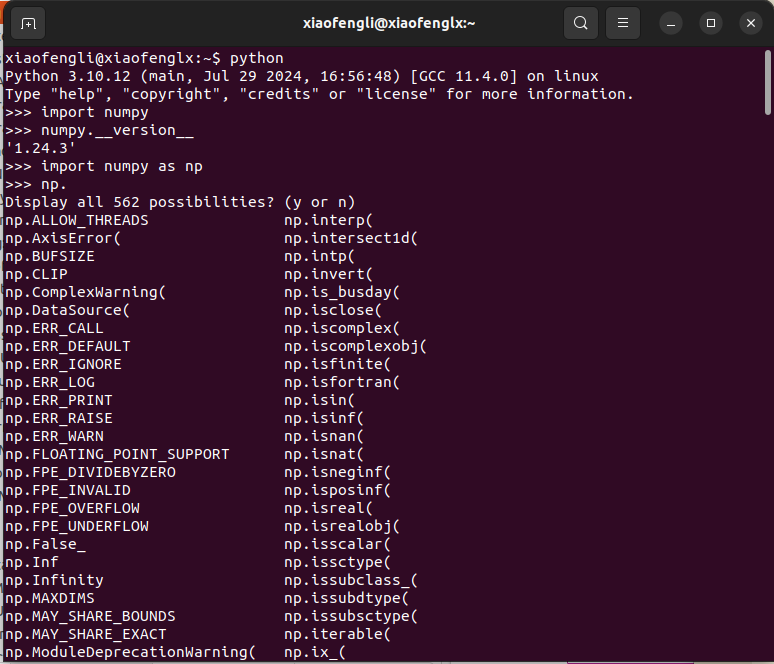

* Data types is an object in C.

A Python Integer Is More Than Just an Integer.
It’s actually a pointer to a compound C struc‐
ture, which contains several values.

```C
struct _longobject {
    long ob_refcnt;
    PyTypeObject *ob_type;
    size_t ob_size;
    long ob_digit[1];
};
```

A single integer in Python 3.4 actually contains four pieces:

* ob_refcnt, a reference count that helps Python silently handle memory allocation and deallocation
* ob_type, which encodes the type of the variable
* ob_size, which specifies the size of the following data members
* ob_digit, which contains the actual integer value that we expect the Python variable to represent

This means that there is some overhead in storing an integer in Python as compared
to an integer in a compiled language like C, as illustrated below,

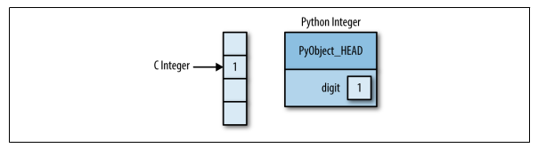

* A Python List Is More Than Just a List.

Because of Python’s dynamic typing, we can even create heterogeneous lists:

```python
In[5]: L3 = [True, "2", 3.0, 4]
[type(item) for item in L3]

Out[5]: [bool, str, float, int]
```

**Cons:**

But this flexibility comes at a cost: to allow these flexible types, each item in the list must contain its own type info, reference count, and other information—that is, each item is a complete Python object. In the special case that all variables are of the same type, much of this information is ***redundant***: it can be much more efficient to store data in a fixed-type array.

* For an array, it should be At the implementation level, the array essentially contains a single pointer to one contiguous block of data. The Python list, on the other hand, contains a pointer to a block of pointers, each of which in turn points to a full Python object like the Python integer we saw earlier. **Array Vs LinkedList**

> Hint: Java Interview question: ArrayList vs LinkedList.

* Fixed-type NumPy-style arrays lack this flexibility, but are much more efficient for storing and manipulating data.

### Fixed-Type Arrays in Python

Python offers several different options for storing data in efficient, fixed-type data buffers. The built-in array module (available since Python 3.3) can be used to create dense arrays of a uniform type:

```python
In[6]: import array
L = list(range(10))
A = array.array('i', L)
A
Out[6]: array('i', [0, 1, 2, 3, 4, 5, 6, 7, 8, 9])
```

Here 'i' is a type code indicating the contents are integers.
Much more useful, however, is the ndarray object of the Nu

However, NumPy's ndarray provides more flexibility in efficient operations on that data.

### Creating Arrays from Python Lists

```python
In[7]: import numpy as np
In[8]: # integer array:
np.array([1, 4, 2, 5, 3])
Out[8]: array([1, 4, 2, 5, 3])
```

**Upcast**

```python
In[9]: np.array([3.14, 4, 2, 3])
Out[9]: array([ 3.14, 4.,2.,3.])
```

**Data Type**

```python
In[10]: np.array([1, 2, 3, 4], dtype='float32')
Out[10]: array([ 1.,2.,3.,4.], dtype=float32)
```

**Multidimentional**

```python
In[11]: # nested lists result in multidimensional arrays
np.array([range(i, i + 3) for i in [2, 4, 6]])
Out[11]: array([[2, 3, 4],
[4, 5, 6],
[6, 7, 8]])
```

**Creating Arrays from Scratch**

Especially for larger arrays, it is more efficient to create arrays from scratch using rou‐tines built into NumPy. Here are several examples:

```python
In[12]: # Create a length-10 integer array filled with zeros
np.zeros(10, dtype=int)
Out[12]: array([0, 0, 0, 0, 0, 0, 0, 0, 0, 0])

In[13]: # Create a 3x5 floating-point array filled with 1s
np.ones((3, 5), dtype=float)
Out[13]: array([[ 1.,[ 1.,[ 1.,1.,1.,1.,1.,1.,1.,1.,1.,1.,1.],1.],1.]])

In[14]: # Create a 3x5 array filled with 3.14
np.full((3, 5), 3.14)
Out[14]: array([[ 3.14, 3.14, 3.14, 3.14, 3.14],
                [ 3.14, 3.14, 3.14, 3.14, 3.14],
                [ 3.14, 3.14, 3.14, 3.14, 3.14]])

In[15]: # Create an array filled with a linear sequence
# Starting at 0, ending at 20, stepping by 2
# (this is similar to the built-in range() function)
np.arange(0, 20, 2)
Out[15]: array([0, 2, 4, 6, 8, 10, 12, 14, 16, 18])

In[16]: # Create an array of five values evenly spaced between 0 and 1
np.linspace(0, 1, 5)
Out[16]: array([0.,0.25,0.5,0.75,1.])

In[17]: # Create a 3x3 array of uniformly distributed
# random values between 0 and 1
np.random.random((3, 3))
Out[17]: array([[ 0.99844933,0.52183819,0.22421193],
[ 0.08007488,0.45429293, 0.20941444],
[ 0.14360941,0.96910973,0.946117 ]])

In[18]: # Create a 3x3 array of normally distributed random values
# with mean 0 and standard deviation 1
np.random.normal(0, 1, (3, 3))
Out[18]: array([[ 1.51772646, 0.39614948, -0.10634696]
                [ 0.25671348, 0.00732722, 0.37783601],
                [ 0.68446945,0.15926039, -0.70744073]])

In[19]: # Create a 3x3 array of random integers in the interval [0, 10)
np.random.randint(0, 10, (3, 3))
Out[19]: array([[2, 3, 4],
                [5, 7, 8],
                [0, 5, 0]])

In[20]: # Create a 3x3 identity matrix
np.eye(3)
Out[20]: array([[ 1., 0., 0.],
                [ 0., 1., 0.],
                [ 0., 0., 1.]])

In[21]: # Create an uninitialized array of three integers
# The values will be whatever happens to already exist at that
# memory location
np.empty(3)
Out[21]: array([ 1.,1.,1.])
```

## NumPy Standard Data Types

NumPy arrays contain values of a single type, so it is important to have detailed
knowledge of those types and their limitations. Because NumPy is built in C, the
types will be familiar to users of **C**, **Fortran**, and other related languages.

You can do either of the followings, and they are the same.

`np.zeros(10, dtype='int16')`

or

`np.zeros(10, dtype=np.int16)`

**Standard NumPy data types**

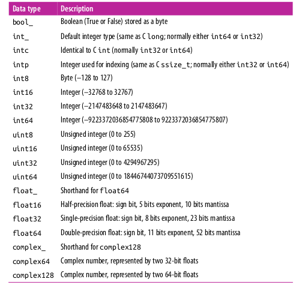

## Basics of NumPy

**The Basics of NumPy Arrays**

* Attributes of arrays
Determining the size, shape, memory consumption, and data types of arrays

* Indexing of arrays
Getting and setting the value of individual array elements

* Slicing of arrays
Getting and setting smaller subarrays within a larger array

* Reshaping of arrays
Changing the shape of a given array

* Joining and splitting of arrays
Combining multiple arrays into one, and splitting one array into many

### NumPy Array Attributes

Let us use the following examples to enumerate all the features.

```python
In[1]: import numpy as np
np.random.seed(0) # seed for reproducibility
x1 = np.random.randint(10, size=6) # One-dimensional array
x2 = np.random.randint(10, size=(3, 4)) # Two-dimensional array
x3 = np.random.randint(10, size=(3, 4, 5)) # Three-dimensional array
```

Each array has attributes ndim (the number of dimensions), shape (the size of each dimension), and size (the total size of the array):

```python
In[2]: print("x3 ndim: ", x3.ndim)
print("x3 shape:", x3.shape)
print("x3 size: ", x3.size)
x3 ndim: 3
x3 shape: (3, 4, 5)
x3 size: 60

In[3]: print("dtype:", x3.dtype)
dtype: int64

In[4]: print("itemsize:", x3.itemsize, "bytes")
print("nbytes:", x3.nbytes, "bytes")
itemsize: 8 bytes
nbytes: 480 bytes
```

### Array Indexing: Accessing Single Elements

```python
In[5]: x1
Out[5]: array([5, 0, 3, 3, 7, 9])

In[6]: x1[0]
Out[6]: 5

In[7]: x1[4]
Out[7]: 7
```

To index from the end of the array, you can use negative indices:

```python
In[8]: x1[-1]
Out[8]: 9

In[9]: x1[-2]
Out[9]: 7
```

In a multidimensional array, you access items using a comma-separated tuple of
indices:

```python
In[10]: x2
Out[10]: array([[3, 5, 2, 4],
[7, 6, 8, 8],
[1, 6, 7, 7]])

In[11]: x2[0, 0]
Out[11]: 3
```

In a multidimensional array, you access items using a comma-separated tuple of
indices:

```python
In[10]: x2
Out[10]: array([[3, 5, 2, 4],
[7, 6, 8, 8],
[1, 6, 7, 7]])

In[11]: x2[0, 0]
Out[11]: 3
|
In[12]: x2[2, 0]
Out[12]: 1

In[13]: x2[2, -1]
Out[13]: 7
```

You can also modify values using any of the above index notation:

```python
In[14]: x2[0, 0] = 12
x2
Out[14]: array([[12, 5, 2, 4],
                [7,6,8,8],
                [1,6,7,7]])

```

### Array Slicing: Accessing Subarrays

***syntax***: `x[start:stop:step]`

***One-dimensional subarrays***

```python
In[16]: x = np.arange(10)
x
Out[16]: array([0, 1, 2, 3, 4, 5, 6, 7, 8, 9])
In[17]: x[:5] # first five elements
Out[17]: array([0, 1, 2, 3, 4])
In[18]: x[5:] # elements after index 5
Out[18]: array([5, 6, 7, 8, 9])
In[19]: x[4:7] # middle subarray
Out[19]: array([4, 5, 6])
In[20]: x[::2]
# every other element
Out[20]: array([0, 2, 4, 6, 8])
In[21]: x[1::2]
# every other element, starting at index 1
Out[21]: array([1, 3, 5, 7, 9])
```

A potentially confusing case is when the step value is negative. In this case, the defaults for start and stop are swapped. This becomes a convenient way to reverse an array:

```python
In[22]: x[::-1]
# all elements, reversed
Out[22]: array([9, 8, 7, 6, 5, 4, 3, 2, 1, 0])
In[23]: x[5::-2]
# reversed every other from index 5
Out[23]: array([5, 3, 1])
```

***Multidimensional subarrays***

```python
In[24]: x2
Out[24]: array([[12, 5, 2, 4],
[ 7, 6, 8, 8],
[ 1, 6, 7, 7]])
```

```python
In[25]: x2[:2, :3] # two rows, three columns
Out[25]: array([[12,5,2], [ 7, 6, 8]])

In[26]: x2[:3, ::2] # all rows, every other column
Out[26]: array([[12,2], [7, 8], [1,7]])
```

Finally, subarray dimensions can even be reversed together:

```python
In[27]: x2[::-1, ::-1]
Out[27]: array([[ 7, 7 , 6, 1],
                [8, 8, 6, 7],
                [4, 2, 5, 12]])
```

***Accessing array rows and columns***

```sql
In[28]: print(x2[:, 0]) # first column of x2
[12 7 1]

In[29]: print(x2[0, :]) # first row of x2
[12 5 2 4]
```

In the case of row access, the empty slice can be omitted for a more compact syntax:

```sql
In[30]: print(x2[0]) # equivalent to x2[0, :]
[12 5 2 4]
```

***Subarrays as no-copy views***

Consider our two-dimensional array from before:

### Reshaping of Arrays

***Array Concatenation and Splitting***

### Computation on NumPy Arrays: Universal Functions

Computation on NumPy arrays can be very fast, or it can be very slow. The key to
making it fast is to use vectorized operations, generally implemented through Num‐Py’s universal functions (ufuncs).

***The Slowness of Loops***

The following is a quicker way to get jupyter notebook.
To be exact, it is the IPython shell that I am interseted to use.

`pip3 install jupyter`

`python3 -m notebook`


**Introducing UFuncs**

Vectorized operations in NumPy are implemented via ufuncs, whose main purpose is
to quickly execute repeated operations on values in NumPy arrays.

Using the same 1M numbers big array, we do some math operations, and we can see the difference in timing,

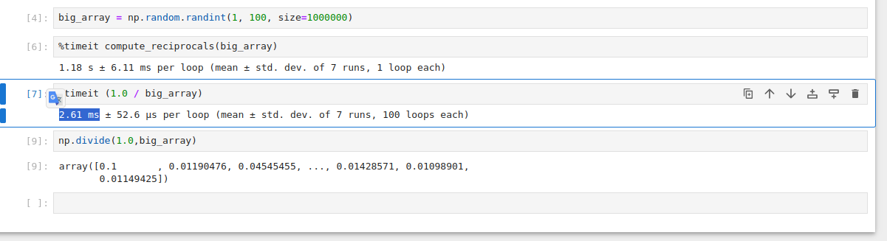

Ufuncs are extremely flexible—before we saw an operation between a scalar and an array, but we
can also operate between two arrays:

```python
In[5]: np.arange(5) / np.arange(1, 6)
Out[5]: array([ 0. , 0.5, 0.66666667, 0.75, 0.8])
```

And ufunc operations are not limited to one-dimensional arrays—they can act on
multidimensional arrays as well:

```python
In[6]: x = np.arange(9).reshape((3, 3))
2 ** x
Out[6]: array([[ 1, 2, 4],
               [ 8, 16, 32],
               [ 64, 128, 256]])
```

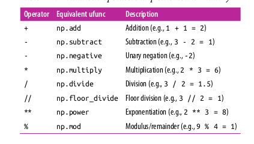

**Examples**

***Array arithmetic***

NumPy’s ufuncs feel very natural to use because they make use of Python’s native arithmetic operators. The standard addition, subtraction multiplication, and division can all be used:

```python
In[7]: x = np.arange(4)
print("x=", x)
print("x + 5 =", x + 5)
print("x - 5 =", x - 5)
print("x * 2 =", x * 2)
print("x // 2 =", x // 2)
x= [0 1 2 3]
x + 5 = [5 6 7 8]
x - 5 = [-5 -4 -3 -2]
x * 2 = [0 2 4 6]
x / 2 = [ 0.0.5 1.1.5]
x // 2 = [0 0 1 1]
```

# floor division

There is also a unary ufunc for negation, a ** operator for exponentiation, and a % operator for modulus:

```python
In[8]: print("-x= ", -x)
print("x ** 2 = ", x ** 2)
print("x % 2 = ", x % 2)
-x= [ 0 -1 -2 -3]
x ** 2 = [0 1 4 9]
x % 2 = [0 1 0 1]
```

In addition, these can be strung together however you wish, and the standard order of operations is respected:

```python
In[9]: -(0.5*x + 1) ** 2
Out[9]: array([-1. , -2.25, -4., -6.25])
```

All of these arithmetic operations are simply convenient wrappers around specific functions built into NumPy; for example, the + operator is a wrapper for the add function:

```python
In[10]: np.add(x, 2)
Out[10]: array([2, 3, 4, 5])
```

**Absolute value**

Just as NumPy understands Python’s built-in arithmetic operators, it also understands Python’s built-in absolute value function:

```python
In[11]: x = np.array([-2, -1, 0, 1, 2])
abs(x)
Out[11]: array([2, 1, 0, 1, 2])
```

The corresponding NumPy ufunc is np.absolute, which is also available under the alias `np.abs`:

```python
In[12]: np.absolute(x)
Out[12]: array([2, 1, 0, 1, 2])
In[13]: np.abs(x)
Out[13]: array([2, 1, 0, 1, 2])
```

This ufunc can also handle complex data, in which the absolute value returns the magnitude:

```python
In[14]: x = np.array([3 - 4j, 4 - 3j, 2 + 0j, 0 + 1j])
np.abs(x)
Out[14]: array([ 5., 5., 2., 1.])
```

**Trigonometric functions**

NumPy provides a large number of useful ufuncs, and some of the most useful for the data scientist are the trigonometric functions. We’ll start by defining an array of angles:

```python
In[15]: theta = np.linspace(0, np.pi, 3)
```

Now we can compute some trigonometric functions on these values:

```python
In[16]: print("theta= ", theta)
print("sin(theta) = ", np.sin(theta))
print("cos(theta) = ", np.cos(theta))
print("tan(theta) = ", np.tan(theta))
theta= [ 0. 1.57079633 3.14159265]
sin(theta) = [ 0.00000000e+00 1.00000000e+00 1.22464680e-16]
cos(theta) = [ 1.00000000e+00 6.12323400e-17 -1.00000000e+00]
tan(theta) = [ 0.00000000e+00 1.63312394e+16 -1.22464680e-16]
```

The values are computed to within machine precision, which is why values that should be zero do not always hit exactly zero. Inverse trigonometric functions are also available:

```python
In[17]: x = [-1, 0, 1]
print("x= ", x)
print("arcsin(x) = ", np.arcsin(x))
print("arccos(x) = ", np.arccos(x))
print("arctan(x) = ", np.arctan(x))
x= [-1, 0, 1]
arcsin(x) = [-1.57079633 0. 1.57079633]
arccos(x) = [ 3.14159265 1.57079633 0.]
arctan(x) = [-0.78539816 0 0.78539816]
```

**Exponents and logarithms**

Another common type of operation available in a NumPy ufunc are the exponentials:

```python
In[18]: x = [1, 2, 3]
print("x=", x)
print("e^x=", np.exp(x))
print("2^x=", np.exp2(x))
print("3^x=", np.power(3, x))
x= [1, 2, 3]
e^x = [ 2.71828183 7.3890561 20.08553692]
2^x = [ 2. 4. 8.]
3^x = [ 3 9 27]
```

The inverse of the exponentials, the logarithms, are also available. The basic `np.log` gives the natural logarithm; if you prefer to compute the base-2 logarithm or the base-10 logarithm, these are available as well:

```python
In[19]: x = [1, 2, 4, 10]
print("x=", x)
print("ln(x)=", np.log(x))
print("log2(x) =", np.log2(x))
print("log10(x) =", np.log10(x))
x= [1, 2, 4, 10]
ln(x)= [ 0. 0.69314718
log2(x) = [ 0. 1. 3.32192809]
log10(x) = [ 0. 0.60205999 1.]
0.30103
1.38629436 2.30258509]
2.
```

There are also some specialized versions that are useful for maintaining precision
with very small input:

```python
In[20]: x = [0, 0.001, 0.01, 0.1]
print("exp(x) - 1 =", np.expm1(x))
print("log(1 + x) =", np.log1p(x))
exp(x) - 1 = [ 0.
log(1 + x) = [ 0.
0.0010005
0.0009995
0.01005017 0.10517092]
0.00995033 0.09531018]
```

When x is very small, these functions give more precise values than if the raw np.log
or np.exp were used.

**Specialized ufuncs**

NumPy has many more ufuncs available, including hyperbolic trig functions, bitwise
arithmetic, comparison operators, conversions from radians to degrees, rounding and
remainders, and much more. A look through the NumPy documentation reveals a lot
of interesting functionality.

Another excellent source for more specialized and obscure ufuncs is the submodule
scipy.special. If you want to compute some obscure mathematical function on
your data, chances are it is implemented in scipy.special. There are far too many
functions to list them all, but the following snippet shows a couple that might come
up in a statistics context:

```python
In[21]: from scipy import special
In[22]: # Gamma functions (generalized factorials) and related functions
x = [1, 5, 10]
print("gamma(x)
=", special.gamma(x))
print("ln|gamma(x)| =", special.gammaln(x))
print("beta(x, 2)
=", special.beta(x, 2))
gamma(x)
= [ 1.00000000e+00
2.40000000e+01
3.62880000e+05]
ln|gamma(x)| = [ 0.
3.17805383 12.80182748]
beta(x, 2)
= [ 0.5
0.03333333 0.00909091]
In[23]: # Error function (integral of Gaussian)
# its complement, and its inverse
x = np.array([0, 0.3, 0.7, 1.0])
print("erf(x) =", special.erf(x))
print("erfc(x) =", special.erfc(x))
print("erfinv(x) =", special.erfinv(x))
erf(x) = [ 0.
erfc(x) = [ 1.
erfinv(x) = [ 0.
0.32862676 0.67780119 0.84270079]
0.67137324 0.32219881 0.15729921]
0.27246271 0.73286908
inf]
```

There are many, many more ufuncs available in both NumPy and scipy.special.
Because the documentation of these packages is available online, a web search along
the lines of “gamma function python” will generally find the relevant information.

**Advanced Ufunc Features**

Many NumPy users make use of ufuncs without ever learning their full set of features.
We’ll outline a few specialized features of ufuncs here.

***Specifying output***

For large calculations, it is sometimes useful to be able to specify the array where the
result of the calculation will be stored. Rather than creating a temporary array, you
can use this to write computation results directly to the memory location where you’d

```python
In[24]: x = np.arange(5)
y = np.empty(5)
np.multiply(x, 10, out=y)
print(y)
[0. 10. 20. 30. 40.]
```

This can even be used with array views. For example, we can write the results of a
computation to every other element of a specified array:

```python
In[25]: y = np.zeros(10)
np.power(2, x, out=y[::2])
print(y)
[1. 0. 2. 0 4. 0 8. 0. 16. 0.]
```

If we had instead written y[::2] = 2 ** x, this would have resulted in the creation
of a temporary array to hold the results of 2 ** x, followed by a second operation
copying those values into the y array. This doesn’t make much of a difference for such
a small computation, but for very large arrays the memory savings from careful use of
the out argument can be significant.

**Aggregates**

For binary ufuncs, there are some interesting aggregates that can be computed
directly from the object. For example, if we’d like to reduce an array with a particular
operation, we can use the reduce method of any ufunc. A reduce repeatedly applies a
given operation to the elements of an array until only a single result remains.
For example, calling reduce on the add ufunc returns the sum of all elements in the
array:

```python
In[26]: x = np.arange(1, 6)
np.add.reduce(x)
Out[26]: 15
```

Similarly, calling reduce on the multiply ufunc results in the product of all array
elements:

```python
In[27]: np.multiply.reduce(x)
Out[27]: 120
```

If we’d like to store all the intermediate results of the computation, we can instead use
accumulate:

```python
In[28]: np.add.accumulate(x)
Out[28]: array([ 1, 3, 6, 10, 15])

In[29]: np.multiply.accumulate(x)
Out[29]: array([1, 2, 6, 24, 120])
```

**Outer products**

Finally, any ufunc can compute the output of all pairs of two different inputs using
the outer method. This allows you, in one line, to do things like create a multiplica‐
tion table:

```python
In[30]: x = np.arange(1, 6)
np.multiply.outer(x, x)
Out[30]: array([[ 1, 2, 3, 4, 5],
[ 2, 4, 6, 8, 10],
[ 3, 6, 9, 12, 15],
[ 4, 8, 12, 16, 20],
[ 5, 10, 15, 20, 25]])
```

## NumPy Aggregations: Min, Max, and Everything in Between

**Summing the Values in an Array**

As a quick example, consider computing the sum of all values in an array. Python
itself can do this using the built-in sum function:

```python
In[1]: import numpy as np
In[2]: L = np.random.random(100)
sum(L)
Out[2]: 55.61209116604941
```

The syntax is quite similar to that of NumPy’s sum function, and the result is the same
in the simplest case:

```python
In[3]: np.sum(L)
Out[3]: 55.612091166049424
```

However, because it executes the operation in compiled code, NumPy’s version of the
operation is computed much more quickly:

```python
In[4]: big_array = np.random.rand(1000000)
%timeit sum(big_array)
%timeit np.sum(big_array)
10 loops, best of 3: 104 ms per loop
1000 loops, best of 3: 442 µs per loop
```
>hint: do this in Jupyter notebook.

Be careful, though: the sum function and the np.sum function are not identical, which
can sometimes lead to confusion! In particular, their optional arguments have differ‐
ent meanings, and np.sum is aware of multiple array dimensions, as we will see in the
following section.

**Minimum and Maximum**

Similarly, Python has built-in min and max functions, used to find the minimum value and maximum value of any given array:

```python
In[5]: min(big_array), max(big_array)
Out[5]: (1.1717128136634614e-06, 0.9999976784968716)
```

NumPy’s corresponding functions have similar syntax, and again operate much more
quickly:

```python
In[6]: np.min(big_array), np.max(big_array)
Out[6]: (1.1717128136634614e-06, 0.9999976784968716)

In[7]: %timeit min(big_array)
%timeit np.min(big_array)
10 loops, best of 3: 82.3 ms per loop
1000 loops, best of 3: 497 µs per loop
```

For min, max, sum, and several other NumPy aggregates, a shorter syntax is to use
methods of the array object itself:

```In[8]: print(big_array.min(), big_array.max(), big_array.sum())
1.17171281366e-06 0.999997678497 499911.628197
```

Whenever possible, make sure that you are using the NumPy version of these aggre‐
gates when operating on NumPy arrays!

**Multidimensional aggregates**

One common type of aggregation operation is an aggregate along a row or column.
Say you have some data stored in a two-dimensional array:

```python
In[9]: M = np.random.random((3, 4))
print(M)
[[ 0.8967576
0.03783739 0.75952519 0.06682827]
[ 0.8354065
0.99196818 0.19544769 0.43447084]
[ 0.66859307 0.15038721 0.37911423 0.6687194 ]]
```

By default, each NumPy aggregation function will return the aggregate over the entire array:

```python
In[10]: M.sum()
Out[10]: 6.0850555667307118
```

Aggregation functions take an additional argument specifying the axis along which the aggregate is computed. For example, we can find the minimum value within each column by specifying axis=0:

```python
In[11]: M.min(axis=0)
Out[11]: array([ 0.66859307, 0.03783739, 0.19544769, 0.06682827])
```

The function returns four values, corresponding to the four columns of numbers.
Similarly, we can find the maximum value within each row:

```python
In[12]: M.max(axis=1)
Out[12]: array([ 0.8967576, 0.99196818, 0.6687194 ])
```

The way the axis is specified here can be confusing to users coming from other languages. The axis keyword specifies the dimension of the array that will be collapsed,
rather than the dimension that will be returned. So specifying `axis=0` means that the first axis will be collapsed: for two-dimensional arrays, this means that values within
each column will be aggregated.

**Other aggregation functions**

NumPy provides many other aggregation functions, but we won’t discuss them in
detail here. Additionally, most aggregates have a NaN-safe counterpart that computes
the result while ignoring missing values, which are marked by the special IEEE
floating-point NaN value (for a fuller discussion of missing data, see “Handling Miss‐
ing Data” on page 119). Some of these NaN-safe functions were not added until
NumPy 1.8, so they will not be available in older NumPy versions.

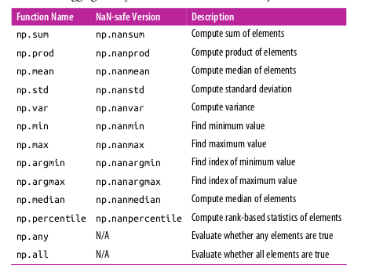

**Example: What Is the Average Height of US Presidents?**

```python
In[13]: !head -4 data/president_heights.csv
order,name,height(cm)
1,George Washington,189
2,John Adams,170
3,Thomas Jefferson,189
```

We’ll use the Pandas package, which we’ll explore more fully in Chapter 3, to read the
file and extract this information (note that the heights are measured in centimeters):

```python
In[14]: import pandas as pd
data = pd.read_csv('data/president_heights.csv')
heights = np.array(data['height(cm)'])
print(heights)
[189 170 189 163 183 171 185 168 173 183 173 173 175 178 183 193 178 173
174 183 183 168 170 178 182 180 183 178 182 188 175 179 183 193 182 183
177 185 188 188 182 185]
```

Now that we have this data array, we can compute a variety of summary statistics:

```python
In[15]: print("Mean height:", heights.mean())
print("Standard deviation:", heights.std())
print("Minimum height:", heights.min())
print("Maximum height:", heights.max())
Mean height:
179.738095238
Standard deviation: 6.93184344275
Minimum height:
163
Maximum height:
193
```

Note that in each case, the aggregation operation reduced the entire array to a single
summarizing value, which gives us information about the distribution of values. We
may also wish to compute quantiles:

```python
In[16]: print("25th percentile:
print("Median:
print("75th percentile: 25th percentile:
Median: 75th percentile:
", np.percentile(heights, 25))
", np.median(heights))
", np.percentile(heights, 75))
174.25
182.0
183.0
```

We see that the median height of US presidents is 182 cm, or just shy of six feet.
Of course, sometimes it’s more useful to see a visual representation of this data, which
we can accomplish using tools in Matplotlib (we’ll discuss Matplotlib more fully in
Chapter 4). For example, this code generates the chart shown in Figure 2-3:

```python
In[17]: %matplotlib inline
import matplotlib.pyplot as plt
import seaborn; seaborn.set() # set plot style
In[18]: plt.hist(heights)
plt.title('Height Distribution of US Presidents')
plt.xlabel('height (cm)')
plt.ylabel('number');
```

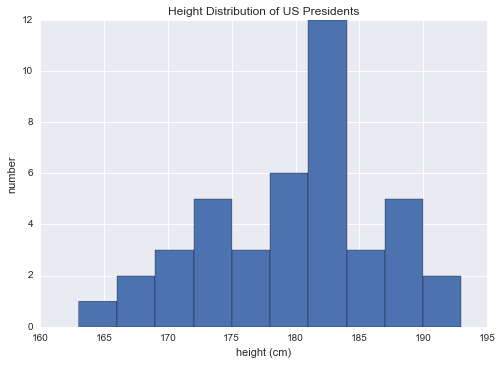

>What Is a Histogram?
A histogram is a graphical representation of data points organized into user-specified ranges. Similar in appearance to a bar graph, the histogram condenses a data series into an easily interpreted visual by taking many data points and grouping them into logical ranges or bins.

> Histograms vs. Bar Charts
Both histograms and bar charts provide a visual display using columns, and people often use the terms interchangeably. Technically, however, a histogram represents the frequency distribution of variables in a data set.
A bar graph typically represents a graphical comparison of discrete or categorical variables.

## Part II Advanced Array Operations: Broadcasting

Broadcasting is simply a set of rules for applying binary ufuncs (addition, subtraction, multiplication, etc.) on arrays of different sizes.

**Introducing Broadcasting**

```python
In[1]: import numpy as np
In[2]: a = np.array([0, 1, 2])
b = np.array([5, 5, 5])
a + b
Out[2]: array([5, 6, 7])
```

To add a scala like zero dimension array, it can add to each element of the vector.

```python
In[3]: a + 5
Out[3]: array([5, 6, 7])
```

We can similarly extend this to arrays of higher dimension. Observe the result when
we add a one-dimensional array to a two-dimensional array:

```python
In[4]: M = np.ones((3, 3))
M
Out[4]: array([[ 1., 1., 1.],
[ 1., 1., 1.],
[ 1., 1., 1.]])
In[5]: M + a
Out[5]: array([
[ 1., 2.,3.],
[ 1., 2.,3.],
[ 1., 2.,3.]
])
```

A more complex one,

```python
While these examples are relatively easy to understand, more complicated cases can
involve broadcasting of both arrays. Consider the following example:
In[6]: a = np.arange(3)
b = np.arange(3)[:, np.newaxis]
print(a)
print(b)
[0 1 2]
[[0]
[1]
[2]]

In[7]: a + b
Out[7]: array([[0, 1, 2],
[1, 2, 3],
[2, 3, 4]])
```

***Rules of Broadcasting***

Broadcasting in NumPy follows a strict set of rules to determine the interaction
between the two arrays:

• Rule 1: If the two arrays differ in their number of dimensions, the shape of the
one with fewer dimensions is padded with ones on its leading (left) side.

• Rule 2: If the shape of the two arrays does not match in any dimension, the array
with shape equal to 1 in that dimension is stretched to match the other shape.

• Rule 3: If in any dimension the sizes disagree and neither is equal to 1, an error is raised.

**Broadcasting example 1**

Let’s look at adding a two-dimensional array to a one-dimensional array:

```python
In[8]: M = np.ones((2, 3))
a = np.arange(3)
```

Let’s consider an operation on these two arrays. The shapes of the arrays are:

```python
M.shape = (2, 3)
a.shape = (3,)
```

We see by rule 1 that the array a has fewer dimensions, so we pad it on the left with
ones:

```python
M.shape -> (2, 3)
a.shape -> (1, 3)
```

By rule 2, we now see that the first dimension disagrees, so we stretch this dimension
to match:

```python
M.shape -> (2, 3)
a.shape -> (2, 3)
```

The shapes match, and we see that the final shape will be (2, 3):

```python
In[9]: M + a
Out[9]: array([[ 1., 2., 3.],
[ 1., 2., 3.]])
```

**Broadcasting example 2**

Let’s take a look at an example where both arrays need to be broadcast:

```python
In[10]: a = np.arange(3).reshape((3, 1))
b = np.arange(3)
```

Again, we’ll start by writing out the shape of the arrays:

```python
a.shape = (3, 1)
b.shape = (3,)
```

**Broadcasting example 3**

Now let’s take a look at an example in which the two arrays are not compatible:

```python
In[12]: M = np.ones((3, 2))
a = np.arange(3)
```

This is just a slightly different situation than in the first example: the matrix M is
transposed. How does this affect the calculation? The shapes of the arrays are:

```python
M.shape = (3, 2)
a.shape = (3,)
```

Again, rule 1 tells us that we must pad the shape of a with ones:

```python
M.shape -> (3, 2)
a.shape -> (1, 3)
```

By rule 2, the first dimension of a is stretched to match that of M:

```python
M.shape -> (3, 2)
a.shape -> (3, 3)
```

Now we hit rule 3—the final shapes do not match, so these two arrays are incompati‐
ble, as we can observe by attempting this operation:

```python
In[13]: M + a
---------------------------------------------------------------------------
ValueError
Traceback (most recent call last)
<ipython-input-13-9e16e9f98da6> in <module>()
----> 1 M + a
ValueError: operands could not be broadcast together with shapes (3,2) (3,)
```

Because neither of the (n,m) of both of the matrix has in common,
to make it work, we can do the following,

```python
In[14]: a[:, np.newaxis].shape
Out[14]: (3, 1)
In[15]: M + a[:, np.newaxis]
Out[15]: array([[ 1.,1.],
                [ 2.,2.]
                [ 3.,3.]
])
```

>Hint: Rule of thumb is that if the low dimensional matrix can be padded by adding more rows.
> and after padding, the number of columns of the operator matrices have to have the same column numbers.

Also note that while we’ve been focusing on the + operator here, these broadcasting
rules apply to any binary ufunc. For example, here is the logaddexp(a, b) function,
which computes log(exp(a) + exp(b)) with more precision than the naive
approach: 

```
In[16]: np.logaddexp(M, a[:, np.newaxis])
Out[16]: array([[ 1.31326169, 1.31326169],
[ 1.69314718, 1.69314718],
[ 2.31326169, 2.31326169]])
```

## Applications

**Centering an array**

In the previous section, we saw that ufuncs allow a NumPy user to remove the need
to explicitly write slow Python loops. Broadcasting extends this ability.

One commonly seen example is centering an array of data. Imagine you have an array of 10 observations, each of which consists of 3 values.


More practice on this,


After the above practice, let us do the following,

```python
In[18]: Xmean = X.mean(0)
Xmean
Out[18]: array([ 0.53514715, 0.66567217, 0.44385899])
```

And now we can center the X array by subtracting the mean (this is a broadcasting
operation):

```python
In[19]: X_centered = X - Xmean
```

To double-check that we’ve done this correctly, we can check that the centered array
has near zero mean:

```python
In[20]: X_centered.mean(0)
Out[20]: array([2.22044605e-17, -7.77156117e-17, -1.66533454e-17])
```

To within-machine precision, the mean is now zero.


**Plotting a two-dimensional function**

One place that broadcasting is very useful is in displaying images based on two-
dimensional functions. If we want to define a function z = f(x, y), broadcasting can be
used to compute the function across the grid:

```python
In[21]: # x and y have 50 steps from 0 to 5
x = np.linspace(0, 5, 50)
y = np.linspace(0, 5, 50)[:, np.newaxis]
z = np.sin(x) ** 10 + np.cos(10 + y * x) * np.cos(x)
```

We’ll use Matplotlib to plot this two-dimensional array (these tools will be discussed
in full in “Density and Contour Plots” on page 241):

```python
In[22]: %matplotlib inline
import matplotlib.pyplot as plt
In[23]: plt.imshow(z, origin='lower', extent=[0, 5, 0, 5], cmap='viridis')
plt.colorbar();
```

The result, shown in the following is a compelling visualization of the two-dimensional


**Comparison**

```python
In[4]: x = np.array([1, 2, 3, 4, 5])
In[5]: x < 3
# less than
Out[5]: array([ True, True, False, False, False], dtype=bool)

In[6]: x > 3
# greater than
Out[6]: array([False, False, False,True, True], dtype=bool)

In[7]: x <= 3
Out[7]: array([ True,True, True, False, False, dtype=bool)

In[8]: x >= 3
Out[8]: array([False, False, True,True,True], dtype=bool)

In[9]: x != 3 # not equal
Out[9]: array([ True, True, False,True,True], dtype=bool)

In[10]: x == 3
Out[10]: array([False, False, True, False, False], dtype=bool)
```

>Hint: For example, when you write x < 3, internally NumPy uses
np.less(x, 3).

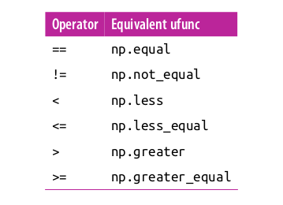 

**Another example on two dimensional**

```python
In[12]: rng = np.random.RandomState(0)
x = rng.randint(10, size=(3, 4))
x
Out[12]: array([[5, 0, 3, 3],
[7, 9, 3, 5],
[2, 4, 7, 6]])

In[13]: x < 6
Out[13]: array([[True, True, True, True],
               [False, False, True, True],
               [True, True, False, False]], dtype=bool)
```

In each case, the result is a Boolean array, and NumPy provides a number of straight‐
forward patterns for working with these Boolean results.


***Working with Boolean Arrays***

Given a Boolean array, there are a host of useful operations you can do. We’ll work
with x, the two-dimensional array we created earlier:

```
In[14]: print(x)
[[5 0 3 3]
[7 9 3 5]
[2 4 7 6]]
```

**Counting entries**

To count the number of True entries in a Boolean array, np.count_nonzero is useful:

```
In[15]: # how many values less than 6?
np.count_nonzero(x < 6)
Out[15]: 8
```

We see that there are eight array entries that are less than 6. Another way to get at this
information is to use np.sum; in this case, False is interpreted as 0, and True is interpreted as 1:

```
In[16]: np.sum(x < 6)
Out[16]: 8
```

The benefit of sum() is that like with other NumPy aggregation functions, this sum‐
mation can be done along rows or columns as well:

```
In[17]: # how many values less than 6 in each row?
np.sum(x < 6, axis=1)
Out[17]: array([4, 2, 2])
```

This counts the number of values less than 6 in each row of the matrix.

If we’re interested in quickly checking whether any or all the values are true, we can
use (you guessed it) np.any() or np.all():

```
In[18]: # are there any values greater than 8?
np.any(x > 8)
Out[18]: True

In[19]: # are there any values less than zero?
np.any(x < 0)
Out[19]: False

In[20]: # are all values less than 10?
np.all(x < 10)
Out[20]: True

In[21]: # are all values equal to 6?
np.all(x == 6)
Out[21]: False
```

np.all() and np.any() can be used along particular axes as well. For example:

```
In[22]: # are all values in each row less than 8?
np.all(x < 8, axis=1)
Out[22]: array([ True, False, True], dtype=bool)
```

Here all the elements in the first and third rows are less than 8, while this is not the
case for the second row.

Finally, a quick warning: as mentioned in “Aggregations: Min, Max, and Everything
in Between” on page 58, Python has built-in sum(), any(), and all() functions.
These have a different syntax than the NumPy versions, and in particular will fail or
produce unintended results when used on multidimensional arrays.


**Boolean operators**

We’ve already seen how we might count, say, all days with rain less than four inches,
or all days with rain greater than two inches. But what if we want to know about all
days with rain less than four inches and greater than one inch? This is accomplished
through Python’s bitwise logic operators, `&`, `|`, `^`, and `~`. Like with the standard arithmetic operators, NumPy overloads these as ufuncs that work element-wise on (usually Boolean) arrays.

For example, we can address this sort of compound question as follows:

```
In[23]: np.sum((inches > 0.5) & (inches < 1))
Out[23]: 29
```

So we see that there are 29 days with rainfall between 0.5 and 1.0 inches.

Note that the parentheses here are important—because of operator precedence rules,
with parentheses removed this expression would be evaluated as follows, which
results in an error:

`inches > (0.5 & inches) < 1`

Using the equivalence of A AND B and NOT (A OR B) (which you may remember if
you’ve taken an introductory logic course), we can compute the same result in a different manner:

```python
In[24]: np.sum(~( (inches <= 0.5) | (inches >= 1) ))
Out[24]: 29
```

Combining comparison operators and Boolean operators on arrays can lead to a wide
range of efficient logical operations.


**Boolean Arrays as Masks**

In the preceding section, we looked at aggregates computed directly on Boolean
arrays. A more powerful pattern is to use Boolean arrays as masks, to select particular
subsets of the data themselves. Returning to our x array from before, suppose we
want an array of all values in the array that are less than, say, 5:

In[26]: x
Out[26]: array([[5, 0, 3, 3],
[7, 9, 3, 5],
[2, 4, 7, 6]])
We can obtain a Boolean array for this condition easily, as we’ve already seen:
In[27]: x < 5
Out[27]: array([[False, True, True, True],
[False, False, True, False],
[ True, True, False, False]], dtype=bool)
Now to select these values from the array, we can simply index on this Boolean array;
this is known as a masking operation:
In[28]: x[x < 5]
Out[28]: array([0, 3, 3, 3, 2, 4])
What is returned is a one-dimensional array filled with all the values that meet this
condition; in other words, all the values in positions at which the mask array is True.
We are then free to operate on these values as we wish. For example, we can compute
some relevant statistics on our Seattle rain data:
In[29]:
# construct a mask of all rainy days
rainy = (inches > 0)
# construct a mask of all summer days (June 21st is the 172nd day)
summer = (np.arange(365) - 172 < 90) & (np.arange(365) - 172 > 0)
print("Median precip on rainy days in 2014 (inches):
",
np.median(inches[rainy]))
print("Median precip on summer days in 2014 (inches): ",
np.median(inches[summer]))
print("Maximum precip on summer days in 2014 (inches): ",
np.max(inches[summer]))
print("Median precip on non-summer rainy days (inches):",
np.median(inches[rainy & ~summer]))
Median precip on rainy days in 2014 (inches):
0.194881889764
Median precip on summer days in 2014 (inches):
0.0
Maximum precip on summer days in 2014 (inches): 0.850393700787
Median precip on non-summer rainy days (inches): 0.200787401575

By combining Boolean operations, masking operations, and aggregates, we can very
quickly answer these sorts of questions for our dataset.


Using the Keywords and/or Versus the Operators &/|
One common point of confusion is the difference between the keywords and and or
on one hand, and the operators & and | on the other hand. When would you use one
versus the other?
The difference is this: and and or gauge the truth or falsehood of entire object, while &
and | refer to bits within each object.
When you use and or or, it’s equivalent to asking Python to treat the object as a single
Boolean entity. In Python, all nonzero integers will evaluate as True. Thus:
In[30]: bool(42), bool(0)
Out[30]: (True, False)
In[31]: bool(42 and 0)
Out[31]: False
In[32]: bool(42 or 0)
Out[32]: True
When you use & and | on integers, the expression operates on the bits of the element,
applying the and or the or to the individual bits making up the number:
In[33]: bin(42)
Out[33]: '0b101010'
In[34]: bin(59)
Out[34]: '0b111011'
In[35]: bin(42 & 59)
Out[35]: '0b101010'
In[36]: bin(42 | 59)
Out[36]: '0b111011'
Notice that the corresponding bits of the binary representation are compared in order
to yield the result.
When you have an array of Boolean values in NumPy, this can be thought of as a
string of bits where 1 = True and 0 = False, and the result of & and | operates in a
similar manner as before:
In[37]: A = np.array([1, 0, 1, 0, 1, 0], dtype=bool)
B = np.array([1, 1, 1, 0, 1, 1], dtype=bool)
A | B
Out[37]: array([ True,
True,
True, False,
True,
True], dtype=bool)


Using or on these arrays will try to evaluate the truth or falsehood of the entire array
object, which is not a well-defined value:
In[38]: A or B
---------------------------------------------------------------------------
ValueError
Traceback (most recent call last)
<ipython-input-38-5d8e4f2e21c0> in <module>()
----> 1 A or B
ValueError: The truth value of an array with more than one element is...
Similarly, when doing a Boolean expression on a given array, you should use | or &
rather than or or and:
In[39]: x = np.arange(10)
(x > 4) & (x < 8)
Out[39]: array([False, False, ...,
True,
True, False, False], dtype=bool)
Trying to evaluate the truth or falsehood of the entire array will give the same
ValueError we saw previously:
In[40]: (x > 4) and (x < 8)
---------------------------------------------------------------------------
ValueError
Traceback (most recent call last)
<ipython-input-40-3d24f1ffd63d> in <module>()
----> 1 (x > 4) and (x < 8)
ValueError: The truth value of an array with more than one element is...
So remember this: and and or perform a single Boolean evaluation on an entire
object, while & and | perform multiple Boolean evaluations on the content (the indi‐
vidual bits or bytes) of an object. For Boolean NumPy arrays, the latter is nearly
always the desired operation.

## Fancy Indexing

In the previous sections, we saw how to access and modify portions of arrays using
simple indices (e.g., arr[0]), slices (e.g., arr[:5]), and Boolean masks (e.g., arr[arr > 0]). In this section, we’ll look at another style of array indexing, known as fancy
indexing. Fancy indexing is like the simple indexing we’ve already seen, but we pass
arrays of indices in place of single scalars. This allows us to very quickly access and
modify complicated subsets of an array’s values.

**Exploring Fancy Indexing**

Fancy indexing is conceptually simple: it means passing an array of indices to access
multiple array elements at once. For example, consider the following array:

```
In[1]: import numpy as np
rand = np.random.RandomState(42)
x = rand.randint(100, size=10)
print(x)
[51 92 14 71 60 20 82 86 74 74]
```

Suppose we want to access three different elements. We could do it like this:

```
In[2]: [x[3], x[7], x[2]]
Out[2]: [71, 86, 14]
```


Alternatively, we can pass a single list or array of indices to obtain the same result:

```
In[3]: ind = [3, 7, 4]
x[ind]
Out[3]: array([71, 86, 60])
```

With fancy indexing, the shape of the result reflects the shape of the index arrays
rather than the shape of the array being indexed:

```
In[4]: ind = np.array([[3, 7],
[4, 5]])
x[ind]
Out[4]: array([[71, 86],
[60, 20]])
```

Fancy indexing also works in multiple dimensions. Consider the following array:

```
In[5]: X = np.arange(12).reshape((3, 4))
X
Out[5]: array([[ 0, 1, 2, 3],
               [ 4, 5, 6, 7],
               [ 8, 9, 10, 11]
             ]) 
```

Like with standard indexing, the first index refers to the row, and the second to the
column:

```
In[6]: row = np.array([0, 1, 2])
col = np.array([2, 1, 3])
X[row, col]
Out[6]: array([ 2, 5, 11]) 
```

Notice that the first value in the result is X[0, 2], the second is X[1, 1], and the
third is X[2, 3].

For example, if we combine a column vector and a row vector within the indices, we
get a two-dimensional result:

```
In[7]: X[row[:, np.newaxis], col]
Out[7]: array([[ 2, 1, 3],
               [ 6, 5, 7],
               [10, 9, 11]
             ])
```

Here, each row value is matched with each column vector, exactly as we saw in broad‐
casting of arithmetic operations. For example:

```
In[8]: row[:, np.newaxis] * col
Out[8]: array([[0, 0, 0],
[2, 1, 3],
[4, 2, 6]])
```

It is always important to remember with fancy indexing that the return value reflects
the broadcasted shape of the indices, rather than the shape of the array being indexed.

**Combined Indexing**

For even more powerful operations, fancy indexing can be combined with the other
indexing schemes we’ve seen:

```
In[9]: print(X)
[[ 0
[ 4
[ 8
1 2 3]
5 6 7]
9 10 11]]
```

We can combine fancy and simple indices:

```
In[10]: X[2, [2, 0, 1]]
Out[10]: array([10,
8,
9])
```

We can also combine fancy indexing with slicing:

```
In[11]: X[1:, [2, 0, 1]]
Out[11]: array([[ 6,
[10,
4,
8,
5],
9]])
```

And we can combine fancy indexing with masking:

```
In[12]: mask = np.array([1, 0, 1, 0], dtype=bool)
X[row[:, np.newaxis], mask]
Out[12]: array([[ 0, 2],
[ 4, 6],
[ 8, 10]])
```

All of these indexing options combined lead to a very flexible set of operations for
accessing and modifying array values.

**Example: Selecting Random Points**

One common use of fancy indexing is the selection of subsets of rows from a matrix.
For example, we might have an N by D matrix representing N points in D dimen‐
sions, such as the following points drawn from a two-dimensional normal distribu‐
tion:

```
In[13]: mean = [0, 0]
cov = [[1, 2],
[2, 5]]
X = rand.multivariate_normal(mean, cov, 100)
X.shape
Out[13]: (100, 2)
```

Using the plotting tools we will discuss in Chapter 4, we can visualize these points as
a scatter plot (Figure 2-7):

```
In[14]: %matplotlib inline
import matplotlib.pyplot as plt
import seaborn; seaborn.set() # for plot styling
plt.scatter(X[:, 0], X[:, 1]);
```


Let’s use fancy indexing to select 20 random points. We’ll do this by first choosing 20
random indices with no repeats, and use these indices to select a portion of the original array:

```
In[15]: indices = np.random.choice(X.shape[0], 20, replace=False)
indices
Out[15]: array([93, 45, 73, 81, 50, 10, 98, 94,
80, 25, 90, 63, 20])

In[16]: selection = X[indices]
selection.shape
# fancy indexing here
Out[16]: (20, 2)
```

Now to see which points were selected, let’s over-plot large circles at the locations of
the selected points (Figure 2-8):

```
In[17]: plt.scatter(X[:, 0], X[:, 1], alpha=0.3)
plt.scatter(selection[:, 0], selection[:, 1],
facecolor='none', s=200);
```

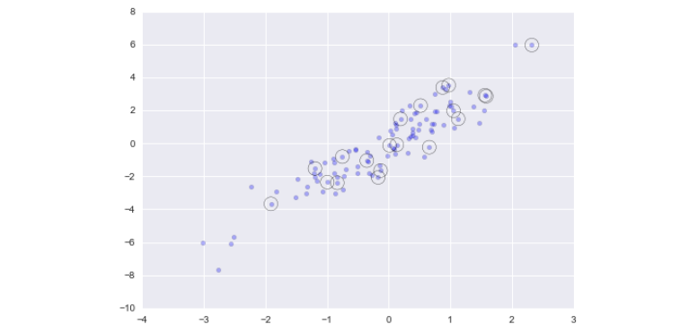

This sort of strategy is often used to quickly partition datasets, as is often needed in
train/test splitting for validation of statistical models (see “Hyperparameters and
Model Validation” on page 359), and in sampling approaches to answering statistical
questions.

**Modifying Values with Fancy Indexing**

Just as fancy indexing can be used to access parts of an array, it can also be used to
modify parts of an array. For example, imagine we have an array of indices and we’d
like to set the corresponding items in an array to some value:

```
In[18]: x = np.arange(10)
i = np.array([2, 1, 8, 4])
x[i] = 99
print(x)
[ 0 99 99
3 99
5
6
7 99
9]
```

We can use any assignment-type operator for this. For example:

```
In[19]: x[i] -= 10
print(x)
[ 0 89 89
3 89
5
6
7 89
9]
```

Notice, though, that repeated indices with these operations can cause some potentially unexpected results. Consider the following:

```
In[20]: x = np.zeros(10)
x[[0, 0]] = [4, 6]
print(x)
[ 6.
0.
0.
0.
0.
0.
0.
0.
0.
0.]
```

Where did the 4 go? The result of this operation is to first assign x[0] = 4, followed
by x[0] = 6. The result, of course, is that x[0] contains the value 6.
Fair enough, but consider this operation:

```
In[21]: i = [2, 3, 3, 4, 4, 4]
x[i] += 1
x
Out[21]: array([ 6.,
0.,
1.,
1.,
1.,
0.,
0.,
0.,
0.,
0.])
```

You might expect that x[3] would contain the value 2, and x[4] would contain the
value 3, as this is how many times each index is repeated. Why is this not the case?
Conceptually, this is because x[i] += 1 is meant as a shorthand of x[i] = x[i] + 1.
x[i] + 1 is evaluated, and then the result is assigned to the indices in x. With this in
mind, it is not the augmentation that happens multiple times, but the assignment,
which leads to the rather nonintuitive results.

So what if you want the other behavior where the operation is repeated? For this, you
can use the at() method of ufuncs (available since NumPy 1.8), and do the following:

```
In[22]: x = np.zeros(10)
np.add.at(x, i, 1)
print(x)
[ 0.
0.
1.
2.
3.
0.
0.
0.
0.
0.]
```

The at() method does an in-place application of the given operator at the specified
indices (here, i) with the specified value (here, 1). Another method that is similar in
spirit is the reduceat() method of ufuncs, which you can read about in the NumPy
documentation.

```
In[23]: np.random.seed(42)
x = np.random.randn(100)
# compute a histogram by hand
bins = np.linspace(-5, 5, 20)
counts = np.zeros_like(bins)
# find the appropriate bin for each x
i = np.searchsorted(bins, x)
# add 1 to each of these bins
np.add.at(counts, i, 1)
The counts now reflect the number of points within each bin—in other words, a his‐
togram (Figure 2-9):

In[24]: # plot the results
plt.plot(bins, counts, linestyle='steps');

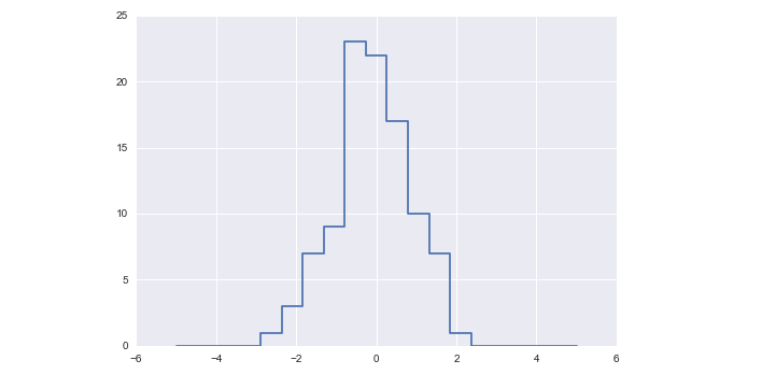
```

Of course, it would be silly to have to do this each time you want to plot a histogram.
This is why Matplotlib provides the plt.hist() routine, which does the same in a
single line:

`plt.hist(x, bins, histtype='step');`

This function will create a nearly identical plot to the one seen here. To compute the
binning, Matplotlib uses the np.histogram function, which does a very similar com‐
putation to what we did before. Let’s compare the two here:

```
In[25]: print("NumPy routine:")
%timeit counts, edges = np.histogram(x, bins)

print("Custom routine:")
%timeit np.add.at(counts, np.searchsorted(bins, x), 1)

NumPy routine:
10000 loops, best of 3: 97.6 µs per loop
Custom routine:
10000 loops, best of 3: 19.5 µs per loop
```

Our own one-line algorithm is several times faster than the optimized algorithm in
NumPy! How can this be? If you dig into the np.histogram source code (you can do
this in IPython by typing np.histogram??), you’ll see that it’s quite a bit more
involved than the simple search-and-count that we’ve done; this is because NumPy’s
algorithm is more flexible, and particularly is designed for better performance when
the number of data points becomes large:

```
In[26]: x = np.random.randn(1000000)
print("NumPy routine:")
%timeit counts, edges = np.histogram(x, bins)
print("Custom routine:")
%timeit np.add.at(counts, np.searchsorted(bins, x), 1)
NumPy routine:
10 loops, best of 3: 68.7 ms per loop
Custom routine:
10 loops, best of 3: 135 ms per loop
```

**Sorting Arrays**

Up to this point we have been concerned mainly with tools to access and operate on
array data with NumPy. This section covers algorithms related to sorting values in
NumPy arrays. These algorithms are a favorite topic in introductory computer sci‐
ence courses: if you’ve ever taken one, you probably have had dreams (or, depending
on your temperament, nightmares) about insertion sorts, selection sorts, merge sorts,
quick sorts, bubble sorts, and many, many more. All are means of accomplishing a
similar task: sorting the values in a list or array.

For example, a simple selection sort repeatedly finds the minimum value from a list,
and makes swaps until the list is sorted. We can code this in just a few lines of Python:

```
In[1]: import numpy as np
def selection_sort(x):
for i in range(len(x)):
swap = i + np.argmin(x[i:])
(x[i], x[swap]) = (x[swap], x[i])
return x

In[2]: x = np.array([2, 1, 4, 3, 5])
selection_sort(x)
Out[2]: array([1, 2, 3, 4, 5])
```

As any first-year computer science major will tell you, the selection sort is useful for
its simplicity, but is much too slow to be useful for larger arrays. For a list of N values,
it requires N loops, each of which does on the order of ~ N comparisons to find the
swap value. In terms of the “big-O” notation often used to characterize these algo‐
rithms (see “Big-O Notation” on page 92), selection sort averages � N 2 : if you dou‐
ble the number of items in the list, the execution time will go up by about a factor of
four.

Even selection sort, though, is much better than my all-time favorite sorting algo‐
rithms, the bogosort:

```
In[3]: def bogosort(x):
while np.any(x[:-1] > x[1:]):
np.random.shuffle(x)
return x

In[4]: x = np.array([2, 1, 4, 3, 5])
bogosort(x)Out[4]: array([1, 2, 3, 4, 5])
```

This silly sorting method relies on pure chance: it repeatedly applies a random shuffling of the array until the result happens to be sorted. With an average scaling of
O( N × N) ! (that’s N times N factorial), this should—quite obviously—never be used
for any real computation.

Fortunately, Python contains built-in sorting algorithms that are much more efficient
than either of the simplistic algorithms just shown. We’ll start by looking at the
Python built-ins, and then take a look at the routines included in NumPy and optimized for NumPy arrays.


**Fast Sorting in NumPy: np.sort and np.argsort**

Although Python has built-in sort and sorted functions to work with lists, we won’t
discuss them here because NumPy’s np.sort function turns out to be much more efficient and useful for our purposes. By default np.sort uses an � N log N , quick‐
sort algorithm, though mergesort and heapsort are also available. For most applications, the default quicksort is more than sufficient.

To return a sorted version of the array without modifying the input, you can use np.sort:

```
In[5]: x = np.array([2, 1, 4, 3, 5])
np.sort(x)
Out[5]: array([1, 2, 3, 4, 5])
```

If you prefer to sort the array in-place, you can instead use the sort method of arrays:

```
In[6]: x.sort()
print(x)
[1 2 3 4 5]
```

A related function is argsort, which instead returns the indices of the sorted
elements:

```
In[7]: x = np.array([2, 1, 4, 3, 5])
i = np.argsort(x)
print(i)
[1 0 3 2 4]
```

The first element of this result gives the index of the smallest element, the second
value gives the index of the second smallest, and so on. These indices can then be
used (via fancy indexing) to construct the sorted array if desired:

```
In[8]: x[i]
Out[8]: array([1, 2, 3, 4, 5])
```

**Sorting along rows or columns**

A useful feature of NumPy’s sorting algorithms is the ability to sort along specific
rows or columns of a multidimensional array using the axis argument. For example:

```
In[9]: rand = np.random.RandomState(42)
X = rand.randint(0, 10, (4, 6))
print(X)
[[6 3 7 4 6 9]
[2 6 7 4 3 7]
[7 2 5 4 1 7]
[5 1 4 0 9 5]]

In[10]: # sort each column of X
np.sort(X, axis=0)
Out[10]: array([[2, 1, 4, 0, 1, 5],
                [5, 2, 5, 4, 3, 7],
                [6, 3, 7, 4, 6, 7],
                [7, 6, 7, 4, 9, 9]])

In[11]: # sort each row of X
np.sort(X, axis=1)
Out[11]: array([[3, 4, 6, 6, 7, 9],
                [2, 3, 4, 6, 7, 7],
                [1, 2, 4, 5, 7, 7],
                [0, 1, 4, 5, 5, 9]])
```

Keep in mind that this treats each row or column as an independent array, and any
relationships between the row or column values will be lost!

**Partial Sorts: Partitioning**

Sometimes we’re not interested in sorting the entire array, but simply want to find the
K smallest values in the array. NumPy provides this in the np.partition function.
np.partition takes an array and a number K; the result is a new array with the small‐
est K values to the left of the partition, and the remaining values to the right, in arbi‐
trary order:

```
In[12]: x = np.array([7, 2, 3, 1, 6, 5, 4])
np.partition(x, 3)
Out[12]: array([2, 1, 3, 4, 6, 5, 7])
```

Note that the first three values in the resulting array are the three smallest in the
array, and the remaining array positions contain the remaining values. Within the
two partitions, the elements have arbitrary order.

Similarly to sorting, we can partition along an arbitrary axis of a multidimensional
array:

```
In[13]: np.partition(X, 2, axis=1)
Out[13]: array([[3, 4, 6, 7, 6, 9],
                [2, 3, 4, 7, 6, 7],
                [1, 2, 4, 5, 7, 7],
                [0, 1, 4, 5, 9, 5]])
```

The result is an array where the first two slots in each row contain the smallest values
from that row, with the remaining values filling the remaining slots.

Finally, just as there is a np.argsort that computes indices of the sort, there is a
np.argpartition that computes indices of the partition. We’ll see this in action in the
following section.

**Example: k-Nearest Neighbors**
Let’s quickly see how we might use this argsort function along multiple axes to find
the nearest neighbors of each point in a set. We’ll start by creating a random set of 10 points on a two-dimensional plane. Using the standard convention, we’ll arrange
these in a 10×2 array:

```
In[14]: X = rand.rand(10, 2)
```

To get an idea of how these points look, let’s quickly scatter plot them (Figure 2-10):

```
In[15]: %matplotlib inline
import matplotlib.pyplot as plt
import seaborn; seaborn.set() # Plot styling
plt.scatter(X[:, 0], X[:, 1], s=100);
```

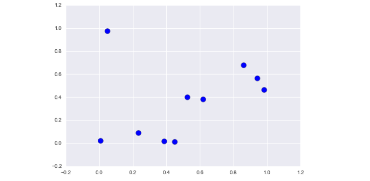

Now we’ll compute the distance between each pair of points. Recall that the squared-distance between two points is the sum of the squared differences in each dimension;
using the efficient broadcasting and aggregation (“Aggregations: Min, Max, and Everything in Between")
routines provided by NumPy, we can compute the matrix of square distances in a single line of code:

`In[16]: dist_sq = np.sum((X[:,np.newaxis,:] - X[np.newaxis,:,:]) ** 2, axis=-1)`

This operation has a lot packed into it, and it might be a bit confusing if you’re unfa‐
miliar with NumPy’s broadcasting rules. When you come across code like this, it can
be useful to break it down into its component steps:

```
In[17]: # for each pair of points, compute differences in their coordinates
differences = X[:, np.newaxis, :] - X[np.newaxis, :, :]
differences.shape
Out[17]: (10, 10, 2)

In[18]: # square the coordinate differences
sq_differences = differences ** 2
sq_differences.shape
Out[18]: (10, 10, 2)

In[19]: # sum the coordinate differences to get the squared distance
dist_sq = sq_differences.sum(-1)
dist_sq.shape
Out[19]: (10, 10)
```

Just to double-check what we are doing, we should see that the diagonal of this matrix
(i.e., the set of distances between each point and itself) is all zero:

```
In[20]: dist_sq.diagonal()
Out[20]: array([ 0.,
0.,
0.,
0.,
0.,
0.,
0.,
0.,
0.,
0.])
```

It checks out! With the pairwise square-distances converted, we can now use np.arg
sort to sort along each row. The leftmost columns will then give the indices of the
nearest neighbors:

```
In[21]: nearest = np.argsort(dist_sq, axis=1)
print(nearest)
[[0 3 9 7 1 4 2 5 6 8]
[1 4 7 9 3 6 8 5 0 2]
[2 1 4 6 3 0 8 9 7 5]
[3 9 7 0 1 4 5 8 6 2]
[4 1 8 5 6 7 9 3 0 2]
[5 8 6 4 1 7 9 3 2 0]
[6 8 5 4 1 7 9 3 2 0]
[7 9 3 1 4 0 5 8 6 2]
[8 5 6 4 1 7 9 3 2 0]
[9 7 3 0 1 4 5 8 6 2]]
```

Notice that the first column gives the numbers 0 through 9 in order: this is due to the
fact that each point’s closest neighbor is itself, as we would expect.
By using a full sort here, we’ve actually done more work than we need to in this case.
If we’re simply interested in the nearest k neighbors, all we need is to partition each
row so that the smallest k + 1 squared distances come first, with larger distances fill‐
ing the remaining positions of the array. We can do this with the np.argpartition
function:

```
In[22]: K = 2
nearest_partition = np.argpartition(dist_sq, K + 1, axis=1)
```

In order to visualize this network of neighbors, let’s quickly plot the points along with
lines representing the connections from each point to its two nearest neighbors.

```
In[23]: plt.scatter(X[:, 0], X[:, 1], s=100)
# draw lines from each point to its two nearest neighbors
K = 2
for i in range(X.shape[0]):
for j in nearest_partition[i, :K+1]:
# plot a line from X[i] to X[j]
# use some zip magic to make it happen:
plt.plot(*zip(X[j], X[i]), color='black')
```

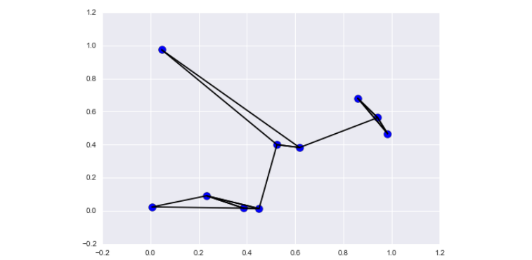

Each point in the plot has lines drawn to its two nearest neighbors. At first glance, it
might seem strange that some of the points have more than two lines coming out of
them: this is due to the fact that if point A is one of the two nearest neighbors of point
B, this does not necessarily imply that point B is one of the two nearest neighbors of
point A.

Although the broadcasting and row-wise sorting of this approach might seem less
straightforward than writing a loop, it turns out to be a very efficient way of operating
on this data in Python. You might be tempted to do the same type of operation by
manually looping through the data and sorting each set of neighbors individually, but
this would almost certainly lead to a slower algorithm than the vectorized version we
used. The beauty of this approach is that it’s written in a way that’s agnostic to the size
of the input data: we could just as easily compute the neighbors among 100 or
1,000,000 points in any number of dimensions, and the code would look the same.

Finally, I’ll note that when doing very large nearest-neighbor searches, there are tree-
based and/or approximate algorithms that can scale as � N log N or better rather than the � N 2 of the brute-force algorithm. One example of this is the KD-Tree,
implemented in Scikit-Learn.

>Hint 
> 
> Big-O Notation
Big-O notation is a means of describing how the number of operations required for
an algorithm scales as the input grows in size. To use it correctly is to dive deeply into
the realm of computer science theory, and to carefully distinguish it from the related
small-o notation, big-θ notation, big-Ω notation, and probably many mutant hybrids
thereof. While these distinctions add precision to statements about algorithmic scal‐
ing, outside computer science theory exams and the remarks of pedantic blog com‐
menters, you’ll rarely see such distinctions made in practice. Far more common in the
data science world is a less rigid use of big-O notation: as a general (if imprecise)
description of the scaling of an algorithm. With apologies to theorists and pedants,
this is the interpretation we’ll use throughout this book.
Big-O notation, in this loose sense, tells you how much time your algorithm will take
as you increase the amount of data. If you have an � N (read “order N”) algorithm
that takes 1 second to operate on a list of length N=1,000, then you should expect it to
take roughly 5 seconds for a list of length N=5,000. If you have an � N 2 (read “order
N squared”) algorithm that takes 1 second for N=1,000, then you should expect it to
take about 25 seconds for N=5,000.
For our purposes, the N will usually indicate some aspect of the size of the dataset (the
number of points, the number of dimensions, etc.). When trying to analyze billions or
trillions of samples, the difference between � N and � N 2 can be far from trivial!
Notice that the big-O notation by itself tells you nothing about the actual wall-clock
time of a computation, but only about its scaling as you change N. Generally, for
example, an � N algorithm is considered to have better scaling than an � N 2 algo‐
rithm, and for good reason. But for small datasets in particular, the algorithm with
better scaling might not be faster. For example, in a given problem an � N 2 algo‐
rithm might take 0.01 seconds, while a “better” � N algorithm might take 1 second.
Scale up N by a factor of 1,000, though, and the � N algorithm will win out.
Even this loose version of Big-O notation can be very useful for comparing the per‐
formance of algorithms, and we’ll use this notation throughout the book when talking
about how algorithms scale.

**Structured Data: NumPy’s Structured Arrays**

While often our data can be well represented by a homogeneous array of values,
sometimes this is not the case. This section demonstrates the use of NumPy’s structured arrays and record arrays, which provide efficient storage for compound, heterogeneous data. While the patterns shown here are useful for simple operations,
scenarios like this often lend themselves to the use of Pandas DataFrames, which we’ll explore later.

Imagine that we have several categories of data on a number of people (say, name, age, and weight), and we’d like to store these values for use in a Python program. It
would be possible to store these in three separate arrays:

```
In[2]: name = ['Alice', 'Bob', 'Cathy', 'Doug']
age = [25, 45, 37, 19]
weight = [55.0, 85.5, 68.0, 61.5]
```

But this is a bit clumsy. There’s nothing here that tells us that the three arrays are
related; it would be more natural if we could use a single structure to store all of this
data. NumPy can handle this through structured arrays, which are arrays with com‐
pound data types.

Recall that previously we created a simple array using an expression like this:

```
In[3]: x = np.zeros(4, dtype=int)
```

We can similarly create a structured array using a compound data type specification:

```
In[4]: # Use a compound data type for structured arrays
data = np.zeros(4, dtype={'names':('name', 'age', 'weight'),
'formats':('U10', 'i4', 'f8')})
print(data.dtype)
[('name', '<U10'), ('age', '<i4'), ('weight', '<f8')]
Here 'U10' translates to “Unicode string of maximum length 10,” 'i4' translates to
“4-byte (i.e., 32 bit) integer,” and 'f8' translates to “8-byte (i.e., 64 bit) float.” We’ll
discuss other options for these type codes in the following section.
Now that we’ve created an empty container array, we can fill the array with our lists of
values:

In[5]: data['name'] = name
data['age'] = age
data['weight'] = weight
print(data)
[('Alice', 25, 55.0) ('Bob', 45, 85.5) ('Cathy', 37, 68.0)
('Doug', 19, 61.5)]

```

As we had hoped, the data is now arranged together in one convenient block of
memory.

The handy thing with structured arrays is that you can now refer to values either by
index or by name:

```
In[6]: # Get all names
data['name']

Out[6]: array(['Alice', 'Bob', 'Cathy', 'Doug'],
dtype='<U10')

In[7]: # Get first row of data
data[0]
Out[7]: ('Alice', 25, 55.0)

In[8]: # Get the name from the last row
data[-1]['name']
Out[8]: 'Doug'
```

Using Boolean masking, this even allows you to do some more sophisticated operastions such as filtering on age:

```
In[9]: # Get names where age is under 30
data[data['age'] < 30]['name']
Out[9]: array(['Alice', 'Doug'],
dtype='<U10')
```

Note that if you’d like to do any operations that are any more complicated than these,
you should probably consider the Pandas package, covered in the next chapter. As
we’ll see, Pandas provides a DataFrame object, which is a structure built on NumPy
arrays that offers a variety of useful data manipulation functionality similar to what
we’ve shown here, as well as much, much more.

**Creating Structured Arrays**

Structured array data types can be specified in a number of ways. Earlier, we saw the
dictionary method:

```
In[10]: np.dtype({'names':('name', 'age', 'weight'),
'formats':('U10', 'i4', 'f8')})
Out[10]: dtype([('name', '<U10'), ('age', '<i4'), ('weight', '<f8')])
```

For clarity, numerical types can be specified with Python types or NumPy dtypes
instead:

```
In[11]: np.dtype({'names':('name', 'age', 'weight'),
'formats':((np.str_, 10), int, np.float32)})
Out[11]: dtype([('name', '<U10'), ('age', '<i8'), ('weight', '<f4')])
```

A compound type can also be specified as a list of tuples:
```
In[12]: np.dtype([('name', 'S10'), ('age', 'i4'), ('weight', 'f8')])
Out[12]: dtype([('name', 'S10'), ('age', '<i4'), ('weight', '<f8')])
```

If the names of the types do not matter to you, you can specify the types alone in a
comma-separated string:

```
In[13]: np.dtype('S10,i4,f8')
Out[13]: dtype([('f0', 'S10'), ('f1', '<i4'), ('f2', '<f8')])
```

The shortened string format codes may seem confusing, but they are built on simple
principles. The first (optional) character is < or >, which means “little endian” or “big
endian,” respectively, and specifies the ordering convention for significant bits. The
next character specifies the type of data: characters, bytes, ints, floating points, and so
on (see Table 2-4). The last character or characters represents the size of the object in
bytes.

**NumPy data types**


**More Advanced Compound Types**

It is possible to define even more advanced compound types. For example, you can
create a type where each element contains an array or matrix of values. Here, we’ll
create a data type with a mat component consisting of a 3×3 floating-point matrix:

```
In[14]: tp = np.dtype([('id', 'i8'), ('mat', 'f8', (3, 3))])
X = np.zeros(1, dtype=tp)
print(X[0])
print(X['mat'][0])
(0, [[0.0, 0.0, 0.0], [0.0, 0.0, 0.0], [0.0, 0.0, 0.0]])
[[ 0. 0. 0.]
[ 0. 0. 0.]
[ 0. 0. 0.]]
```

Now each element in the X array consists of an id and a 3×3 matrix. Why would you
use this rather than a simple multidimensional array, or perhaps a Python dictionary?
The reason is that this NumPy dtype directly maps onto a C structure definition, so
the buffer containing the array content can be accessed directly within an appropri‐
ately written C program. If you find yourself writing a Python interface to a legacy C
or Fortran library that manipulates structured data, you’ll probably find structured
arrays quite useful!

**RecordArrays: Structured Arrays with a Twist**

NumPy also provides the np.recarray class, which is almost identical to the structured arrays just described, but with one additional feature: fields can be accessed as
attributes rather than as dictionary keys. Recall that we previously accessed the ages
by writing:

```
In[15]: data['age']
Out[15]: array([25, 45, 37, 19], dtype=int32)
```

If we view our data as a record array instead, we can access this with slightly fewer
keystrokes:

```
In[16]: data_rec = data.view(np.recarray)
data_rec.age
Out[16]: array([25, 45, 37, 19], dtype=int32)
```

The downside is that for record arrays, there is some extra overhead involved in
accessing the fields, even when using the same syntax. We can see this here:

```
In[17]: %timeit data['age']
%timeit data_rec['age']
%timeit data_rec.age
1000000 loops, best of 3: 241 ns per loop
100000 loops, best of 3: 4.61 µs per loop
100000 loops, best of 3: 7.27 µs per loop
```

Whether the more convenient notation is worth the additional overhead will depend
on your own application.