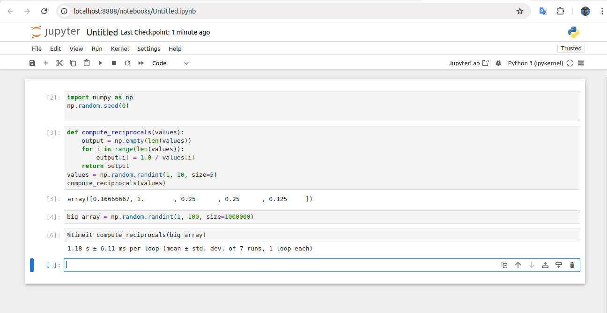

# NumPy

## Array and Coding Efficiencies

### Dynamic type and Dynamic type of Array

* Display the version

```shell
>>> import numpy
>>> numpy.__version__
'1.24.3'
```

* A tab will show you built-in functions.

```shell
>>> import numpy as np
>>> np.[tab on your keyboard]
```


* Data types is an object in C.

A Python Integer Is More Than Just an Integer.
It’s actually a pointer to a compound C struc‐
ture, which contains several values.

```C
struct _longobject {
    long ob_refcnt;
    PyTypeObject *ob_type;
    size_t ob_size;
    long ob_digit[1];
};
```

A single integer in Python 3.4 actually contains four pieces:

• ob_refcnt, a reference count that helps Python silently handle memory alloca‐
tion and deallocation
• ob_type, which encodes the type of the variable
• ob_size, which specifies the size of the following data members
• ob_digit, which contains the actual integer value that we expect the Python vari‐able to represent

This means that there is some overhead in storing an integer in Python as compared
to an integer in a compiled language like C, as illustrated below,


* A Python List Is More Than Just a List.

Because of Python’s dynamic typing, we can even create heterogeneous lists:

```python
In[5]: L3 = [True, "2", 3.0, 4]
[type(item) for item in L3]

Out[5]: [bool, str, float, int]
```

**Cons:**

But this flexibility comes at a cost: to allow these flexible types, each item in the list must contain its own type info, reference count, and other information—that is, each item is a complete Python object. In the special case that all variables are of the same type, much of this information is ***redundant***: it can be much more efficient to store data in a fixed-type array.

* For an array, it should be At the implementation level, the array essentially contains a single pointer to one con‐tiguous block of data. The Python list, on the other hand, contains a pointer to a block of pointers, each of which in turn points to a full Python object like the Python integer we saw earlier. **Array Vs LinkedList**

> Hint: Java Interview question: ArrayList vs LinkedList.

* Fixed-type NumPy-style arrays lack this flexibil‐ity, but are much more efficient for storing and manipulating data.

### Fixed-Type Arrays in Python

Python offers several different options for storing data in efficient, fixed-type data buffers. The built-in array module (available since Python 3.3) can be used to create dense arrays of a uniform type:

```python
In[6]: import array
L = list(range(10))
A = array.array('i', L)
A
Out[6]: array('i', [0, 1, 2, 3, 4, 5, 6, 7, 8, 9])
```

Here 'i' is a type code indicating the contents are integers.
Much more useful, however, is the ndarray object of the Nu

However, NumPy's ndarray provides more flexibility in efficient operations on that data.

### Creating Arrays from Python Lists

```python
In[7]: import numpy as np
In[8]: # integer array:
np.array([1, 4, 2, 5, 3])
Out[8]: array([1, 4, 2, 5, 3])
```

**Upcast**

```python
In[9]: np.array([3.14, 4, 2, 3])
Out[9]: array([ 3.14, 4.,2.,3.])
```

**Data Type**

```python
In[10]: np.array([1, 2, 3, 4], dtype='float32')
Out[10]: array([ 1.,2.,3.,4.], dtype=float32)
```

**Multidimentional**

```python
In[11]: # nested lists result in multidimensional arrays
np.array([range(i, i + 3) for i in [2, 4, 6]])
Out[11]: array([[2, 3, 4],
[4, 5, 6],
[6, 7, 8]])
```

**Creating Arrays from Scratch**

```python

Especially for larger arrays, it is more efficient to create arrays from scratch using rou‐tines built into NumPy. Here are several examples:

In[12]: # Create a length-10 integer array filled with zeros
np.zeros(10, dtype=int)
Out[12]: array([0, 0, 0, 0, 0, 0, 0, 0, 0, 0])

In[13]: # Create a 3x5 floating-point array filled with 1s
np.ones((3, 5), dtype=float)
Out[13]: array([[ 1.,[ 1.,[ 1.,1.,1.,1.,1.,1.,1.,1.,1.,1.,1.],1.],1.]])

In[14]: # Create a 3x5 array filled with 3.14
np.full((3, 5), 3.14)
Out[14]: array([[ 3.14, 3.14, 3.14, 3.14, 3.14],
                [ 3.14, 3.14, 3.14, 3.14, 3.14],
                [ 3.14, 3.14, 3.14, 3.14, 3.14]])

In[15]: # Create an array filled with a linear sequence
# Starting at 0, ending at 20, stepping by 2
# (this is similar to the built-in range() function)
np.arange(0, 20, 2)
Out[15]: array([0, 2, 4, 6, 8, 10, 12, 14, 16, 18])

In[16]: # Create an array of five values evenly spaced between 0 and 1
np.linspace(0, 1, 5)
Out[16]: array([0.,0.25,0.5,0.75,1.])

In[17]: # Create a 3x3 array of uniformly distributed
# random values between 0 and 1
np.random.random((3, 3))
Out[17]: array([[ 0.99844933,0.52183819,0.22421193],
[ 0.08007488,0.45429293, 0.20941444],
[ 0.14360941,0.96910973,0.946117 ]])

In[18]: # Create a 3x3 array of normally distributed random values
# with mean 0 and standard deviation 1
np.random.normal(0, 1, (3, 3))
Out[18]: array([[ 1.51772646, 0.39614948, -0.10634696]
                [ 0.25671348, 0.00732722, 0.37783601],
                [ 0.68446945,0.15926039, -0.70744073]])

In[19]: # Create a 3x3 array of random integers in the interval [0, 10)
np.random.randint(0, 10, (3, 3))
Out[19]: array([[2, 3, 4],
                [5, 7, 8],
                [0, 5, 0]])

In[20]: # Create a 3x3 identity matrix
np.eye(3)
Out[20]: array([[ 1., 0., 0.],
                [ 0., 1., 0.],
                [ 0., 0., 1.]])

In[21]: # Create an uninitialized array of three integers
# The values will be whatever happens to already exist at that
# memory location
np.empty(3)
Out[21]: array([ 1.,1.,1.])
```

## NumPy Standard Data Types

NumPy arrays contain values of a single type, so it is important to have detailed
knowledge of those types and their limitations. Because NumPy is built in C, the
types will be familiar to users of **C**, **Fortran**, and other related languages.

You can do either of the followings, and they are the same.

`np.zeros(10, dtype='int16')`

or

`np.zeros(10, dtype=np.int16)`

**Standard NumPy data types**


## Basics of NumPy

**The Basics of NumPy Arrays**

* Attributes of arrays
Determining the size, shape, memory consumption, and data types of arrays

* Indexing of arrays
Getting and setting the value of individual array elements

* Slicing of arrays
Getting and setting smaller subarrays within a larger array

* Reshaping of arrays
Changing the shape of a given array

* Joining and splitting of arrays
Combining multiple arrays into one, and splitting one array into many

### NumPy Array Attributes

Let us use the following examples to emuerate all the features.

```python
In[1]: import numpy as np
np.random.seed(0) # seed for reproducibility
x1 = np.random.randint(10, size=6) # One-dimensional array
x2 = np.random.randint(10, size=(3, 4)) # Two-dimensional array
x3 = np.random.randint(10, size=(3, 4, 5)) # Three-dimensional array
```

Each array has attributes ndim (the number of dimensions), shape (the size of each dimension), and size (the total size of the array):

```python
In[2]: print("x3 ndim: ", x3.ndim)
print("x3 shape:", x3.shape)
print("x3 size: ", x3.size)
x3 ndim: 3
x3 shape: (3, 4, 5)
x3 size: 60

In[3]: print("dtype:", x3.dtype)
dtype: int64

In[4]: print("itemsize:", x3.itemsize, "bytes")
print("nbytes:", x3.nbytes, "bytes")
itemsize: 8 bytes
nbytes: 480 bytes
```

### Array Indexing: Accessing Single Elements

```python
In[5]: x1
Out[5]: array([5, 0, 3, 3, 7, 9])

In[6]: x1[0]
Out[6]: 5

In[7]: x1[4]
Out[7]: 7
```

To index from the end of the array, you can use negative indices:

```sql
In[8]: x1[-1]
Out[8]: 9

In[9]: x1[-2]
Out[9]: 7
```

In a multidimensional array, you access items using a comma-separated tuple of
indices:

```sql
In[10]: x2
Out[10]: array([[3, 5, 2, 4],
[7, 6, 8, 8],
[1, 6, 7, 7]])

In[11]: x2[0, 0]
Out[11]: 3
```

In a multidimensional array, you access items using a comma-separated tuple of
indices:

```python
In[10]: x2
Out[10]: array([[3, 5, 2, 4],
[7, 6, 8, 8],
[1, 6, 7, 7]])

In[11]: x2[0, 0]
Out[11]: 3
|
In[12]: x2[2, 0]
Out[12]: 1

In[13]: x2[2, -1]
Out[13]: 7
```

You can also modify values using any of the above index notation:

```python
In[14]: x2[0, 0] = 12
x2
Out[14]: array([[12, 5, 2, 4],
                [7,6,8,8],
                [1,6,7,7]])

```

### Array Slicing: Accessing Subarrays

***syntax***: `x[start:stop:step]`

***One-dimensional subarrays***

```python
In[16]: x = np.arange(10)
x
Out[16]: array([0, 1, 2, 3, 4, 5, 6, 7, 8, 9])
In[17]: x[:5] # first five elements
Out[17]: array([0, 1, 2, 3, 4])
In[18]: x[5:] # elements after index 5
Out[18]: array([5, 6, 7, 8, 9])
In[19]: x[4:7] # middle subarray
Out[19]: array([4, 5, 6])
In[20]: x[::2]
# every other element
Out[20]: array([0, 2, 4, 6, 8])
In[21]: x[1::2]
# every other element, starting at index 1
Out[21]: array([1, 3, 5, 7, 9])
```

A potentially confusing case is when the step value is negative. In this case, the defaults for start and stop are swapped. This becomes a convenient way to reverse an array:

```python
In[22]: x[::-1]
# all elements, reversed
Out[22]: array([9, 8, 7, 6, 5, 4, 3, 2, 1, 0])
In[23]: x[5::-2]
# reversed every other from index 5
Out[23]: array([5, 3, 1])
```

***Multidimensional subarrays***

In[24]: x2
Out[24]: array([[12, 5, 2, 4],
[ 7, 6, 8, 8],
[ 1, 6, 7, 7]])

In[25]: x2[:2, :3] # two rows, three columns
Out[25]: array([[12,
[ 7,5,
6,
2],
8]])

In[26]: x2[:3, ::2]# all rows, every other column
Out[26]: array([[12,
[ 7,
[ 1,2],
8],
7]])

Finally, subarray dimensions can even be reversed together:

In[27]: x2[::-1, ::-1]
Out[27]: array([[ 7,
[ 8,
[ 4,
7,
8,
2,
6, 1],
6, 7],
5, 12]])

[Page 45]

***Accessing array rows and columns***

```sql
In[28]: print(x2[:, 0]) # first column of x2
[12 7 1]

In[29]: print(x2[0, :]) # first row of x2
[12 5 2 4]
```

In the case of row access, the empty slice can be omitted for a more compact syntax:

```sql
In[30]: print(x2[0]) # equivalent to x2[0, :]
[12 5 2 4]
```

***Subarrays as no-copy views***

Consider our two-dimensional array from before:

### Reshaping of Arrays

***Array Concatenation and Splitting***

### Computation on NumPy Arrays: Universal Functions

Computation on NumPy arrays can be very fast, or it can be very slow. The key to
making it fast is to use vectorized operations, generally implemented through Num‐Py’s universal functions (ufuncs).

***The Slowness of Loops***

The following is a quicker way to get jupyter notebook.
To be exact, it is the IPython shell that I am interseted to use.

`pip3 install jupyter`

`python3 -m notebook`



**Introducing UFuncs**

Vectorized operations in NumPy are implemented via ufuncs, whose main purpose is
to quickly execute repeated operations on values in NumPy arrays.

Using the same 1M numbers big array, we do some math operations, and we can see the difference in timing,


Ufuncs are
extremely flexible—before we saw an operation between a scalar and an array, but we
can also operate between two arrays:
In[5]: np.arange(5) / np.arange(1, 6)
Out[5]: array([ 0.
,
0.5
,
0.66666667,
0.75
,
0.8
])
And ufunc operations are not limited to one-dimensional arrays—they can act on
multidimensional arrays as well:

```python
In[6]: x = np.arange(9).reshape((3, 3))
2 ** x
Out[6]: array([[ 1, 2, 4],
               [ 8, 16, 32],
               [ 64, 128, 256]])
```


**Examples**

***Array arithmetic***

NumPy’s ufuncs feel very natural to use because they make use of Python’s native arithmetic operators. The standard addition, subtraction multiplication, and division can all be used:

```python
In[7]: x = np.arange(4)
print("x=", x)
print("x + 5 =", x + 5)
print("x - 5 =", x - 5)
print("x * 2 =", x * 2)
print("x // 2 =", x // 2)
x= [0 1 2 3]
x + 5 = [5 6 7 8]
x - 5 = [-5 -4 -3 -2]
x * 2 = [0 2 4 6]
x / 2 = [ 0.0.5 1.1.5]
x // 2 = [0 0 1 1]
```

# floor division

There is also a unary ufunc for negation, a ** operator for exponentiation, and a % operator for modulus:

```python
In[8]: print("-x= ", -x)
print("x ** 2 = ", x ** 2)
print("x % 2 = ", x % 2)
-x= [ 0 -1 -2 -3]
x ** 2 = [0 1 4 9]
x % 2 = [0 1 0 1]
```

In addition, these can be strung together however you wish, and the standard order of operations is respected:

```python
In[9]: -(0.5*x + 1) ** 2
Out[9]: array([-1. , -2.25, -4., -6.25])

All of these arithmetic operations are simply convenient wrappers around specific functions built into NumPy; for example, the + operator is a wrapper for the add function:

In[10]: np.add(x, 2)
Out[10]: array([2, 3, 4, 5])

**Absolute value**

Just as NumPy understands Python’s built-in arithmetic operators, it also understands Python’s built-in absolute value function:

```python
In[11]: x = np.array([-2, -1, 0, 1, 2])
abs(x)
Out[11]: array([2, 1, 0, 1, 2])
```

The corresponding NumPy ufunc is np.absolute, which is also available under the alias `np.abs`:

```python
In[12]: np.absolute(x)
Out[12]: array([2, 1, 0, 1, 2])
In[13]: np.abs(x)
Out[13]: array([2, 1, 0, 1, 2])
```

This ufunc can also handle complex data, in which the absolute value returns the magnitude:

```python
In[14]: x = np.array([3 - 4j, 4 - 3j, 2 + 0j, 0 + 1j])
np.abs(x)
Out[14]: array([ 5., 5., 2., 1.])
```

**Trigonometric functions**

NumPy provides a large number of useful ufuncs, and some of the most useful for the data scientist are the trigonometric functions. We’ll start by defining an array of angles:

```python
In[15]: theta = np.linspace(0, np.pi, 3)
```

Now we can compute some trigonometric functions on these values:

```python
In[16]: print("theta= ", theta)
print("sin(theta) = ", np.sin(theta))
print("cos(theta) = ", np.cos(theta))
print("tan(theta) = ", np.tan(theta))
theta= [ 0. 1.57079633 3.14159265]
sin(theta) = [ 0.00000000e+00 1.00000000e+00 1.22464680e-16]
cos(theta) = [ 1.00000000e+00 6.12323400e-17 -1.00000000e+00]
tan(theta) = [ 0.00000000e+00 1.63312394e+16 -1.22464680e-16]
```

The values are computed to within machine precision, which is why values that should be zero do not always hit exactly zero. Inverse trigonometric functions are also available:

```python
In[17]: x = [-1, 0, 1]
print("x= ", x)
print("arcsin(x) = ", np.arcsin(x))
print("arccos(x) = ", np.arccos(x))
print("arctan(x) = ", np.arctan(x))
x= [-1, 0, 1]
arcsin(x) = [-1.57079633 0. 1.57079633]
arccos(x) = [ 3.14159265 1.57079633 0.]
arctan(x) = [-0.78539816 0 0.78539816]
```

**Exponents and logarithms**

Another common type of operation available in a NumPy ufunc are the exponentials:

```python
In[18]: x = [1, 2, 3]
print("x=", x)
print("e^x=", np.exp(x))
print("2^x=", np.exp2(x))
print("3^x=", np.power(3, x))
x= [1, 2, 3]
e^x = [ 2.71828183 7.3890561 20.08553692]
2^x = [ 2. 4. 8.]
3^x = [ 3 9 27]
```

The inverse of the exponentials, the logarithms, are also available. The basic `np.log` gives the natural logarithm; if you prefer to compute the base-2 logarithm or the base-10 logarithm, these are available as well:

```python
In[19]: x = [1, 2, 4, 10]
print("x=", x)
print("ln(x)=", np.log(x))
print("log2(x) =", np.log2(x))
print("log10(x) =", np.log10(x))
x= [1, 2, 4, 10]
ln(x)= [ 0. 0.69314718
log2(x) = [ 0. 1. 3.32192809]
log10(x) = [ 0. 0.60205999 1.]
0.30103
1.38629436 2.30258509]
2.
```

There are also some specialized versions that are useful for maintaining precision
with very small input:

```python
In[20]: x = [0, 0.001, 0.01, 0.1]
print("exp(x) - 1 =", np.expm1(x))
print("log(1 + x) =", np.log1p(x))
exp(x) - 1 = [ 0.
log(1 + x) = [ 0.
0.0010005
0.0009995
0.01005017 0.10517092]
0.00995033 0.09531018]
```

When x is very small, these functions give more precise values than if the raw np.log
or np.exp were used.

**Specialized ufuncs**

NumPy has many more ufuncs available, including hyperbolic trig functions, bitwise
arithmetic, comparison operators, conversions from radians to degrees, rounding and
remainders, and much more. A look through the NumPy documentation reveals a lot
of interesting functionality.

Another excellent source for more specialized and obscure ufuncs is the submodule
scipy.special. If you want to compute some obscure mathematical function on
your data, chances are it is implemented in scipy.special. There are far too many
functions to list them all, but the following snippet shows a couple that might come
up in a statistics context:

```python
In[21]: from scipy import special
In[22]: # Gamma functions (generalized factorials) and related functions
x = [1, 5, 10]
print("gamma(x)
=", special.gamma(x))
print("ln|gamma(x)| =", special.gammaln(x))
print("beta(x, 2)
=", special.beta(x, 2))
gamma(x)
= [ 1.00000000e+00
2.40000000e+01
3.62880000e+05]
ln|gamma(x)| = [ 0.
3.17805383 12.80182748]
beta(x, 2)
= [ 0.5
0.03333333 0.00909091]
In[23]: # Error function (integral of Gaussian)
# its complement, and its inverse
x = np.array([0, 0.3, 0.7, 1.0])
print("erf(x) =", special.erf(x))
print("erfc(x) =", special.erfc(x))
print("erfinv(x) =", special.erfinv(x))
erf(x) = [ 0.
erfc(x) = [ 1.
erfinv(x) = [ 0.
0.32862676 0.67780119 0.84270079]
0.67137324 0.32219881 0.15729921]
0.27246271 0.73286908
inf]
```

There are many, many more ufuncs available in both NumPy and scipy.special.
Because the documentation of these packages is available online, a web search along
the lines of “gamma function python” will generally find the relevant information.

**Advanced Ufunc Features**

Many NumPy users make use of ufuncs without ever learning their full set of features.
We’ll outline a few specialized features of ufuncs here.

Specifying output

For large calculations, it is sometimes useful to be able to specify the array where the
result of the calculation will be stored. Rather than creating a temporary array, you
can use this to write computation results directly to the memory location where you’d
56
|
Chapter 2: Introduction to NumPylike them to be. For all ufuncs, you can do this using the out argument of the
function:

```python
In[24]: x = np.arange(5)
y = np.empty(5)
np.multiply(x, 10, out=y)
print(y)
[
0.
10.
20.
30.
40.]
```

This can even be used with array views. For example, we can write the results of a
computation to every other element of a specified array:

```python
In[25]: y = np.zeros(10)
np.power(2, x, out=y[::2])
print(y)
[
1.
0.
2.
0.
4.
0.
8.
0.
16.
0.]
```

If we had instead written y[::2] = 2 ** x, this would have resulted in the creation
of a temporary array to hold the results of 2 ** x, followed by a second operation
copying those values into the y array. This doesn’t make much of a difference for such
a small computation, but for very large arrays the memory savings from careful use of
the out argument can be significant.

**Aggregates**

For binary ufuncs, there are some interesting aggregates that can be computed
directly from the object. For example, if we’d like to reduce an array with a particular
operation, we can use the reduce method of any ufunc. A reduce repeatedly applies a
given operation to the elements of an array until only a single result remains.
For example, calling reduce on the add ufunc returns the sum of all elements in the
array:

```python
In[26]: x = np.arange(1, 6)
np.add.reduce(x)
Out[26]: 15
```

Similarly, calling reduce on the multiply ufunc results in the product of all array
elements:

```python
In[27]: np.multiply.reduce(x)
Out[27]: 120
```

If we’d like to store all the intermediate results of the computation, we can instead use
accumulate:

```python
In[28]: np.add.accumulate(x)
Out[28]: array([ 1,
3,
6, 10, 15])

In[29]: np.multiply.accumulate(x)
Out[29]: array([
1,
2,
6,
24, 120])
```

**Outer products**

Finally, any ufunc can compute the output of all pairs of two different inputs using
the outer method. This allows you, in one line, to do things like create a multiplica‐
tion table:

```python
In[30]: x = np.arange(1, 6)
np.multiply.outer(x, x)
Out[30]: array([[ 1, 2, 3, 4, 5],
[ 2, 4, 6, 8, 10],
[ 3, 6, 9, 12, 15],
[ 4, 8, 12, 16, 20],
[ 5, 10, 15, 20, 25]])
```

The ufunc.at and ufunc.reduceat methods, which we’ll explore in “Fancy Index‐
ing” on page 78, are very helpful as well.

Another extremely useful feature of ufuncs is the ability to operate between arrays of
different sizes and shapes, a set of operations known as broadcasting. This subject is
important enough that we will devote a whole section to it (see “Computation on
Arrays: Broadcasting” on page 63).

## NumPy Aggregations: Min, Max, and Everything in Between

Summing the Values in an Array
As a quick example, consider computing the sum of all values in an array. Python
itself can do this using the built-in sum function:
In[1]: import numpy as np
In[2]: L = np.random.random(100)
sum(L)
Out[2]: 55.61209116604941
The syntax is quite similar to that of NumPy’s sum function, and the result is the same
in the simplest case:
In[3]: np.sum(L)
Out[3]: 55.612091166049424
However, because it executes the operation in compiled code, NumPy’s version of the
operation is computed much more quickly:
In[4]: big_array = np.random.rand(1000000)
%timeit sum(big_array)
%timeit np.sum(big_array)
10 loops, best of 3: 104 ms per loop
1000 loops, best of 3: 442 µs per loop
Be careful, though: the sum function and the np.sum function are not identical, which
can sometimes lead to confusion! In particular, their optional arguments have differ‐
ent meanings, and np.sum is aware of multiple array dimensions, as we will see in the
following section.
Minimum and Maximum
Similarly, Python has built-in min and max functions, used to find the minimum value
and maximum value of any given array:
In[5]: min(big_array), max(big_array)
Out[5]: (1.1717128136634614e-06, 0.9999976784968716)
NumPy’s corresponding functions have similar syntax, and again operate much more
quickly:
In[6]: np.min(big_array), np.max(big_array)
Out[6]: (1.1717128136634614e-06, 0.9999976784968716)

In[7]: %timeit min(big_array)
%timeit np.min(big_array)
10 loops, best of 3: 82.3 ms per loop
1000 loops, best of 3: 497 µs per loop
For min, max, sum, and several other NumPy aggregates, a shorter syntax is to use
methods of the array object itself:
In[8]: print(big_array.min(), big_array.max(), big_array.sum())
1.17171281366e-06 0.999997678497 499911.628197
Whenever possible, make sure that you are using the NumPy version of these aggre‐
gates when operating on NumPy arrays!
Multidimensional aggregates
One common type of aggregation operation is an aggregate along a row or column.
Say you have some data stored in a two-dimensional array:
In[9]: M = np.random.random((3, 4))
print(M)
[[ 0.8967576
0.03783739 0.75952519 0.06682827]
[ 0.8354065
0.99196818 0.19544769 0.43447084]
[ 0.66859307 0.15038721 0.37911423 0.6687194 ]]
By default, each NumPy aggregation function will return the aggregate over the entire
array:
In[10]: M.sum()
Out[10]: 6.0850555667307118
Aggregation functions take an additional argument specifying the axis along which
the aggregate is computed. For example, we can find the minimum value within each
column by specifying axis=0:
In[11]: M.min(axis=0)
Out[11]: array([ 0.66859307,
0.03783739,
0.19544769,
0.06682827])
The function returns four values, corresponding to the four columns of numbers.
Similarly, we can find the maximum value within each row:
In[12]: M.max(axis=1)
Out[12]: array([ 0.8967576 ,
0.99196818,
0.6687194 ])
The way the axis is specified here can be confusing to users coming from other lan‐
guages. The axis keyword specifies the dimension of the array that will be collapsed,
rather than the dimension that will be returned. So specifying axis=0 means that the

first axis will be collapsed: for two-dimensional arrays, this means that values within
each column will be aggregated.
Other aggregation functions
NumPy provides many other aggregation functions, but we won’t discuss them in
detail here. Additionally, most aggregates have a NaN-safe counterpart that computes
the result while ignoring missing values, which are marked by the special IEEE
floating-point NaN value (for a fuller discussion of missing data, see “Handling Miss‐
ing Data” on page 119). Some of these NaN-safe functions were not added until
NumPy 1.8, so they will not be available in older NumPy versions.
Table 2-3 provides a list of useful aggregation functions available in NumPy.


**Example: What Is the Average Height of US Presidents?**

In[13]: !head -4 data/president_heights.csv
order,name,height(cm)
1,George Washington,189
2,John Adams,170
3,Thomas Jefferson,189


We’ll use the Pandas package, which we’ll explore more fully in Chapter 3, to read the
file and extract this information (note that the heights are measured in centimeters):
In[14]: import pandas as pd
data = pd.read_csv('data/president_heights.csv')
heights = np.array(data['height(cm)'])
print(heights)
[189 170 189 163 183 171 185 168 173 183 173 173 175 178 183 193 178 173
174 183 183 168 170 178 182 180 183 178 182 188 175 179 183 193 182 183
177 185 188 188 182 185]
Now that we have this data array, we can compute a variety of summary statistics:
In[15]: print("Mean height:
", heights.mean())
print("Standard deviation:", heights.std())
print("Minimum height:
", heights.min())
print("Maximum height:
", heights.max())
Mean height:
179.738095238
Standard deviation: 6.93184344275
Minimum height:
163
Maximum height:
193
Note that in each case, the aggregation operation reduced the entire array to a single
summarizing value, which gives us information about the distribution of values. We
may also wish to compute quantiles:
In[16]: print("25th percentile:
print("Median:
print("75th percentile:
25th percentile:
Median:
75th percentile:
", np.percentile(heights, 25))
", np.median(heights))
", np.percentile(heights, 75))
174.25
182.0
183.0
We see that the median height of US presidents is 182 cm, or just shy of six feet.
Of course, sometimes it’s more useful to see a visual representation of this data, which
we can accomplish using tools in Matplotlib (we’ll discuss Matplotlib more fully in
Chapter 4). For example, this code generates the chart shown in Figure 2-3:
In[17]: %matplotlib inline
import matplotlib.pyplot as plt
import seaborn; seaborn.set() # set plot style
In[18]: plt.hist(heights)
plt.title('Height Distribution of US Presidents')
plt.xlabel('height (cm)')
plt.ylabel('number');


>What Is a Histogram?
A histogram is a graphical representation of data points organized into user-specified ranges. Similar in appearance to a bar graph, the histogram condenses a data series into an easily interpreted visual by taking many data points and grouping them into logical ranges or bins.

> Histograms vs. Bar Charts
Both histograms and bar charts provide a visual display using columns, and people often use the terms interchangeably. Technically, however, a histogram represents the frequency distribution of variables in a data set.
A bar graph typically represents a graphical comparison of discrete or categorical variables.

## Computation on Arrays: Broadcasting
Broadcasting is simply a
set of rules for applying binary ufuncs (addition, subtraction, multiplication, etc.) on arrays of different sizes.

**Introducing Broadcasting**

***Rules of Broadcasting***

Broadcasting in NumPy follows a strict set of rules to determine the interaction
between the two arrays:
• Rule 1: If the two arrays differ in their number of dimensions, the shape of the
one with fewer dimensions is padded with ones on its leading (left) side.
• Rule 2: If the shape of the two arrays does not match in any dimension, the array
with shape equal to 1 in that dimension is stretched to match the other shape.
• Rule 3: If in

In[1]: import numpy as np
In[2]: a = np.array([0, 1, 2])
b = np.array([5, 5, 5])
a + b
Out[2]: array([5, 6, 7])

In[3]: a + 5
Out[3]: array([5, 6, 7])

In[4]: M = np.ones((3, 3))
M
Out[4]: array([[ 1., 1., 1.],
[ 1., 1., 1.],
[ 1., 1., 1.]])
In[5]: M + a
Out[5]: array([[ 1.,
[ 1.,
[ 1.,
2.,
2.,
2.,
3.],
3.],
3.]])

> What is Scala?


In[6]: a = np.arange(3)
b = np.arange(3)[:, np.newaxis]
print(a)
print(b)
[0 1 2]
[[0]
[1]
[2]]
In[7]: a + b
Out[7]: array([[0, 1, 2],
[1, 2, 3],
[2, 3, 4]])

[TODO page 65]