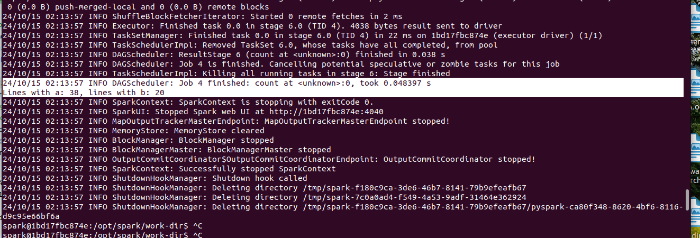

# Programming

```shell
xiaofengli@xiaofenglx:~$ docker pull apache/spark:3.5.1
3.5.1: Pulling from apache/spark
3c67549075b6: Pull complete
482e8906db89: Pull complete
486b105cee21: Pull complete
ba536847d6fa: Pull complete
ef7346692452: Pull complete
318ff7bb2b26: Pull complete
8333604c87bb: Pull complete
18838527ab39: Pull complete
ec020c8178d4: Pull complete
4f4fb700ef54: Pull complete
3a9e183a5640: Pull complete
Digest: sha256:b49e3b73ce385c1693cc3294ec4b5b3882e9fa9bd5fc599d4c79198abc49cc94
Status: Downloaded newer image for apache/spark:3.5.1
docker.io/apache/spark:3.5.1
xiaofengli@xiaofenglx:~$ docker run -it apache/spark:3.5.1 /bin/bash
spark@bbe3927c7ff0:/opt/spark/work-dir$ 
```

Then we would go up one dir, and run the pyspark,

```shell
spark@bbe3927c7ff0:/opt/spark/work-dir$ cd ..
spark@bbe3927c7ff0:/opt/spark$ ls
bin  data  examples  jars  python  R  RELEASE  sbin  tests  work-dir
spark@bbe3927c7ff0:/opt/spark$ ./bin/pyspark
Python 3.8.10 (default, Nov 22 2023, 10:22:35)
[GCC 9.4.0] on linux
Type "help", "copyright", "credits" or "license" for more information.
Setting default log level to "WARN".
To adjust logging level use sc.setLogLevel(newLevel). For SparkR, use setLogLevel(newLevel).
24/10/15 00:14:08 WARN NativeCodeLoader: Unable to load native-hadoop library for your platform... using builtin-java classes where applicable
Welcome to
____              __
/ __/__  ___ _____/ /__
_\ \/ _ \/ _ `/ __/  '_/
/__ / .__/\_,_/_/ /_/\_\   version 3.5.1
/_/

Using Python version 3.8.10 (default, Nov 22 2023 10:22:35)
Spark context Web UI available at http://bbe3927c7ff0:4040
Spark context available as 'sc' (master = local[*], app id = local-1728951249167).
SparkSession available as 'spark'.
>>> 
```

But before we write any code, let us dive out and see what is in the container,

```shell
...
Welcome to
____              __
/ __/__  ___ _____/ /__
_\ \/ _ \/ _ `/ __/  '_/
/__ / .__/\_,_/_/ /_/\_\   version 3.5.1
/_/

Using Python version 3.8.10 (default, Nov 22 2023 10:22:35)
Spark context Web UI available at http://bbe3927c7ff0:4040
Spark context available as 'sc' (master = local[*], app id = local-1728951249167).
SparkSession available as 'spark'.
Use quit() or Ctrl-D (i.e. EOF) to exit
>>> quit()
```

* Check the release and distribution of the docker image,

```shell
spark@bbe3927c7ff0:/opt/spark$ cat /etc/*release*
DISTRIB_ID=Ubuntu
DISTRIB_RELEASE=20.04
DISTRIB_CODENAME=focal
DISTRIB_DESCRIPTION="Ubuntu 20.04.6 LTS"
NAME="Ubuntu"
VERSION="20.04.6 LTS (Focal Fossa)"
ID=ubuntu
ID_LIKE=debian
PRETTY_NAME="Ubuntu 20.04.6 LTS"
VERSION_ID="20.04"
HOME_URL="https://www.ubuntu.com/"
SUPPORT_URL="https://help.ubuntu.com/"
BUG_REPORT_URL="https://bugs.launchpad.net/ubuntu/"
PRIVACY_POLICY_URL="https://www.ubuntu.com/legal/terms-and-policies/privacy-policy"
VERSION_CODENAME=focal
UBUNTU_CODENAME=focal
```

* Check spark related vars

```shell
spark@bbe3927c7ff0:/opt/spark$ set |grep SPARK
SPARK_HOME=/opt/spark
SPARK_TGZ_ASC_URL=https://archive.apache.org/dist/spark/spark-3.5.1/spark-3.5.1-bin-hadoop3.tgz.asc
SPARK_TGZ_URL=https://archive.apache.org/dist/spark/spark-3.5.1/spark-3.5.1-bin-hadoop3.tgz
```

* Check first spark program

Spark’s primary abstraction is a distributed collection of items called a Dataset. 
Datasets can be created from Hadoop InputFormats (such as HDFS files) or by transforming other Datasets. 

Due to Python’s dynamic nature, we don’t need the Dataset to be strongly-typed in Python. As a result, all Datasets in Python are Dataset[Row], and we call it DataFrame to be consistent with the data frame concept in Pandas and R. 

Let’s make a new DataFrame from the text of the README file in the Spark source directory:

```shell
spark@bbe3927c7ff0:/opt/spark$ ls
bin  data  examples  jars  python  R  RELEASE  sbin  tests  work-dir
spark@bbe3927c7ff0:/opt/spark$ find . -name "README.md"
./data/artifact-tests/crc/README.md
```

Then let us run an example,

```shell
>>> textFile = spark.read.text("./data/artifact-tests/crc/README.md")
>>> textFile.count()
5
>>> textFile.first()
Row(value='The CRCs for a specific file are stored in a text file with the same name (excluding the original extension).')
>>>
```

Now let’s transform this DataFrame to a new one. We call filter to return a new DataFrame with a subset of the lines in the file.

```shell
>>> textFile.filter(textFile.value.contains("a")).count()  # How many lines contain "a"?
3
```

## Create a Self-Contained Applications

This means that it is not interactive command lines. It is a python code and you run it from start to end.
What it will do is to start the spark session, finish computing and close the spark session.

* First let us create a setup.py file

>Hint: in this docker image, there is no sudo permission and no way to install vim, so we have to create them outside 
> out the container and mount the drive to get them in.

If you are building a packaged PySpark application or library you can add it to your setup.py file as:

```shell
    install_requires=[
        'pyspark==3.5.3'
    ]
```

As an example, we’ll create a simple Spark application, `SimpleApp.py`:

```shell
"""SimpleApp.py"""
from pyspark.sql import SparkSession

logFile = "/opt/spark/work-dir/README.md"  # Should be some file on your system
spark = SparkSession.builder.appName("SimpleApp").getOrCreate()
logData = spark.read.text(logFile).cache()

numAs = logData.filter(logData.value.contains('a')).count()
numBs = logData.filter(logData.value.contains('b')).count()

print("Lines with a: %i, lines with b: %i" % (numAs, numBs))
spark.stop()
```

* First let us create a README.md in your hosting os dir

Download from here, [readme](https://github.com/apache/spark/blob/master/README.md)

* Mount the hosting os 's drive to the `/opt/spark/work-dir` in the container

First you need to make sure you are in the directory where it contains the following 3 files.

```shell
xiaofengli@xiaofenglx:~/code/spark$ ls
README.md  setup.py  SimpleApp.py
```

Next is that, you run the following command to mount the current drive to `/opt/spark/work-dir`,

```shell
xiaofengli@xiaofenglx:~/code/spark$ docker run -v "$PWD":/opt/spark/work-dir -it apache/spark:3.5.1 /bin/bash
`/opt/spark/work-dir` 
```

* Run the code,

```shell
spark@1bd17fbc874e:/opt/spark/work-dir$ ../bin/spark-submit  SimpleApp.py
24/10/15 02:13:52 INFO SparkContext: Running Spark version 3.5.1
24/10/15 02:13:52 INFO SparkContext: OS info Linux, 6.8.0-45-generic, amd64
24/10/15 02:13:52 INFO SparkContext: Java version 11.0.22
24/10/15 02:13:52 WARN NativeCodeLoader: Unable to load native-hadoop library for your platform... using builtin-java classes where applicable
24/10/15 02:13:52 INFO ResourceUtils: ==============================================================
24/10/15 02:13:52 INFO ResourceUtils: No custom resources configured for spark.driver.
24/10/15 02:13:52 INFO ResourceUtils: ==============================================================
...
24/10/15 02:13:57 INFO Executor: Running task 0.0 in stage 6.0 (TID 4)
24/10/15 02:13:57 INFO ShuffleBlockFetcherIterator: Getting 1 (60.0 B) non-empty blocks including 1 (60.0 B) local and 0 (0.0 B) host-local and 0 (0.0 B) push-merged-local and 0 (0.0 B) remote blocks
24/10/15 02:13:57 INFO ShuffleBlockFetcherIterator: Started 0 remote fetches in 2 ms
24/10/15 02:13:57 INFO Executor: Finished task 0.0 in stage 6.0 (TID 4). 4038 bytes result sent to driver
24/10/15 02:13:57 INFO TaskSetManager: Finished task 0.0 in stage 6.0 (TID 4) in 22 ms on 1bd17fbc874e (executor driver) (1/1)
24/10/15 02:13:57 INFO TaskSchedulerImpl: Removed TaskSet 6.0, whose tasks have all completed, from pool 
24/10/15 02:13:57 INFO DAGScheduler: ResultStage 6 (count at <unknown>:0) finished in 0.038 s
24/10/15 02:13:57 INFO DAGScheduler: Job 4 is finished. Cancelling potential speculative or zombie tasks for this job
24/10/15 02:13:57 INFO TaskSchedulerImpl: Killing all running tasks in stage 6: Stage finished
24/10/15 02:13:57 INFO DAGScheduler: Job 4 finished: count at <unknown>:0, took 0.048397 s
Lines with a: 38, lines with b: 20
24/10/15 02:13:57 INFO SparkContext: SparkContext is stopping with exitCode 0.
24/10/15 02:13:57 INFO SparkUI: Stopped Spark web UI at http://1bd17fbc874e:4040
24/10/15 02:13:57 INFO MapOutputTrackerMasterEndpoint: MapOutputTrackerMasterEndpoint stopped!
24/10/15 02:13:57 INFO MemoryStore: MemoryStore cleared
24/10/15 02:13:57 INFO BlockManager: BlockManager stopped
24/10/15 02:13:57 INFO BlockManagerMaster: BlockManagerMaster stopped
24/10/15 02:13:57 INFO OutputCommitCoordinator$OutputCommitCoordinatorEndpoint: OutputCommitCoordinator stopped!
24/10/15 02:13:57 INFO SparkContext: Successfully stopped SparkContext
24/10/15 02:13:57 INFO ShutdownHookManager: Shutdown hook called
24/10/15 02:13:57 INFO ShutdownHookManager: Deleting directory /tmp/spark-f180c9ca-3de6-46b7-8141-79b9efeafb67
24/10/15 02:13:57 INFO ShutdownHookManager: Deleting directory /tmp/spark-7c0a0ad4-f549-4a53-9adf-31464e362924
24/10/15 02:13:57 INFO ShutdownHookManager: Deleting directory /tmp/spark-f180c9ca-3de6-46b7-8141-79b9efeafb67/pyspark-ca80f348-8620-4bf6-8116-d9c95e66bf6a
```

Seen in the following image,




For a lot of PySpark clusters, such as databricks, you would need this above way to run the job and distribute it to a cluster.

## Run PySpark code without using container

To simply development. You can run PySpark code without using the container.

Then let us exit from your container and come back to your hosting os, and let us do the following,

* First let us make a copy of `SimpleApp.py` and call it `SimpleApp-b.py`

```shell
xiaofengli@xiaofenglx:~/code/spark$ cp SimpleApp.py SimpleApp-b.py
```

* Alter the file and make sure change that to  "./README.md".

```shell
xiaofengli@xiaofenglx:~/code/spark$ vi SimpleApp-b.py
```

* Run it with just your python

```shell
xiaofengli@xiaofenglx:~/code/spark$ python SimpleApp-b.py
Setting default log level to "WARN".
To adjust logging level use sc.setLogLevel(newLevel). For SparkR, use setLogLevel(newLevel).
24/10/14 22:20:44 WARN NativeCodeLoader: Unable to load native-hadoop library for your platform... using builtin-java classes where applicable
Lines with a: 38, lines with b: 20
```

## More Examples

Finally, Spark includes several samples in the examples directory (Scala, Java, Python, R). You can run them as follows:

### For Scala and Java, use run-example
./bin/run-example SparkPi

### For Python examples, use spark-submit directly
./bin/spark-submit examples/src/main/python/pi.py

### For R examples, use spark-submit directly
./bin/spark-submit examples/src/main/r/dataframe.R

Let us check only Python examples in the following directory,

```shell
spark@994e99365cfe:/opt/spark/examples/src/main$ cd python/
spark@994e99365cfe:/opt/spark/examples/src/main/python$ ls
als.py		     kmeans.py		     mllib		     pi.py    status_api_demo.py     wordcount.py
avro_inputformat.py  logistic_regression.py  pagerank.py	     sort.py  streaming
__init__.py	     ml			     parquet_inputformat.py  sql      transitive_closure.py
spark@994e99365cfe:/opt/spark/examples/src/main/python$ pwd
/opt/spark/examples/src/main/python
spark@994e99365cfe:/opt/spark/examples/src/main/python$ 
```

Then we are going to run the `pi.py` example,

```shell
spark@994e99365cfe:/opt/spark/examples/src/main/python$ spark-submit ./pi.py
bash: spark-submit: command not found
spark@994e99365cfe:/opt/spark/examples/src/main/python$ export PATH=$PATH:/opt/spark/bin:.
spark@994e99365cfe:/opt/spark/examples/src/main/python$ spark-submit ./pi.py
24/10/15 02:33:02 INFO SparkContext: Running Spark version 3.5.1
24/10/15 02:33:02 INFO SparkContext: OS info Linux, 6.8.0-45-generic, amd64
24/10/15 02:33:02 INFO SparkContext: Java version 11.0.22
24/10/15 02:33:02 WARN NativeCodeLoader: Unable to load native-hadoop library for your platform... using builtin-java classes where applicable
24/10/15 02:33:02 INFO ResourceUtils: ==============================================================
24/10/15 02:33:02 INFO ResourceUtils: No custom resources configured for spark.driver.
24/10/15 02:33:02 INFO ResourceUtils: ==============================================================
24/10/15 02:33:02 INFO SparkContext: Submitted application: PythonPi
24/10/15 02:33:02 INFO ResourceProfile: Default ResourceProfile created, executor resources: Map(cores -> name: cores, amount: 1, script: , vendor: , memory -> name: memory, amount: 1024, script: , vendor: , offHeap -> name: offHeap, amount: 0, script: , vendor: ), task resources: Map(cpus -> name: cpus, amount: 1.0)
24/10/15 02:33:02 INFO ResourceProfile: Limiting resource is cpu
24/10/15 02:33:02 INFO ResourceProfileManager: Added ResourceProfile id: 0
24/10/15 02:33:03 INFO SecurityManager: Changing view acls to: spark
24/10/15 02:33:03 INFO SecurityManager: Changing modify acls to: spark
24/10/15 02:33:03 INFO SecurityManager: Changing view acls groups to: 
24/10/15 02:33:03 INFO SecurityManager: Changing modify acls groups to: 
24/10/15 02:33:03 INFO SecurityManager: SecurityManager: authentication disabled; ui acls disabled; users with view permissions: spark; groups with view permissions: EMPTY; users with modify permissions: spark; groups with modify permissions: EMPTY
24/10/15 02:33:03 INFO Utils: Successfully started service 'sparkDriver' on port 34053.
24/10/15 02:33:03 INFO SparkEnv: Registering MapOutputTracker
24/10/15 02:33:03 INFO SparkEnv: Registering BlockManagerMaster
24/10/15 02:33:03 INFO BlockManagerMasterEndpoint: Using org.apache.spark.storage.DefaultTopologyMapper for getting topology information
24/10/15 02:33:03 INFO BlockManagerMasterEndpoint: BlockManagerMasterEndpoint up
24/10/15 02:33:03 INFO SparkEnv: Registering BlockManagerMasterHeartbeat
24/10/15 02:33:03 INFO DiskBlockManager: Created local directory at /tmp/blockmgr-4ca8444b-a570-4178-83a2-f05bc1ec326b
24/10/15 02:33:03 INFO MemoryStore: MemoryStore started with capacity 434.4 MiB
24/10/15 02:33:03 INFO SparkEnv: Registering OutputCommitCoordinator
24/10/15 02:33:03 INFO JettyUtils: Start Jetty 0.0.0.0:4040 for SparkUI
24/10/15 02:33:03 INFO Utils: Successfully started service 'SparkUI' on port 4040.
24/10/15 02:33:03 INFO Executor: Starting executor ID driver on host 994e99365cfe
24/10/15 02:33:03 INFO Executor: OS info Linux, 6.8.0-45-generic, amd64
24/10/15 02:33:03 INFO Executor: Java version 11.0.22
24/10/15 02:33:03 INFO Executor: Starting executor with user classpath (userClassPathFirst = false): ''
24/10/15 02:33:03 INFO Executor: Created or updated repl class loader org.apache.spark.util.MutableURLClassLoader@29fe4ab4 for default.
24/10/15 02:33:03 INFO Utils: Successfully started service 'org.apache.spark.network.netty.NettyBlockTransferService' on port 33547.
24/10/15 02:33:03 INFO NettyBlockTransferService: Server created on 994e99365cfe:33547
24/10/15 02:33:03 INFO BlockManager: Using org.apache.spark.storage.RandomBlockReplicationPolicy for block replication policy
24/10/15 02:33:03 INFO BlockManagerMaster: Registering BlockManager BlockManagerId(driver, 994e99365cfe, 33547, None)
24/10/15 02:33:03 INFO BlockManagerMasterEndpoint: Registering block manager 994e99365cfe:33547 with 434.4 MiB RAM, BlockManagerId(driver, 994e99365cfe, 33547, None)
24/10/15 02:33:03 INFO BlockManagerMaster: Registered BlockManager BlockManagerId(driver, 994e99365cfe, 33547, None)
24/10/15 02:33:03 INFO BlockManager: Initialized BlockManager: BlockManagerId(driver, 994e99365cfe, 33547, None)
24/10/15 02:33:04 INFO SparkContext: Starting job: reduce at /opt/spark/examples/src/main/python/pi.py:42
24/10/15 02:33:04 INFO DAGScheduler: Got job 0 (reduce at /opt/spark/examples/src/main/python/pi.py:42) with 2 output partitions
24/10/15 02:33:04 INFO DAGScheduler: Final stage: ResultStage 0 (reduce at /opt/spark/examples/src/main/python/pi.py:42)
24/10/15 02:33:04 INFO DAGScheduler: Parents of final stage: List()
24/10/15 02:33:04 INFO DAGScheduler: Missing parents: List()
24/10/15 02:33:04 INFO DAGScheduler: Submitting ResultStage 0 (PythonRDD[1] at reduce at /opt/spark/examples/src/main/python/pi.py:42), which has no missing parents
24/10/15 02:33:04 INFO MemoryStore: Block broadcast_0 stored as values in memory (estimated size 11.4 KiB, free 434.4 MiB)
24/10/15 02:33:04 INFO MemoryStore: Block broadcast_0_piece0 stored as bytes in memory (estimated size 8.6 KiB, free 434.4 MiB)
24/10/15 02:33:04 INFO BlockManagerInfo: Added broadcast_0_piece0 in memory on 994e99365cfe:33547 (size: 8.6 KiB, free: 434.4 MiB)
24/10/15 02:33:04 INFO SparkContext: Created broadcast 0 from broadcast at DAGScheduler.scala:1585
24/10/15 02:33:04 INFO DAGScheduler: Submitting 2 missing tasks from ResultStage 0 (PythonRDD[1] at reduce at /opt/spark/examples/src/main/python/pi.py:42) (first 15 tasks are for partitions Vector(0, 1))
24/10/15 02:33:04 INFO TaskSchedulerImpl: Adding task set 0.0 with 2 tasks resource profile 0
24/10/15 02:33:04 INFO TaskSetManager: Starting task 0.0 in stage 0.0 (TID 0) (994e99365cfe, executor driver, partition 0, PROCESS_LOCAL, 7595 bytes) 
24/10/15 02:33:04 INFO TaskSetManager: Starting task 1.0 in stage 0.0 (TID 1) (994e99365cfe, executor driver, partition 1, PROCESS_LOCAL, 7595 bytes) 
24/10/15 02:33:04 INFO Executor: Running task 1.0 in stage 0.0 (TID 1)
24/10/15 02:33:04 INFO Executor: Running task 0.0 in stage 0.0 (TID 0)
24/10/15 02:33:05 INFO PythonRunner: Times: total = 496, boot = 389, init = 48, finish = 59
24/10/15 02:33:05 INFO PythonRunner: Times: total = 497, boot = 391, init = 46, finish = 60
24/10/15 02:33:05 INFO Executor: Finished task 1.0 in stage 0.0 (TID 1). 1369 bytes result sent to driver
24/10/15 02:33:05 INFO Executor: Finished task 0.0 in stage 0.0 (TID 0). 1369 bytes result sent to driver
24/10/15 02:33:05 INFO TaskSetManager: Finished task 1.0 in stage 0.0 (TID 1) in 610 ms on 994e99365cfe (executor driver) (1/2)
24/10/15 02:33:05 INFO TaskSetManager: Finished task 0.0 in stage 0.0 (TID 0) in 628 ms on 994e99365cfe (executor driver) (2/2)
24/10/15 02:33:05 INFO TaskSchedulerImpl: Removed TaskSet 0.0, whose tasks have all completed, from pool 
24/10/15 02:33:05 INFO PythonAccumulatorV2: Connected to AccumulatorServer at host: 127.0.0.1 port: 49881
24/10/15 02:33:05 INFO DAGScheduler: ResultStage 0 (reduce at /opt/spark/examples/src/main/python/pi.py:42) finished in 0.787 s
24/10/15 02:33:05 INFO DAGScheduler: Job 0 is finished. Cancelling potential speculative or zombie tasks for this job
24/10/15 02:33:05 INFO TaskSchedulerImpl: Killing all running tasks in stage 0: Stage finished
24/10/15 02:33:05 INFO DAGScheduler: Job 0 finished: reduce at /opt/spark/examples/src/main/python/pi.py:42, took 0.840705 s
Pi is roughly 3.142480
24/10/15 02:33:05 INFO SparkContext: SparkContext is stopping with exitCode 0.
24/10/15 02:33:05 INFO SparkUI: Stopped Spark web UI at http://994e99365cfe:4040
24/10/15 02:33:05 INFO MapOutputTrackerMasterEndpoint: MapOutputTrackerMasterEndpoint stopped!
24/10/15 02:33:05 INFO MemoryStore: MemoryStore cleared
24/10/15 02:33:05 INFO BlockManager: BlockManager stopped
24/10/15 02:33:05 INFO BlockManagerMaster: BlockManagerMaster stopped
24/10/15 02:33:05 INFO OutputCommitCoordinator$OutputCommitCoordinatorEndpoint: OutputCommitCoordinator stopped!
24/10/15 02:33:05 INFO SparkContext: Successfully stopped SparkContext
24/10/15 02:33:06 INFO ShutdownHookManager: Shutdown hook called
24/10/15 02:33:06 INFO ShutdownHookManager: Deleting directory /tmp/spark-4d2b4583-87a0-46da-8a53-c19a259fba39
24/10/15 02:33:06 INFO ShutdownHookManager: Deleting directory /tmp/spark-770fa595-05d9-49f8-9d1f-79bc4ff35efc/pyspark-ad8f1f8a-6966-4e5f-b2d5-875e309b7230
24/10/15 02:33:06 INFO ShutdownHookManager: Deleting directory /tmp/spark-770fa595-05d9-49f8-9d1f-79bc4ff35efc
```