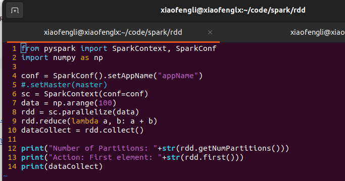
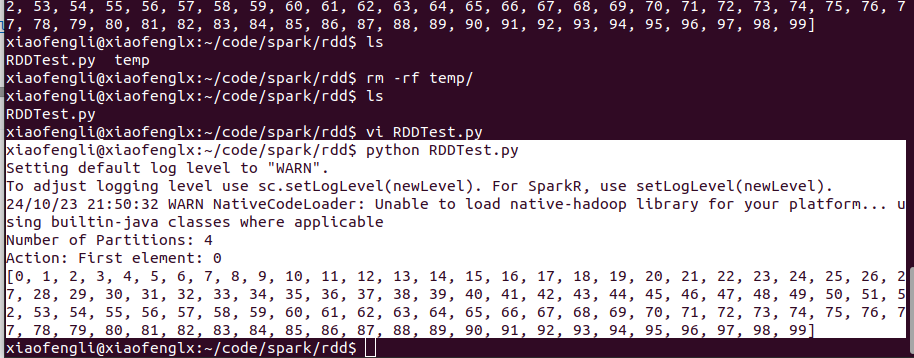
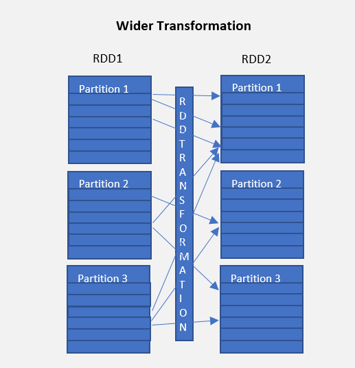

# RDD Programming Guide (Resilient Distributed Dataset)

Resilient Distributed Datasets (RDD) is a fundamental data structure of PySpark.
It is an immutable-distributed collection of objects. Each dataset in RDD is divided into logical partitions, which may be computed on different nodes of the cluster.


## RDD Creation

**Example 1**

Create a file called "RDDTest.py",


Paste the content in,

```python
from pyspark import SparkContext, SparkConf
import numpy as np
 
 conf = SparkConf().setAppName("appName")
 #.setMaster(master)
 sc = SparkContext(conf=conf)
 data = np.arange(100)
 rdd = sc.parallelize(data)
 rdd.reduce(lambda a, b: a + b)
 dataCollect = rdd.collect()
  
 print("Number of Partitions: "+str(rdd.getNumPartitions()))
 print("Action: First element: "+str(rdd.first()))
 print(dataCollect)
```

It should look like the following,



Run the code,


***Explanation:***

* We created SparkConf and then SparkContext.
* PySpark shell provides SparkContext variable "sc", use sc.parallelize() to create an RDD.

**Example 2**

Since PySpark 2.0, First, you need to create a `SparkSession` which internally creates a `SparkContext` for you.

**`source_code`**

```python
import pyspark
from pyspark.sql import SparkSession
import numpy as np
 
spark = SparkSession.builder.appName('SparkBySession').getOrCreate()
sc=spark.sparkContext
data = np.arange(100)
rdd = sc.parallelize(data)
rdd.reduce(lambda a, b: a + b)
dataCollect = rdd.collect()
 
print("Number of Partitions: " + str(rdd.getNumPartitions()))
print("Action: First element: " + str(rdd.first()))
print(dataCollect)
```



**create empty RDD by using sparkContext.parallelize**

```shell
emptyRDD = sparkContext.emptyRDD()
emptyRDD2 = rdd=sparkContext.parallelize([])
print("is Empty RDD : "+str(emptyRDD2.isEmpty()))
```

## RDD Transformation and Lineage

PySpark RDD Transformations are lazy evaluation and is used to transform/update from one RDD into another. 
When executed on RDD, it results in a single or multiple new RDD.

Since RDD are immutable in nature, transformations always create a new RDD without updating an existing one hence, 
a chain of RDD transformations creates an RDD lineage.


RDD Lineage is also known as the RDD operator graph or RDD dependency graph.

In this tutorial, you will learn lazy transformations, types of transformations, a complete list of transformation functions using wordcount example.

### RDD Transformations are Lazy

RDD Transformations are lazy operations meaning none of the transformations get executed until you call an action on PySpark RDD. 
Since RDD’s are immutable, any transformations on it result in a new RDD leaving the current one unchanged.

### RDD Transformation Types

There are two types of transformations.

#### Narrow Transformation

Narrow transformations are the result of map() and filter() functions and these compute data that live on a single partition meaning there will not be any data movement between partitions to execute narrow transformations.

Functions such as `map()`, `mapPartition()`, `flatMap()`, `filter()`, `union()` are some examples of narrow transformation.


#### Wider Transformation

Functions such as `groupByKey()`, `aggregateByKey()`, `aggregate()`, `join()`, `repartition()` are some examples of a wider transformations.

Wider transformations are the result of groupByKey() and reduceByKey() functions and these compute data that live on many 
partitions meaning there will be data movements between partitions to execute wider transformations.

Since these shuffles the data, they also called shuffle transformations.



### aggregate – action

Aggregate the elements of each partition, and then the results for all the partitions, using a given combine functions “combOp” and a neutral “zero value.”

The first function (seqOp) can return a different result type, U, than the type of this RDD. Thus, we need one operation for merging a T into an U and one operation for merging two U

`syntax: aggregate(zeroValue, seqOp, combOp)`

**Example 1**

**Source**

```python

import pyspark
from pyspark.sql import SparkSession

spark = SparkSession.builder.appName('SparkBySession').getOrCreate()
listRdd = spark.sparkContext.parallelize([1,2,3,4,5,3,2])

#aggregate
seqOp = (lambda x, y: x + y)
combOp = (lambda x, y: x + y)
agg=listRdd.aggregate(0, seqOp, combOp)
print(agg) # output 20
```

Run the code,


## Ref

- https://spark.apache.org/docs/latest/rdd-programming-guide.html

- https://sparkbyexamples.com/pyspark/pyspark-parallelize-create-rdd/