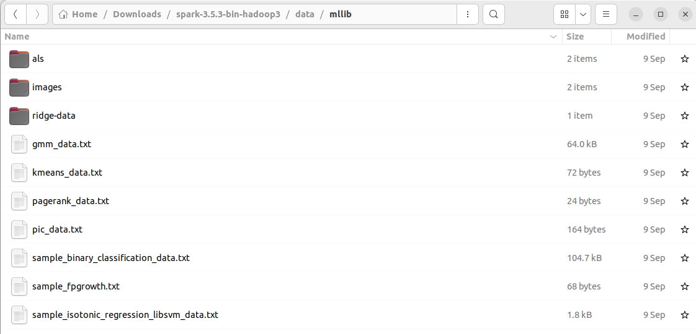
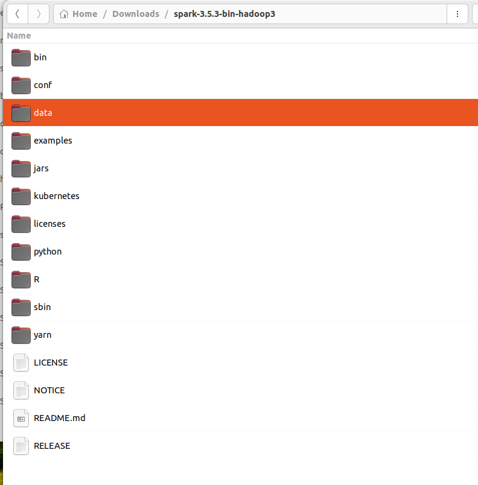
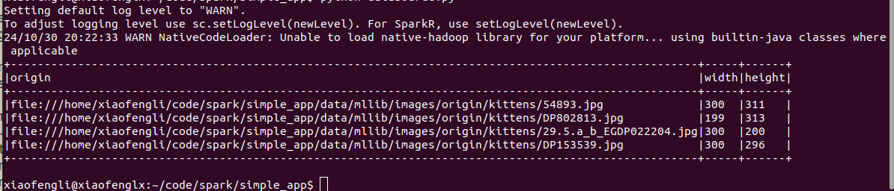
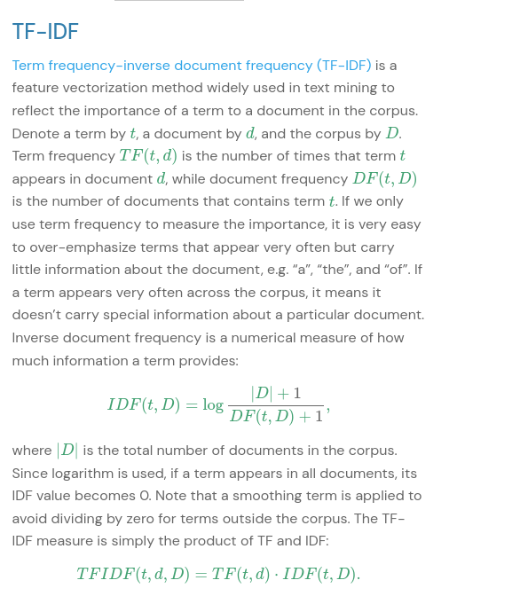

# Spark ML

Machine Learning Library (MLlib) Guide

MLlib is Spark’s machine learning (ML) library. Its goal is to make practical machine learning scalable and easy. At a high level, it provides tools such as:

* ML Algorithms: common learning algorithms such as classification, regression, clustering, and collaborative filtering
* Featurization: feature extraction, transformation, dimensionality reduction, and selection
* Pipelines: tools for constructing, evaluating, and tuning ML Pipelines
* Persistence: saving and load algorithms, models, and Pipelines
* Utilities: linear algebra, statistics, data handling, etc.


**Algorithms**

MLlib contains many algorithms and utilities.

**ML algorithms include:**

* Classification: logistic regression, naive Bayes,...
* Regression: generalized linear regression, survival regression,...
* Decision trees, random forests, and gradient-boosted trees
* Recommendation: alternating least squares (ALS)
* Clustering: K-means, Gaussian mixtures (GMMs),...
* Topic modeling: latent Dirichlet allocation (LDA)
* Frequent itemsets, association rules, and sequential pattern mining

**ML workflow utilities include:**

* Feature transformations: standardization, normalization, hashing,...
* ML Pipeline construction
* Model evaluation and hyper-parameter tuning
* ML persistence: saving and loading models and Pipelines

**Other utilities include:**

* Distributed linear algebra: SVD, PCA,...
* Statistics: summary statistics, hypothesis testing,...

## What are the implications?

MLlib will still support the RDD-based API in spark.mllib with bug fixes.

MLlib will not add new features to the RDD-based API.

In the Spark 2.x releases, MLlib will add features to the DataFrames-based API to reach feature parity with the RDD-based API.

## Why is MLlib switching to the DataFrame-based API?

DataFrames provide a more user-friendly API than RDDs. The many benefits of DataFrames include Spark Datasources, SQL/DataFrame queries, Tungsten and Catalyst optimizations, and uniform APIs across languages.

The DataFrame-based API for MLlib provides a uniform API across ML algorithms and across multiple languages.
DataFrames facilitate practical ML Pipelines, particularly feature transformations. See the Pipelines guide for details.

## What is “Spark ML”?

“Spark ML” is not an official name but occasionally used to refer to the MLlib DataFrame-based API. This is majorly due to the org.apache.spark.ml Scala package name used by the DataFrame-based API, and the “Spark ML Pipelines” term we used initially to emphasize the pipeline concept.

## Is MLlib deprecated?

No. MLlib includes both the RDD-based API and the DataFrame-based API. The RDD-based API is now in maintenance mode. But neither API is deprecated, nor MLlib as a whole.

## Dependencies

* MLlib uses linear algebra packages Breeze and dev.ludovic.netlib for optimised numerical processing1. Those packages may call native acceleration libraries such as `Intel MKL` or `OpenBLAS` if they are available as system libraries or in runtime library paths.

* To use MLlib in Python, you will need NumPy version 1.4 or newer.

## Data sources

* Step 1 get data source

Lab - (Download spark from here: https://spark.apache.org/downloads.html)

or click the following link to download,

https://www.apache.org/dyn/closer.lua/spark/spark-3.5.3/spark-3.5.3-bin-hadoop3.tgz

* Step 2 unarchive it with 7zip or other zip utility

In this section, we introduce how to use data source in ML to load data. Besides some general data sources such as Parquet, CSV, JSON and JDBC, we also provide some specific data sources for ML.

Table of Contents

* Image data source
* LIBSVM data source

When we download the zip and unarchive it, we can see a data dir,



### Image data source

This image data source is used to load image files from a directory, it can load compressed image (jpeg, png, etc.) into raw image representation via ImageIO in Java library. The loaded DataFrame has one StructType column: “image”, containing image data stored as image schema. The schema of the image column is:

* origin: StringType (represents the file path of the image)
* height: IntegerType (height of the image)
* width: IntegerType (width of the image)
* nChannels: IntegerType (number of image channels)
* mode: IntegerType (OpenCV-compatible type)
* data: BinaryType (Image bytes in OpenCV-compatible order: row-wise BGR in most cases)

```python
>>> df = spark.read.format("image").option("dropInvalid", True).load("data/mllib/images/origin/kittens")
>>> df.select("image.origin", "image.width", "image.height").show(truncate=False)
+-----------------------------------------------------------------------+-----+------+
|origin                                                                 |width|height|
+-----------------------------------------------------------------------+-----+------+
|file:///spark/data/mllib/images/origin/kittens/54893.jpg               |300  |311   |
|file:///spark/data/mllib/images/origin/kittens/DP802813.jpg            |199  |313   |
|file:///spark/data/mllib/images/origin/kittens/29.5.a_b_EGDP022204.jpg |300  |200   |
|file:///spark/data/mllib/images/origin/kittens/DP153539.jpg            |300  |296   |
+-----------------------------------------------------------------------+-----+------+
```

* Copy the data/ directory from unarchived spark dir to your code dir,

Copy from spark dir/



To my dev dir/


* Prepare the above code in datasource.py

```python
from pyspark.sql import SparkSession

spark = SparkSession.builder.appName("SimpleApp").getOrCreate()

df = spark.read.format("image").option("dropInvalid", True).load("data/mllib/images/origin/kittens")
df.select("image.origin", "image.width", "image.height").show(truncate=False)
spark.stop()
```

* Then run the code



### LIBSVM data source

This LIBSVM data source is used to load ‘libsvm’ type files from a directory. The loaded DataFrame has two columns: label containing labels stored as doubles and features containing feature vectors stored as Vectors. 

> Hint: What is LIBSVM
> LIBSVM and LIBLINEAR are two popular open source machine learning libraries, both developed at the National Taiwan University and both written in C++ though with a C API. LIBSVM implements the sequential minimal optimization (SMO) algorithm for kernelized support vector machines (SVMs), supporting classification and regression. LIBLINEAR implements linear SVMs and logistic regression models trained using a coordinate descent algorithm.

>The SVM learning code from both libraries is often reused in other open source machine learning toolkits, including GATE, KNIME, Orange and scikit-learn. Bindings and ports exist for programming languages such as Java, MATLAB, R, Julia, and Python. It is available in e1071 library in R and scikit-learn in Python.

> Both libraries are free software released under the 3-clause BSD license. 
> Ref: 
> * https://en.wikipedia.org/wiki/LIBSVM
> * https://www.csie.ntu.edu.tw/~cjlin/libsvm/
> * https://www.csie.ntu.edu.tw/~cjlin/liblinear/

The schemas of the columns are:

* label: DoubleType (represents the instance label)
* features: VectorUDT (represents the feature vector)

In PySpark we provide Spark SQL data source API for loading LIBSVM data as a DataFrame.

```python
>>> df = spark.read.format("libsvm").option("numFeatures", "780").load("data/mllib/sample_libsvm_data.txt")
>>> df.show(10)
+-----+--------------------+
|label|            features|
+-----+--------------------+
|  0.0|(780,[127,128,129...|
|  1.0|(780,[158,159,160...|
|  1.0|(780,[124,125,126...|
|  1.0|(780,[152,153,154...|
|  1.0|(780,[151,152,153...|
|  0.0|(780,[129,130,131...|
|  1.0|(780,[158,159,160...|
|  1.0|(780,[99,100,101,...|
|  0.0|(780,[154,155,156...|
|  0.0|(780,[127,128,129...|
+-----+--------------------+
```

only showing top 10 rows

## Basic Statistics

**Correlation**

Calculating the correlation between two series of data is a common operation in Statistics. In spark.ml we provide the flexibility to calculate pairwise correlations among many series. The supported correlation methods are currently Pearson’s and Spearman’s correlation.

Correlation computes the correlation matrix for the input Dataset of Vectors using the specified method. The output will be a DataFrame that contains the correlation matrix of the column of vectors.

```PYTHON

from pyspark.ml.linalg import Vectors
from pyspark.ml.stat import Correlation

data = [(Vectors.sparse(4, [(0, 1.0), (3, -2.0)]),),
        (Vectors.dense([4.0, 5.0, 0.0, 3.0]),),
        (Vectors.dense([6.0, 7.0, 0.0, 8.0]),),
        (Vectors.sparse(4, [(0, 9.0), (3, 1.0)]),)]
df = spark.createDataFrame(data, ["features"])

r1 = Correlation.corr(df, "features").head()

print("Pearson correlation matrix:\n" + str(r1[0]))

r2 = Correlation.corr(df, "features", "spearman").head()

print("Spearman correlation matrix:\n" + str(r2[0]))
```

> Find full example code at "examples/src/main/python/ml/correlation_example.py" in the Spark repo.

**Hypothesis testing**

Hypothesis testing is a powerful tool in statistics to determine whether a result is statistically significant, whether this result occurred by chance or not. spark.ml currently supports Pearson’s Chi-squared ( χ2) tests for independence.

***ChiSquareTest***

ChiSquareTest conducts Pearson’s independence test for every feature against the label. For each feature, the (feature, label) pairs are converted into a contingency matrix for which the Chi-squared statistic is computed. All label and feature values must be categorical.

```python
from pyspark.ml.linalg import Vectors
from pyspark.ml.stat import ChiSquareTest

data = [(0.0, Vectors.dense(0.5, 10.0)),
        (0.0, Vectors.dense(1.5, 20.0)),
        (1.0, Vectors.dense(1.5, 30.0)),
        (0.0, Vectors.dense(3.5, 30.0)),
        (0.0, Vectors.dense(3.5, 40.0)),
        (1.0, Vectors.dense(3.5, 40.0))]
df = spark.createDataFrame(data, ["label", "features"])

r = ChiSquareTest.test(df, "features", "label").head()

print("pValues: " + str(r.pValues))
print("degreesOfFreedom: " + str(r.degreesOfFreedom))
print("statistics: " + str(r.statistics))
```

> Find full example code at "examples/src/main/python/ml/chi_square_test_example.py" in the Spark repo.

**Summarizer**

We provide vector column summary statistics for Dataframe through Summarizer. Available metrics are the column-wise max, min, mean, sum, variance, std, and number of nonzeros, as well as the total count.

```python
from pyspark.ml.stat import Summarizer
from pyspark.sql import Row
from pyspark.ml.linalg import Vectors

df = sc.parallelize([Row(weight=1.0, features=Vectors.dense(1.0, 1.0, 1.0)),
                     Row(weight=0.0, features=Vectors.dense(1.0, 2.0, 3.0))]).toDF()

# create summarizer for multiple metrics "mean" and "count"
summarizer = Summarizer.metrics("mean", "count")

# compute statistics for multiple metrics with weight
df.select(summarizer.summary(df.features, df.weight)).show(truncate=False)

# compute statistics for multiple metrics without weight
df.select(summarizer.summary(df.features)).show(truncate=False)

# compute statistics for single metric "mean" with weight
df.select(Summarizer.mean(df.features, df.weight)).show(truncate=False)

# compute statistics for single metric "mean" without weight
df.select(Summarizer.mean(df.features)).show(truncate=False)
```

> Find full example code at "examples/src/main/python/ml/summarizer_example.py" in the Spark repo.

## Extracting, transforming and selecting features

This section covers algorithms for working with features, roughly divided into these groups:

* Extraction: Extracting features from “raw” data
* Transformation: Scaling, converting, or modifying features
* Selection: Selecting a subset from a larger set of features
* Locality Sensitive Hashing (LSH): This class of algorithms combines aspects of feature transformation with other algorithms.

**Feature Extractors**

* TF-IDF
* Word2Vec
* CountVectorizer
* FeatureHasher

**Feature Transformers**

* Tokenizer
* StopWordsRemover
* n-gram
* Binarizer
* PCA
* PolynomialExpansion
* Discrete Cosine Transform (DCT)
* StringIndexer
* IndexToString
* OneHotEncoder
* VectorIndexer
* Interaction
* Normalizer
* StandardScaler
* RobustScaler
* MinMaxScaler
* MaxAbsScaler
* Bucketizer
* ElementwiseProduct
* SQLTransformer
* VectorAssembler
* VectorSizeHint
* QuantileDiscretizer
* Imputer

**Feature Selectors**

* VectorSlicer
* RFormula
* ChiSqSelector
* UnivariateFeatureSelector
* VarianceThresholdSelector

## TF-IDF (Term frequency-inverse document frequency (TF-IDF)) - Extractor



There are several variants on the definition of term frequency and document frequency. In MLlib, we separate TF and IDF to make them flexible.

TF: Both HashingTF and CountVectorizer can be used to generate the term frequency vectors.

HashingTF is a Transformer which takes sets of terms and converts those sets into fixed-length feature vectors. In text processing, a “set of terms” might be a bag of words. HashingTF utilizes the hashing trick. A raw feature is mapped into an index (term) by applying a hash function. The hash function used here is MurmurHash 3. Then term frequencies are calculated based on the mapped indices. This approach avoids the need to compute a global term-to-index map, which can be expensive for a large corpus, but it suffers from potential hash collisions, where different raw features may become the same term after hashing. To reduce the chance of collision, we can increase the target feature dimension, i.e. the number of buckets of the hash table. Since a simple modulo on the hashed value is used to determine the vector index, it is advisable to use a power of two as the feature dimension, otherwise the features will not be mapped evenly to the vector indices. The default feature dimension is 218=262,144
. An optional binary toggle parameter controls term frequency counts. When set to true all nonzero frequency counts are set to 1. This is especially useful for discrete probabilistic models that model binary, rather than integer, counts.

CountVectorizer converts text documents to vectors of term counts. Refer to CountVectorizer for more details.

IDF: IDF is an Estimator which is fit on a dataset and produces an IDFModel. The IDFModel takes feature vectors (generally created from HashingTF or CountVectorizer) and scales each feature. Intuitively, it down-weights features which appear frequently in a corpus.

Note: spark.ml doesn’t provide tools for text segmentation. We refer users to the Stanford NLP Group and scalanlp/chalk.

**Examples**

In the following code segment, we start with a set of sentences. We split each sentence into words using Tokenizer. For each sentence (bag of words), we use HashingTF to hash the sentence into a feature vector. We use IDF to rescale the feature vectors; this generally improves performance when using text as features. Our feature vectors could then be passed to a learning algorithm.

```python
from pyspark.ml.feature import HashingTF, IDF, Tokenizer

sentenceData = spark.createDataFrame([
    (0.0, "Hi I heard about Spark"),
    (0.0, "I wish Java could use case classes"),
    (1.0, "Logistic regression models are neat")
], ["label", "sentence"])

tokenizer = Tokenizer(inputCol="sentence", outputCol="words")
wordsData = tokenizer.transform(sentenceData)

hashingTF = HashingTF(inputCol="words", outputCol="rawFeatures", numFeatures=20)
featurizedData = hashingTF.transform(wordsData)
# alternatively, CountVectorizer can also be used to get term frequency vectors

idf = IDF(inputCol="rawFeatures", outputCol="features")
idfModel = idf.fit(featurizedData)
rescaledData = idfModel.transform(featurizedData)

rescaledData.select("label", "features").show()
```

>hint: Find full example code at "examples/src/main/python/ml/tf_idf_example.py" in the Spark repo.

## Word2Vec - Extractor

Word2Vec is an Estimator which takes sequences of words representing documents and trains a Word2VecModel. The model maps each word to a unique fixed-size vector. The Word2VecModel transforms each document into a vector using the average of all words in the document; this vector can then be used as features for prediction, document similarity calculations, etc. Please refer to the MLlib user guide on Word2Vec for more details.

>https://spark.apache.org/docs/latest/mllib-feature-extraction.html#word2vec
>https://spark.apache.org/docs/latest/api/python/reference/api/pyspark.ml.feature.Word2Vec.html


**Example**

In the following code segment, we start with a set of documents, each of which is represented as a sequence of words. For each document, we transform it into a feature vector. This feature vector could then be passed to a learning algorithm.

```python
from pyspark.ml.feature import Word2Vec

# Input data: Each row is a bag of words from a sentence or document.
documentDF = spark.createDataFrame([
    ("Hi I heard about Spark".split(" "), ),
    ("I wish Java could use case classes".split(" "), ),
    ("Logistic regression models are neat".split(" "), )
], ["text"])

# Learn a mapping from words to Vectors.
word2Vec = Word2Vec(vectorSize=3, minCount=0, inputCol="text", outputCol="result")
model = word2Vec.fit(documentDF)

result = model.transform(documentDF)
for row in result.collect():
    text, vector = row
    print("Text: [%s] => \nVector: %s\n" % (", ".join(text), str(vector))
```

> Find full example code at "examples/src/main/python/ml/word2vec_example.py" in the Spark repo.


**Tokenizer - Transformer**

Tokenization is the process of taking text (such as a sentence) and breaking it into individual terms (usually words). A simple Tokenizer class provides this functionality. The example below shows how to split sentences into sequences of words.

RegexTokenizer allows more advanced tokenization based on regular expression (regex) matching. By default, the parameter “pattern” (regex, default: "\\s+") is used as delimiters to split the input text. Alternatively, users can set parameter “gaps” to false indicating the regex “pattern” denotes “tokens” rather than splitting gaps, and find all matching occurrences as the tokenization result.

>https://spark.apache.org/docs/latest/api/python/reference/api/pyspark.ml.feature.Tokenizer.html
>https://spark.apache.org/docs/latest/api/python/reference/api/pyspark.ml.feature.RegexTokenizer.html

```python
from pyspark.ml.feature import Tokenizer, RegexTokenizer
from pyspark.sql.functions import col, udf
from pyspark.sql.types import IntegerType

sentenceDataFrame = spark.createDataFrame([
    (0, "Hi I heard about Spark"),
    (1, "I wish Java could use case classes"),
    (2, "Logistic,regression,models,are,neat")
], ["id", "sentence"])

tokenizer = Tokenizer(inputCol="sentence", outputCol="words")

regexTokenizer = RegexTokenizer(inputCol="sentence", outputCol="words", pattern="\\W")
# alternatively, pattern="\\w+", gaps(False)

countTokens = udf(lambda words: len(words), IntegerType())

tokenized = tokenizer.transform(sentenceDataFrame)
tokenized.select("sentence", "words")\
    .withColumn("tokens", countTokens(col("words"))).show(truncate=False)

regexTokenized = regexTokenizer.transform(sentenceDataFrame)
regexTokenized.select("sentence", "words") \
    .withColumn("tokens", countTokens(col("words"))).show(truncate=False)
```

>Find full example code at "examples/src/main/python/ml/tokenizer_example.py" in the Spark repo.

**StopWordsRemover - Transformer**

Stop words are words which should be excluded from the input, typically because the words appear frequently and don’t carry as much meaning.

```python
from pyspark.ml.feature import StopWordsRemover

sentenceData = spark.createDataFrame([
    (0, ["I", "saw", "the", "red", "balloon"]),
    (1, ["Mary", "had", "a", "little", "lamb"])
], ["id", "raw"])

remover = StopWordsRemover(inputCol="raw", outputCol="filtered")
remover.transform(sentenceData).show(truncate=False)
```

**n-gram**

An n-gram is a sequence of n tokens (typically words) for some integer n. The NGram class can be used to transform input features into n-grams.

NGram takes as input a sequence of strings (e.g. the output of a Tokenizer). The parameter n is used to determine the number of terms in each n-gram. The output will consist of a sequence of n-grams where each n-gram is represented by a space-delimited string of n consecutive words. If the input sequence contains fewer than n strings, no output is produced.

```python
from pyspark.ml.feature import Binarizer

continuousDataFrame = spark.createDataFrame([
    (0, 0.1),
    (1, 0.8),
    (2, 0.2)
], ["id", "feature"])

binarizer = Binarizer(threshold=0.5, inputCol="feature", outputCol="binarized_feature")

binarizedDataFrame = binarizer.transform(continuousDataFrame)

print("Binarizer output with Threshold = %f" % binarizer.getThreshold())
binarizedDataFrame.show()
```

>Find full example code at "examples/src/main/python/ml/binarizer_example.py" in the Spark repo.

**PCA**

PCA is a statistical procedure that uses an orthogonal transformation to convert a set of observations of possibly correlated variables into a set of values of linearly uncorrelated variables called principal components. A PCA class trains a model to project vectors to a low-dimensional space using PCA. The example below shows how to project 5-dimensional feature vectors into 3-dimensional principal components

```python
from pyspark.ml.feature import PCA
from pyspark.ml.linalg import Vectors

data = [(Vectors.sparse(5, [(1, 1.0), (3, 7.0)]),),
        (Vectors.dense([2.0, 0.0, 3.0, 4.0, 5.0]),),
        (Vectors.dense([4.0, 0.0, 0.0, 6.0, 7.0]),)]
df = spark.createDataFrame(data, ["features"])

pca = PCA(k=3, inputCol="features", outputCol="pcaFeatures")
model = pca.fit(df)

result = model.transform(df).select("pcaFeatures")
result.show(truncate=False)
```

> Find full example code at "examples/src/main/python/ml/pca_example.py" in the Spark repo.

**Binarizer**

Binarization is the process of thresholding numerical features to binary (0/1) features.

Binarizer takes the common parameters inputCol and outputCol, as well as the threshold for binarization. Feature values greater than the threshold are binarized to 1.0; values equal to or less than the threshold are binarized to 0.0. Both Vector and Double types are supported for inputCol.

```python
from pyspark.ml.feature import Binarizer

continuousDataFrame = spark.createDataFrame([
    (0, 0.1),
    (1, 0.8),
    (2, 0.2)
], ["id", "feature"])

binarizer = Binarizer(threshold=0.5, inputCol="feature", outputCol="binarized_feature")

binarizedDataFrame = binarizer.transform(continuousDataFrame)

print("Binarizer output with Threshold = %f" % binarizer.getThreshold())
binarizedDataFrame.show()
```

> https://spark.apache.org/docs/latest/api/python/reference/api/pyspark.ml.feature.Binarizer.html
> Find full example code at "examples/src/main/python/ml/binarizer_example.py" in the Spark repo.

**PolynomialExpansion**

Polynomial expansion is the process of expanding your features into a polynomial space, which is formulated by an n-degree combination of original dimensions. A PolynomialExpansion class provides this functionality. The example below shows how to expand your features into a 3-degree polynomial space.

**Discrete Cosine Transform (DCT)**

The Discrete Cosine Transform transforms a length N real-valued sequence in the time domain into another length N real-valued sequence in the frequency domain. A DCT class provides this functionality, implementing the DCT-II and scaling the result by 1/√2 such that the representing matrix for the transform is unitary. No shift is applied to the transformed sequence (e.g. the 0th element of the transformed sequence is the 0th DCT coefficient and not the N/2 th).

```python
from pyspark.ml.feature import DCT
from pyspark.ml.linalg import Vectors

df = spark.createDataFrame([
    (Vectors.dense([0.0, 1.0, -2.0, 3.0]),),
    (Vectors.dense([-1.0, 2.0, 4.0, -7.0]),),
    (Vectors.dense([14.0, -2.0, -5.0, 1.0]),)], ["features"])

dct = DCT(inverse=False, inputCol="features", outputCol="featuresDCT")

dctDf = dct.transform(df)

dctDf.select("featuresDCT").show(truncate=False)
```

>Find full example code at "examples/src/main/python/ml/dct_example.py" in the Spark repo.

**Normalizer**
**StandardScaler**
**RobustScaler**
**MinMaxScaler**
**MaxAbsScaler**
**Bucketizer**
**ElementwiseProduct**
**ChiSqSelector - Selector**

ChiSqSelector stands for Chi-Squared feature selection. It operates on labeled data with categorical features. ChiSqSelector uses the Chi-Squared test of independence to decide which features to choose. It supports five selection methods: numTopFeatures, percentile, fpr, fdr, fwe:

numTopFeatures chooses a fixed number of top features according to a chi-squared test. This is akin to yielding the features with the most predictive power.

percentile is similar to numTopFeatures but chooses a fraction of all features instead of a fixed number.

fpr chooses all features whose p-values are below a threshold, thus controlling the false positive rate of selection.

fdr uses the Benjamini-Hochberg procedure to choose all features whose false discovery rate is below a threshold.

fwe chooses all features whose p-values are below a threshold. The threshold is scaled by 1/numFeatures, thus controlling the family-wise error rate of selection. By default, the selection method is numTopFeatures, with the default number of top features set to 50. The user can choose a selection method using setSelectorType.

**Examples**

Assume that we have a DataFrame with the columns id, features, and clicked, which is used as our target to be predicted:

id | features              | clicked
---|-----------------------|---------
 7 | [0.0, 0.0, 18.0, 1.0] | 1.0
 8 | [0.0, 1.0, 12.0, 0.0] | 0.0
 9 | [1.0, 0.0, 15.0, 0.1] | 0.0

If we use ChiSqSelector with numTopFeatures = 1, then according to our label clicked the last column in our features is chosen as the most useful feature:

id | features              | clicked | selectedFeatures
---|-----------------------|---------|------------------
 7 | [0.0, 0.0, 18.0, 1.0] | 1.0     | [1.0]
 8 | [0.0, 1.0, 12.0, 0.0] | 0.0     | [0.0]
 9 | [1.0, 0.0, 15.0, 0.1] | 0.0     | [0.1]

 ```python
 from pyspark.ml.feature import ChiSqSelector
from pyspark.ml.linalg import Vectors

df = spark.createDataFrame([
    (7, Vectors.dense([0.0, 0.0, 18.0, 1.0]), 1.0,),
    (8, Vectors.dense([0.0, 1.0, 12.0, 0.0]), 0.0,),
    (9, Vectors.dense([1.0, 0.0, 15.0, 0.1]), 0.0,)], ["id", "features", "clicked"])

selector = ChiSqSelector(numTopFeatures=1, featuresCol="features",
                         outputCol="selectedFeatures", labelCol="clicked")

result = selector.fit(df).transform(df)

print("ChiSqSelector output with top %d features selected" % selector.getNumTopFeatures())
result.show()
```

>https://spark.apache.org/docs/latest/api/python/reference/api/pyspark.ml.feature.ChiSqSelector.html
>Find full example code at "examples/src/main/python/ml/chisq_selector_example.py" in the Spark repo.

## Ref

- https://spark.apache.org/mllib/
- https://spark.apache.org/docs/latest/ml-guide.html
- https://spark.apache.org/docs/latest/ml-statistics.html
- https://spark.apache.org/docs/latest/ml-features.html#elementwiseproduct
- https://www.jmp.com/en_us/statistics-knowledge-portal/what-is-correlation.html#:~:text=Correlation%20is%20a%20statistical%20measure,statement%20about%20cause%20and%20effect.
- https://www.bmj.com/about-bmj/resources-readers/publications/statistics-square-one/11-correlation-and-regression
- https://byjus.com/maths/correlation/
- https://www.simplilearn.com/tutorials/statistics-tutorial/what-is-correlation-in-statistics
