# Spark SQL and Dateframe

## Intro

Spark SQL is a Spark module for structured data processing. Internally, Spark SQL uses this extra information to perform extra optimizations. When computing a result, the same execution engine is used, independent of which API/language you are using to express the computation.

Aggregate functions in PySpark are functions that operate on a group of rows and return a single value. These functions are used in Spark SQL queries to summarize and analyze data.

## create SparkSession and Dataframe

```python
from pyspark.sql import SparkSession
spark = SparkSession.builder.appName("SQLExample").getOrCreate()
data = [("John", "Hardware", 1000),
("Sara", "Software", 2000),
("Mike", "Hardware", 3000),
("Lisa", "Hardware", 4000),
("David", "Software", 5000)]

df = spark.createDataFrame(data, ["name", "category", "sales"])
df.show()
```

This will create a dataframe with columns name, category, and sales and five rows of data. You can use this dataframe to apply the aggregate functions that were shown in the previous example.

## Spark SQL with aggregation functions

1. SUM
   This function returns the sum of the values in a specified column.

```python
from pyspark.sql.functions import sum
df.select(sum("sales")).show()
```

**Output**

```shell
+----------+
|sum(sales)|
+----------+
|    15000 |
+----------+
```

2. COUNT

This function returns the number of rows in a specified column.

```python
from pyspark.sql.functions import count
df.select(count("customer_id")).show()
```

**Output**

```shell
+------------------+
|count(customer_id)|
+------------------+
|               5  |
+------------------+
```

3. AVG

This function returns the average value of a specified column.

```python
from pyspark.sql.functions import avg
df.select(avg("sales")).show()
```

**Output**

```shell
+-------------------+
|         avg(sales)|
+-------------------+
|            3000.0 |
+-------------------+
```

5. MAX

This function returns the maximum value in a specified column.

```python
from pyspark.sql.functions import max
df.select(max("sales")).show()
```

**Output**

```shell
+----------+
|max(sales)|
+----------+
|      5000|
+----------+
```

5. MIN

This function returns the minimum value in a specified column.

```python
from pyspark.sql.functions import min
df.select(min("sales")).show()
```

**Output**

```shell
+----------+
|min(sales)|
+----------+
|      1000|
+----------+
```

6. GROUP BY

This function groups the data by one or more columns and then applies an aggregate function to each group.

```python
from pyspark.sql.functions import avg
df.groupBy("category").agg(avg("sales")).show()
```

**Output**

```shell
+--------+----------+
|category|avg(sales)|
+--------+----------+
|Hardware|      2666|
|Software|      3500|
+--------+----------+
```

Note that the exact values might be different based on the data you are using. These are just a few examples of the many aggregate functions available in PySpark.

## Usage of SQL

One use of Spark SQL is to execute SQL queries. Spark SQL can also be used to read data from an existing Hive installation. For more on how to configure this feature, please refer to the Hive Tables section. When running SQL from within another programming language the results will be returned as a Dataset/DataFrame. You can also interact with the SQL interface using the command-line or over JDBC/ODBC.

## SQL Lab1

* Step 1 Make a source code like this,

```python
 from pyspark.sql import SparkSession
 
 df = spark.read.json("examples/people.json")
 df.show()
 spark.stop()
```

* Step 2 Download spark tarball, unzip it and get the example jsons out

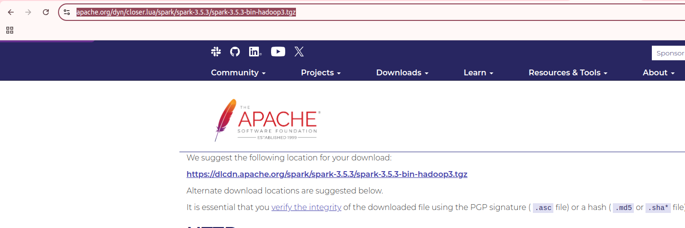

Exact the zip and you will see this,

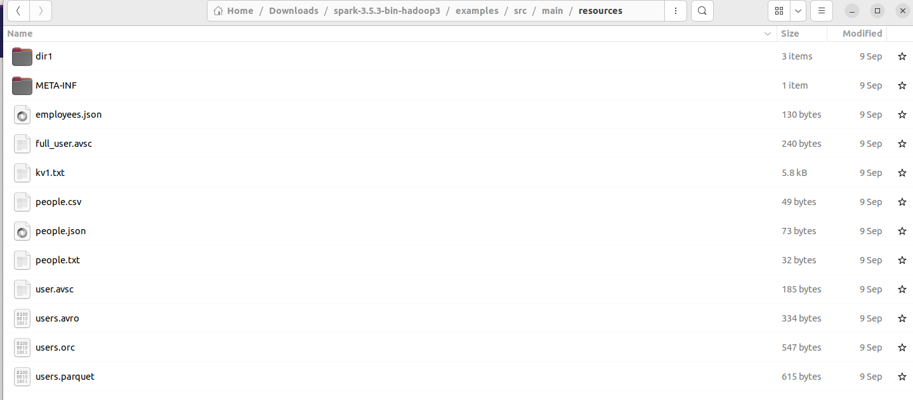

This is my folder structures,

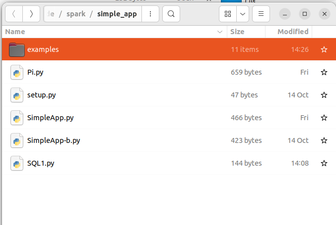

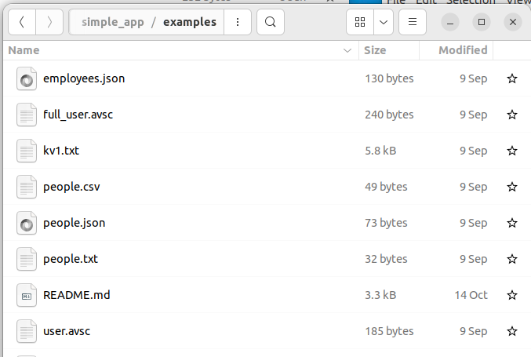

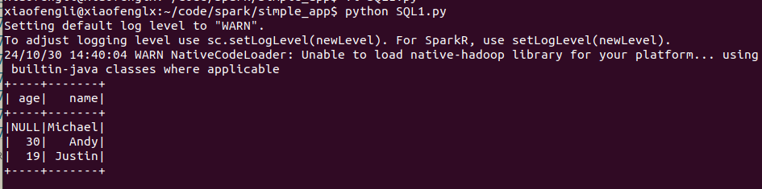

* Step 3 Run the code

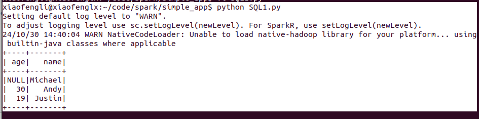

* Step 4 update our code to the following,

Let us add more usage of the dataframe, once the data is imported into dataframe,
it is in our hand. In the following example, we use `df.select`, `df.filter` and `df.groupBy`

```python
from pyspark.sql import SparkSession

spark = SparkSession \
       .builder \
        .appName("Python Spark SQL basic example") \
        .config("spark.some.config.option", "some-value") \
        .getOrCreate()
df = spark.read.json("examples/people.json")
df.show()
   
# spark, df are from the previous example
# Print the schema in a tree format
df.printSchema()
 
# Select only the "name" column
df.select("name").show()

# Select everybody, but increment the age by 1
df.select(df['name'], df['age'] + 1).show() 

# Select people older than 21
df.filter(df['age'] > 21).show()
  
 # Count people by age
df.groupBy("age").count().show()
spark.stop()
```

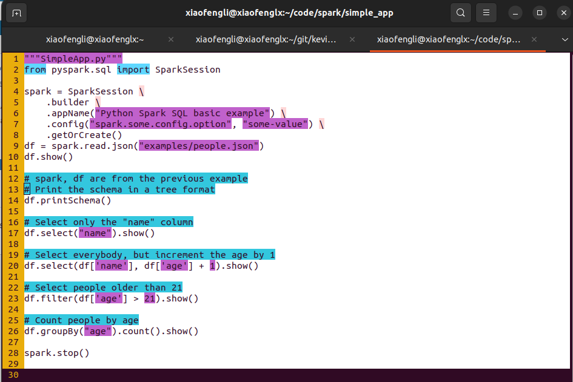

You can download the code from here [SQL1.py](kevinli-webbertech.github.io/blog/md/courses/big_data/spark/spark_code/SQL1.py)

## SQL Lab 2

Download the code from here [SQL2.py](kevinli-webbertech.github.io/blog/md/courses/big_data/spark/spark_code/SQL2.py). It is the same content as the following code,

```python
from pyspark.sql import SparkSession
spark = SparkSession \
       .builder \
       .appName("Python Spark SQL basic example") \
       .config("spark.some.config.option", "some-value") \
       .getOrCreate()
df = spark.read.json("examples/people.json")

# Register the DataFrame as a SQL temporary view
df.createOrReplaceTempView("people")
sqlDF = spark.sql("SELECT * FROM people")
sqlDF.show()
spark.stop()
```

* Run the code

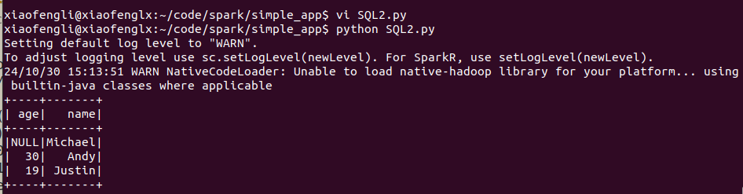

## Datasets and DataFrames

A Dataset is a distributed collection of data. Dataset is a new interface added in Spark 1.6 that provides the benefits of RDDs (strong typing, ability to use powerful lambda functions) with the benefits of Spark SQL’s optimized execution engine.

* A Dataset can be constructed from JVM objects and then manipulated using functional transformations (map, flatMap, filter, etc.).

* A DataFrame is a Dataset organized into named columns. It is conceptually equivalent to a table in a relational database or a data frame in R/Python, but with richer optimizations under the hood.

* DataFrames can be constructed from a wide array of sources such as: structured data files, tables in Hive, external databases, or existing RDDs.

* The Dataset API is available in Scala and Java. `Python does not have the support for the Dataset API`. But due to Python’s dynamic nature, many of the benefits of the Dataset API are already available (i.e. you can access the field of a row by name naturally row.columnName). The case for R is similar.

* The DataFrame API is available in Scala, Java, Python, and R. In Scala and Java, a DataFrame is represented by a Dataset of Rows. In the Scala API, DataFrame is simply a type alias of Dataset[Row]. While, in Java API, users need to use Dataset<Row> to represent a DataFrame.

### Creating Datasets

Datasets are similar to RDDs, however, instead of using Java serialization or Kryo they use a specialized Encoder to serialize the objects for processing or transmitting over the network. While both encoders and standard serialization are responsible for turning an object into bytes, encoders are code generated dynamically and use a format that allows Spark to perform many operations like filtering, sorting and hashing without deserializing the bytes back into an object.

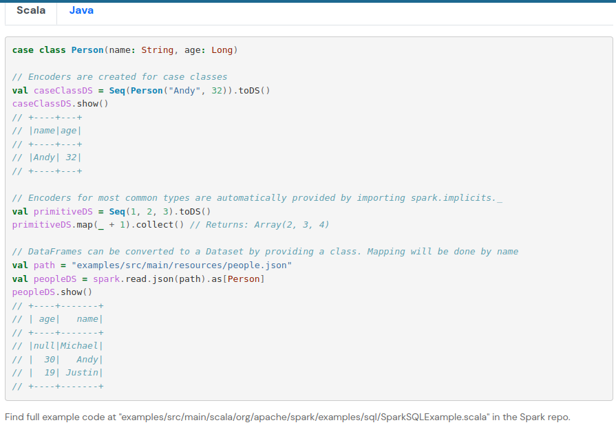

## Lab 3 Programmatically Specifying the Schema

In this lab, we are doing the following things,

* Parse a txt file
* Create an RDD of tuples or lists from the original RDD;
* Create the schema represented by a StructType matching the structure of tuples or lists in the RDD created in the step 1.
* Apply the schema to the RDD via createDataFrame method provided by SparkSession.

You can download the file from here [SQL3.py](kevinli-webbertech.github.io/blog/md/courses/big_data/spark/spark_code/SQL3.py)

* Step 1 create a SQL3.py

Like the following,

```python
# $example on:init_session$
from pyspark.sql import SparkSession
# $example off:init_session$

# $example on:schema_inferring$
from pyspark.sql import Row
# $example off:schema_inferring$

# $example on:programmatic_schema$
# Import data types
from pyspark.sql.types import StringType, StructType, StructField
# $example off:programmatic_schema$

def programmatic_schema_example(spark: SparkSession) -> None:
    # $example on:programmatic_schema$
    sc = spark.sparkContext

    # Load a text file and convert each line to a Row.
    lines = sc.textFile("examples/people.txt")
    parts = lines.map(lambda l: l.split(","))
    # Each line is converted to a tuple.
    people = parts.map(lambda p: (p[0], p[1].strip()))

    # The schema is encoded in a string.
    schemaString = "name age"

    fields = [StructField(field_name, StringType(), True) for field_name in schemaString.split()]
    schema = StructType(fields)

    # Apply the schema to the RDD.
    schemaPeople = spark.createDataFrame(people, schema)

    # Creates a temporary view using the DataFrame
    schemaPeople.createOrReplaceTempView("people")

    # SQL can be run over DataFrames that have been registered as a table.
    results = spark.sql("SELECT name FROM people")

    results.show()
    # +-------+
    # |   name|
    # +-------+
    # |Michael|
    # |   Andy|
    # | Justin|
    # +-------+
    # $example off:programmatic_schema$

if __name__ == "__main__":
    # $example on:init_session$
    spark = SparkSession \
        .builder \
        .appName("Python Spark SQL basic example") \
        .config("spark.some.config.option", "some-value") \
        .getOrCreate()
    # $example off:init_session$

    programmatic_schema_example(spark)

    spark.stop()
```

* Run SQL3.py

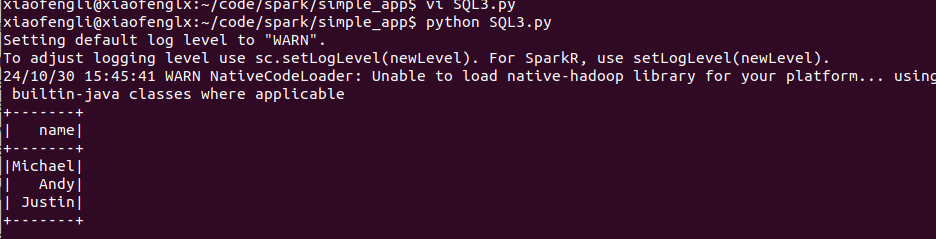

## Lab 4

* Prepare your code SQL4.py

Download the code from here [SQL4.py](kevinli-webbertech.github.io/blog/md/courses/big_data/spark/spark_code/SQL4.py)

```python
# $example on:init_session$
from pyspark.sql import SparkSession
# $example off:init_session$

# $example on:schema_inferring$
from pyspark.sql import Row
# $example off:schema_inferring$

# $example on:programmatic_schema$
# Import data types
from pyspark.sql.types import StringType, StructType, StructField
# $example off:programmatic_schema$

def schema_inference_example(spark: SparkSession) -> None:
    # $example on:schema_inferring$
    sc = spark.sparkContext

    # Load a text file and convert each line to a Row.
    lines = sc.textFile("examples/people.txt")
    parts = lines.map(lambda l: l.split(","))
    people = parts.map(lambda p: Row(name=p[0], age=int(p[1])))

    # Infer the schema, and register the DataFrame as a table.
    schemaPeople = spark.createDataFrame(people)
    schemaPeople.createOrReplaceTempView("people")

    # SQL can be run over DataFrames that have been registered as a table.
    # WHERE age >= 13 AND age <= 19
    teenagers = spark.sql("SELECT name FROM people")

    # The results of SQL queries are Dataframe objects.
    # rdd returns the content as an :class:`pyspark.RDD` of :class:`Row`.
    teenNames = teenagers.rdd.map(lambda p: "Name: " + p.name).collect()
    for name in teenNames:
        print(name)
    # Name: Justin
    # $example off:schema_inferring$

if __name__ == "__main__":
    # $example on:init_session$
    spark = SparkSession \
        .builder \
        .appName("Python Spark SQL basic example") \
        .config("spark.some.config.option", "some-value") \
        .getOrCreate()
    # $example off:init_session$

    schema_inference_example(spark)

    spark.stop()
```

* Prep our people.txt like the following,

```json
Michael, 29
Andy, 30
Justin, 19
John, 20
Ian, 18
Tom, 15
```

* Run SQL4.py
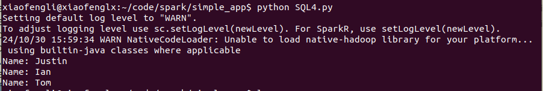

## Files supported

### Data formats

* CSV, TXT, JSON
* HIVE tables
* Avro
* ORC
* Protobuf
* Whole binary

### Generic Load/Save Functions

* parquet

Parquet is a columnar format that is supported by many other data processing systems.

```shell
df = spark.read.load("examples/src/main/resources/users.parquet")
df.select("name", "favorite_color").write.save("namesAndFavColors.parquet")
```

With options,

```python
df = spark.read.parquet("examples/src/main/resources/users.parquet")
(df.write.format("parquet")
    .option("parquet.bloom.filter.enabled#favorite_color", "true")
    .option("parquet.bloom.filter.expected.ndv#favorite_color", "1000000")
    .option("parquet.enable.dictionary", "true")
    .option("parquet.page.write-checksum.enabled", "false")
    .save("users_with_options.parquet"))
```

* orc

Apache ORC is a columnar format which has more advanced features like native zstd compression, bloom filter and columnar encryption.

```shell
df = spark.read.orc("examples/src/main/resources/users.orc")
(df.write.format("orc")
    .option("orc.bloom.filter.columns", "favorite_color")
    .option("orc.dictionary.key.threshold", "1.0")
    .option("orc.column.encoding.direct", "name")
    .save("users_with_options.orc"))
```

* Json

```python
df = spark.read.load("examples/src/main/resources/people.json", format="json")
```

* Run SQL on files directly

`df = spark.sql("SELECT * FROM parquet.`examples/src/main/resources/users.parquet`")`

> Hint: full example is found at "examples/src/main/python/sql/datasource.py" in the Spark repo.

## Bucketing, Sorting and Partitioning

`df.write.bucketBy(42, "name").sortBy("age").saveAsTable("people_bucketed")`

`df.write.partitionBy("favorite_color").format("parquet").save("namesPartByColor.parquet")`

and you can do them in one action,

```python
df = spark.read.parquet("examples/src/main/resources/users.parquet")
(df
    .write
    .partitionBy("favorite_color")
    .bucketBy(42, "name")
    .saveAsTable("users_partitioned_bucketed"))
```

* avro file

**Apache Avro data**

***Load and write data***

`df = spark.read.format("avro").load("examples/src/main/resources/users.avro")`

`df.select("name", "favorite_color").write.format("avro").save("namesAndFavColors.avro")`

Full example,

```python
from pyspark.sql.avro.functions import from_avro, to_avro

# `from_avro` requires Avro schema in JSON string format.
jsonFormatSchema = open("examples/src/main/resources/user.avsc", "r").read()

df = spark\
  .readStream\
  .format("kafka")\
  .option("kafka.bootstrap.servers", "host1:port1,host2:port2")\
  .option("subscribe", "topic1")\
  .load()

# 1. Decode the Avro data into a struct;
# 2. Filter by column `favorite_color`;
# 3. Encode the column `name` in Avro format.
output = df\
  .select(from_avro("value", jsonFormatSchema).alias("user"))\
  .where('user.favorite_color == "red"')\
  .select(to_avro("user.name").alias("value"))

query = output\
  .writeStream\
  .format("kafka")\
  .option("kafka.bootstrap.servers", "host1:port1,host2:port2")\
  .option("topic", "topic2")\
  .start()
```

* Binary file

`park.read.format("binaryFile").option("pathGlobFilter", "*.png").load("/path/to/data")`

## Ref

- https://spark.apache.org/docs/latest/sql-programming-guide.html
- https://sparkbyexamples.com/pyspark/pyspark-rdd-actions/
- https://spark.apache.org/sql/
- https://spark.apache.org/docs/latest/sql-data-sources.html
