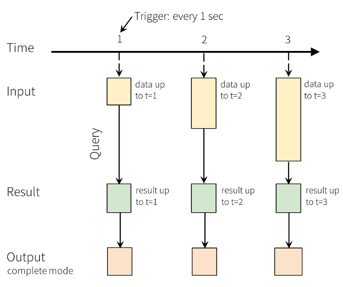

## Unified batch and streaming APIs

Spark Structured Streaming provides the same structured APIs (DataFrames and Datasets) as Spark so that you don’t need to develop on or maintain two different technology stacks for batch and streaming. In addition, unified APIs make it easy to migrate your existing batch Spark jobs to streaming jobs.

## Low latency and cost effective

Spark Structured Streaming uses the same underlying architecture as Spark so that you can take advantage of all the performance and cost optimizations built into the Spark engine. With Spark Structured Streaming, you can build low latency streaming applications and pipelines cost effectively.

## Ref

- https://spark.apache.org/streaming/
- https://spark.apache.org/docs/latest/structured-streaming-programming-guide.html