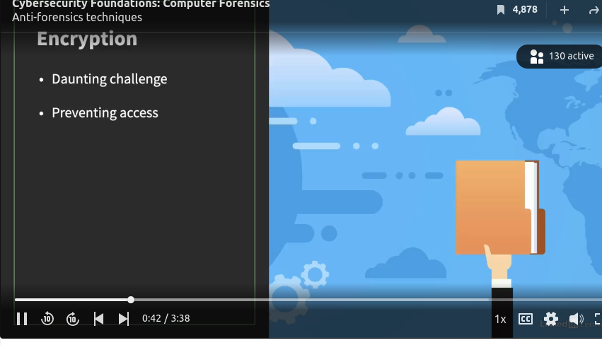
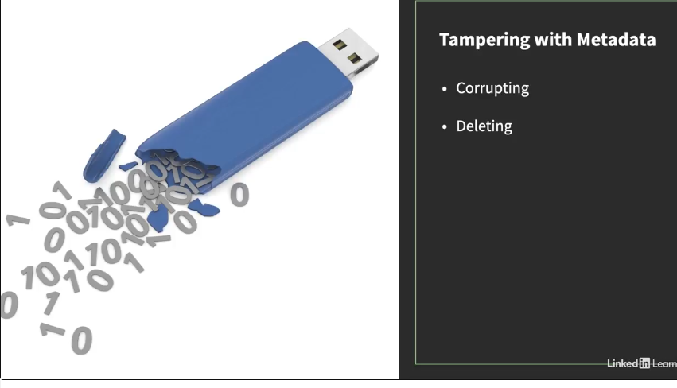
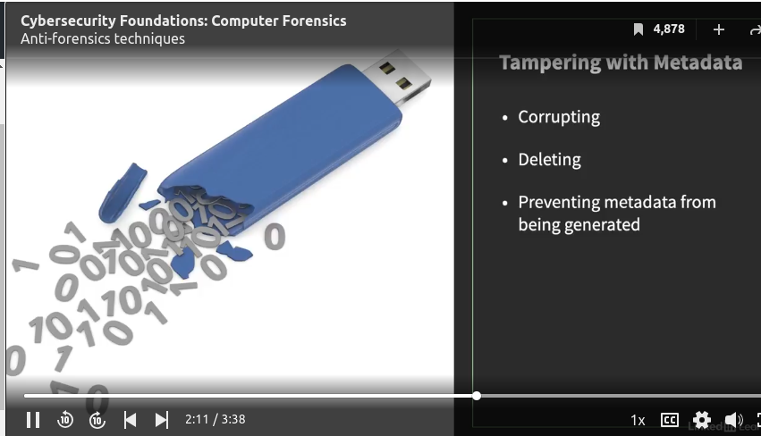
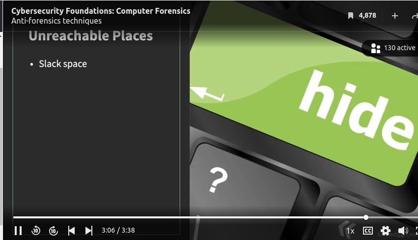

### **Anti-forensics techniques**

There is an ongoing race between criminals and computer forensics professionals. The lawbreakers are always seeking ways to evade the investigators. Sometimes bad guys get unexpected help from operating systems or OS vendors. To protect the privacy of its users, OS companies strengthened their encryption, which could keep good guys like investigators from doing their work. It's a delicate balance.

 Encryption is one of the most daunting challenges computer forensics specialists face today because it prevents investigators from reading the data they need to investigate. 
 
 

 Another obstacle is an attempt to erase evidence from various media, like a solid state drive. It's impossible to recover your data depending on how you delete it. When you delete a file, your OS doesn't remove it from a storage device. It simply marks the area the file occupies as deleted so it can be overwritten later. Therefore, to thrive in this ever-changing field, to override the section designated as deleted and make it permanently erased. 
 
 

Metadata provides information on different aspects of data. If your data is a digital photo, its metadata includes facts like when the photo was taken and which device took it. 

OSs keep metadata about files, including names, sizes, timestamps, and most importantly, where the files are stored. Corrupting or deleting the metadata will make it extremely difficult to reconstruct or find the file. 

Preventing metadata from being created altogether is another option. An example is suppressing the changes of timestamps every time revisions are made. This will throw off investigators because they'll be confused about the sequence of file change events. 

There are also more creative ways to avoid detection and hide information. One of the methods is using steganography, often favored by spies. They can subtly embed information in a picture file so that the image is not significantly altered.

If done well, it's almost impossible to tell the difference between an original image and its tampered version, as you can see on the Guardian Project website where they offer a steganography app.

A more general method to hide data is to put it in unreachable places, undetectable by computer forensics software. A slack space, a leftover created when writing to a file system, is a popular choice for this. 

More advanced techniques can destroy evidence once they detect and attempt to analyze a digital medium forensically. 

New anti-forensic approaches are constantly emerging and many more are under development. 

This race between defenders and violators will continue as long as there is money to be made through computer and cyber crimes.

