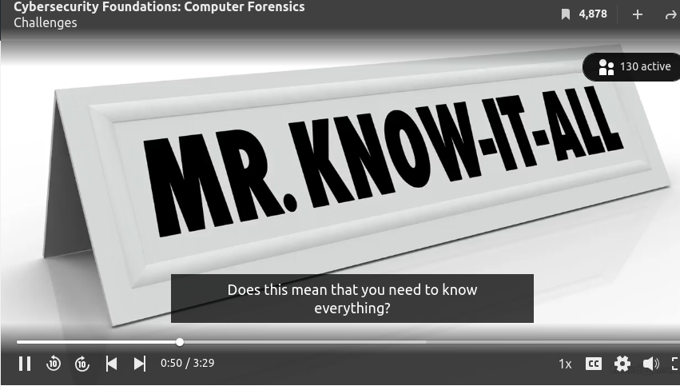

## **Challenges**

Working in computer forensics is challenging, partly due to the rapidly changing technology landscape. Whether they're old or new, all the technologies also coexist while new software and hardware are constantly appearing.

Take your PC, they continuously release new versions of the operating systems or OS. Microsoft OS alone has a long list of upgrades from MS-DOS to the latest version of Windows OS.
 

Computer forensics professionals encounter many different technologies during an investigation. It could be MS-DOS today, but Windows 11 tomorrow.
 
Does this mean that you need to know everything? The simple answer is no. It's virtually impossible to master every OS.
 

A good compromise is to develop foundational knowledge that transcends different versions of OSs and to focus on more persistent aspects of computer technology, such as file systems. You also have to be resourceful. Sometimes all it takes is a call to an expert. 
 

However, it's still challenging to keep up with the changes and fundamentals and maintain an understanding of numerous technologies out there.
 

Therefore, to thrive in this ever-changing field, you must love learning. The second challenge is that criminals are getting smarter and developing new ways thwart forensic analysis attempts. These anti forensics techniques range from encryption to steganography.
 

Once again, computer forensic specialists should be fully aware of these tricks and wade through the challenges to acquire the evidence they are tasked to find. The third challenge is the sheer volume of data to be analyzed. The storage capacity of a typical computer is growing exponentially.

These days, it's common for a laptop to have a terabyte solid state drive. To produce a timely report, an investigator must have access to a powerful workstation equipped with the latest forensic technologies, which are rapidly evolving themselves.

There are also other non-technical challenges. Privacy is one of them. To stay out of trouble, a forensic specialist should be crafty and able to navigate through private data while not violating a person's privacy. Otherwise, the investigator risks having the collected evidence not accepted by the court.

Jurisdiction is another legal challenge. Due to the differences in laws between countries, you may not be allowed to retrieve and present certain information.

There are many more challenges in computer forensics, which naturally result in more expansion and specializations in the field. These challenges are good for the industry because they generate more opportunities for all of us.