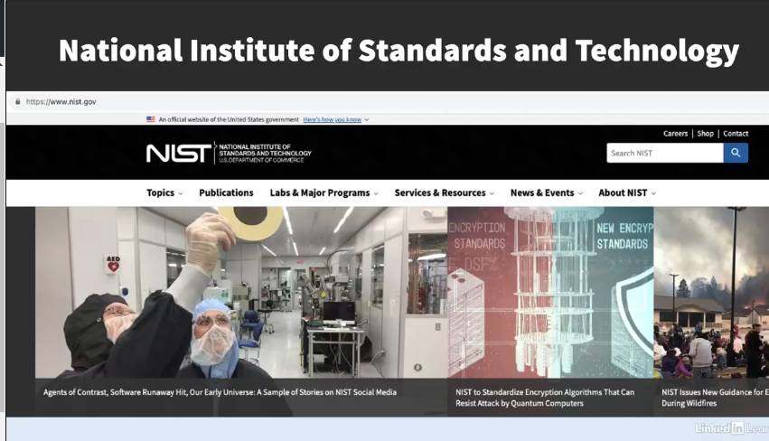
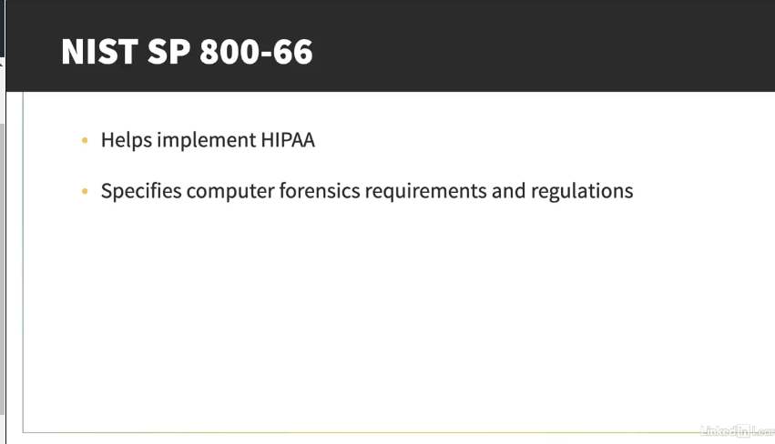
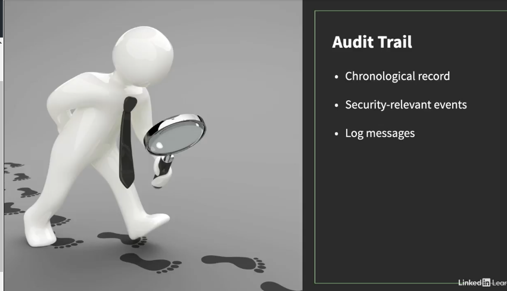
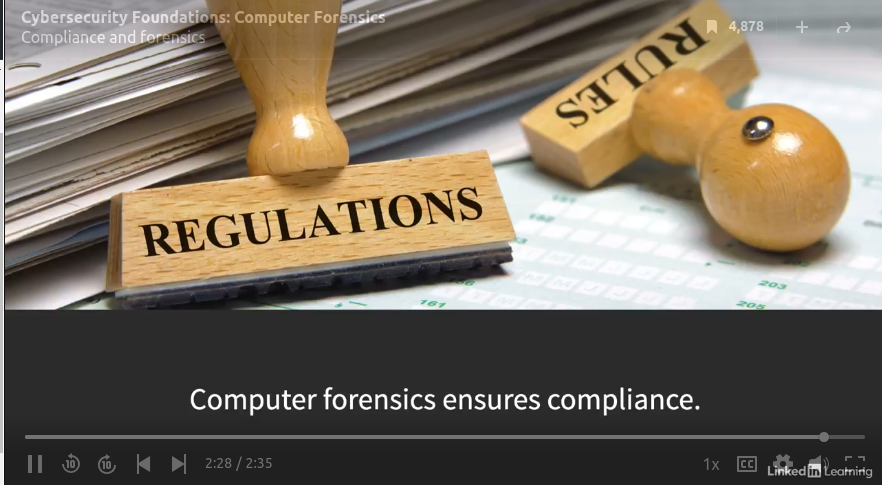

## **Compliance and forensics**

Computer forensics is essential to meeting compliance requirements. 

Organizations must comply with different rules and regulations, depending on the industry. The Health Insurance Portability and Accountability Act, or HIPAA of 1996, stipulates protecting personally identifiable information, or PII, in the healthcare and insurance industries.

The National Institute of Standards and Technology, or NIST, is a non-regulatory agency of the US Department of Commerce. NIST SP 800-66 is a publication designed to help implement the HIPAA security rule.

SP here stands for special publication. The NIST Guide clearly specifies computer forensics requirements and regulations.

In particular, it discusses establishing an audit trail, supporting a forensics investigation after an incident. An audit trail is a chronological record that documents security-relevant events. Various log messages generated by software and hardware are an example of an audit trail.

In handling credit card transactions, an organization is responsible for adhering to the Payment Card Industry Data Security Standard, or PCI DSS.

PCI DSS imposes annual audit reports to ensure organizations take proper security precautions while processing customer credit card information.

It mandates a process to provide a timely computer forensics investigation after a compromise occurs. The Federal Information Security Management Act, or FSMA of 2002, requires federal organizations to generate and retain an immutable audit trail that enables a computer forensics investigation after a security incident. 

Computer forensics plays a crucial role in ensuring that an organization remains compliant with cybersecurity rules and regulations. This is one more reason to learn about computer forensics if you're involved in any aspect of the cybersecurity industry.

### Ref

(https://www.linkedin.com/learning/cybersecurity-foundations-computer-forensics/compliance-and-forensics?resume=false&u=56745521#)