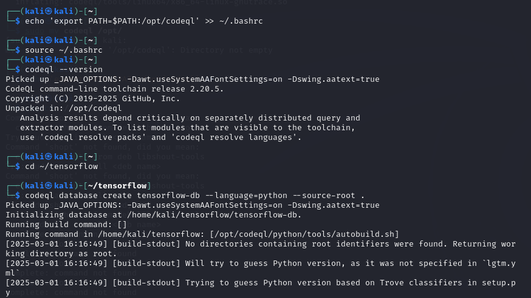
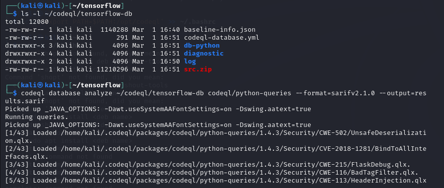
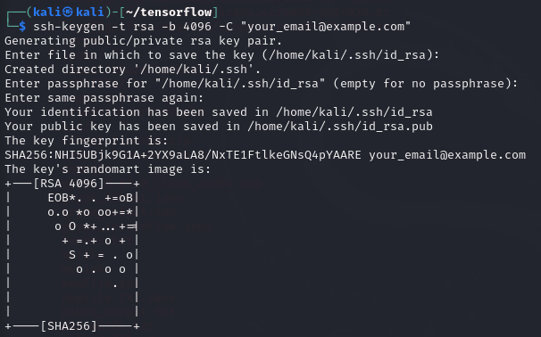
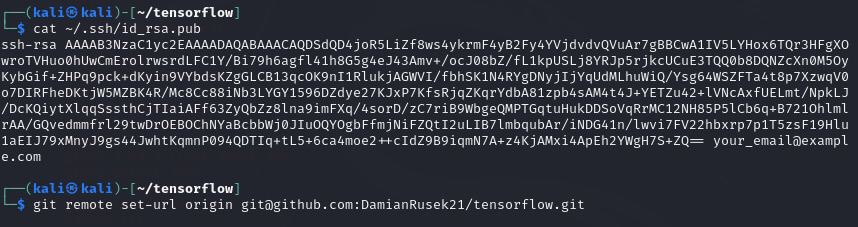
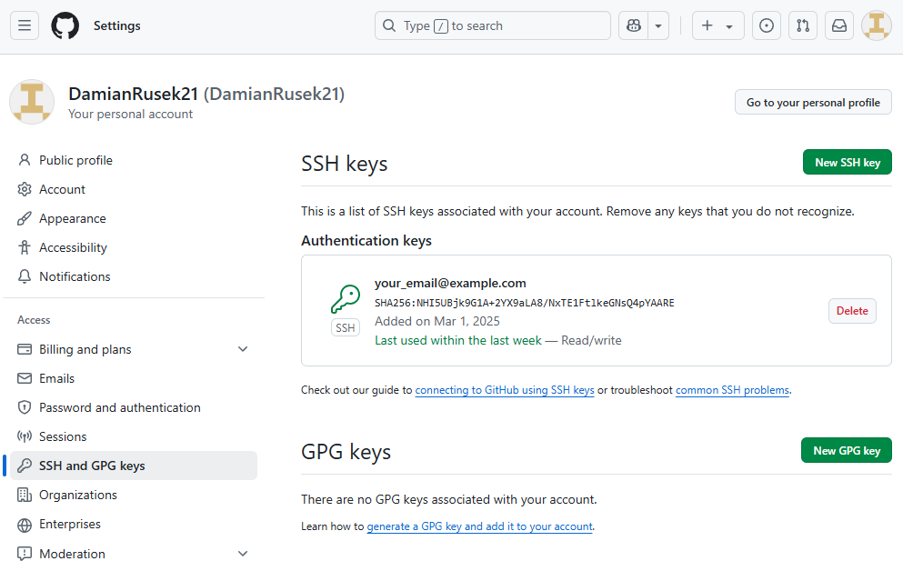
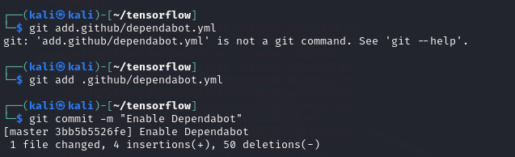
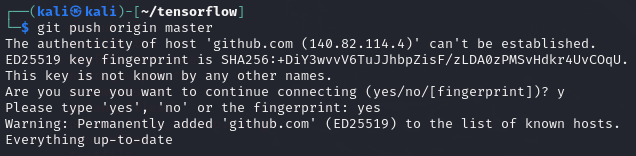

# CodeQL and Dependabot

## Installation

1. CodeQL
- What it is:
+ CodeQL is GitHub's static analysis engine that scans for security vulnerabilities
and coding issues. It works by treating code as data and querying it for patterns that indicate vulnerabilities.

- How it works:
+ It builds a database from the repository's code.
+ Runs queries to detect common security flaws like SQL injection, buffer overflows, and hardcoded credentials.
+ Generates alerts with detailed information.

2. Dependabot
- What it is:
+ Dependabot helps mange dependency security by scanning for outdated or vulnerable dependencies
and automatically suggesting updates.

### How it works

+ It checks dependency files like requirements.txt, package.jjson, or pom.xml
+ It a security issues is found, it creates a pull request suggesting an update.
+ Can also perform version updates for dependencies to avoid outdated packages.

## Setting Up CodeQL and Dependabot in Kali Linux

1. Clone the TensorFlow Repository

git clone https://github.com/tensorflow/tensorflow.git
cd tensorflow


2. Run CodeQL Analysis

Installing CodeQL

gh extension install github/gh-codeql


## Creating a CodeQL Database

gh codeql database create tensorflow-db --language=python --source-root .



## Running a CodeQL Query

gh codeql database analyze tensorflow-db --format=sarifv2.1.0 --output=results.sarif



(The output file results.sarif contains security vulnerabilities and other findings)

## Enabling Dependabot

First, you need to create a .github/dependabot.yml file
and paste the following content inside of it:

To create the file:

```shell
mkdir -p .github
nano .github/dependabot.yml
```

Then paste:

```shell
version: 2
updates:
  - package-ecosystem: "pip"
    directory: "/"
    schedule:
      interval: "weekly"
``````

## We then have to create a token

**Why?**
- Dependabot needs permission to scan dependencies and create pull requests in your repository
- GitHub uses authentication tokens (instead of passwords) to securely grant access to services line Dependabot
- The SSH key you will generate acts as proof that Dependabot has the right to interact with your repository
- Without the token, Dependabot wouldn't be able to suggest dependency updates or open pull requests

So, let's create the token:

`ssh-keygen -t rsa -b 4096 -C "your_email@example.com"`



then view it:

cat ~/.ssh/id_rsa.pub



Lastly, we go into our github to create a new SSH key and paste our created token inside of it



Once we have that we can run the following commands:

`git add.github/dependabot.yml`

(With this we make the Git track the changes and prepare it for the next commit.
Basically telling Git that we want this file to be included in our next snapshot of the project).

`git commit -m "Enable Dependabot"`

>Hint: This creates our snapshot (commit), which is essentially a saved state of the repository. The -m "Enable Dependabot" adds a snaphot message describing the change, making it easier to track history. Thanks to this, Git will know that this change is part of the repository's version history.

## git push origin master

* Lastly, this pushes the committed changes to the remote GitHub Repository. origin refers to the default remote repository [the one you cloned from].

* master is the main branch where these changes will be applied)

(After this command, the .github/dependabot.yml file will be available in our GitHub Repository, allowing dependabot to start working)

By doing so, our Dependabot will now start scanning dependencies.


