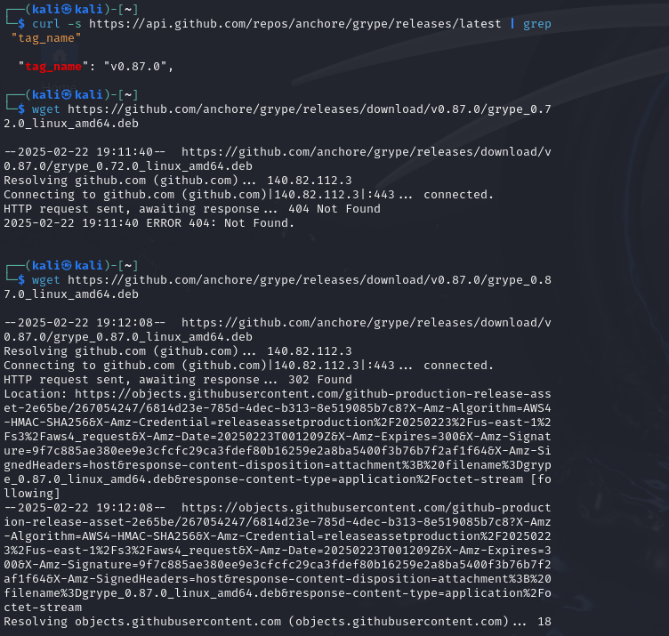
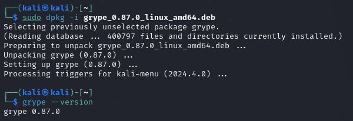
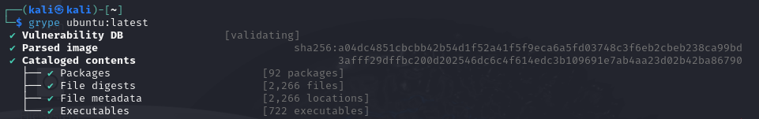
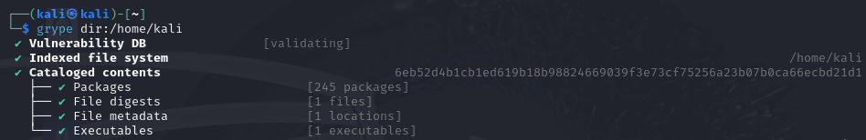
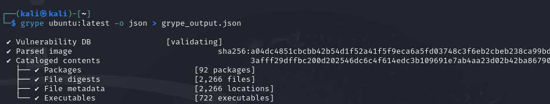

# Grype Scanner

    • Purpose: Scans container images and filesystems for vulnerabilities.
    • Key Features:
        ◦ Scans Deep into Dependencies
            ▪ Grype doesn’t just check what’s on the surface; it digs into all the dependencies (those libraries and packages your software relies on) to find security flaws.
            ▪ It’s like checking every ingredient in a meal to see if anything is expired instead of just looking at the main dish.
        ◦ Anchore Enterprise
            ▪ If you’re using Anchore Enterprise, Grype integrates smoothly, giving you extra security features and better vulnerability tracking.
            ▪ Same principal but just amplified security.
        ◦ Multiple Output Formats for Different Needs
            ▪ JSON: Great for automation or feeding data into other tools
            ▪ CycloneDX: A format used for software bill of materials (SBOMs), which is just a fancy way of saying  “a list of all the parts in your software.”
            ▪ So, JSON is sort of a simple checklist and CycloneDX is a full ingredient label for your app’s security.

Basically, Grype is a deep-diving vulnerability scanner that checks all your software dependencies, works extra well with Anchore Enterprise, and gives you security reports in useful formats.

## Difference?

Grype and Trivy both scan for vulnerabilities, but they have different strengths. Grype goes deep into dependencies and is great if you need detailed SBOM (Software Bill of Materials) reports. Trivy, on the other hand, is faster and scans more than just vulnerabilities—it also checks for misconfigurations, secrets, and infrastructure-as-code (IaC) issues.
If you want a thorough dependency check, go with Grype. If you want a faster, more versatile scanner, go with Trivy.

## Installation

## Scanning

### Scan a Docker Image

Command: `grype ubuntu:latest`
    • What this does: Scans the latest Ubuntu container image for vulnerabilities.
    • Output:
        ◦ Lists vulnerabilities including deep dependencies
        ◦ More detailed than Trivy for SBOM (Software Bill of Materials) data

### Scan a Local Filesystem

Command: `grype  dir:/home/kali`
    • What this does: Scans the latest Ubuntu container image for vulnerabilities.
    • Output:
        ◦ Lists vulnerabilities including deep dependencies
        ◦ More detailed than Trivy for SBOM (Software Bill of Materials) data

### Save Scan Output to a File

Command: `grype ubuntu:latest -o json > grype_output.json`

• What this does: Saves the output in JSON format for detailed logging

### Scanning the Repo with Grype

* You will run into a problem where your tmp directory was full so you have to first create a new temp directory, and then tell Grype to use this new temp folder instead of the original one. And only then that I ran the command of grype dir:. Which offers a more detailed vulnerability list, and includes deep dependencies and package version.
  
* then go on to save the output with the command of `grype dir:. -o json > grype_tensorflow.json`

* Lastly, let us view the JSON output: 

`cat grype_tensorflow.json | jq .`

## Ref

- https://github.com/anchore/grype