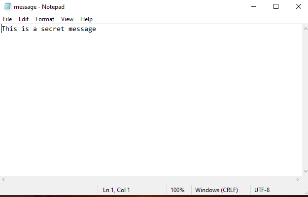
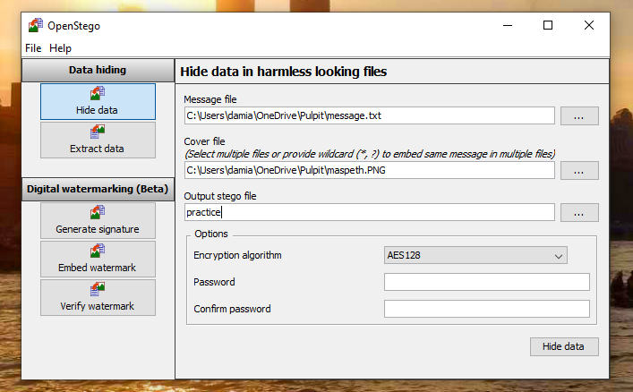
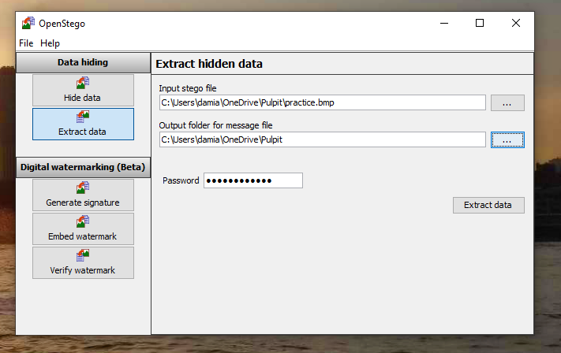

## Lab 2 Hidding Messages in PNG files using `OpenStego`

1. Choose Your Image
    • Use an image, for example of Maspeth, Queens (let’s call it maspeth.png). Make sure it’s under 500x500 pixels for simplicity.

2. Prepare Your Secret Message
    • You already have a secret message in message.txt. This can be any text you want to hide in the image.

3. Hide the Message with OpenStego

    1. Open OpenStego

        ◦ Launch the OpenStego app.

    2. Load Files

        ◦ Message File: Click "Browse" and select message.txt (your secret message).
        ◦ Cover File: Click "Browse" and choose maspeth.png (the image where the message will be hidden).

    3. Set Output File

        ◦ Choose a name for your new image, like practice.png.

    4. Encrypt (Optional)

        ◦ If you want extra security, select "Encrypt message" and enter a password (e.g., "bestpassword").

    5. Hide the Message

        ◦ Click "Hide Data". This will create practice.png, an image with your secret message hidden inside.

4. Extract the Hidden Message

    1. Open OpenStego

        ◦ Go back to OpenStego, and click on "Extract Data".

    2. Load the Stego Image

        ◦ Click "Browse" and select practice.png (the image with the hidden message).

    3. Enter the Password (If Used)

        ◦ If you encrypted the message, enter the password.

    4. Extract the Message

        ◦ Click "Extract Data", and OpenStego will give you a file with the hidden message, like extracted_message.txt.

