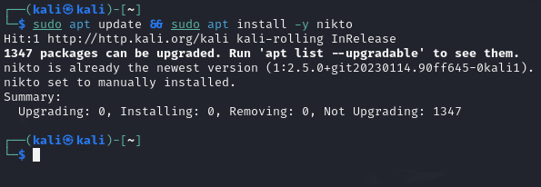

# Nikto Scanner

    • Purpose: It’s like a security guard for web servers. It scans them to find weak spots.
    • Key Features:
        ◦ Finds Misconfigurations, Old Software, and Exposed Files
            ▪ It checks if your web server is set up wrong, running outdated software, or leaking sensitive files.
            ▪ Basically, it’s like checking if your house has unlocked doors, broken windows, or a hidden key under the doormat.
        ◦ Uses a Huge Vulnerability Database
            ▪ Nikto knows about 6,700+ security issues, so it can spot known weaknesses in web servers.

Basically, Nikto is a web server security scanner that helps you find misconfigurations and vulnerabilities before attackers do. It’s not stealthy (noticeable on the network), but it’s super useful for spotting basic security issues fast.

## Difference?

* Nikto is completely different from Grype and Trivy because it focuses on web servers, not containers or software dependencies.
    • Grype & Trivy scan containers, filesystems, and dependencies for vulnerabilities in software packages. They help secure applications before deployment.
    • Nikto, on the other hand, scans live web servers to find misconfigurations, outdated software, and exposed files. It’s used to check if a web server is set up securely.

* Grype and Trivy help secure software and containers before deployment. Nikto scans web servers after they’re running to check for security flaws.

## Installation

## Scanning 

### Scan a Running Web Server with Nikto

Command: `nikto -h http://example.com`
    • What this does: Scans example.com for misconfigurations, outdated software, and security risks.
    • Output:
        ◦ Detects server software versions (Apache, Nginx, etc.)
        ◦ Shows known security vulnerabilities and exposed files.

### Save Scan Output to a File

Command: `nikto -h http://example.com -o nikto_output.txt`
    • What this does: Saves the scan report to nikto_output.txt

Unlike scanning a local filesystem, scanning a GitHub repo lets us check for vulnerabilities in both the code and dependencies before deployment. This is useful for securing open-source projects.

## Ref

- https://www.cisa.gov/resources-tools/services/nikto