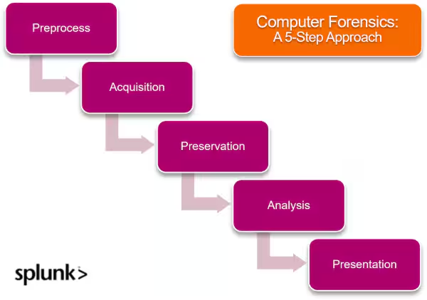
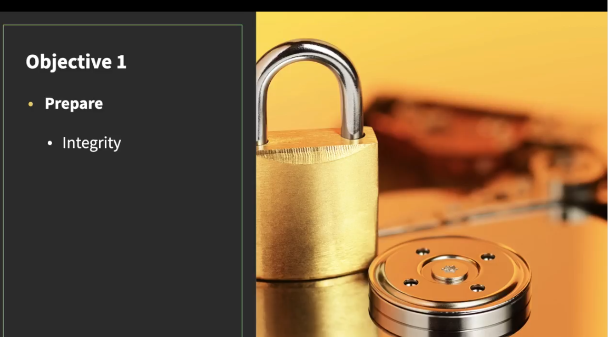
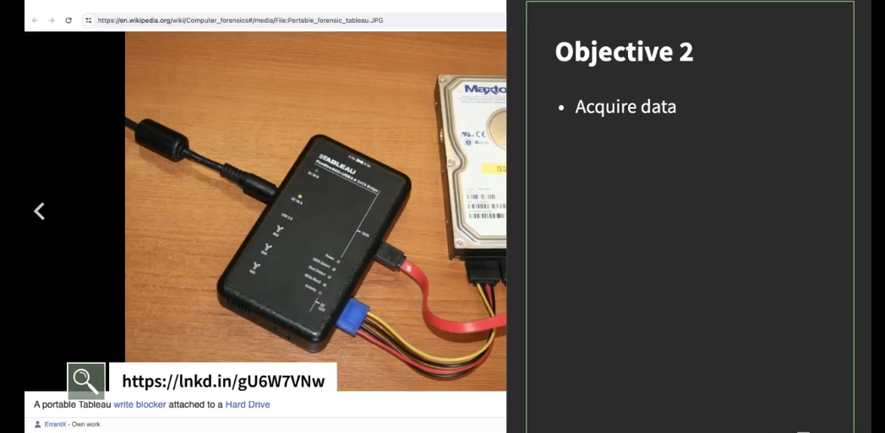
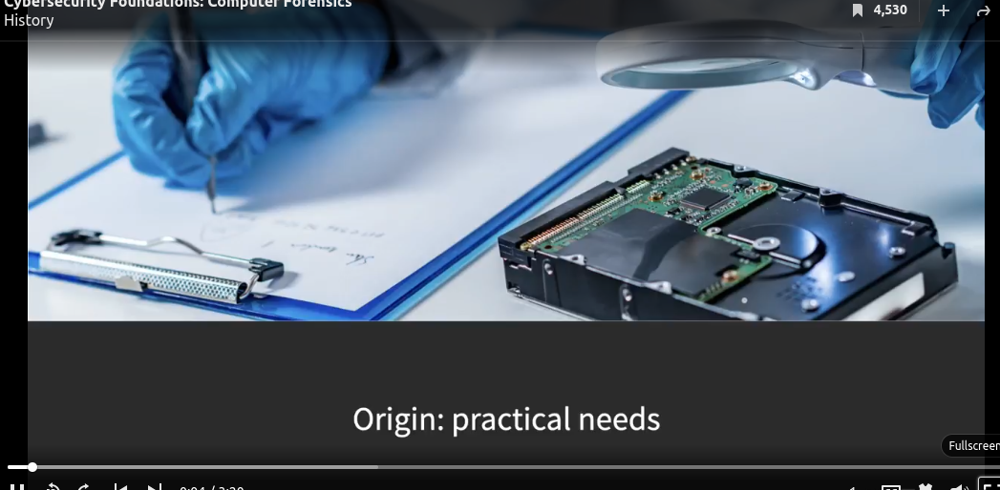

# Week1 Introduction – Understanding Computer Forensics

Every day, thousands of people become victims of cyberterrorism, online fraud, and crimes beyond white-collar offenses. That’s why law enforcement agencies combine traditional investigations with digital evidence to combat these and secure cyberspace.

**But how do we collect digital evidence?**

Computer forensics has emerged as a modern technology to identify, extract, document, and preserve data stored on digital devices. This ensures the data is presented in authentic and undamaged form at the court of law.

Computer forensics is a post-incident analysis that involves analyzing recovery, documentation, and presentation of digital evidence. As crimes like cyberstalking and harassment increase, advances in computer forensics are becoming increasingly important.

## Why it is important

This progress will drive growth in the cybersecurity industry, which is expected to reach $185.70 billion in revenue by 2024.

To perform computer forensics the right way, you must consider the following points:  

* Maintain authenticity and integrity of digital evidence.

* Acquire warrants from relevant authorities.Never compromise on individual and organizational privacy.

* Follow professional protocols and avoid conflict of interest.

In 2023, computer crimes resulted in 12.5 billion USD in losses, which will grow if not appropriately handled. Only the rapid pace of technological change and ample funding can bridge the gap and keep you ahead.

Computer forensics is used to handle these crimes. It has many strengths, but some areas still have loopholes. For example, handling cloud evidence is currently the biggest challenge.

## How computer forensics work

Any data that is unreliable or compromised cannot be used in court or other justice systems. To avoid that, computer forensics is an excellent threat detection and recovery tool that helps ensure the data is ready to be used.

>Image: from https://www.splunk.com/en_us/blog/learn/computer-forensics.html

**Step 1. Pre-process**

Before data collection and investigation, computer forensics examiners must complete the following pre-process steps:

* Computer forensics examiners must be practicing officers.

* They must obtain approval from the authorities.

* They should prepare and set up the required tools.

* They should obtain consent from relevant parties.

* Verify if the consenting party has the authority to access certain areas or devices in a shared location.

**Step 2. Acquisition**

In the second phase, they must acquire data from a suspect's digital devices. These devices may contain files or documents that can help resolve legal matters.

That’s why the forensic examiner thoroughly searches these devices and seizes them if they're relevant to the investigation. This helps them collect and transport relevant data securely.

**Step 3. Preservation**

After data acquisition, the investigation team safeguards the crime-related information and collected evidence to maintain its integrity. They ensure that the documents and ID are readable and traceable.

The team uses appropriate tools and methods to prevent data loss and modifications. In addition, they engage a third party for digital archive management to strengthen data authenticity by introducing an independent layer of verification.

**Step 4. Analysis**

Aside from finding the source and type of information stored on the device, this phase also includes identifying the real culprit. It can be straightforward if only one person can access the device, but that's not always true.

So, if there are multiple users, forensics teams analyze the following:

* How many people have access to the device?
* How many user accounts exist?
* Which accounts are shared by multiple individuals?

These questions help them build a solid case and catch the responsible person.

**Step 5. Presentation**

In the final phase, the forensic examiner prepares a final report and presents the findings to the authorities. The report includes:

* The findings from each phase of the investigation.

* The methods used to collect and analyze the evidence.

* A clear explanation of how and where you accessed each document.

* Sequence and timeline of the events if any similarity exists.

## Different types of computer forensics

The type of computer forensics you need to perform depends on the nature of the crime. Maybe you are investigating a malware attack or a phishing attack. Each type of crime requires a different approach and set of tools.  

Let’s look at some of the most common types of computer forensics:

**Web forensics** allows you to trace and attribute security attacks on web applications. You analyze log files from web browsers, servers, and applications to find evidence of cybercrime.

**Email forensics.** Of attacks reported in quarter one of 2024, more than one-third (37.6% ) were phishing attacks. In such attacks, users receive fake emails with malicious links to steal their identity or install malware. As a result, email forensics is used to detect such crimes.

**Network forensics.** Network breaches are on the rise. In 2023, a staggering 19% of all detected cyberattacks involved a network breach. That’s why companies use network forensics to analyze cookies and cache and identify attack sources. This way, you can avoid spam websites and prevent becoming a victim again.

**Cloud forensics.** While more businesses are adopting cloud computing models, cloud security remains the biggest concern. Cloud forensics addresses these cloud-related privacy crimes. However, since clouds are deployed in different locations, it's quite daunting to seize the physical devices.

Memory forensics allows you to analyze active processes on RAM and volatile memory to extract data where malware might be hidden. The goal is to find when the virus was installed and what its actions were on the system.

## Computer forensics: Some key challenges

Computer crime is the ugly truth of the digitally connected world. Unsurprisingly, the IT sector is the most breached sector of 2024. That’s why organizations use computer forensics to find the root cause of these attacks.

However, following are some of the associated challenges with implementing computer forensics:

* **Difficulty retrieving mobile data:**  Recovering deleted data is part of computer forensics, which is challenging for cell phones and iPhones. It's nearly impossible to retrieve data from the latest released models.

* **Shared computing resources:** Multiple users share the same cloud resource. That's why isolating and securing evidence without compromising other users' privacy is challenging.

* **No physical accessibility:** Due to cloud models' distributed nature, it's impossible to find the exact location of data. This issue will persist unless users can choose the territories of their data.

* **Data hiding in storage space:** Steganography is a common way for criminals to hide evidence in digital storage in the form of images, which makes it challenging for forensic experts to differentiate anomalies from modified ones. (Related reading: storage monitoring can help.)

* **Data encryption:** Scammers encrypt data to other formats to delay the digital investigation process. Data decryption is complex and requires a secret key to crack the code — making it time-consuming for forensics teams to break the encryption.

## Tools in a glimpse

### **Types of Digital Forensics**

**Digital forensics** is a branch of forensic science that involves the recovery, investigation, and analysis of digital evidence from devices like computers, smartphones, servers, and other digital storage systems. It is a critical tool for law enforcement, corporate investigations, and cybersecurity. Digital forensics is broadly categorized based on the type of evidence being examined or the devices involved. Below are the major types of digital forensics:

---

### Computer Forensics

**Computer forensics** involves the investigation and analysis of digital data stored on computers or computer systems. The primary focus is on recovering and analyzing data from hard drives, SSDs, memory, and other internal storage devices.

**Key Areas of Computer Forensics**:
- **File System Analysis**: Investigating file systems like **NTFS**, **FAT**, **EXT**, and **HFS+** to find deleted files, metadata, and file access history.
- **Data Recovery**: Recovering files that were deleted or corrupted, including those in unallocated space or slack space.
- **Memory Forensics**: Analyzing the system’s volatile memory (RAM) for signs of malware, rootkits, or unauthorized activity.
- **Malware Analysis**: Detecting, analyzing, and identifying malicious software found on computers.
- **Log Analysis**: Investigating system logs, application logs, and event logs to reconstruct actions or uncover unauthorized activities.

**Common Tools**:
- **FTK Imager**
- **EnCase**
- **The Sleuth Kit**
- **Autopsy**

---

### Mobile Device Forensics

**Mobile device forensics** focuses on retrieving and analyzing data from mobile devices such as smartphones, tablets, and smartwatches. This includes recovering data like contacts, messages, app data, call logs, location data, and more.

**Key Areas of Mobile Forensics**:
- **Data Extraction**: Extracting data from smartphones, tablets, and other mobile devices, even if they are locked or encrypted.
- **SIM Card Analysis**: Extracting information from SIM cards, including contacts, messages, and network data.
- **App Forensics**: Analyzing installed apps, their data, and their usage patterns, including app caches, logs, and databases.
- **Location Forensics**: Investigating location data from GPS-enabled apps and services, as well as mobile carriers' location tracking information.
- **Call and Text Message Recovery**: Recovering deleted text messages, call logs, voicemails, and multimedia messages (MMS).

**Common Tools**:
- **Cellebrite UFED**
- **XRY**
- **Magnet AXIOM**
- **Oxygen Forensic Detective**

---

### Network Forensics

**Network forensics** focuses on the monitoring, capturing, and analysis of network traffic to identify security incidents, detect breaches, or investigate cybercrimes. This type of forensics involves analyzing **packets**, **protocols**, and **network behavior** to trace unauthorized activities or attacks.

**Key Areas of Network Forensics**:
- **Packet Capture**: Capturing and analyzing raw network traffic to detect malicious activity, unauthorized access, or data exfiltration.
- **Traffic Analysis**: Analyzing patterns of network traffic to identify suspicious behaviors, including DDoS attacks, port scanning, and data breaches.
- **Intrusion Detection**: Using network monitoring tools (IDS/IPS) to detect network attacks, such as SQL injection, malware communication, or lateral movement.
- **VPN Analysis**: Investigating encrypted traffic or tunneling protocols like VPNs, which may be used for bypassing security measures.

**Common Tools**:
- **Wireshark**
- **tcpdump**
- **Suricata**
- **Snort**

---

### Cloud Forensics

**Cloud forensics** deals with the investigation and analysis of data stored in cloud computing environments. As more organizations store data and applications in the cloud, this type of forensics has become essential for uncovering cloud-based cybercrimes, breaches, or data theft.

**Key Areas of Cloud Forensics**:
- **Data Recovery**: Recovering data from cloud storage services (e.g., Google Drive, AWS S3, Microsoft Azure).
- **Account Analysis**: Investigating user accounts, access logs, and permissions on cloud platforms.
- **Activity Monitoring**: Tracking actions performed by users or attackers on cloud platforms, including file access, uploads, and downloads.
- **Virtual Machine Forensics**: Investigating the state and activity of virtual machines and containers in cloud environments.

**Common Tools**:
- **Elasticsearch**
- **CloudTrail (AWS)**
- **Azure Log Analytics**
- **Google Cloud Platform Logs**

---

### Memory Forensics

**Memory forensics** is the process of analyzing a system's volatile memory (RAM) to uncover hidden data, running processes, or suspicious activity. This type of forensics is essential for detecting malware, rootkits, or unauthorized processes that may not be visible in traditional disk-based analysis.

**Key Areas of Memory Forensics**:
- **Live Memory Capture**: Capturing the contents of RAM from running systems to analyze active processes, network connections, and other volatile data.
- **Malware Analysis**: Identifying malicious processes or hidden malware that may not have been recorded on disk.
- **Rootkit Detection**: Finding signs of rootkits or advanced persistent threats (APTs) that operate in system memory.
- **Network Connections**: Analyzing active network connections and open ports in system memory.

**Common Tools**:
- **Volatility**
- **Rekall**
- **Memoryze**

---

### Disk Forensics

**Disk forensics** involves the examination of storage devices such as hard drives, SSDs, and external media to recover and analyze data. This process can uncover deleted files, hidden data, file system structures, and even encrypted content.

**Key Areas of Disk Forensics**:
- **Data Carving**: Recovering fragments of deleted files or partially overwritten data from unallocated space.
- **File System Analysis**: Examining file system structures (e.g., NTFS, EXT4) for metadata, timestamps, file location, and deleted file recovery.
- **Encrypted Data**: Investigating encrypted volumes or containers and, when possible, attempting to decrypt the data.
- **Deleted File Recovery**: Identifying and recovering files that were deleted but not overwritten in storage.

**Common Tools**:
- **EnCase**
- **FTK Imager**
- **The Sleuth Kit**
- **Autopsy**

---

### Mobile Application Forensics

**Mobile application forensics** focuses on the investigation of **mobile apps** and their associated data. This can include analyzing app behavior, recovering app-specific files, and extracting data stored locally or in the cloud.

**Key Areas of Mobile App Forensics**:
- **App Data Recovery**: Recovering app data such as chat logs, photos, or contacts.
- **App Logs and Artifacts**: Analyzing app logs, databases (SQLite), and caches for valuable evidence.
- **App Network Traffic**: Investigating network traffic generated by mobile apps, including API calls and data exchanged with remote servers.
- **App Metadata**: Examining metadata and usage statistics for apps installed on the mobile device.

**Common Tools**:
- **Cellebrite UFED**
- **X1 Social Discovery**
- **Oxygen Forensic Detective**
- **Magnet AXIOM**

---

### Web Forensics

**Web forensics** focuses on the investigation of web-based data, including websites, web applications, browser history, and online communication. This area of forensics can help uncover evidence of cybercrimes, such as fraud, harassment, or illicit activity.

**Key Areas of Web Forensics**:
- **Browser History Analysis**: Analyzing browser history, cache, cookies, and downloads to track user activity online.
- **Web Server Logs**: Analyzing web server logs to trace user access, page views, and potential attack attempts.
- **Email and Messaging Analysis**: Recovering evidence from web-based email accounts (e.g., Gmail, Yahoo) and messaging platforms (e.g., WhatsApp Web).
- **Web Application Logs**: Investigating logs for vulnerabilities or evidence of attacks like SQL injection or cross-site scripting (XSS).

**Common Tools**:
- **X1 Search**
- **WebHarvy**
- **Browser History Examiner**
- **Wireshark**

---

### Forensic Imaging and Data Acquisition Tools

Forensic imaging tools are used to create **bit-for-bit copies** of storage devices, ensuring that the original evidence is not altered during the examination. These tools play a crucial role in preserving the integrity of data for forensic investigations.

**Key Areas of Forensic Imaging**:
- **Disk Imaging**: Create exact copies of storage devices (hard drives, SSDs) for analysis.
- **Memory Imaging**: Create forensic copies of system memory (RAM).
- **Network Capture**: Capture network traffic and data packets for analysis.

**Common Tools**:
- **FTK Imager**
- **dd** (Linux/Unix command)
- **Guymager**
- **WinFE**

---

### Forensic Cloud Data Recovery

Cloud forensics involves retrieving, analyzing, and preserving data from cloud platforms. As more data moves to cloud storage services, forensic investigators must focus on cloud-based evidence collection, including account activities, shared data, and access logs.

**Key Areas of Cloud Forensics**:
- **Cloud Storage Data**: Investigating files stored in cloud platforms like **Google Drive**, **Dropbox**, or **iCloud**.
- **Account Authentication Logs**: Examining login and access logs for cloud accounts.
- **Email Forensics**: Investigating cloud email services like **Gmail**, **Outlook**, and **iCloud Mail**.

**Common Tools**:
- **CloudTrail (AWS)**
- **Google Vault**
- **Elasticsearch**
- **Azure Log Analytics**

---

### **Conclusion**

Digital forensics encompasses a broad range of investigative techniques used to collect, analyze, and preserve evidence from various digital devices and systems. The tools mentioned above help forensic investigators gather critical evidence from computer systems, mobile devices, networks, cloud environments, and web platforms. 

Each area of forensics requires specialized tools and techniques to effectively investigate and resolve incidents related to cybercrimes, data breaches, and system intrusions.