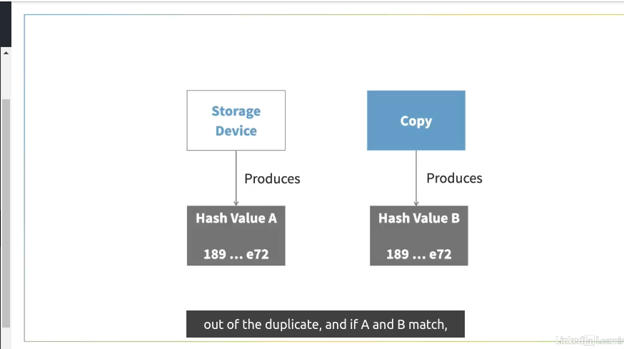

# Legal

### **Legal implications**

As a computer forensics investigator, you should be aware of the potential legal consequences of your action. If you conduct your computer forensics investigation improperly, the court could throw away all the evidence you provide. Even worse, you could get into legal trouble if you're not careful. In the context of a public investigation, one of the first things you have to consider is the Fourth Amendment. 

As you know, the Fourth Amendment protects you from unauthorized search and seizure. Therefore, as a computer forensics investigator working in public cases, you must obtain a warrant, by putting together a document called an affidavit, to justify the warrant.

In the context of a private investigation, the Fourth Amendment is often not a significant issue because internal policies drive your investigation instead of the statutes of the law.

Employers ask their employees to give their consent to comply with these policies when a job offer is made. Whether part of a public or private case, for your evidence to be accepted by the court, you must ensure the reproducibility and verifiability of your evidence. You can accomplish this by following systematic procedures in your computer forensics investigations when collecting and analyzing data. For example, using chain of custody forms and evidence lockers is critical to ensure there is little chance of tampering. 

Chain of custody forms allow you to track who handled your evidence, while evidence lockers are secure containers to store physical evidence. 

One way of ensuring verifiability is by the use of hashing. Let's say you have data on an original storage device or evidence drive, and a hash algorithm produces value A based on that data. Then you make a copy of the drive. If the same algorithm produces hash value B out of the duplicate, and if A and B match, the validity of the copy is verified. 

This course has a dedicated lesson where we look into hashing in more detail. Reproducibility is proven if you can generate the same hash value repeatedly. The Fourth Amendment, verifiability, and reproducibility are what you should always keep in mind as a computer forensics professional. How you conduct your investigation concerning these principles may have a significant legal impact. To avoid unintended consequences, following the leading practices is essential.