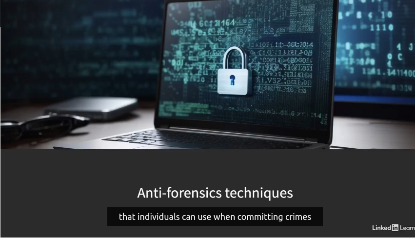
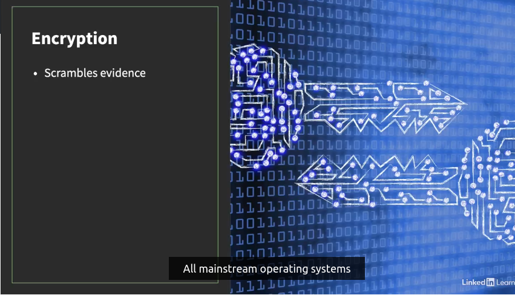
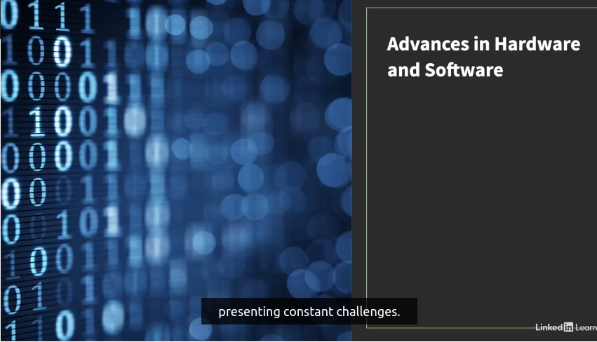

# **Current and future trends**

The good news for computer forensics professionals is that there are opportunities everywhere and there'll be even more because computer crimes are rising.

The bad news is that criminals are getting more organized and sophisticated, making our job as investigators more challenging.

There are many anti-forensics techniques that individuals can use when committing crimes in cyberspace. 

It's now a common practice to adopt one or more of these approaches to evade detection. Encryption is a huge challenge because it scrambles evidence and renders it useless. All mainstream operating systems or OS vendors are providing advanced encryption capabilities for mobile devices and personal computers to protect the privacy of their customers. 

Users can quickly and easily turn encryption on without expert knowledge. Some of you may remember a controversy surrounding Apple not providing technical support for bypassing its encryption algorithm to help law enforcement. 

Advances in hardware and software are always ongoing, presenting constant challenges. 

The sheer volume of data they generate alone is already too daunting to keep up with. These days, many standard storage devices have well over one terabyte capacity. Unless we accomplish comparable advances in search tools, forensic analysis attempts are bound to take longer. Luckily, we are seeing an explosion in data science innovations, especially in the area of big data and artificial intelligence, and I'm hoping that these newly emerging data science solutions will help reduce the average turnaround time for computer forensics analysis reports.

We are also storing more data in the cloud, and the ownership of data is not always clear, which could lead to custody disputes over potential evidence that a cloud service provider stores.

Another welcome change would be the improvement of the ease of use of computer forensics tools. 

More automation is important because it will enable investigators to spend less time on mundane tasks and focus more on what's really important. Automation can also help relieve specialists of simple but critical preliminary tasks such as collecting evidence at crime scenes, which less trained law enforcement officers should be able to handle with the help of more user-friendly software and hardware. Despite some of the challenges I mentioned here, the prospect of computer forensics industry.