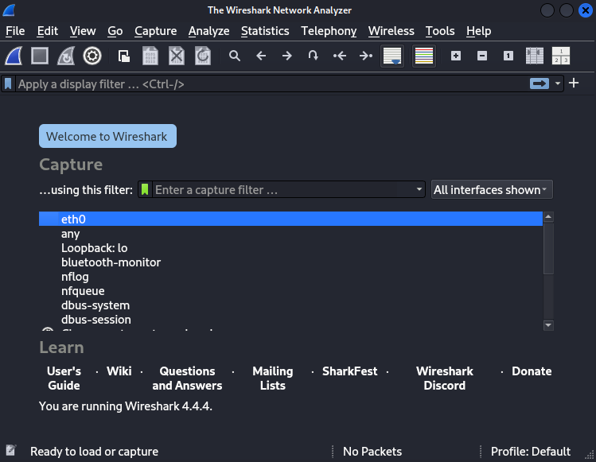
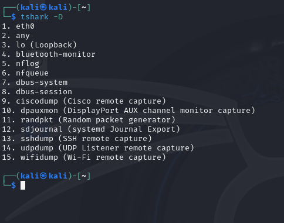
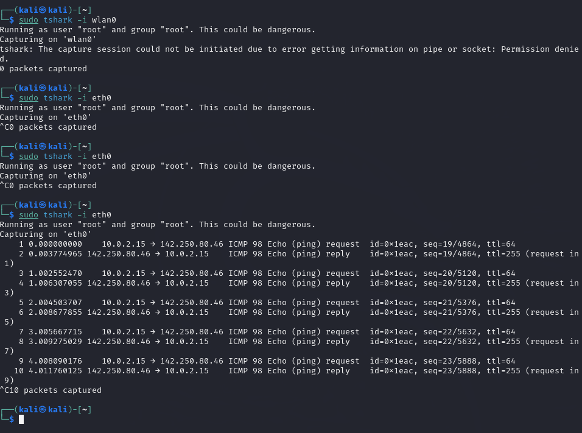
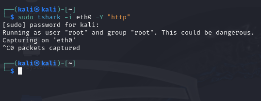
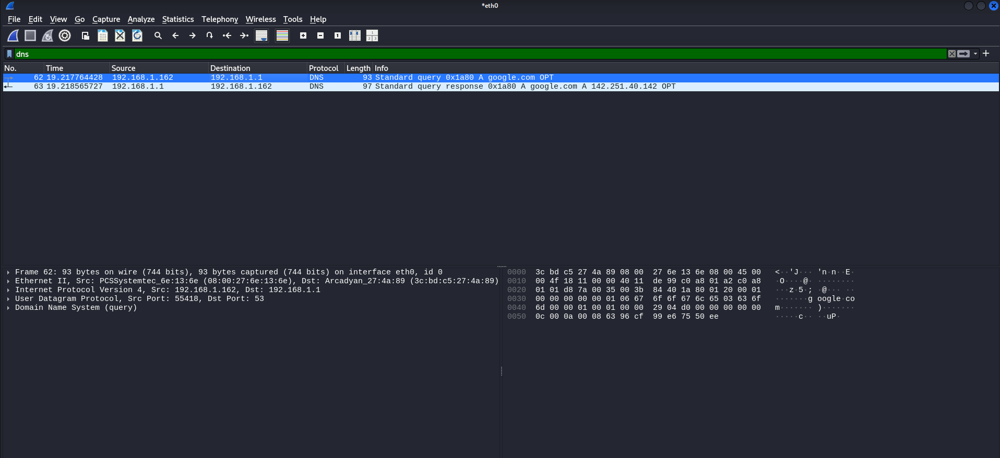
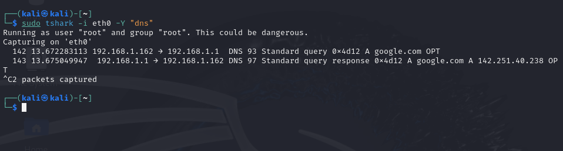
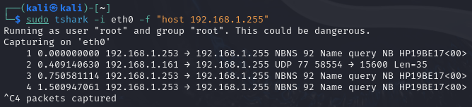
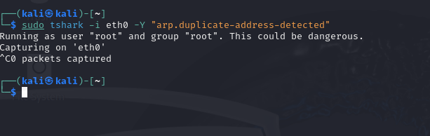
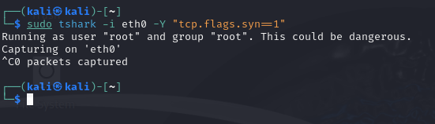

# What is Wireshark?

Wireshark is a network protocol analyzer, meaning it captures and inspects network traffic in real time. It allows you to see packets (small chunks of data) being sent and received on your network. 

## What is Wireshark Used For?

Network Troubleshooting: Diagnose connection issues, slow network speeds, and packet loss.
Cybersecurity Analysis: Detect hacking attempts, suspicious traffic, or malware communication.
Protocol Analysis: Study how different network protocols work.
Traffic Monitoring: See what websites, IPs, or services are being accessed on a network.

## How Does It Work?

    1. Captures Network Packets: Wireshark listens to your network interface (Wi-Fi, Ethernet, etc.) and collects packets of data.

    2. Decodes and Displays Traffic: It shows detailed information about each packet, including the source, destination, protocol, and contents.

    3. Filters Data for Analysis: You can filter specific traffic, such as only HTTP requests, DNS queries, or traffic from a particular IP address.

    4. Helps Identify Anomalies: By analyzing packet behavior, you can detect security threats, network misconfigurations, or unusual activity.

## Installing Wireshark on Kali Linux

Wireshark should come pre-installed on Kali Linux, but if missing, install it with:

`sudo apt update && sudo apt install wireshark -y`

You can either run Wireshark with a GUI Version using (sudo wireshark) or with a Command-line Version using (`sudo tshark`)

You can also check available network interfaces using `tshark -D`

What it does is, lists all network interfaces (Ethernet, Wi-Fi, Loopback, etc.) available for packet capture.

## **Capturing Packets on a Specific Interface**

`sudo tshark -i eth0`

**What This Does:**

- Captures all network traffic going through your Ethernet interface (eth0)
    • If you’re on a Wi-Fi, simply replace eth0 with wlan0
- Displays live packet details such as source IP, destination IP, protocol, and packet type

**Why This is Useful:**

- Helps you see everything happening on your network in real time
- If a device is sending unexpected traffic, this will reveal it
- Useful for troubleshooting slow network speeds or unexpected data usag

(To stop a packet capture, simply press Ctrl + C). 

`sudo tshark -i eth0`

## **Capture Only HTTP (Web Browsing) Traffic**

`sudo tshark -I eth0 -Y “http”`

**What This Does:**

- Filters only HTTP traffic (unencrypted web browsing)
- Shows GET and POST requests, which are used to load webpages and send from data

**Why This is Useful:**

- You can see which websites are being visited on your network
- If you’re logging into a website without HTTPS, you can see your username and password in plaintext (a security risk)

## Capture Only DNS (Website Lookup) Traffic

`sudo tshark -i eth0 -Y “dns”`

**What This Does:**

- Filters only DNS queries and responses
- DNS is responsible for converting website names (e.g., google.com) into IP addresses (e.g., 142.250.64.78)

**Why This is Useful?**

- Helps identify which websites are being accessed
- Can detect suspicious DNS requests, which might indicate malware or phishing attempts.

Above (Using GUI)

## Capture Traffic from a Specific IP (Tracking a Device)

`sudo tshark -i eth0 -f  “host 192.168.1.50”`

**What This Does:**

- Captures only traffic related to the device at 192.168.1.50
- Useful for monitoring a specific computer or server

**Why This is Useful?**

- Helps track a suspicious device on the network
- Useful for debugging a device’s network issues

## Detect ARP Spoofing (Man-in-the-Middle Attack)

`sudo tshark -i eth0 -Y “arp.duplicate -address-detected”`

**What This Does:**

- Detects if two device claim to have the same IP, which if often a sign of an ARP spoofing attack

**Why This is Useful?**

- Attackers use ARP spoofing to impersonate your router and intercept your internet traffic
- If an attacker does hit, they can steal passwords, view unencrypted traffic, or inject malicious content

If an attack would be happening that is what you would get:
WARNING: Duplicate address detected for 192.168.1.1 (00:11:22:33:44:55) \

## Detect Port Scanning (Hacker Reconnaissance)

`sudo tshark -i eth0 -Y “tcp.flags.syn == 1”`

**What This Does:**

- Captures only TCP SYN packets, which are used in port scanning attacks

**Why This is Useful?**

- If you see multiple SYN packets to different ports, someone might be scanning your system for vulnerabilities

Again, if you would be under attack, this is an example of what you would see:
1      0.000000    192.168.1.50 → 192.168.1.10 TCP SYN (Port 22)
2      0.002345    192.168.1.50 → 192.168.1.10 TCP SYN (Port 80)
3      0.004678    192.168.1.50 → 192.168.1.10 TCP SYN (Port 443)

## Wireshark Summary

Wireshark is a tool that lets you see what’s happening on your network in real time. It captures all the data travelling in my instance through ethernet connection (eth0), helping you figure out which devices are talking, what websites are being accessed, and whether anything suspicious is going on. You can filter traffic to focus on things like web browsing (HTTP), DNS lookups, or even track a specific device’s activity. It’s also great for spotting security threats like hackers scanning your network or someone trying to intercept your data. Whether’ you’re troubleshooting slow internet or keeping an eye on network security, Wireshark gives you the inside scoop on what’s really happening behind the scenes of your own network.