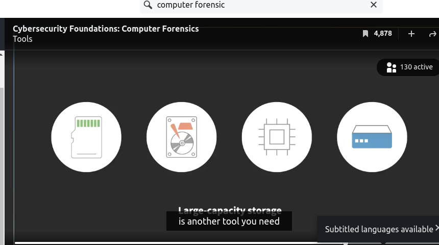

# **Tools**

There are many tools of the trade in computer forensics. Some of these tools are software-based, others are hardware-based. Many computer forensics software tools exist in the form of a software suite.

They usually have a comprehensive set of features that cover an investigation from the beginning to its completion. Some of these features include the ability to acquire and process data, conduct searches, and generate reports. EnCase Forensic by OpenText is one such software suite. Here is their website in case you'd like to check it out. 

Depending on the nature of your case, you may need specialized software tools other than a computer forensic software suite because sometimes they don't provide the particular feature you're looking for. For example, if you had to retrieve a hidden text in an image file, a general purpose computer forensics tool wouldn't help you. For that, you need specialized software called a steganography tool similar to the one you're seeing here. 

There are also special hardware needs. Forensic software is demanding in terms of processing power, memory size, and storage space. The more of these resources you have, the better. 

Forensic workstations also feature extra base and ports to help with future expansions. 

In addition to the computer forensics workstation, you may also need special equipment such as a write-blocker, which prevents an operating system from writing over on evidence drive.

Software write-blockers are also available, but hardware write-blockers are often preferred because of their simple and surefire nature. Although it's not very special, a large capacity storage device is another tool you need in your computer forensics arsenal.These days, evidence drives tend to be big size devices, and they are getting bigger as we speak.

Regardless of our backgrounds, we know very well that having an effective tool at hand can make a day and night difference. The same applies to computer forensics. To be effective as a computer forensics investigator, you have to have as many relevant tools as possible, and throughout this course, we'll explore many of the tools I've mentioned.

## **Understanding hexadecimal numbers**

The knowledge of hexadecimal numbers is essential in the toolbox of a digital forensics investigator. One of the motivations for using hexadecimal numbers is that it's often necessary to investigate data at a binary level. We use binary numbers to represent everything on a computer device. Binary numbers rely on only two symbols, 0 and 1. Machine code is a string or strings consisting of 0s and 1s. It's the only language your computer speaks. Criminals frequently hide or fabricate their data at the machine code level. Therefore, as a digital forensics investigator, you should also be able to examine your evidence in its native format, that is combination of 0s and 1s. The challenge associated with reading machine code is that there are simply too many digits to deal with. A more compact way to represent binary numbers makes human inspection much easier. The way you represent your data in machine code is called encoding. For example, to encode A, we need eight binary digits, 0100 0001. As you can see, displaying the raw binary data takes up a lot of space. Detecting a pattern in the sea of 0s and 1s is also more difficult because of their similarities. Hexadecimal representation, on the other hand, is much more compact and easier to examine, which increases readability and facilitates spotting a specific pattern. Hexadecimal representation, on the other hand, is much more compact and easier to examine, which increases readability and facilitates spotting a specific pattern. Another reason we use hexadecimal numbers to represent binary numbers is the ease of conversion. I told you that letter A requires eight binary digits to encode, as shown here. In hexadecimal, we just need two digits to represent the same number, which are 4 and 1. Think about the difference between 0100 0001 versus 41. Which one do you think is easier to manage? Each binary digit is referred to as a bit. 1 byte consists of 8 bits. Usually 1 byte is all it takes to represent a character in an alphabet. The hexadecimal number system uses base 16, which means it uses 16 different symbols, 0 through 9 and A through F, to represent the magnitudes, such as 10 through 15. Therefore, in hexadecimal, A is 10, B is 11, C is 12, D is 13, E is 14, F is 15. Each hexadecimal digit is capable of representing four binary digits. 1111 is the biggest binary number you can represent with 1 hexadecimal digit, which is F. The knowledge of hexadecimal number system will help you in your future digital forensics investigations because you're bound to handle it in your hex editors. Many digital forensics tools also present data to their end users in hexadecimal numbers.

### **Using a hex editor**

Your computer stores everything in binary numbers, or in other words, zeros and ones. Criminals modify these binary numbers and fabricate them to hide their data. You need hex editors to find this hidden data. Hex in the term hex editors is short for hexadecimal. As its name suggests, hex editors allow us to examine and play with data at the binary level. In hex editors, your number appears in hex numbers, which represent binary numbers more compactly. There are many hex editors available. Some of them are free and open source. Others are commercial products. There are essential hex editor features you need as a digital forensics investigator. These include abilities to open big files or local drives. You frequently have to open an entire drive in a hex editor. It's problematic if your hex editor crashes because it cannot handle the file size or the drive. You also need abilities to make and save changes to reveal secrets. Another essential feature is an effective means to conduct searches, especially by sectors, which are the smallest physical storage unit of a data drive. It's sometimes necessary to shift bits to find hidden information. Almost all the hex editors can generate hash values, which are unique strings representing files. Getting a hash value using a hex editor is simple and fast. One of the things you encounter while using a hex editor is a distinction between physical and logical drives. Physical drives refer to hard drives, USB drives, or solid state drives. These are the tangible hardware components connected to your computer. Logical drives refer to the partitions of a physical drive, which your operating system creates to allow end users to manage their data storage more effectively. Because of this, a single physical drive can show up as multiple logical drives on an operating system. A hex editor denotes the location of a particular piece of information in a file or drive by showing how many multiples of spaces away a specific part of data is from the beginning of a file or a sector. This concept is called offset. How do you feel about this initial tour of a hex editor environment? Hopefully you're ready and motivated to do some basic investigations using hex editors by now.

## **Understanding offset**

Understanding the concept of offset is critical in analyzing and interpreting your data in digital forensics. Offset is significant, especially in the context of locating a piece of information in your dataset. Simply put, an offset is a way to refer to a location from a particular reference point like the beginning of a file, the beginning of a sector, or the beginning of an entire drive by specifying their distance in bytes. That's the whole idea behind offset. To do this, we use hex numbers to record the number of bytes between a reference point and a location of our interest. By the way, hex here is short for hexadecimal. Let's say the offset is one zero in hex, which means the current location of a piece of data is 16 bytes away from a reference point. We use a particular offset notation to make it clear that it's a hex number as shown here. The prefix zero and lowercase x denote that the offset amount is in hex. Here, zero x one zero means the offset amount is one zero in hexadecimal. The subscript 16 is there to indicate that we're using base 16\. With this newly-gained knowledge of offset, you can locate any piece of information in a file or drive. Before you feel more comfortable, you need lot of practice. You must try this on your own using the tools of your choice.

## **Forensics OS distributions**

We talked about forensics Linux distributions. Let's check them out. Because its source code is freely available to the public, Linux is a great platform to leverage if you want to create a custom operating system. All you have to do is pick and choose the components you want and add your flavor to the graphical user interface, or GUI. We call these custom-built OS's distributions. A website called DistroWatch.com follows the rankings of all the known Linux OS distributions. As you can see, there's so many out there. Kali is one of the Linux OS distributions specializing in digital forensics. It comes with Open Source and free digital forensic suites, such as **Autopsy**. Let's see if we can find it. Let's go to Applications. Choose Forensics. Autopsy is there. SANS Investigative Forensic Toolkit, or SIFT, is another forensic distribution worth your attention. This is what the SIFT environment looks like. You see all the cheat sheets on the desktop. Lets open one. This should be handy when you cannot remember a command or its options. **GParted** is a Linux OS distribution dedicated to managing disc partitions. It's a GUI version of **FDISK**, and a favorite tool for many digital forensics practitioners. Let's take a look. All this distribution contains is the GParted tool, except for some bare essentials such as screenshot, terminal, and a web browser. Let's start GParted. I'm about to create a new partition here, D-E-V-S-D-A 1. On Linux, we represent storage devices as files. A serial advanced technology attachment, or SATA drive, shows up as D-E-V-S-D-A, as shown here. If I had a second drive, it would appear as D-E-V-S-D-B, as in baby. The numbers after the drive letters, like SDA and SDB, refer to partitions. Therefore, D-E-V-S-D-A 1 is the first partition of D-E-V-S-D-A. While D-E-V-S-D-A 2 is the second partition. To create these partitions, all I have to do is to click on New under partition. Here you decide the size of your partition and the file system, and click on Add. The last step is to press the Apply button here. I'm always amazed at how many free resources are available at our fingertips. Do you now have a good sense of what you can take advantage of? There's a lot to learn because each tool has many features.

### **Lab Challenge: Install Kali Linux**

### **Lab Challenge: Hex editor**

Let's download the Hex editor and give it a try. Visit this free `Hex editor Neo` website. Download and install the software. As a prep, let's create a text file called Test. Open the file and type, "This is a test." Let's save it. Your challenge is to open this text file in Neo and inspect it.

### **Solution: Hex editor**

Let's go ahead and download `Neo`. We'll select the first option. The download is now complete. Open the file. Click Install. And click on Close. Click OK. We created our text file earlier, the test.txt test file. Let's open the test text file in Neo. Go to File, Open, Open file. Choose test. Click on Open. You see the hex number representation of characters here. The original text is displayed here. And this is what an offset value looks like.

## **Understanding file systems**

Understanding how an operating system, or OS, stores files is critical in computer forensics because criminals use this knowledge to hide information. File systems determine how an OS stores data on a storage device. One of the most widely used Windows file systems today is File Allocation Table, or FAT. There's a newer Windows file system called New Technology File System, or NTFS. The main difference between FAT and NTFS is the file structure databases used to store file metadata and to keep track of the locations of the file data FAT uses file allocation table as a file structure database while NTFS uses master file table, or MFT. Let's go over some terminology here before we go any further. In the context of file systems, metadata refers to the data about files. For example, data such as file names, timestamps, and other file attributes are metadata. File data is the actual data stored in a file. It's also important to know the difference between sectors and clusters. Each sector often contains 512 bytes of data. Newer hard drives use 4,096 byte sectors. Clusters are the smallest logical unit of file storage. They consist of one or more sectors. Although, they use drastically different hardware to store data, solid state drives still use the same naming convention, such as sectors, in operating systems. Knowing the distinction between logical and physical file storage units is crucial, too. Logical file storage unit is what is recognized by an operating system. Clusters are logical units. Physical file storage unit is what is recognized by a storage device. Sectors are physical units. Therefore, we know that your physical storage device deals with sectors, while your operating system handles logical storage units, namely clusters. Your operating system stores a file at the cluster level. Because the files are stored in clusters, this is what causes a wasted space problem. Let's say that you have a file who size is 2,050 bytes. Also assume that a cluster consists of two sectors. As you can see in this diagram, your file whose size is 2,050 bytes cannot fit in two clusters. The file requires three clusters to be stored. Next time your operating system stores a new file, it must start after the third cluster. Because of this, there is this unused space in cluster number three, as you can see in blue, and this unused wasted space is called a slack. When it comes to efficiency, NTFS is more efficient because it uses a smaller cluster size compared to FAT, which means it reduces the amount of select spaces resulting in less wasted spaces. The latest Windows file system is Resilient File System, or ReFS. It builds on the successes of its predecessors and is an attempt to address the newly emerging challenges file systems are facing. ReFS aims at making the Windows file system more compatible, available, and scalable. However, ReFS has its own shortcomings and is not a replacement for NTFS yet. Have you noticed that we only focused on Windows file systems in this lesson? Linux and Mac OS file systems are entirely new topics. Of course, there are also many more things to learn about Windows. Well, we just scratched the surface, are you ready for more?

## **Understanding the boot sequence**

Understanding the concept of boot sequence as a computer forensics investigator is mandatory because you often have to modify it to protect the integrity of your evidence. Some of the boot sequence related hardware include CMOS and BIOS. CMOS is a volatile memory chip containing time and date information, as well as other configuration information. CMOS stands for complementary metal-oxide semiconductor. It's a computer chip on a motherboard. BIOS stores a program that loads hardware drivers. It also loads an operating system. Before your operating system is loaded into the main memory, you have to make the memory hardware operational by loading the driver for the memory. BIOS stands for basic input/output system. The BIOS hardware is now being replaced by a new alternative, which is called unified extensible firmware interface, or UEFI. One of the things your BIOS checks when your computer starts is the boot sequence. The boot sequence information is stored in your CMOS and the boot sequence setting decides which drive to access to read operating system code. This is significant to computer forensics, especially because we're always trying to avoid changing the evidence drive accidentally. As soon as your operating system has access to your evidence drive, it could attempt to write to it and therefore compromise your evidence. The best practice is to boot from a drive containing a specialized operating system with pre-installed computer forensics programs. You can create a USB stick containing a forensic distribution of a Linux operating system. All you have to do is plug the USB drive into your computer, which will provide an operating system for the machine you're investigating and not touch anything on your evidence drive. This is just one example of how to leverage your boot sequence for a computer forensics investigation. There are also many other uses. By learning more about them, you'll enhance your chance of a successful investigation.

## **Understanding disk/solid-state drives**

Data storage drives provide a relatively cheap way of storing data. As a computer forensics specialist, you recover data from various sources, such as solid state or hard disk drives. Therefore, it's essential to understand how they work to do your job effectively. We focus on hard disk drives here because of their complexity compared to solid state drives. Let's get started by learning some terminology. There are multiple disks inside your hard disk drive. Those are called platters. On both sides of the platters, you have read write heads. That's one read write head on each side. A platter is divided into tracks and sectors for addressing purposes. Tracks are concentric circular patterns on which data is written. Sectors are evenly divided sections of a track that typically holds 512 or 4,096 bytes of data. The reason why your platter is divided into tracks and sectors is that they allow you to locate a piece of information. Based on the track number and the sector numbers, you'll know exactly where the data is stored, and that information is stored in a database so that when there's a need to locate the piece of information, you can always come back to the exact location. A cylinder is a collection of tracks at the same location on multiple platters. The number of cylinders, sectors, and heads decides the total capacity of a hard disk drive. If you have 1000 cylinders, 32 sectors, and 100 heads, the total capacity of the hard disk drive can be computed by multiplying all these three numbers. We assume that each sector consists of 512 bytes, so we multiply 512 at the end of the process. As a result, in this case, you have 1.6 gigabytes of capacity based on the number of cylinders, sectors, and heads.

## **Understanding the master boot records (MBR)**

Once your BIOS selects a disc drive to boot from, the master boot record or MBR on your disc is accessed. The physical drive you're booting from contains the MBR, and it keeps track of information on partitions on a storage device such as locations of your partition, the sizes of your partitions, and the bootable status of your partition. Because at least one of your partitions has to be set up as bootable so that your computer can boot. The disc you're booting from can also contain boot loader software. The boot loader is a program that displays the menu screen you see when you start your computer. And it typically gives you options for different operating systems. For example, it could display a message that allows you to select either Windows or Linux operating system. Your MBR is located in the first sector of a storage device. There are some software solutions you should be aware of regarding MBR. You can use FDISK and its graphical user interface version called, GParted to edit your MBR. The Grand Unified Boot Loader or GRUB is an example of a boot loader typically installed by your Linux operating system.

## **Understanding Partitioning**

Partitioning creates an illusion to make a single physical storage device appear as multiple logical devices. For example, you can divide a physical drive into two partitions, one for the operating system and applications, and the other for data. By separating the data from the OS and applications, if it's necessary to reinstall the OS and applications, the data is not affected. In general, partitioning allows for more efficient and organized storage device management. Another very important use of partitioning is to make it possible to install multiple OS's on a single physical drive. This way you can have various OS options during a boot process and choose to boot into a particular OS. A typical setup for this is a multiple system that allows you to boot into either Windows or Linux OS on the same computer. There are two types of partitions, primary and extended. There could be up to four primary partitions. However, you can overcome this limit by making one of the primary partitions an extended partition. The extended partition can have an unlimited number of logical partitions in it. Although the number of partitions depends on the size of the extended partition, Windows OS can be only installed on primary partitions while Linux OS can be installed on a logical partition two.

## **Lab Challenge: Partitioning a USB drive**

Let's create one primary partition and one logical partition on a USB drive. The tool you need is Gparted. The first thing to do is to find the right drive. Based on the size of the drive, I know devsdb is my USB drive. On my USB stick, one primary partition takes up the whole drive, and its format is fat32. I have to resize this partition to make room for creating my second partition. Please note that you need to create an extended partition first to house a logical partition in it.

### **Solution: Partitioning a USB drive**

Let's resize the existing partition to about four gigabytes. Let's create an extended partition in the new space. Let's label it other. Click on add. The final step is to create a logical partition in it. I'll format the new partition to be EXT4 so that I can install a Linux OS, and I'll label it Linux and click on add. That's it. All that's left is clicking on this check mark button to apply all operations.(https://www.linkedin.com/learning/cybersecurity-foundations-computer-forensics/solution-partitioning-a-usb-drive?resume=false&u=56745521#)
